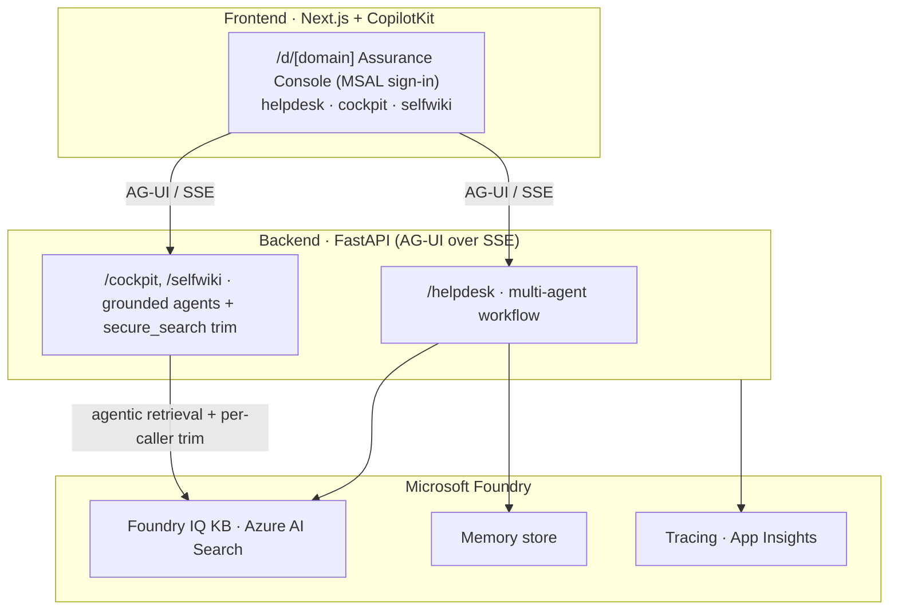
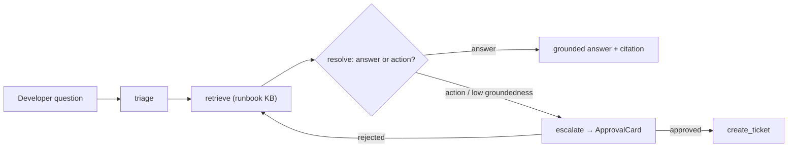

# Foundry Assured

An internal engineering support **concierge** — a Microsoft Foundry showcase that
exercises every Foundry pillar hands-on: a grounded knowledge base, a streamed
multi-agent workflow, per-user memory, human-in-the-loop approval, offline
evaluation, and a managed hosted-agent deployment. The frontend is **CopilotKit**
(Next.js) talking to a Python backend over the **AG-UI** protocol.

> **Clone → provision → deploy:** [`docs/DEPLOYMENT.md`](./docs/DEPLOYMENT.md) — the
> step-by-step runbook (infra, Entra app registrations, KB/memory, hosted agent,
> Container Apps).
> **Use this template:** [`docs/USE-THIS-TEMPLATE.md`](./docs/USE-THIS-TEMPLATE.md) —
> *Use this template → Create a new repository*, then provision your own infra, CI/CD
> identities (OIDC + GitHub App, no PAT) and reset the version history.
> **Make it your own domain:** [`docs/CUSTOMIZE.md`](./docs/CUSTOMIZE.md) — swap the
> corpus, prompts, action and identity to turn this into any "ask → ground → resolve →
> escalate" assistant.
> **Release & deploy automation:** [`docs/RELEASE-AUTOMATION.md`](./docs/RELEASE-AUTOMATION.md) —
> the merge → release → gated-deploy flow + the GitHub App setup.
> **Case study:** [`docs/CASE-STUDY-LLM-WIKI-LOOP.md`](./docs/CASE-STUDY-LLM-WIKI-LOOP.md) —
> a measured generate→verify→ingest→consume loop for grounding an agent on a large codebase.
> **Assurance mechanism:** [`docs/METHOD.md`](./docs/METHOD.md) — the reusable, measured
> KB→agent guarantee (built faithfully · retrieves completely · secure per-caller access ·
> red-teamed), with a worked example in [`docs/use-case-demo.html`](./docs/use-case-demo.html)
> / [`docs/USE-CASE-WALKTHROUGH.md`](./docs/USE-CASE-WALKTHROUGH.md).
> Contributing & CI/CD: [`CONTRIBUTING.md`](./CONTRIBUTING.md) · security:
> [`SECURITY.md`](./SECURITY.md) · full build spec:
> [`foundry-helpdesk-spec.md`](./foundry-helpdesk-spec.md) · working rules:
> [`CLAUDE.md`](./CLAUDE.md)

A developer asks in chat → the system **triages** intent/urgency → **retrieves**
from the runbook knowledge base → **resolves** with a grounded, cited answer →
**escalates** with human approval when an action is needed → and the whole thing
is **evaluated** and **traceable**.

## Deployment modes — multi-tenant SaaS

On top of the showcase + assurance mechanism, the repo has evolved into a **hybrid
multi-tenant SaaS** — one codebase, three deployment modes, selected by a
**deployment-mode seam** ([ADR-007](./docs/adr/ADR-007-coexistence-deployment-mode.md)).
A `TenantConfigProvider` (Single/Multi impl) is the single point of variation; everything
else is identical across modes. All data, compute, and credentials stay in the customer's
cloud (BYO) — the control plane stores **per-tenant config + connection references only,
never secrets, never customer data** ([ADR-005](./docs/adr/ADR-005-never-store-secrets.md)).

| Mode | Tenancy | Where | Vehicle |
| --- | --- | --- | --- |
| **self_hosted** (today, default) | 1 | customer cloud, customer operates | `azd up` (byte-identical to before) |
| **dedicated** (enterprise) | 1 | customer cloud, we operate | Azure **Managed Application** + **Lighthouse** |
| **shared** (SMB/default SaaS) | N | our cloud | multi-tenant control plane; tenant resolved per-request from the Entra `tid` |

In **shared** mode each request resolves its tenant from the token's `tid`, loads that
tenant's config + `Connection` records, mints a brokered token (OBO for Microsoft-audience
servers; OAuth identity passthrough / Foundry connections otherwise — **we never read a
secret**), and calls the customer's own data plane. Memory is namespaced by tenant. The
**dedicated** stamp is deployed into the customer's own subscription as an Azure **Managed
Application** ([`infra/managed-app/`](./infra/managed-app)) with cross-tenant management via
Azure **Lighthouse** ([`infra/lighthouse/`](./infra/lighthouse), [ADR-002](./docs/adr/ADR-002-dedicated-stamp-managed-app-lighthouse.md)).

> Target architecture: [`docs/superpowers/specs/2026-06-29-saas-target-architecture-design.md`](./docs/superpowers/specs/2026-06-29-saas-target-architecture-design.md) ·
> tenancy model: [ADR-001](./docs/adr/ADR-001-tenancy-deployment-stamps.md) ·
> the full ADR index (001–011): [`docs/adr/README.md`](./docs/adr/README.md) ·
> packaging the dedicated stamp + hosted platform agent: [`docs/D-PACKAGING-RUNBOOK.md`](./docs/D-PACKAGING-RUNBOOK.md).

The single-tenant `self_hosted` mode below is the **default**, byte-identical to the
pre-SaaS product — everything in this README runs unchanged in that mode unless a section
says otherwise.

## Four domains (config-driven)

The frontend is an **Assurance Console** that fronts four agents. Three are
**grounded/workflow** domains sharing the same grounded/assured plumbing; the fourth is
a **tool-driven** ops concierge:

- **helpdesk** — the multi-agent workflow above (triage → retrieve → resolve →
  escalate, with HITL).
- **cockpit** — grounded, cited Q&A over the `cockpit-kb` corpus.
- **selfwiki** — grounded, cited Q&A over a deep-wiki generated from **this repo's
  own source** (the dogfood).
- **platform** — a **tool-driven** ops concierge over Microsoft first-party MCP servers
  (Learn, Azure, Entra, Azure DevOps, GitHub), with **HITL approval on write actions**.
  Unlike the three grounded domains it resolves answers by *calling tools*, not by
  retrieving a corpus; it also has the **live-vs-hosted toggle** (its hosted twin is the
  deployed **platform** agent — see [Deployment modes](#deployment-modes--multi-tenant-saas)).

Domains are **config-driven**: a single registry, [`apps/frontend/lib/domains.ts`](./apps/frontend/lib/domains.ts),
drives the agent map, the nav, the generic console route, and the per-domain
suggested prompts. Adding a domain = **one entry there + a backend agent**; deploy
any subset (cockpit and selfwiki only register once their KB is ingested). In **shared**
mode, domains mount globally but are gated per-tenant by a **license entitlement**
(`DomainAssignment`, [ADR-010](./docs/adr/ADR-010-per-tenant-domain-entitlement.md)).

### Two wiki-generation paths

The deep-wiki the **selfwiki** domain grounds on can be generated two ways:

- **Foundry pipeline** — [`apps/backend/app/knowledge/wiki_builder.py`](./apps/backend/app/knowledge/wiki_builder.py),
  automated via `uv run`, using the Foundry model (`gpt-5-mini`) with the build-fidelity
  gate. Costs roughly **$0.30** for the whole monorepo.
- **Microsoft Agent Skills** — [`apps/backend/app/knowledge/skills/{wiki-architect,wiki-page-writer}`](./apps/backend/app/knowledge/skills).
  Open the repo in **VS Code Copilot or Claude Code** and ask it to *"create a wiki"*;
  the IDE agent reads the `SKILL.md` and runs the loop. **No cloud, no azd, no cost** —
  it uses the IDE's own Copilot.

## Quickstart

```bash
azd auth login && az login
azd up                      # provision Azure infra
./scripts/setup-entra.sh    # optional: Entra sign-in + OBO (skip to run without auth)
./scripts/bootstrap.sh      # fill .env, ingest the knowledge base, provision memory

cd apps/backend  && uv run uvicorn app.main:app --port 8000 --reload
cd apps/frontend && npm install && npm run dev      # http://localhost:3000
```

Full runbook + the manual steps behind the scripts: [`docs/DEPLOYMENT.md`](./docs/DEPLOYMENT.md).
Adapt it to your own domain: [`docs/CUSTOMIZE.md`](./docs/CUSTOMIZE.md).

## Demo mode — see it with **no Azure**

Want to see the experience before provisioning anything? Committed AG-UI fixtures are
replayed by [CopilotKit **aimock**](https://github.com/CopilotKit/aimock) — the real
frontend renders the real flow (triage→retrieve→resolve **steps**, grounded **cited**
answers, honest off-corpus decline) with **no Azure and no Python backend**:

```bash
cd apps/frontend && npm install && npm run demo      # → http://localhost:3000
```

The fixtures are **recorded from real runs** (`./scripts/demo-record.sh`), so they're
genuine workflow output, not hand-faked — just replayed deterministically. Try the
recorded prompts: *"How do I roll back a bad deploy?"*, *"My Kubernetes pod is stuck in
CrashLoopBackOff…"*, *"What's the weather in Paris?"* (off-corpus → declines).

> The **HITL ticket approval** isn't in the fixture yet (the resume handshake is
> captured by recording through the live UI); it runs in the full app. Add it by
> re-recording with `./scripts/demo-record.sh` and approving a ticket in the browser.

## Status — all six phases green

| Phase | Pillar | What it proves |
| --- | --- | --- |
| 0 | AG-UI hello-world | message round-trips with streaming |
| 1 | Foundry IQ knowledge base | answers cite a runbook, decline off-corpus |
| 2 | Multi-agent workflow | `triage → retrieve → resolve` steps stream to the UI |
| 3 | Memory + **Entra ID / OBO** | per-user memory, Foundry called *as the signed-in user* |
| 4 | Human-in-the-loop | ticket escalation pauses for explicit approval before `create_ticket` |
| 5 | Evaluation | deterministic policy gate + Foundry judges, surfaced on `/evals` from the project; CI runs Microsoft's official [`ai-agent-evals`](https://github.com/microsoft/ai-agent-evals) action on the deployed agent |
| 6 | Hosted-agent deploy | same workflow packaged as a managed Foundry hosted agent |

> On top of the six showcase phases, the repo ships a reusable **assurance mechanism** —
> the KB→agent guarantees below, each a **measured gate** in CI (not a promise).

## Assurance mechanism

The repo's headline differentiator: a domain-agnostic recipe to point an agent at one or
more repos/knowledge bases and get **measured, gated** guarantees — the company brings the
data, the mechanism brings the guarantees. Each pillar is a number wired to a CI gate
(thresholds in [`apps/backend/eval/assurance.yaml`](./apps/backend/eval/assurance.yaml)):

| Pillar | Guarantee | Gate |
| --- | --- | --- |
| **Build** | every wiki claim cites a real source file | fidelity gate (`wiki_builder`) |
| **Recall** | nothing relevant is left out of retrieval | recall measured (agentic effort) |
| **Completeness** | answers are grounded *and* complete | completeness gate (`run_eval`) |
| **Access control** | each caller sees only their entitlement — access **follows the source** (no classification in code); enforced pre-model, defense-in-depth (service-side passthrough + app-side trim) | access-control gate (`access_control_test`, violations = 0) |
| **Red-team** | no prompt leaks content across groups | red-team gate (`red_team_test`, ASR ≤ ceiling) |

Full as-built model: [`docs/METHOD.md`](./docs/METHOD.md) · visual walkthrough:
[`docs/use-case-demo.html`](./docs/use-case-demo.html) · design rationale:
[`docs/ASSURANCE-MECHANISM-PLAN.md`](./docs/ASSURANCE-MECHANISM-PLAN.md).

## Architecture

Three layers. The Next.js frontend talks to the Python backend over **AG-UI (SSE)**;
the backend runs a **multi-agent workflow** against Foundry in the cloud. Phase 6
adds a second, parallel delivery model: the same workflow packaged as a **managed
hosted agent** (Responses protocol) on Foundry Agent Service.

The diagram below shows the **self_hosted** (single-tenant) topology. In **shared** mode
the same backend resolves the tenant per-request from the Entra `tid` and calls *that
tenant's* Foundry/KB/memory; see [Deployment modes](#deployment-modes--multi-tenant-saas).

The three layers — frontend, backend, and Foundry:



The helpdesk workflow itself — triage, retrieve, resolve, and a human-approved escalation:



**Two ways to consume the same agent** (switchable in the UI):

- **Live workflow (AG-UI)** — the rich experience: intermediate workflow steps
  stream into the chat, the approval card gates ticket creation, and Foundry is
  called *on-behalf-of* the signed-in developer (OBO) with per-user memory.
- **Hosted agent (Foundry)** — the same `triage → retrieve → resolve` workflow,
  deployed as a managed, autoscaling agent you invoke by name over the Responses
  API. Request→response (no live steps/HITL — those are inherent to AG-UI), runs
  under its own platform identity, and costs nothing while idle.

## Repository layout

A monorepo: deployable apps live under `apps/`; infra and docs sit alongside.
Each app is internally layered (backend: thin routers → services → core;
frontend: feature-organized components).

```
apps/
  backend/                    Python 3.12 · FastAPI · Agent Framework · uv
    app/
      main.py                 app wiring: CORS, lifespan, routers, AG-UI /helpdesk
      core/                   settings.py · auth.py (Entra JWT + OnBehalfOf / OBO)
      api/                    thin HTTP routers: health · chat (/helpdesk-hosted) · tickets · evals
      services/               hosted.py — Responses→AG-UI bridge for the hosted agent
      agents/                 prompts.py (single source of truth) · concierge.py
      workflow/               graph · agents · escalation · memory · stream_fix (multi-agent)
      tools/tickets.py        real create_ticket tool + persistence
      knowledge/              corpus/*.md (~13 runbooks) · ingest.py
    cli/                      data-plane scripts: provision_memory · provision_guardrail · provision_eval_rule
    eval/                     Phase 5 — offline harness (run_eval · assertions · datasets · rubrics)
  frontend/                   Next.js 15 (App Router) · CopilotKit v2 · MSAL
    app/                      routes only: page (Overview) · chat · tickets · evals · api/* proxies
    components/{shell,chat,evals,tickets}/   feature-organized (HelpdeskApp, AppShell, …)
    lib/auth/msal.ts · styles/globals.css
  hosted-agent/               Phase 6 — hosted-agent container (main · Dockerfile · agent.yaml)
infra/                        Bicep (azd): Foundry + AI Search + Storage + ACR + Container Apps + RBAC
scripts/set-deploy-env.sh     copies Entra values from .env into the azd env (for publishing)
docs/                         DEPLOYMENT.md (provisioning runbook) · presentation.html (slide deck)
azure.yaml                    azd config — services point at apps/{backend,frontend,hosted-agent}
.github/workflows/eval-gate.yml   CI: the policy gate self-test
```

## Run locally

### 1. Provision Foundry (azd)

```bash
azd auth login
azd up        # prompts for env name + location; provisions everything in infra/
```

Creates `rg-<env>`, the Foundry account + project **`helpdesk-concierge`**, a
`gpt-5-mini` + `text-embedding-3-small` deployment, **Azure AI Search (Basic)**,
Storage, an **ACR** (for the Phase 6 image), and keyless RBAC. Pick a region where
`gpt-5-mini` GlobalStandard is available; AI Search may need a different region
(set `AZURE_SEARCH_LOCATION`).

### 2. Backend + data-plane objects

```bash
cd apps/backend
cp .env.example .env                       # fill from `azd env get-values`
az login
uv run python -m app.knowledge.ingest      # build the Foundry IQ knowledge base
uv run python -m cli.provision_memory      # create the memory store
uv run uvicorn app.main:app --port 8000 --reload
```

Knowledge base and memory store are **data-plane** objects created by scripts (not
Bicep) — Bicep is control-plane only. Auth is always `DefaultAzureCredential`.

### 3. Frontend

```bash
cd apps/frontend
cp .env.example .env.local                 # NEXT_PUBLIC_ENTRA_* for Entra sign-in
npm install
npm run dev                                # http://localhost:3000
```

- **`/`** — Overview (hero + the six capability cards).
- **`/d/[domain]`** — the generic Assurance Console (defaults to **`/d/helpdesk`**;
  also **`/d/cockpit`** and **`/d/selfwiki`**). An **EvidencePanel** shows the
  sources a grounded answer cited plus its assurance badges. For helpdesk, toggle
  **Live workflow** (AG-UI: steps, approval, OBO, memory) ⇄ **Hosted agent** (the
  deployed Foundry agent). Legacy **`/chat`** and **`/cockpit`** redirect to
  `/d/<id>`.
- **`/admin/users`** — in-portal user + role management (Admin role only; see below).
- **`/evals`** — recorded eval runs with direct links to the Foundry portal report.

### Entra ID (OBO) sign-in

When `NEXT_PUBLIC_ENTRA_*` are set, the chat gates behind Microsoft sign-in and
forwards the user's token; the backend does the On-Behalf-Of exchange and calls
Foundry/KB/memory **as the user**. Two app registrations: a SPA (`redirect
http://localhost:3000`) and an API (`scope access_as_user`, `requestedAccessToken
Version: 2`). Unset → falls back to `DefaultAzureCredential` so it still boots.

### App roles & user management

Authorization rides in the token's **`roles`** claim via four Entra **App Roles** —
**Admin · Author · Approver · Reader**. The HITL ticket approval requires the
**Approver** (or **Admin**) role, so a Reader can ask and ground but can't green-light
an action. The in-portal admin page **`/admin/users`** manages users and their role
assignments through **Microsoft Graph** (app-only), backed by the backend's `/admin/*`
endpoints. Design + setup: [`docs/RBAC-AND-USER-MANAGEMENT-PLAN.md`](./docs/RBAC-AND-USER-MANAGEMENT-PLAN.md).

## Evaluation (Phase 5)

```bash
cd apps/backend
uv run python -m eval.run_eval              # local policy gate over real agent outputs
uv run python -m eval.run_eval --cloud      # + Foundry groundedness/relevance/coherence (portal link)
uv run python -m eval.run_eval --self-test  # prove the gate catches a planted violation (offline)
```

The **LocalEvaluator** policies (every answer cites a runbook or declines; never
leak a secret) are the hard CI gate — a violation exits non-zero. **FoundryEvals**
adds cloud LLM-judge scores, viewable per-run in the Foundry portal. CI runs the
offline `--self-test` (`.github/workflows/eval-gate.yml`). See
[`apps/backend/eval/README.md`](./backend/eval/README.md).

## Hosted agent (Phase 6)

The workflow packaged as a managed Foundry hosted agent (Responses protocol),
deployed via the Azure-recommended `azd ai agent` path:

```bash
# one-time: the azure.yaml already declares the helpdesk-concierge agent service
azd env set AZURE_AI_PROJECT_ID "<project ARM id .../projects/helpdesk-concierge>"
azd deploy helpdesk-concierge               # remote build → ACR → create agent version → active
azd ai agent show helpdesk-concierge        # status + endpoint + portal playground
azd ai agent invoke helpdesk-concierge "How do I roll back a bad deploy?"
```

> **Post-deploy RBAC** (the agent gets its own identity at deploy time, so it
> can't be pre-assigned in Bicep): grant the agent's *Instance Identity Principal
> ID* (from `azd ai agent show`) **Azure AI User** on the account and **Search
> Index Data Reader** on the search service, or it returns 403 at runtime.

## Safety & continuous evaluation (Foundry add-ons)

Beyond the offline harness, two data-plane scripts wire up Foundry's safety and
online-eval surfaces on the deployed agent (run after `azd deploy`):

```bash
# Adversarial / jailbreak eval (offline): refuse-or-ground gate + Foundry safety judges
uv run python -m eval.run_eval --safety [--cloud]

# Content Safety guardrail: screen every prompt + response at runtime (default RAI policy)
uv run python -m cli.provision_guardrail

# Continuous (online) evaluation: score the agent's LIVE responses against an eval
uv run python -m cli.provision_eval_rule --eval-id eval_xxx     # eval_xxx from a --cloud run's portal URL
```

The `--safety` run shows many jailbreaks are stopped by Azure's content + jailbreak
filter *before* the model (🛡️). `guardrail_provision` adds an agent-level RAI
guardrail; `eval_rule_provision` registers a rule that scores every `RESPONSE_COMPLETED`
and links the score to its trace in the Foundry Control Plane.

## Publish backend + frontend (Azure Container Apps)

Both apps ship as containers to Azure Container Apps, built/pushed by azd. The
infra (`infra/containerapps.bicep`) adds a Container Apps environment + Log
Analytics + the two apps, all running as a shared managed identity (ACR pull, and
— for the backend — Foundry + search access). The apps find each other by FQDN,
so no manual URL wiring.

```bash
# 1. Browser-baked values (NEXT_PUBLIC_* are compiled into the bundle at image
#    build) + the backend OBO secret — set them in the azd env first:
azd env set NEXT_PUBLIC_ENTRA_TENANT_ID    <tenant-id>
azd env set NEXT_PUBLIC_ENTRA_SPA_CLIENT_ID <spa-client-id>
azd env set NEXT_PUBLIC_ENTRA_API_CLIENT_ID <api-client-id>
azd env set ENTRA_TENANT_ID                 <tenant-id>
azd env set ENTRA_API_CLIENT_ID             <api-client-id>
azd env set ENTRA_API_CLIENT_SECRET         <api-secret>     # → container app secret

# 2. Provision the Container Apps + build/push/deploy both images:
azd up                       # or: azd provision && azd deploy backend && azd deploy web

# 3. Register the web app's URL as an Entra SPA redirect URI (one-time):
azd env get-values | grep WEB_URL
#    add  https://<web-fqdn>/  to the SPA app registration → Authentication → redirect URIs
```

The backend's `FRONTEND_ORIGIN` (CORS) and the web's `AGUI_URL` / `HOSTED_AGUI_URL`
/ `BACKEND_URL` are wired to each other's FQDN by Bicep. Images build remotely in
ACR (`remoteBuild: true`), so no local Docker/amd64 step is needed.

## Cost & teardown

| Resource | Cost | Note |
| --- | --- | --- |
| Azure AI Search (Basic) | ~$0.10/hr | billed while it exists |
| ACR (Basic) | ~$5/mo | holds the hosted-agent image |
| Hosted agent compute | **$0 idle** | deprovisions after 15 min inactivity |
| Models | per-token | |

```bash
azd ai agent delete helpdesk-concierge   # remove just the hosted agent
azd down --purge                         # delete the whole resource group (stops AI Search)
```

## References

- Agent Framework evaluation — learn.microsoft.com/agent-framework/agents/evaluation
- Deploy a hosted agent — learn.microsoft.com/azure/foundry/agents/how-to/deploy-hosted-agent
- agent-framework hosting samples — github.com/microsoft/agent-framework `python/samples/04-hosting/foundry-hosted-agents`
- AG-UI ↔ Agent Framework — learn.microsoft.com/agent-framework/integrations/ag-ui/
