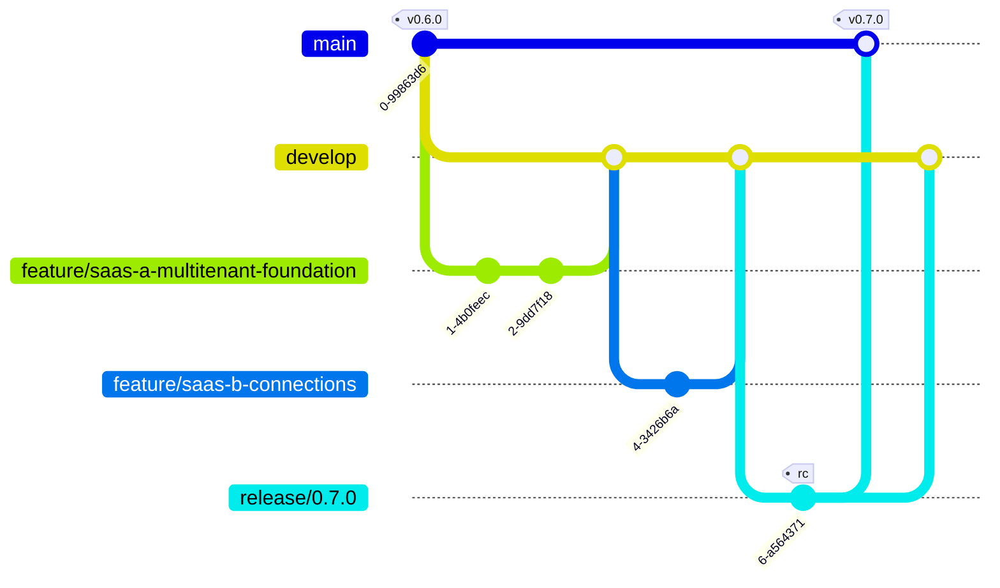

# Branching, release & environments

Foundry Assured follows **Git Flow** — the established model with long-lived `main` +
`develop` and short-lived `feature/*`, `release/*`, `hotfix/*` branches. This keeps **`main`
always production-clean** (today: no SaaS) while a large, multi-part feature (the multi-tenant
SaaS, split across sub-projects A→D) **integrates on `develop`** until a release ships it.

> Small-team note: Git Flow is the chosen standard here for the explicit separation it gives
> (`main` with zero in-progress SaaS). Once the SaaS epic ships and the team wants faster cadence,
> the architecture is already feature-flagged (`DEPLOYMENT_MODE`), so a later move to
> trunk-based development is low-risk.

## The branches

| Branch | Lives | Purpose | Merges from → to |
|---|---|---|---|
| **`main`** | forever | **Production.** Always deployable, only released code. Tagged (`vX.Y.Z`). | ← `release/*`, `hotfix/*` |
| **`develop`** | forever | **Integration** of the next release. Where completed features assemble. | ← `feature/*`; → `release/*` |
| **`feature/*`** | short | One unit of work, branched from `develop`. | from `develop` → `develop` |
| **`release/*`** | short | Stabilize a release (version bump, final fixes). | from `develop` → `main` **and** `develop` |
| **`hotfix/*`** | short | Urgent production fix, branched from `main`. | from `main` → `main` **and** `develop` |

**Never commit directly to `main` or `develop`** — always via a PR from a `feature/`,
`release/`, or `hotfix/` branch.



## The SaaS epic on this model

The multi-tenant SaaS is fractioned into sub-projects (see
[`docs/superpowers/specs/2026-06-29-saas-target-architecture-design.md`](./superpowers/specs/2026-06-29-saas-target-architecture-design.md)).
Each is a `feature/*` branched from `develop`, PR'd back into `develop` **when independently
complete**:

| Sub-project | Branch | Note |
|---|---|---|
| A — multi-tenant foundation | `feature/saas-a-multitenant-foundation` | independently shippable (zero behavior change) |
| B — connection store + UI | `feature/saas-b-connections` | on top of A |
| C — credential brokering | `feature/saas-c-credential-brokering` | on top of A/B |
| D — stamps / packaging | `feature/saas-d-stamps` | parallel to B/C |

`main` carries **none** of this until a `release/*` cuts a version from `develop`. Because every
piece is gated by `DEPLOYMENT_MODE` (default `self_hosted` = today's behavior), even after the
epic reaches `main`, production stays unchanged until a deployment explicitly sets `shared`.

## Environments

`azd` supports **named environments** — that is how "one deploy" becomes dev/staging/prod
without code changes. Each maps to a branch and a `DEPLOYMENT_MODE`:

| Environment | `azd env` | Tracks branch | `DEPLOYMENT_MODE` | Purpose |
|---|---|---|---|---|
| **dev** | `dev` | `develop` | `shared` (or `self_hosted`) | integrate + exercise in-progress features, incl. multi-tenant |
| **staging** | `staging` | `release/*` | matches the target prod mode | pre-prod validation of a release candidate |
| **prod** | `prod` | `main` (tagged) | `self_hosted` (until SaaS GA) | production |

```bash
azd env new dev      # create an environment (repeat for staging, prod)
azd env select dev   # switch the active environment
azd env set DEPLOYMENT_MODE shared    # per-environment flag
azd up               # provision/deploy the selected environment
```

Each environment is its own resource group + its own data plane, fully isolated. The control
plane's `DEPLOYMENT_MODE` decides single- vs multi-tenant per environment.

## Day-to-day flow

1. **Start work:** `git checkout develop && git pull && git checkout -b feature/<name>`.
2. **PR target:** open the PR against **`develop`** (not `main`). CI + review on the PR.
3. **Merge:** squash/merge into `develop` when the feature is complete and green.
4. **Release:** branch `release/X.Y.Z` from `develop`, bump version, final fixes; PR to `main`,
   tag `vX.Y.Z`, then merge `release/*` back to `develop`.
5. **Hotfix:** branch `hotfix/<name>` from `main`, fix, PR to `main` (tag a patch), merge back to
   `develop`.

> Open PRs that pre-date this policy (e.g. the MCP integration and SaaS-design PRs) are
> retargeted to **`develop`**.
