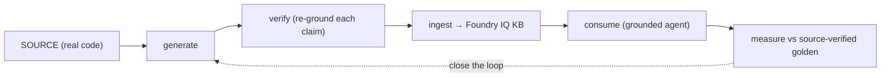

# Source-grounded LLM wikis on Foundry: a measured case study

**Claim.** To ground an agent on a large, multi-repository codebase, *both* the
documentation it retrieves *and* the evaluation that judges it must be **verified
against the source** — an LLM summary is not enough. A **generate → verify → ingest →
consume** loop, measured against a *source-verified* golden set, produces measurably
more faithful answers. This is a case study with the numbers.

> Testbed: a real internal platform of ~21 services (mixed .NET / Python / Node),
> ~250 pages of pre-existing LLM-generated docs, and the actual source repositories
> available as ground truth. Specifics are anonymized; the method and the measurements
> are what generalize. Tooling: Microsoft Foundry (Agent Framework + Foundry IQ),
> Microsoft `deep-wiki` Agent Skills, `gpt-5-codex`.

## The problem

Teams increasingly ground assistants on **LLM-generated wikis** of their codebases
(the "LLM Wiki" / DeepWiki pattern). But an LLM *summary* of code drifts from the code.
And the obvious way to measure the agent — an LLM-authored Q&A golden set — drifts too.
So you can end up "measuring" a lossy agent with a lossy ruler and trusting the result.

## The method

1. **Generate** a wiki from the source with an agent that follows Microsoft's
   `wiki-page-writer` skill depth rules ("trace actual code paths; every claim cites a
   real file; no guessing").
2. **Verify** each page: a second pass re-grounds every claim against the source and
   drops anything unsupported.
3. **Ingest** into a Foundry IQ knowledge base (agentic retrieval).
4. **Consume**: a grounded agent answers, citing the component + document.
5. **Measure** against a golden set whose answers are **verified against the source**,
   with a *fair* judge (rewards the key fact, not exhaustiveness).

## The evidence

We measured the agent on a 20-question golden set as we corrected the *methodology*
(not just the agent). The score rose **12 → 16 → 17 / 20** — and *why* it rose is the
finding:

| Step | What changed | Score |
| --- | --- | --- |
| Baseline | LLM-summarized docs + LLM-authored golden | 12/20 |
| Source-verify the **golden** | ~5 "failures" were **golden bugs** the source corrected (the agent had been right) | 16/20 |
| Authority instruction | prefer authoritative architecture docs over component summaries (in the agent's grounding instructions) | 17/20 |

**The meta-finding.** Re-checking the golden against the source showed our *own*
LLM-authored ground truth was **wrong** on several items — e.g. it claimed a graph
database stored *conversations* when the source showed it stored *code-analysis*
graphs; it under-specified an API's real endpoints. The agent had answered correctly
and the *ruler* was bent. **Don't trust an LLM-generated golden any more than
LLM-generated docs — verify both against source.**

**Fidelity of generation.** The pre-existing LLM-summary docs stated facts that
diverged from the source. The **generate+verify** wiki (`gpt-5-codex` + a verifier
pass) cited claims to **real files with line ranges** — e.g. a page's "source" column
pointed at `src/<File>.cs:95-123` for each statement. Verifiable, not vibes.

**Closing the loop.** We regenerated one component's wiki this way, replaced its lossy
pages in the KB, and re-asked the agent. With zero hand-holding it returned the
component's *real* implementation — the custom retry middleware, the passive
health/throttling policy, the env-var backend configuration and priority selection —
all traceable to source. The full `generate → verify → ingest → consume` loop held end
to end.

## Two generation paths — one consumption

The *generate* side runs on the **open Agent Skills (`SKILL.md`) standard**, so the same
Microsoft `deep-wiki` skills drive two interchangeable runtimes. We ran **both on the
same component** to compare:

- **Path 1 — Foundry workflow**: `agent-framework` + `gpt-5-codex`, following the
  deep-wiki depth rules, with a **verifier pass** that re-grounds every claim.
- **Path 2 — coding-agent CLI**: the native Microsoft `deep-wiki` plugin running in a
  terminal coding agent (its fast "crisp" mode), billed to the developer's existing
  subscription — zero cloud-inference cost.

| metric | Path 1 (Foundry, gpt-5-codex + verifier) | Path 2 (deep-wiki crisp) |
| --- | ---: | ---: |
| pages | 6 | 7 |
| size (chars) | 73,926 | 29,349 |
| citations to `src/` | 135 | 43 |
| citations **with line ranges** (`file:NN-MM`) | 129 | 34 |
| distinct source files cited | 22 | 24 |
| citations into stale git worktrees | 0 | 0 |

**What it shows.** Both paths are source-grounded and both cite the *canonical* source —
but *how* they got there differs: Path 1 needed a **code fix** (ignore git worktrees in
the file walk) to stop citing a feature-branch copy; Path 2 avoided it from a single
**prompt instruction**. Path 1 is markedly **deeper and more line-anchored** (≈2.5× the
text, ≈3.8× the line-cited claims); Path 2 is **broader but lighter** — it touched
slightly more files with far less depth, and ran **free and fast**. *Cheap breadth vs
cited depth.*

Not apples-to-apples (different models; "crisp" is deliberately light; only Path 1 ran a
verifier) — and that's the point: **the same open skills run in either runtime**, and you
pick by need. The consumption side (Foundry IQ retrieval), the eval, memory and HITL stay
identical regardless of which path produced the wiki.

## Reproducibility

The loop is generic, not bespoke: the generator takes `--repo / --component / --model`,
so the same protocol documents *any* multi-repo project; the evaluation is a JSONL
golden + an LLM-judge harness. Nothing here is specific to the testbed except the
content.

## Limitations (honestly)

- One golden set of 20 questions and one fully-closed-loop component — enough to show
  the *direction* and the mechanism, not a population statistic. The community
  guidance we followed says small judge-scored sets are for catching regressions, not
  for absolute quality claims; grow the set before hard-gating.
- The LLM judge is itself fallible; we made it *fairer* (key-fact, not exhaustiveness)
  but it should be calibrated against human labels before it gates anything.
- "Verified against source" is as good as the verifier's reading; it reduces, not
  eliminates, error.

## Takeaways

1. **Ground the docs in source** — generate with depth rules, then *verify* each claim.
2. **Ground the eval in source** — a golden written by an LLM needs source-checking too.
3. **Measure the loop, not a vibe** — the numbers moved because the *method* improved.
4. It runs **100% on Foundry** (Agent Framework + Foundry IQ) and reuses Microsoft's
   curated `deep-wiki` skills rather than reinventing the methodology.

> Method + plan: [`SECOND-DOMAIN-WIKI-PLAN.md`](./SECOND-DOMAIN-WIKI-PLAN.md). Generator:
> `apps/backend/app/knowledge/wiki_builder.py` (uses the deep-wiki **generation** skills).
> Consumption is Microsoft's Foundry IQ pattern — the `AzureAISearchContextProvider`
> grounds the agent; the answering discipline lives in `COCKPIT_INSTRUCTIONS`
> (`apps/backend/app/agents/prompts.py`), no consume-side skill.
