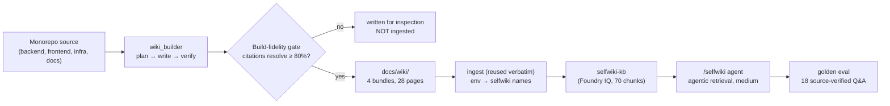

# Case study: the mechanism on itself (selfwiki)

We turned the assurance mechanism on **its own source**: generated a deep-wiki from this
monorepo (`apps/backend`, `apps/frontend`, `infra`, `docs`), ingested it into a dedicated
Foundry IQ knowledge base, and stood up a third grounded agent — `/selfwiki`, "the
deep-wiki daqui" — that answers questions about this project from that wiki.

The point wasn't a demo. Dogfooding a quality mechanism on a codebase you know cold is the
fastest way to find where it lies to you. It found two real bugs **in the mechanism
itself**, forced a model migration, and exposed an operational rough edge — and then
proved the core claim (the mechanism is domain-generic) by construction.

## The pipeline



## What it found

### 1. The model under it had been retired

The first `azd provision` **failed validation**: the Bicep pinned `gpt-4.1-mini`
(`2025-04-14`), which Azure now reports as *Deprecating* and refuses for new deployments —
and the whole `gpt-4.1` / `gpt-4o` **chat** families are no longer GA in `eastus2`. Only
the `gpt-5.x` family remains. Migrated the default to **`gpt-5-mini`** (`2025-08-07`,
GlobalStandard) across `infra/` + `settings.py` + `.env`. A showcase that can't
re-provision is broken; dogfooding caught it before a user would.

### 2. The fidelity gate had a citation-counting bug (it found a fault in itself)

The build-fidelity gate measures *what fraction of the wiki's file citations resolve to a
real source file*. On the first run, backend scored 95% but **frontend 37%** and **infra
50%** — both failed the gate. Investigation showed it was **not** the wiki hallucinating:
the gate's citation regex built its file-extension alternation **alphabetically**, so `js`
sorted before `json`. Regex alternation is first-match, so every `main.parameters.json`
was captured as `main.parameters.js` — a path that never resolves. **Every `.json` /
`.tsx` citation silently failed.** A Python-only corpus (the backend) hid it; the
config/TS-heavy areas exposed it.

Fix: order the alternation longest-extension-first (`json` before `js`, `tsx` before
`ts`). Re-scored with no regeneration: frontend **37% → 94%**, infra **50% → 98%**. The
bundles were always faithful; the gate was miscounting.

### 3. The fidelity gate under-scored cross-area bundles

The `docs/` bundle then scored **71%** — still below the floor. But a docs/overview wiki
*legitimately* cites files across `apps/` and `infra/`, and the gate resolved citations
only against the bundle's own `--repo` gather (`docs/` alone). Scored against the whole
monorepo — the fair denominator — it's **85%**. Added a `--fidelity-root` flag so a
monorepo sub-area bundle resolves citations against the repo root. (Cockpit, where
`--repo` *is* the whole component, is unaffected.)

### 4. A freshly-provisioned Foundry project 404s under burst

Generation and eval intermittently hit `404 Project not found` even though isolated calls
succeeded — a just-(re)provisioned project's inference routing propagates for a while, so
bursts of agentic calls hit cold nodes. Hardened both `wiki_builder` and the eval harness
with exponential-backoff retry on the transient class (404/429/connection-reset). Without
it, one flaky call crashes a whole run; with it, the runs converge.

## What it proved: the mechanism is domain-generic

The strongest result is what *didn't* need new code. The selfwiki domain reuses the
Cockpit ingest **verbatim** — the only difference is environment:

```bash
KB_KNOWLEDGE_SOURCE=selfwiki-docbundles-ks \
COCKPIT_STORAGE_CONTAINER=selfwiki-corpus \
COCKPIT_SEARCH_KNOWLEDGE_BASE=selfwiki-kb \
COCKPIT_DOCBUNDLES=../../docs/wiki \
  uv run python -m app.knowledge.ingest_cockpit
```

The agent (`app/agents/selfwiki.py`) is a thin mirror of the Cockpit agent pointed at a
different KB. "Same machine, different corpus + prompts" stopped being a claim and became
the actual implementation — a third domain that ships by configuration.

## Build-fidelity results

| Bundle | Source area | Pages | Fidelity (post-fix) |
| --- | --- | --- | --- |
| `foundry-helpdesk-backend`  | `apps/backend`  | 7 | 96% (194/203, 36 files) |
| `foundry-helpdesk-frontend` | `apps/frontend` | 7 | 94% (179/190, 28 files) |
| `foundry-helpdesk-infra`    | `infra`         | 7 | 98% (132/135, 7 files) |
| `foundry-helpdesk-docs`     | `docs`          | 7 | 85% (145/170, 30 files, vs monorepo) |

All four ingested → `selfwiki-kb`, 70 indexed chunks.

## Answer quality (golden eval)

The golden set is **18 source-verified Q&A** about this project, spanning all four areas
(`eval/datasets/selfwiki_golden.jsonl`), run through `eval/run_eval.py --domain selfwiki`.

**Local policy gate — 18/18 passed, 0 failed.** Every answer cited a project source (an
area + document, often a real file path) or declined; none leaked a secret. The gate is
deterministic and CI-blocking. Spot-checking the answers confirmed grounding, not just the
presence of a citation: e.g. *"which AG-UI endpoints does the backend expose"* returned
`/helpdesk`, `/cockpit`, `/selfwiki` cited to `app/main.py`; *"how does document-level
access control work"* described the `groups` field + the `secure_search` trim, cited to
the backend ACL pages.

> A `--cloud` pass (Foundry's hosted SIMILARITY / RELEVANCE / COHERENCE judges, scored
> against each golden `expected`) adds correctness signal on top of the citation gate.
> On this run the hosted eval-run retrieval itself errored (a platform-side flake on the
> just-provisioned project — the same fresh-project instability that forced the retry
> hardening above), so the cloud judge scores aren't reported here. By design the
> deterministic local gate is the CI blocker; the cloud judges are graded signal, not a
> gate, so a flaky judge run doesn't block anything. Re-run `--cloud` once the project
> settles to populate the portal scores.

## What it means

Dogfooding didn't just *test* the mechanism — it **improved** it. Two latent gate bugs
(citation regex, cross-area scope) would have mis-graded any `.json`/`.tsx`-heavy or
cross-cutting corpus a real adopter pointed it at; both are now fixed and the deep-wiki of
this very repo is live and queryable. The generated wiki lives in
[`docs/wiki/`](./wiki/README.md); regenerate and re-ingest with the commands there.
