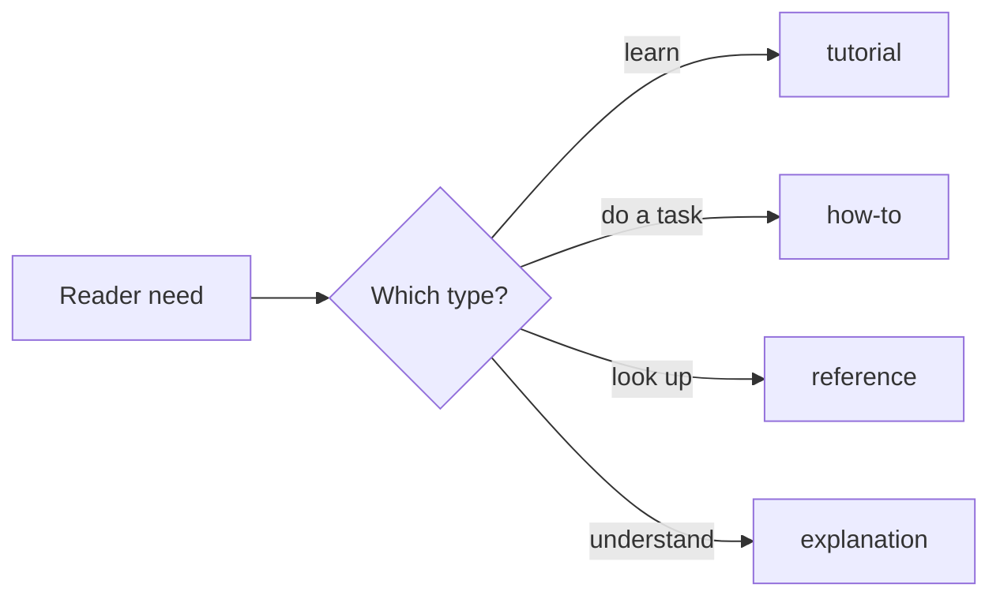

# Documentation standard

How we write docs here, so they're consistent and predictable. It's grounded in what
Microsoft and the wider industry already do — not invented for this repo.

## 1. Every doc has a type (Diátaxis ↔ Microsoft Learn)

We use the [Diátaxis](https://diataxis.fr/) framework (tutorial / how-to / reference /
explanation). It maps 1:1 onto [Microsoft Learn's content types](https://learn.microsoft.com/en-us/contribute/content/markdown-reference)
(`ms.topic`), so a reader's *need* picks the type:

| Type (`type:`) | Microsoft `ms.topic` | The reader is… | Examples here |
| --- | --- | --- | --- |
| `tutorial` | tutorial | learning by doing | (none yet) |
| `how-to` | how-to | trying to complete a task | `DEPLOYMENT.md`, `USE-THIS-TEMPLATE.md`, `CUSTOMIZE.md`, `RELEASE-AUTOMATION.md` |
| `reference` | reference | looking something up | `METHOD.md`, this file |
| `explanation` | conceptual | trying to understand *why* | `CASE-STUDY-LLM-WIKI-LOOP.md`, `USE-CASE-WALKTHROUGH.md` |
| `plan` | conceptual | tracking intended work | `ASSURANCE-MECHANISM-PLAN.md`, `SECOND-DOMAIN-WIKI-PLAN.md` |

Don't mix types in one doc — split a how-to that grows long explanations into a how-to +
an explanation that link to each other.

## 2. Front-matter (lightweight, MS-style)

Every `.md` under `docs/` starts with a YAML block, then exactly one `# H1`
(Microsoft Learn requires both, in that order):

```yaml
---
title: <short title>
description: <one sentence — what + who it's for>
type: tutorial | how-to | reference | explanation | plan
audience: operator | contributor | evaluator | adopter
status: draft | stable | superseded
updated: YYYY-MM-DD
---
```

Root docs (`README.md`, `CONTRIBUTING.md`, `SECURITY.md`) keep their conventional shape
(no front-matter) — GitHub treats them specially.

**Exception — generated content.** Everything under [`docs/wiki/`](./wiki/) is the
machine-generated deep-wiki (the `selfwiki` domain, in the ingest bundle format) and is
**exempt from the front-matter + one-H1 rules** — it's not hand-written and is regenerated,
not edited. See [`docs/wiki/README.md`](./wiki/README.md).

## 3. Diagrams are Mermaid, as code

Architecture and flows are **[Mermaid](https://learn.microsoft.com/en-us/azure/devops/project/wiki/markdown-guidance)**,
not ASCII art — it's the diagrams-as-code approach Microsoft uses in Azure DevOps wikis
and Learn, and **GitHub renders it natively** in `.md`. The diagram lives in the doc,
versioned next to the code, reviewed in the same PR.

- **`flowchart`** for architecture, pipelines, and decision flows.
- **`sequenceDiagram`** for runtime / request / auth flows (who calls whom, in order).
- Quote labels that contain special characters: `A["/auth"]` (a raw `/` breaks the parser).
- Keep one diagram per concept; put the prose explanation right after it.



## 4. Voice & formatting (Microsoft Writing Style Guide)

- Friendly, second person, simple sentences. Active voice.
- One `# H1`; `##` headings carry the page's navigation — use them deliberately.
- Use alerts (`> [!NOTE]`, `> [!IMPORTANT]`, `> [!WARNING]`) sparingly — one or two per
  doc; prefer putting the point in the text.
- Tables for structured comparisons; fenced code with a language tag for commands.

## 5. Docs-as-code & maintenance

- Docs live in the repo, change in the same PR as the code they describe, and are
  reviewed like code.
- The [`docs/README.md`](./README.md) index lists every doc with its type + audience —
  add a row when you add a doc.
- The assurance gates keep code↔docs honest where they overlap (e.g. the access model);
  when behavior changes, update the doc in the same change.
- **One source of truth per fact.** If two docs would state the same thing, one links to
  the other.
