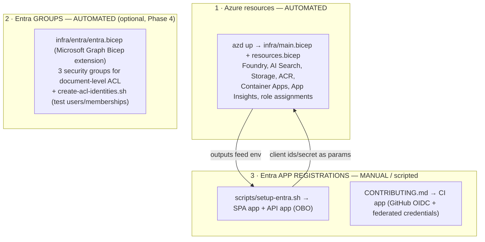

# Identity & access setup — what's automated vs manual

The non-obvious thing when picking this repo up: **`azd up` does NOT create the Entra ID app
registrations.** It provisions the Azure resources and (optionally) the ACL *groups*, but the
**app registrations** (sign-in + OBO + CI) are a separate, mostly-manual step. This page is
the map so nobody has to rediscover it — the step-by-step lives in the linked docs; here is
*what creates what, and why.*

## The three layers

## What creates what

| Objeto | Criado por | Automático? | Onde |
| --- | --- | :---: | --- |
| Azure resources (Foundry, Search, Storage, Container Apps, …) + role assignments | `azd up` → `infra/main.bicep` | ✅ | [DEPLOYMENT.md Step 1](./DEPLOYMENT.md) |
| Entra **security groups** (public/internal/confidential) for the KB ACL | `infra/entra/entra.bicep` (MS Graph Bicep extension) | ✅ (deploy separado, tenant-scoped) | Phase 4 / [METHOD.md](./METHOD.md) |
| Demo **groups + test users** + memberships (ACL demo) | `infra/entra/create-acl-identities.sh` · `create-test-users.sh` | ✅ (script) | infra/entra/ |
| **API app registration** (backend audience, OBO) | `scripts/setup-entra.sh` *(ou manual)* | ⚠️ semi | [DEPLOYMENT.md Step 3a](./DEPLOYMENT.md) |
| **SPA app registration** (frontend sign-in) | `scripts/setup-entra.sh` *(ou manual)* | ⚠️ semi | [DEPLOYMENT.md Step 3b](./DEPLOYMENT.md) |
| **CI app registration** (GitHub Actions OIDC + federated credentials) | manual `az ad app create` | ❌ | [CONTRIBUTING.md](../CONTRIBUTING.md) |
| Admin consent (Graph / Search `user_impersonation`) | manual (Entra admin) | ❌ | DEPLOYMENT Step 3 |

## The three app registrations

| App | Para quê | Produz (env / secret) |
| --- | --- | --- |
| **API** | a *audiência* que o backend valida; faz o **OBO** (troca o token do usuário por um token de Search agindo como ele) | `ENTRA_API_CLIENT_ID`, `ENTRA_API_CLIENT_SECRET` |
| **SPA** | o frontend (MSAL) onde o usuário **assina** | `NEXT_PUBLIC_ENTRA_SPA_CLIENT_ID` (+ `NEXT_PUBLIC_ENTRA_API_CLIENT_ID`, `_TENANT_ID`) |
| **CI** | o **GitHub Actions** logar no Azure sem secret, via **OIDC + federated credentials** | repo vars `AZURE_CLIENT_ID` / `_TENANT_ID` / `_SUBSCRIPTION_ID` |

> A **federated credential** do app de CI referencia o **nome do repo** no subject
> (`repo:<owner>/<repo>:ref:refs/heads/main` e `…:environment:production`). **Se o repo for
> renomeado, atualize o subject** (`az ad app federated-credential update`), senão os jobs que
> logam no Azure (deploy, security-gates, eval-cloud) param de autenticar. O CI básico
> (lint/build/typecheck) não usa OIDC e segue funcionando.

## Por que os app registrations não estão no Bicep

1. **Secret**: o app de OBO precisa de client secret — não se quer o Bicep gerando/expondo secret em output de texto plano.
2. **Admin consent**: as permissões delegadas exigem consentimento de admin — passo interativo, não declarativo.
3. **Separação**: identidade (apps) costuma ser de outro processo/time que a infra.
4. A extensão Graph do Bicep *até* criaria `Microsoft.Graph/applications`, mas por (1)–(3) optou-se por script + parâmetros. (Os **grupos**, que não têm esses problemas, *estão* no Bicep.)

## Gotcha: o que sobrevive ao `azd down`

`azd down` apaga **só o resource group** (os recursos Azure). **Os objetos do Entra
persistem**: app registrations, grupos e usuários **continuam** no tenant. Então:

- Re-rodar `azd up` **não** recria os app regs — reaproveite os existentes (os `ENTRA_*` continuam válidos).
- Os secrets de client **expiram** (rotacione quando vencer).
- Para zerar de verdade a identidade, apague os app regs/grupos à mão (`az ad app delete`, `az ad group delete`).

## Handoff — do zero ao rodando

1. **Infra:** `azd up` → [DEPLOYMENT.md Step 1](./DEPLOYMENT.md).
2. **App regs (sign-in + OBO):** `scripts/setup-entra.sh` (idempotente) → [Step 3](./DEPLOYMENT.md). Pule se for rodar **sem login** (só `DefaultAzureCredential`).
3. **CI (OIDC):** crie o app de CI + federated credentials → [CONTRIBUTING.md](../CONTRIBUTING.md); configure as repo vars/secrets.
4. **ACL (opcional, Phase 4):** deploy `infra/entra/entra.bicep` + `create-acl-identities.sh` → [METHOD.md](./METHOD.md).
5. **Dados:** ingest das KBs → [DEPLOYMENT.md Step 4](./DEPLOYMENT.md).

Se for **só rodar/demonstrar** sem multiusuário, os passos 2–4 são opcionais: o app cai no
`DefaultAzureCredential` e a auth fica desligada.
