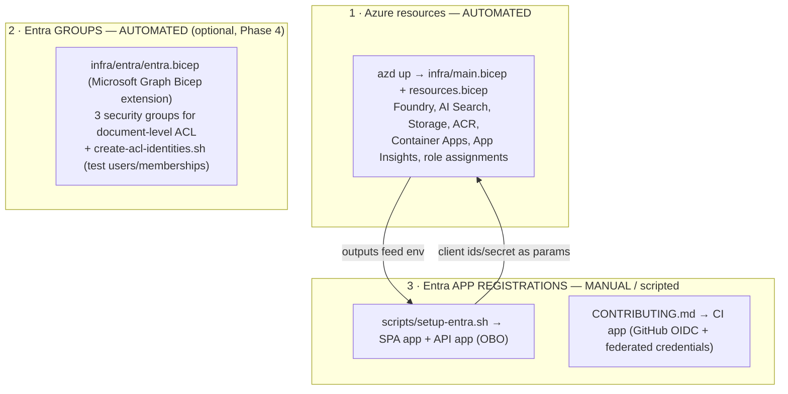

# Identity & access setup — what's automated vs manual

The non-obvious thing when picking this repo up: **`azd up` does NOT create the Entra ID app
registrations.** It provisions the Azure resources and (optionally) the ACL *groups*, but the
**app registrations** (sign-in + OBO + CI) are a separate, mostly-manual step. This page is
the map so nobody has to rediscover it — the step-by-step lives in the linked docs; here is
*what creates what, and why.*

## The three layers

## What creates what

| Object | Created by | Automated? | Where |
| --- | --- | :---: | --- |
| Azure resources (Foundry, Search, Storage, Container Apps, …) + role assignments | `azd up` → `infra/main.bicep` | ✅ | [DEPLOYMENT.md Step 1](./DEPLOYMENT.md) |
| Entra **security groups** (public/internal/confidential) for the KB ACL | `infra/entra/entra.bicep` (MS Graph Bicep extension) | ✅ (separate, tenant-scoped deploy) | Phase 4 / [METHOD.md](./METHOD.md) |
| Demo **groups + test users** + memberships (ACL demo) | `infra/entra/create-acl-identities.sh` · `create-test-users.sh` | ✅ (script) | infra/entra/ |
| **API app registration** (backend audience, OBO) | `scripts/setup-entra.sh` *(or manual)* | ⚠️ semi | [DEPLOYMENT.md Step 3a](./DEPLOYMENT.md) |
| **SPA app registration** (frontend sign-in) | `scripts/setup-entra.sh` *(or manual)* | ⚠️ semi | [DEPLOYMENT.md Step 3b](./DEPLOYMENT.md) |
| **App roles** (Admin/Author/Approver/Reader) on the API app + app-only Graph permissions | `scripts/setup-app-roles.sh` | ⚠️ semi (you still assign yourself Admin in the portal) | [DEPLOYMENT.md Step 3d](./DEPLOYMENT.md) · [RBAC plan](./RBAC-AND-USER-MANAGEMENT-PLAN.md) |
| **CI app registration** (GitHub Actions OIDC + federated credentials) | manual `az ad app create` | ❌ | [CONTRIBUTING.md](../CONTRIBUTING.md) |
| Admin consent (Graph / Search `user_impersonation`) | manual (Entra admin) | ❌ | DEPLOYMENT Step 3 |

## The three app registrations

| App | What it's for | Produces (env / secret) |
| --- | --- | --- |
| **API** | the *audience* the backend validates; performs the **OBO** exchange (swaps the user's token for a Search token acting as them) | `ENTRA_API_CLIENT_ID`, `ENTRA_API_CLIENT_SECRET` |
| **SPA** | the frontend (MSAL) where the user **signs in** | `NEXT_PUBLIC_ENTRA_SPA_CLIENT_ID` (+ `NEXT_PUBLIC_ENTRA_API_CLIENT_ID`, `_TENANT_ID`) |
| **CI** | lets **GitHub Actions** sign in to Azure with no secret, via **OIDC + federated credentials** | repo vars `AZURE_CLIENT_ID` / `_TENANT_ID` / `_SUBSCRIPTION_ID` |

> The CI app's **federated credential** references the **repo name** in its subject
> (`repo:<owner>/<repo>:ref:refs/heads/main` and `…:environment:production`). **If the repo is
> renamed, update the subject** (`az ad app federated-credential update`), or the jobs that
> sign in to Azure (deploy, security-gates, eval-cloud) stop authenticating. The basic CI
> (lint/build/typecheck) doesn't use OIDC and keeps working.
> *(Already done for this repo: the subjects were updated to `repo:ruinosus/foundry-assured`
> after the rename.)*

## Why the app registrations aren't in Bicep

1. **Secret**: the OBO app needs a client secret — you don't want Bicep generating/exposing a secret in a plaintext output.
2. **Admin consent**: the delegated permissions require admin consent — an interactive, non-declarative step.
3. **Separation**: identity (apps) is usually a different process/team than infra.
4. The Graph Bicep extension *could* create `Microsoft.Graph/applications`, but for reasons (1)–(3) we use a script + parameters instead. (The **groups**, which don't have those problems, *are* in Bicep.)

## Gotcha: what survives `azd down`

`azd down` deletes **only the resource group** (the Azure resources). **The Entra objects
persist**: app registrations, groups, and users **remain** in the tenant. So:

- Re-running `azd up` does **not** recreate the app regs — reuse the existing ones (the `ENTRA_*` values stay valid).
- Client secrets **expire** (rotate when they do).
- To truly reset identity, delete the app regs/groups by hand (`az ad app delete`, `az ad group delete`).

## Handoff — from zero to running

1. **Infra:** `azd up` → [DEPLOYMENT.md Step 1](./DEPLOYMENT.md).
2. **App regs (sign-in + OBO):** `scripts/setup-entra.sh` (idempotent) → [Step 3](./DEPLOYMENT.md). Skip if you'll run **without sign-in** (single `DefaultAzureCredential`).
3. **App roles (RBAC):** `ENTRA_API_CLIENT_ID=<api> scripts/setup-app-roles.sh`, then assign yourself **Admin** in the portal → [Step 3d](./DEPLOYMENT.md). Needed for HITL approval (Approver/Admin) + the `/admin/users` portal (Admin).
4. **CI (OIDC):** create the CI app + federated credentials → [CONTRIBUTING.md](../CONTRIBUTING.md); set the repo vars/secrets.
5. **ACL (optional, Phase 4):** deploy `infra/entra/entra.bicep` + `create-acl-identities.sh` → [METHOD.md](./METHOD.md).
6. **Data:** ingest the KBs → [DEPLOYMENT.md Step 4](./DEPLOYMENT.md).

If you're **only running/demoing** without multi-user, steps 2–5 are optional: the app falls
back to `DefaultAzureCredential` and auth is simply off.
