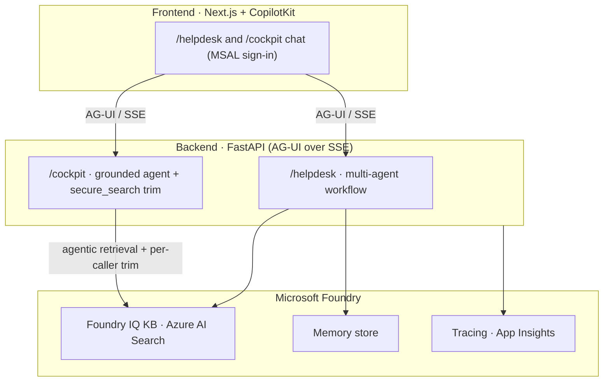
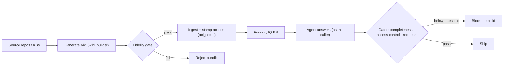

# The mechanism — what it guarantees, how, and how to run it

The reusable recipe to point an agent at one or more repositories / knowledge bases and
get **measured** guarantees: the KB is built faithfully, the agent answers correctly and
completely, and **access is secure** — each caller sees only what they're entitled to,
and no prompt can change that. 100% on Microsoft Foundry. The code is domain-agnostic;
the company brings the data.

> Design & rationale: [`ASSURANCE-MECHANISM-PLAN.md`](./ASSURANCE-MECHANISM-PLAN.md).
> Worked example: [`USE-CASE-WALKTHROUGH.md`](./USE-CASE-WALKTHROUGH.md) (and the visual
> [`use-case-demo.html`](./use-case-demo.html)).

## The shape — three layers

The frontend talks to the backend over AG-UI; the backend runs the workflow against Foundry.



## The guarantees, as controls (not promises)

| Pillar | Guarantee | Gate (🟢/🔴) |
| --- | --- | --- |
| Build right | every wiki claim cites a real source file | **fidelity gate** (`wiki_builder`, `build.fidelity_min`) |
| Retrieve complete | nothing relevant is left out | recall measured (agentic `reasoning_effort`) |
| Answer well | grounded + complete | **completeness gate** (`run_eval`, `answer_completeness_min`) |
| Secure access | each caller sees only their entitlement | **access-control gate** (`access_control_test`, `…violations_max: 0`) |
| Injection-proof | no prompt leaks across groups | **red-team gate** (`red_team_test`, `redteam_asr_max`) |

Thresholds live in one file: [`apps/backend/eval/assurance.yaml`](../apps/backend/eval/assurance.yaml).

Those gates sit along a build → consume → measure pipeline — each one can stop the build:



## Code vs. data (why it's a template)

| Generic **code** (this repo) | Company **data** (external, gitignored) |
| --- | --- |
| `wiki_builder`, `ingest_cockpit`, `acl_setup`, `secure_search`, the eval/red-team harness | the **corpus** (your wikis) |
| reads each doc's access groups → stamps → enforces | the **access** of each doc — inherited from the source repo/ACL, written to the bundle manifest's `groups` (or an external `{component: [group]}` map) |
| maps group **name → Entra id** (config) | your **Entra groups** + their object-IDs (`.env` / repo vars) |
| the agent, prompts, gates | your **golden set** + thresholds |

There is **no classification logic in the code** — access *follows the source*.

## How to run it (operator steps)

1. **Provision** — `azd up` (your Foundry + Search + apps).
2. **Identities** — your security groups exist (or `infra/entra/entra.bicep` /
   `create-acl-identities.sh` create demo ones); set `COCKPIT_ACL_GROUP_MAP` (name→id).
3. **Generate** — `wiki_builder --repo <r> --component <c> --groups <repo read teams>`;
   the fidelity gate rejects a low-fidelity bundle.
4. **Ingest** — `ingest_cockpit` reads each manifest's `groups` and calls
   `app/knowledge/acl_setup.py`, which stamps the index `groups` field and enables
   query-time trimming (the code-vs-data split above: data in, no classification logic).
   (SharePoint/ADLS sources carry native ACLs — Foundry IQ ingests them automatically;
   this step is for blob/generated sources.)
5. **Consume** — the agent retrieves *as the caller* (OBO) and trims to entitlement
   (`secure_search`: service-side passthrough + app-side trim — defense in depth).

   The per-caller trim, as a request flow (defense in depth — the app-side trim is fail-closed):

   ```mermaid
   sequenceDiagram
     actor U as Signed-in user
     participant FE as Frontend (MSAL)
     participant BE as Backend /cockpit (OBO)
     participant SP as SecureAzureAISearchProvider
     participant S as Azure AI Search (Foundry IQ)
     participant M as Model
     U->>FE: question
     FE->>BE: question + user token
     BE->>SP: run agent (OBO credential)
     SP->>S: agentic retrieve (caller token — layer C)
     S-->>SP: chunks (full recall)
     SP->>S: direct search AS caller → entitled components
     S-->>SP: caller's authorized set
     SP->>SP: drop chunks outside entitlement (layer B, fail-closed)
     SP->>M: only authorized chunks
     M-->>U: grounded answer (no cross-group leak)
   ```
6. **Gate** — quality in `ci.yml`/`agent-evals.yml`; security in `security-gates.yml`
   (access-control + red-team). Below threshold → the build fails.

## Adapting to a new domain

See [`CUSTOMIZE.md`](./CUSTOMIZE.md): swap the corpus, the prompts, the action, and — new
for the assurance mechanism — the **access** (your groups + each source's read access)
and the **golden/thresholds**. The mechanism itself is never edited.
