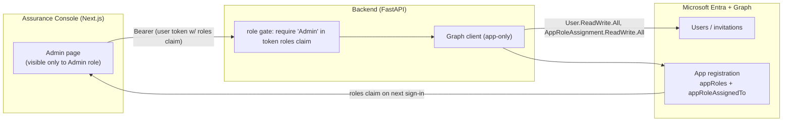

# Plan: app RBAC + user management

## Goal

Two things, both Microsoft-native and built on the Entra + OBO we already have:

1. **App RBAC** — a small, stable set of **Entra App Roles** (`Admin` / `Author` / `Approver`
   / `Reader`) that the app *owns*, gating what a signed-in user can **do**. They ride in the
   token's `roles` claim; the backend authorizes endpoints and the frontend shows/hides
   features.
2. **User management via the portal** — an admin page in the Assurance Console for the **full
   user lifecycle** (invite / create / remove) and **role assignment**, all through
   **Microsoft Graph** — no parallel user store.

## The model: company roles vs app roles (the core distinction)

Enterprise RBAC separates two layers — and the app must respect that line:

| Layer | Owner | Example | In Entra |
|------|-------|---------|----------|
| **Business roles** | the **company** (HR/IAM) | "Finance Manager EMEA", "Engineer APAC" | **security groups** (org-structured: function × region × seniority × entity) |
| **Application roles** | the **app** | `Admin` / `Author` / `Reader` | **App Roles** on the app registration (`roles` claim) |

**The bridge is the mapping**: the company maps *its* groups → *our* app roles. The app
defines **few** roles; the org's complexity lives in **its** groups. If the app tried to model
the multinational's org chart (function × region × seniority × subsidiary), it would hit the
classic **role explosion**. So:

```
COMPANY (owns)                           APP (owns)
business-role groups       ── maps ──▶   app roles (few, stable)
"Eng-EMEA","Fin-APAC",                   Admin · Author · Reader
"IT-Admins","All-Staff"                  (token `roles` claim)
```

This mirrors the document ACL we already built ("a multinational maps these to its own
groups/tiers"). **Groups answer "what can I *see*"; roles answer "what can I *do*".**

## App roles (the app's vocabulary)

| App role | Can do |
|----------|--------|
| **Admin** | manage users + role assignments, configure, ingest KBs |
| **Author** | generate/upload content (decks, wikis), trigger ingest |
| **Approver** | approve/reject HITL escalations (the `create_ticket` approval card) — ties to the existing human-in-the-loop gate |
| **Reader** | query the agents, see what they're entitled to |

Kept deliberately small and permission-oriented (not org-mirroring). Defined as
`appRoles` on the API app registration. `Approver` is the RBAC anchor for the existing HITL
flow: today anyone signed in can approve a ticket; with the role, only Approvers (or Admins) can.

## Assignment: groups (enterprise) vs users (this tenant)

- **Enterprise pattern (recommended):** assign an app role to a **group**, not individuals —
  scalable, consistent, auditable; the app sees the role, the company manages the group.
  **Requires Entra ID P1.**
- **This tenant (`jeffersonbarnabegmail.onmicrosoft.com`) is Entra free** (empty
  `subscribedSkus`), so **group-based app-role assignment isn't available** — we assign app
  roles **to users directly** (works on free). The portal supports **both** (user or group),
  so a real multinational with P1 uses groups; the demo uses users. *(Verify P1 before relying
  on group assignment — same kind of tenant caveat as the no-M365 finding.)*

## Microsoft Graph surface

The admin page drives everything through Graph:

| Action | Graph |
|--------|-------|
| List users | `GET /users` |
| Invite external user (B2B guest) | `POST /invitations` |
| Create internal user | `POST /users` |
| Remove user | `DELETE /users/{id}` |
| Read app's roles + assignments | `GET /servicePrincipals/{spId}/appRoleAssignedTo` |
| Assign / revoke an app role (to user or group) | `POST` / `DELETE /servicePrincipals/{spId}/appRoleAssignedTo` |

**Permissions (admin consent required):** `User.ReadWrite.All`, `User.Invite.All`,
`AppRoleAssignment.ReadWrite.All`, `Directory.Read.All`. These are powerful — see Security.

**Delegated (OBO) vs application permissions:** prefer **app-only** Graph permissions (the API
app's own identity does the management, regardless of which admin called) **gated hard behind
the app's `Admin` role** server-side. The alternative (delegated/OBO) would require each admin
to personally hold directory rights — heavier and inconsistent. App-only + server-side role
gate = clean least-privilege at the app layer.

## Architecture



A user's role change takes effect on their **next token** (sign-in / refresh).

## Admin portal page (Assurance Console)

A new `/admin/users` route, **rendered only for the `Admin` role** (and re-checked
server-side). Lists users with their app roles; actions: **invite/create**, **assign/revoke
role** (user or group), **remove**. Calls thin backend endpoints (below); no Graph from the
browser.

## Backend (FastAPI — additions)

- **Role gate**: a dependency that reads the `roles` claim from the validated token and
  requires `Admin` for the admin endpoints (defense in depth — never trust the hidden UI).
- **Endpoints** (all `Admin`-gated): `GET /admin/users`, `POST /admin/users/invite`,
  `POST /admin/users`, `DELETE /admin/users/{id}`, `GET /admin/role-assignments`,
  `POST /admin/role-assignments`, `DELETE /admin/role-assignments/{id}`.
- Each calls Graph (app-only) via a small client.

## Reused vs new

| Piece | Reused | New |
|------|:----:|:---:|
| Entra ID + MSAL sign-in | ✅ | |
| Token validation (the API app audience) | ✅ | + read `roles` claim |
| Backend auth dependency | ✅ | + role gate |
| **App Roles** on the app registration | | ✅ (declare appRoles) |
| Graph client (app-only) + admin endpoints | | ✅ |
| `/admin/users` page in the console | | ✅ |

## Governance (enterprise, future)

- **PIM** (Privileged Identity Management) — just-in-time elevation for `Admin` (eligible →
  activate for a window) instead of standing access.
- **Access packages / entitlement management** — request + approval + recertification of role
  assignments across systems, for multinational governance.

These are Entra features the app inherits; out of MVP scope but worth noting for a real rollout.

## Security considerations

- **Server-side role gate, always.** Hiding the admin UI is not security; every admin endpoint
  re-checks the `Admin` role from the validated token.
- **Powerful Graph permissions.** `User.ReadWrite.All` + `AppRoleAssignment.ReadWrite.All`
  let the app manage *all* users — so the app-only credential must be tightly held (Key Vault),
  every admin action audited (App Insights), and the `Admin` role granted sparingly.
- **Least privilege + PIM** for the `Admin` role itself.
- **Token staleness**: role changes apply on the next token; the UI should say so.

## MVP (decided)

Full scope — the lifecycle is in the MVP.

1. Declare `appRoles` (**Admin / Author / Approver / Reader**) on the API app registration;
   surface the `roles` claim.
2. Backend role gate + read the claim; gate real actions by role: ingest = Author/Admin,
   the HITL approval = **Approver**/Admin.
3. `GET /admin/role-assignments` + assign/revoke **to a user** (free-tenant path) via Graph.
4. `/admin/users` page (list + assign/revoke role), Admin-only.
5. **Full user lifecycle in the MVP**: invite (B2B guest), create (internal member), remove.
6. Group-based assignment deferred to when the tenant has **P1** (the portal already supports
   the user path; the group path is the same Graph call against a group principal).

## Decisions (resolved 2026-06-29)

1. **Entra ID P1?** — No (tenant is free). **User-level app-role assignment** for the demo;
   group-based assignment is the same call and lights up when P1 is available.
2. **Graph auth** — **App-only** Graph permissions, gated hard behind the server-side `Admin`
   role check. ✅
3. **Role set** — **Admin / Author / Approver / Reader** (added `Approver`, anchoring the HITL gate). ✅
4. **User lifecycle** — **invite + create + remove, all in the MVP**. ✅
