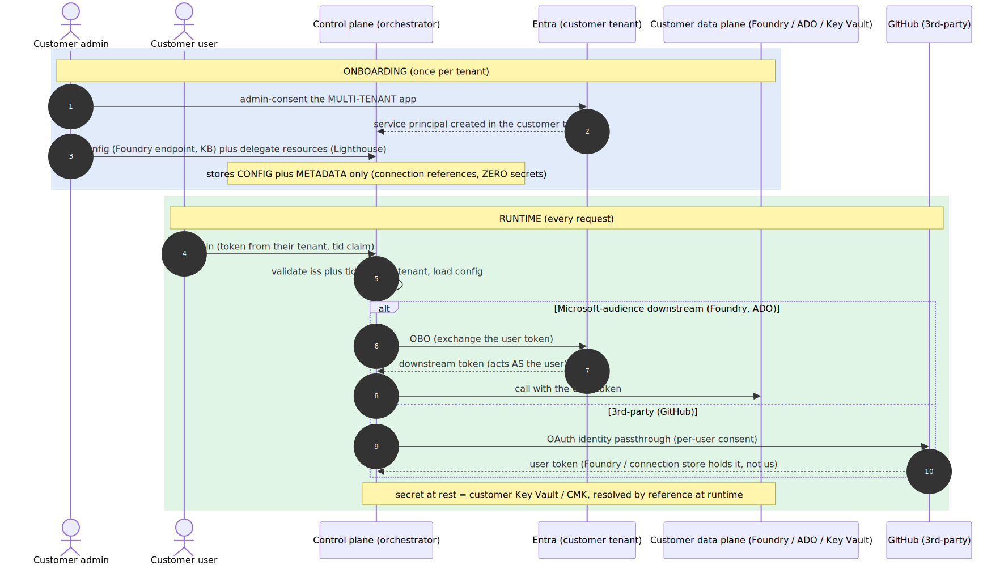

# Foundry Assured — multi-tenant SaaS target architecture

> **Scope of this document.** This is the **high-level target architecture** (validate
> feasibility + sequence the work), not implementation depth. The four sub-projects it defines
> (A–D) each get their own spec → plan → build cycle. Decisions here are recorded as
> [ADR-001…007](../../adr/README.md); figures are slide-ready under
> [`docs/diagrams/saas/`](../../diagrams/saas/) (Mermaid source + rendered SVG).

## Goal

Evolve Foundry Assured from a **single-tenant, self-hosted** product (customer provisions their
own Azure via `azd`) into a **hybrid multi-tenant SaaS** where **we are the orchestrator /
control plane** and **all data, compute, and credentials stay in the customer's cloud (BYO)**.
Each customer connects their own Foundry, knowledge base, and external services (GitHub/ADO)
through the web app, with per-user identity via Entra OBO + OAuth identity passthrough. The
**self-hosted and managed models coexist on one codebase** — no fork.

## Non-goals (this spec)

- Implementation-level detail of any sub-project (each gets its own spec/plan).
- Billing, metering, and self-serve sign-up (future).
- A "managed data plane" tier where we host Foundry for customers without Azure (BYO-first; noted as a future option in [ADR-004](../../adr/ADR-004-byo-data-plane-foundry-project.md)).

## 1. Big picture — control plane × data plane

*(source: [`01-control-plane-vs-data-plane.mmd`](../../diagrams/saas/01-control-plane-vs-data-plane.mmd))*

We operate the **control plane** (UI + orchestrator + RBAC + assurance gates); all data,
compute, secrets, and connections live in the customer's **data plane**. The control-plane
store holds **per-tenant config + connection metadata only — never secrets, never customer
data**. At runtime we resolve the tenant from the token's `tid`, load that tenant's config, mint
a brokered token (OBO / passthrough), and call **the customer's own data plane**. The natural
isolation boundary is the customer's **Foundry project**.

## 2. Identity & credential flow

*(source: [`02-identity-credential-flow.mmd`](../../diagrams/saas/02-identity-credential-flow.mmd) · decisions: [ADR-003](../../adr/ADR-003-multitenant-identity-obo.md), [ADR-005](../../adr/ADR-005-never-store-secrets.md))*

- **Onboarding (once/tenant):** the customer admin **admin-consents** the multi-tenant app →
  a service principal is created in their tenant; the admin plugs config and delegates data-plane
  resources (Lighthouse). We store config + connection references only.
- **Runtime, Microsoft-audience (Foundry, ADO):** **OBO** — we exchange the user's token and act
  *as the user*, no extra step (they already signed in with Microsoft). This is today's
  `app/core/auth.py`, made multi-tenant.
- **Runtime, third-party (GitHub):** **OAuth identity passthrough** — per-user consent. **The
  third-party token is held by the customer's Foundry Agent Service; the control-plane store
  holds only a connection reference.** (Microsoft blocks passing a Microsoft-audience token to a
  third-party endpoint, so this path *must* use the service's own OAuth.)
- **Secrets at rest:** the **customer's Key Vault / CMK**, referenced by `secret_ref`, resolved
  at runtime.

## 3. Deployment stamps — one codebase, three modes

*(source: [`03-deployment-stamps.mmd`](../../diagrams/saas/03-deployment-stamps.mmd) · decisions: [ADR-001](../../adr/ADR-001-tenancy-deployment-stamps.md), [ADR-002](../../adr/ADR-002-dedicated-stamp-managed-app-lighthouse.md), [ADR-007](../../adr/ADR-007-coexistence-deployment-mode.md))*

The same code runs in three configurations, differing only in **where the control plane runs**
and **how many tenants it serves**:

| Mode | Tenancy | Where | Vehicle |
|---|---|---|---|
| **self-hosted** (today) | 1 | customer cloud, customer operates | `azd up` |
| **dedicated** (enterprise) | 1 | customer cloud, we operate | Azure **Managed Application** |
| **shared** (SMB/default) | N | our cloud | multi-tenant control plane + **Lighthouse** to the data plane |

The single point of variation is the **config-resolution seam** ([§5 step 1](#5-sequencing--risks--validation)):
a `TenantConfigProvider` with a `SingleTenant` impl (self-hosted/dedicated — the global
`settings` of today) and a `MultiTenant` impl (shared — resolves by `tid`). Everything else is
identical across modes.

## 4. Per-tenant config & connection model

*(source: [`04-tenant-config-model.mmd`](../../diagrams/saas/04-tenant-config-model.mmd) · decision: [ADR-006](../../adr/ADR-006-tenant-scoped-config.md))*

The control-plane store keeps, per tenant: a `Tenant` record (tier/status), a `DataPlaneConfig`
(pointers to the customer's Foundry/Search/storage), `Connection`s (each with an `auth_method`
and a `secret_ref` that is **never** the secret), and `DomainAssignment`s (which agents are
enabled). Three seams change in today's code; the rest is untouched:

| Today (single-tenant) | Target (multi-tenant) |
|---|---|
| `settings = Settings()` global | `TenantConfigProvider.current()` → the current tenant's config |
| `memory_scope()` = `user.oid` | `f"{tid}:{user.oid}"` (per-tenant namespace) |
| static MCP `SERVERS` in code | static registry = catalog/shape; **enabled connections + endpoints come from the per-tenant store** |

Data isolation is largely **automatic** (the data lives in the customer's cloud; the agent calls
*their* Foundry with the brokered token). What *we* isolate is the per-tenant config + in-flight
request context, enforced at a **single tenant-scoping choke point**.

## 5. Sequencing, risks & validation

*(source: [`05-sequencing.mmd`](../../diagrams/saas/05-sequencing.mmd))*

**Sub-projects (each its own spec/plan later):**

1. **A — Multi-tenant foundation** *(the spine)*. The `TenantConfigProvider` + `DEPLOYMENT_MODE`,
   multi-tenant Entra, `tid` resolution, tenant-scoped store + `memory_scope`. **De-risk first:**
   ship the provider with the `SingleTenant` impl and route all `settings` access through it with
   **zero behavior change** (existing eval tests stay green) *before* adding `MultiTenant`. Two
   guards A must include: **(i)** `memory_scope` — `SingleTenant` keeps the existing **un-prefixed**
   `user.oid` scope; only `MultiTenant` prefixes by `tid` (memory keys are *persisted state*, so a
   silent prefix change in self-hosted would orphan existing memories — the "zero behavior change"
   guarantee explicitly covers persisted memory, not just config reads). **(ii)** the
   **allowed-tenant decision** must be at least stubbed (e.g. an allow-list, hardcoded for now) so
   `tid`/`iss` validation has a defined **deny path** from day one rather than waiting on open Q #4.
2. **B — Connection store + UI** (depends on A). The store schema + the "Connections" page where a
   tenant admin plugs Foundry/KB and connects GitHub/ADO via OAuth. (This is the
   "connection in the web app itself" the product needs.)
3. **C — Credential brokering** (depends on B). Multi-tenant OBO + OAuth passthrough +
   `secret_ref` resolution (Key Vault / Foundry connection).
4. **D — Stamps / packaging** (parallel to B/C). The Managed Application package (dedicated) +
   Lighthouse onboarding (shared data-plane). The deployment-mode seam from A makes this config.

> **Convergence:** **dedicated / self-hosted** end-to-end needs only **A→B→C**. **Shared-mode**
> end-to-end needs **C ∩ D** — the multi-tenant OBO in C brokers across a *Lighthouse-delegated*
> subscription, which D provisions. So C and D are independent to build but must converge before
> the shared path is testable end-to-end.

**Error handling / risks (everything fails closed):**

- Tenant not onboarded / config missing → clear error, **never** fall back to another tenant.
- Token / consent failure → fail closed per connection (the MCP pattern already shipped).
- Cross-tenant leakage → tenant-scoped queries forced at **one** choke point (auditable).
- **Biggest risk = the auth/config refactor.** Mitigated by the "`SingleTenant` provider first =
  zero behavior change" step, proven by the existing tests.

**Feasibility validation (what proves it closes):**

- The riskiest assumption — "the provider can replace the global `settings` without changing
  self-hosted behavior" — is validated **first** (provider in, eval suite green).
- Multi-tenant identity — `tid` resolution + `iss` validation proven with a second test tenant.
- Every sub-project has **one clear seam + a Microsoft-sanctioned mechanism** (stamps, Managed
  App, Lighthouse, OBO, passthrough, CMK) — that is what makes the target feasible, not invented.

## Decisions (ADRs)

All decisions in this design are recorded as ADRs: [index](../../adr/README.md) — ADR-001
(stamps), ADR-002 (Managed App + Lighthouse), ADR-003 (multi-tenant identity/OBO), ADR-004 (BYO
data plane), ADR-005 (never store secrets), ADR-006 (tenant-scoped config), ADR-007
(coexistence / deployment-mode).

## Open questions (for the sub-project specs)

1. **Control-plane store technology** (per-tenant config) — managed DB vs per-tenant Key Vault for references; decided in sub-project A/B.
2. **Onboarding UX** — admin-consent + resource delegation flow; Lighthouse ARM template vs marketplace Managed Service offer.
3. **GitHub per-user vs shared** — PAT/connection MVP vs per-user GitHub OAuth (the OBO-equivalent); inherited from the MCP plan.
4. **Allowed-tenant policy** — open sign-up vs allow-list of customer tenants; affects token validation in A.
