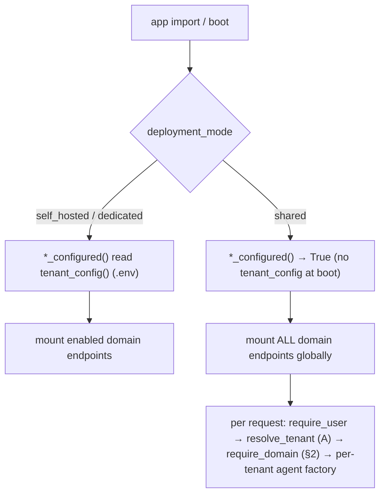

# Sub-project D-runtime — shared-mode enablement

> Fourth sub-project of the [SaaS target architecture](./2026-06-29-saas-target-architecture-design.md),
> first of two slices (**D-runtime** now; **D-packaging** — Managed App + Lighthouse — later).
> Builds on **A** (`DEPLOYMENT_MODE`/`TenantConfigProvider`, `resolve_tenant`, `_current_tenant`,
> `current_tenant_id`, `has_role`/`require_role`), **B** (`TenantStore` + `TenantRecord` +
> `Connection` + the `/tenant` API and Connections page), and **C** (`build_hosted_from_connections`,
> per-tool RBAC, native tool-approval) — all merged to `develop`. Decisions:
> [ADR-001](../../adr/ADR-001-tenancy-deployment-stamps.md) (stamps),
> [ADR-007](../../adr/ADR-007-coexistence-deployment-mode.md) (deployment-mode seam), and the new
> **[ADR-010](../../adr/ADR-010-per-tenant-domain-entitlement.md)** (domain enablement = license entitlement).

## Goal

Make **shared mode** actually boot and serve multiple tenants from one codebase: (1) the agent
domain endpoints must **mount at boot without resolving a tenant** (today `*_configured()` read
`tenant_config()` at import and crash in shared-with-auth), and the per-tenant decision moves to
**request time**; (2) which domains a tenant may use is a **per-tenant license entitlement**
([ADR-010](../../adr/ADR-010-per-tenant-domain-entitlement.md)) — stored, defaulted at onboarding,
gated at request time, and manageable by an Admin; (3) the platform agent's **hosted** path is wired
as a `/platform-hosted` twin (mirroring the `/helpdesk-hosted` route shape + the live-vs-hosted
toggle) over the **Invocations** protocol — the one Microsoft indicates for AG-UI — so C's
write-approval HITL survives on the hosted path.

## Scope boundary

- **D-runtime owns:** the boot-time mount fix in `app/main.py`; `TenantRecord.enabled_domains` +
  `require_domain` gate + onboarding default + the `/tenant/domains` API and Connections-page toggle;
  the `/platform-hosted` route + Invocations bridge skeleton + the frontend twin/toggle.
- **D-packaging owns** (next slice, not here): the dedicated stamp via Azure **Managed Application**,
  cross-tenant data-plane management via Azure **Lighthouse** (ADR-002), the **deployment** of the
  platform hosted agent + its **Foundry Toolbox** tool configuration (where C's
  `build_hosted_from_connections` actually runs, with OAuth identity passthrough).
- **A/B/C owned** (done): the deployment-mode seam, the `TenantStore`/`Connection` model + `/tenant`
  API + Connections UI, the credential brokering + RBAC + native tool-approval.

## Non-goals

- Deploying/operating hosted Foundry agents or the Foundry Toolbox (D-packaging).
- Managed Application / Lighthouse / marketplace (D-packaging).
- Feature-flag infrastructure (App Configuration targeting) — entitlement is catalog data, not a
  flag ([ADR-010](../../adr/ADR-010-per-tenant-domain-entitlement.md)).
- Any change to self-hosted behavior — every change below is **mode-gated and self-hosted is
  byte-identical** (the #1 correctness property carried from A/B/C).

## 1. The shared-mode domain-mounting fix

AG-UI endpoints are registered **at boot** by `add_agent_framework_fastapi_endpoint(...)` — they
cannot be mounted/unmounted per request. Today each `*_configured()` (`_knowledge_configured`,
`cockpit_configured`, `selfwiki_configured`, `platform_configured`) reads `tenant_config()` at import
to decide whether to mount, which **crashes in shared-with-auth** (no tenant is resolved at boot —
the documented target-spec open question #5).

The fix: the `*_configured()` become **mode-aware**. In shared mode they return `True` **without**
calling `tenant_config()` (mount the endpoint globally); the per-tenant decision is deferred to
request time (the agent factory already reads `tenant_config()` per request, plus the
`require_domain` gate of §2). Self-hosted keeps reading the `.env` via the Single-tenant provider —
**unchanged**.

```python
def cockpit_configured() -> bool:
    if settings.deployment_mode == "shared":
        return True                       # shared: mount globally; per-tenant decided at request time
    return bool(tenant_config().azure_search_endpoint                 # self-hosted: exactly as today
                and tenant_config().cockpit_search_knowledge_base)
```



**Result:** `import app.main` boots clean in shared-with-auth; in shared **all** domain endpoints
mount, and per-tenant behavior is entirely request-time (tenant config + entitlement gate).

## 2. DomainAssignment — per-tenant entitlement (storage → gate → default → management)

Per [ADR-010](../../adr/ADR-010-per-tenant-domain-entitlement.md), domain enablement is a **license
entitlement stored on the tenant record**, not a feature flag.

**Storage** — extend B's `TenantRecord` with one defaulted field (serializes exactly like B's
`connections`, so existing Table records round-trip):

```python
DOMAIN_IDS = ("helpdesk", "cockpit", "selfwiki", "platform")   # the registered domain catalog

@dataclass(frozen=True)
class TenantRecord:
    ...  # tid, name, tier, status, data_plane, connections (A/B)
    enabled_domains: tuple[str, ...] = ()   # NEW — the per-tenant entitlement
```

**Gate** — `require_domain(domain_id)`, a FastAPI dependency added to each domain endpoint's
`dependencies=` **only in shared mode** (self-hosted mounts without it — single tenant, all domains
from `.env`). It reads the tenant resolved by A's `require_user`/`resolve_tenant` and fails closed:

```python
def require_domain(domain_id: str):
    async def _check():
        rec = _current_tenant.get()        # set by require_user/resolve_tenant (A) earlier in the chain
        if rec is None or domain_id not in (rec.enabled_domains or ()):
            raise HTTPException(status_code=403, detail=f"domain '{domain_id}' not enabled for tenant")
    return _check
```

In `main.py` (shared): `dependencies=[*auth_dependencies(), Depends(require_domain("cockpit"))]` —
ordering guarantees `require_user` resolves the tenant before `require_domain` reads it.

**Onboarding default** — B's `POST /tenant/onboard` seeds `enabled_domains=DOMAIN_IDS` (MVP: all
domains enabled; the Admin tightens later). A tier→domain-set default can replace the constant later
**without** a schema change (the field already exists).

**Management (API + UI)** — extend B's `/tenant` router and Connections page:
- `GET /tenant/domains` → `{catalog: DOMAIN_IDS, enabled: [...]}`; `PUT /tenant/domains`
  (body `{enabled: [...]}`) — `require_user` + Admin, **tenant-scoped** (read-modify-write of the
  caller's own record; validates every id ∈ `DOMAIN_IDS`; rejects unknown ids).
- A "Domains" section on the Connections admin page with a checkbox per `DOMAIN_IDS` entry, posting
  to the `/api/tenant/domains` proxy (mirrors B's existing list/proxy pattern).

## 3. The `/platform-hosted` twin (Invocations protocol)

Mirror the **route shape** of `/helpdesk-hosted` (`app/api/chat.py` → a bridge in
`app/services/hosted.py`) and the frontend live-vs-hosted toggle — but **not** its protocol.

**Protocol correction (Microsoft guidance):** the Foundry *Hosted agents* doc states AG-UI is a
**custom streaming protocol → use the Invocations protocol** ("AG-UI and other agent-UI protocols
aren't OpenAI-compatible — you need raw SSE control"). The existing `/helpdesk-hosted` bridge uses
the **Responses** protocol (`responses.create`, request→response, **no interrupts** — fine for the
concierge). The **platform** agent carries C's **write-approval HITL**, which **cannot round-trip
over Responses**. Therefore:

- The `/platform-hosted` bridge targets the deployed platform agent's **Invocations** endpoint
  (`{project_endpoint}/agents/{name}/endpoint/protocols/invocations`), streaming raw SSE so the
  approval interrupt survives. Mirror the route + `auth_dependencies()` + (shared)
  `require_domain("platform")`.
- **Stopgap honesty:** if an interim Responses-based bridge is shipped before the Invocations bridge
  lands, the hosted platform path is **read-only** (write tools disabled) — never a Responses mirror
  that *pretends* to have HITL. Stated explicitly so no one silently drops write governance.

**Frontend** (`route.ts`): add a `platformHosted = new HttpAgent({ url: PLATFORM_HOSTED_AGUI_URL })`
+ a `"platform-hosted"` entry in the runtime agent map; the existing live-vs-hosted toggle selects
between `platform` and `platform-hosted`.

**What is writable now vs infra-gated:** D-runtime writes the **route + Invocations bridge skeleton +
frontend twin/toggle** (validated by route-mount + a skip-clean E2E). The **deployed** platform
hosted agent and its **tool configuration** are infra-gated and belong to **D-packaging** — and per
the same Foundry doc, hosted tools are **not injected directly**: they come via the **Foundry Toolbox
MCP endpoint** with *"consolidated auth across OAuth Identity passthrough, agent identity, key
based."* That is the first-party home for C's `build_hosted_from_connections` + the per-tenant
credential resolution (the "delicate point" from C) — **first-party, not hand-rolled**, deferred to
D-packaging. D-runtime only records the seam.

## 4. Error handling, testing, infra-gating

**Error handling (fail-closed):**
- Shared boot must never read `tenant_config()` — a regression that does crashes every tenant; the
  smoke test (below) guards it.
- `require_domain`: no resolved tenant / domain not entitled → **403**, never a crash, never a
  default-open.
- `PUT /tenant/domains`: unknown domain id → **422/400** (reject), tenant-scoped to the caller's own
  record (no path tid, ever).
- Hosted bridge: unreachable/недeployed hosted agent → a clear error to the client, never a hang;
  writes on a Responses stopgap → disabled (§3), not silently un-approved.

**Testing (repo convention: runnable `def main() -> int` modules in `apps/backend/eval/`, NO pytest):**
- **Unit, infra-free:**
  - `*_configured()` mode-awareness: shared → `True` **without** touching `tenant_config()`;
    self-hosted → reads config exactly as before (assert byte-identical decision).
  - **Shared-boot smoke:** `import app.main` under `DEPLOYMENT_MODE=shared` + auth enabled +
    `TENANT_STORE_BACKEND=memory` does not raise.
  - `require_domain`: entitled → pass; not entitled / no record → 403 (fake `_current_tenant`).
  - `enabled_domains` round-trip through the Table serializer (defaulted field on existing records).
  - `/tenant/domains` GET/PUT against a fake store: tighten, reject unknown id, tenant-scoping.
- **Infra-gated (E2E, skips clean offline):** the `/platform-hosted` Invocations bridge against a
  deployed platform hosted agent + the live-vs-hosted toggle; write-approval round-trip over the
  hosted Invocations path (depends on the deployed agent + Toolbox — D-packaging).

**Infra-gated parts** (code written now, validated when infra lands): the deployed platform hosted
agent + Foundry Toolbox tool config (D-packaging), the hosted write-approval E2E. The infra-free
deliverable is the mount fix + DomainAssignment (storage/gate/default/management) + the
route/bridge-skeleton/toggle, fully unit-tested.

## Units (for the writing-plans handoff)

- `app/main.py` — make the four `*_configured()` mode-aware (shared → mount globally); in shared add
  `require_domain(<id>)` to each domain endpoint's `dependencies=`.
- `app/core/tenant.py` — `require_domain(domain_id)`; the `DOMAIN_IDS` catalog constant.
- `app/core/tenant_store.py` — add `TenantRecord.enabled_domains: tuple[str, ...] = ()` + its Table
  (de)serialization (mirrors `connections`).
- `app/api/tenant.py` — `GET`/`PUT /tenant/domains` (Admin, tenant-scoped); seed `enabled_domains`
  in `POST /tenant/onboard`.
- `app/api/chat.py` — `@router.post("/platform-hosted", ...)` mirroring `/helpdesk-hosted`.
- `app/services/hosted.py` — an Invocations-protocol bridge (raw SSE) for the platform hosted agent
  (skeleton; deployed-agent target infra-gated).
- `apps/frontend/app/api/copilotkit/.../route.ts` — `platformHosted` HttpAgent + `"platform-hosted"`
  runtime entry.
- `apps/frontend/components/admin/Connections.tsx` (+ `/api/tenant/[...path]` proxy) — the Domains
  toggle section.
- `apps/backend/eval/` — `configured_mode_test`, `shared_boot_smoke_test`, `require_domain_test`,
  `domains_api_test` (+ the infra-gated `platform_hosted_e2e_test`).

## Open questions (for the plan)

1. **Invocations bridge SSE shape** — confirm the exact Invocations request/response envelope and how
   the AG-UI approval interrupt maps onto raw SSE for the platform agent (don't invent the contract;
   verify against the Foundry hosted-agent Invocations protocol library before relying on it).
2. **`require_domain` ordering** — verify `add_agent_framework_fastapi_endpoint` runs `dependencies=`
   in order so `require_user` resolves the tenant before `require_domain` reads `_current_tenant`
   (else resolve the tenant inside `require_domain`).
3. **Onboarding default policy** — confirm "all domains by default, Admin tightens" for MVP vs a
   tier→domain-set map seeded at onboarding (the field supports either; decide the default source).
