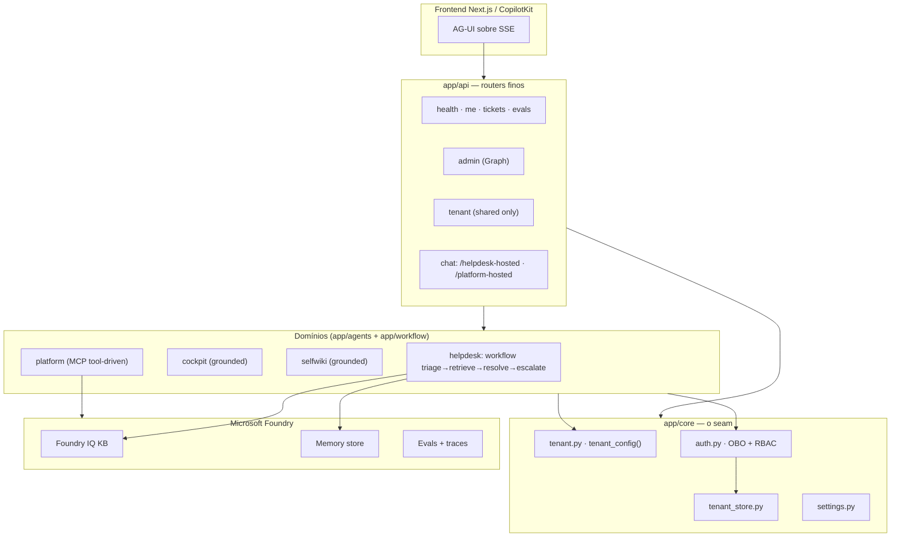

# Visão Geral do Backend (SaaS Híbrido Multi-Tenant)

## Por que este backend existe

O backend é um concierge de suporte de engenharia construído sobre o **Microsoft Foundry** e o **Microsoft Agent Framework**, exposto ao frontend via **AG-UI sobre SSE**. Ele tria a intenção do desenvolvedor, busca em bases de conhecimento (Foundry IQ), redige respostas fundamentadas com citações, decide se precisa de uma ação humana (abrir ticket) e lembra preferências entre sessões — tudo avaliado e rastreável.

**Fato (lido no código):** o entrypoint declara `FastAPI(title="Foundry Assured", version="0.1.0", ...)` e roda como `app.main:app` ([app/main.py:47](https://github.com/ruinosus/foundry-assured/blob/feature/saas-d-packaging/apps/backend/app/main.py#L47)). O `pyproject.toml` ainda declara `version = "0.1.0"` do pacote ([apps/backend/pyproject.toml:4](https://github.com/ruinosus/foundry-assured/blob/feature/saas-d-packaging/apps/backend/pyproject.toml#L4)); este bundle de wiki é a versão **v0.2.0** por refletir a evolução SaaS, não a versão do pacote Python.

## A evolução: de single-tenant para SaaS híbrido (A→B→C→D)

A mudança central desde o bundle v0.1.0 é a introdução de um **seam de modo de implantação**. O mesmo core (agentes, workflow, conhecimento) agora roda sob três modos, selecionados por `DEPLOYMENT_MODE` ([app/core/settings.py:17](https://github.com/ruinosus/foundry-assured/blob/feature/saas-d-packaging/apps/backend/app/core/settings.py#L17)):

| Modo (`deployment_mode`) | Tenancy | Config de tenant | Auth | Fonte |
|---|---|---|---|---|
| `self_hosted` (default) | Único, do cliente | `.env` estático (`SingleTenantConfigProvider`) | SingleTenant Entra ou off | [app/core/settings.py:17](https://github.com/ruinosus/foundry-assured/blob/feature/saas-d-packaging/apps/backend/app/core/settings.py#L17) |
| `dedicated` | Único, dedicado | `.env` estático | SingleTenant Entra | [app/core/auth.py:56](https://github.com/ruinosus/foundry-assured/blob/feature/saas-d-packaging/apps/backend/app/core/auth.py#L56) |
| `shared` | Multi-tenant | Por requisição (`MultiTenantConfigProvider`) | MultiTenant Entra + tenant store | [app/core/auth.py:65](https://github.com/ruinosus/foundry-assured/blob/feature/saas-d-packaging/apps/backend/app/core/auth.py#L65) |

O princípio de design declarado: *"O core (agentes, workflow) só chama `tenant_config()`; ele nunca conhece o modo."* ([app/core/tenant.py:1-6](https://github.com/ruinosus/foundry-assured/blob/feature/saas-d-packaging/apps/backend/app/core/tenant.py#L1-L6)). Em `self_hosted`/`dedicated` o comportamento é descrito como **byte-idêntico ao de antes** ([app/main.py:60-61](https://github.com/ruinosus/foundry-assured/blob/feature/saas-d-packaging/apps/backend/app/main.py#L60-L61)).

## As quatro grandes mudanças de backend

| Área SaaS | O que mudou | Arquivo(s)-chave | Página |
|---|---|---|---|
| **Seam de tenant** | `TenantConfigProvider` Single/Multi, `tenant_config()`, `DOMAIN_IDS`, `require_domain()`, tiers | `app/core/tenant.py`, `app/core/tenant_store.py` | [Modos de Implantação](./page-2.md) |
| **Auth/OBO multi-tenant** | esquema MultiTenant, `resolve_tenant`, `memory_scope` prefixado por tid | `app/core/auth.py`, `app/core/onboarding.py` | [Auth, OBO e RBAC](./page-3.md) |
| **Quarto domínio: platform** | concierge tool-driven sobre MCP, RBAC por ferramenta, aprovação de escrita | `app/agents/platform.py`, `app/agents/mcp/`, `app/agents/per_request.py` | [Platform e MCP](./page-6.md) |
| **Pontes hosted** | `/helpdesk-hosted` (Responses) + `/platform-hosted` (Invocations) | `app/api/chat.py`, `app/services/hosted.py` | [API e Endpoints](./page-4.md) |

## Mapa de camadas (big picture)



<!-- Sources: app/main.py:24-35, app/core/tenant.py:182, app/api/__init__.py:11-19 -->

## Os quatro domínios de agente

`DOMAIN_IDS` enumera explicitamente os domínios registrados ([app/core/tenant.py:182](https://github.com/ruinosus/foundry-assured/blob/feature/saas-d-packaging/apps/backend/app/core/tenant.py#L182)):

```python
DOMAIN_IDS: tuple[str, ...] = ("helpdesk", "cockpit", "selfwiki", "platform")
```

| Domínio | Tipo | Endpoint AG-UI | Builder | Fonte |
|---|---|---|---|---|
| `helpdesk` | Workflow multi-agente (HITL) | `/helpdesk` | `build_helpdesk_workflow` | [app/main.py:85-91](https://github.com/ruinosus/foundry-assured/blob/feature/saas-d-packaging/apps/backend/app/main.py#L85-L91) |
| `cockpit` | Q&A grounded (ACL trim) | `/cockpit` | `build_cockpit_agent` | [app/main.py:99-105](https://github.com/ruinosus/foundry-assured/blob/feature/saas-d-packaging/apps/backend/app/main.py#L99-L105) |
| `selfwiki` | Q&A grounded (dogfood) | `/selfwiki` | `build_selfwiki_agent` | [app/main.py:109-115](https://github.com/ruinosus/foundry-assured/blob/feature/saas-d-packaging/apps/backend/app/main.py#L109-L115) |
| `platform` | Tool-driven (MCP) | `/platform` | `platform_agent_proxy` | [app/main.py:121-127](https://github.com/ruinosus/foundry-assured/blob/feature/saas-d-packaging/apps/backend/app/main.py#L121-L127) |

O quarto domínio (`platform`) é a adição mais significativa desta versão — ver [O Quarto Domínio: Platform e Integração MCP](./page-6.md).

## Stack e dependências

| Dependência | Papel | Fonte |
|---|---|---|
| `agent-framework>=1.9.0` | agentes + `WorkflowBuilder` | [apps/backend/pyproject.toml:8](https://github.com/ruinosus/foundry-assured/blob/feature/saas-d-packaging/apps/backend/pyproject.toml#L8) |
| `agent-framework-ag-ui>=1.0.0rc5` | adapter AG-UI | [apps/backend/pyproject.toml:9](https://github.com/ruinosus/foundry-assured/blob/feature/saas-d-packaging/apps/backend/pyproject.toml#L9) |
| `azure-ai-projects>=2.2.0` | cliente Foundry (KB, memory, eval) | [apps/backend/pyproject.toml:10](https://github.com/ruinosus/foundry-assured/blob/feature/saas-d-packaging/apps/backend/pyproject.toml#L10) |
| `fastapi-azure-auth>=5.2.0` | validação de JWT Entra (Single/Multi) | [apps/backend/pyproject.toml:12](https://github.com/ruinosus/foundry-assured/blob/feature/saas-d-packaging/apps/backend/pyproject.toml#L12) |
| `azure-data-tables>=12.7.0` | tenant store (Table Storage) | [apps/backend/pyproject.toml:21](https://github.com/ruinosus/foundry-assured/blob/feature/saas-d-packaging/apps/backend/pyproject.toml#L21) |
| `httpx>=0.28.1` | passthrough da ponte hosted platform | [apps/backend/pyproject.toml:22](https://github.com/ruinosus/foundry-assured/blob/feature/saas-d-packaging/apps/backend/pyproject.toml#L22) |

**Container:** `python:3.12-slim`, `WORKDIR /app`, dependências via `uv sync --frozen`, expõe `:8000` e roda `uvicorn app.main:app` ([apps/backend/Dockerfile:4-22](https://github.com/ruinosus/foundry-assured/blob/feature/saas-d-packaging/apps/backend/Dockerfile#L4-L22)).

## Regra inegociável: auth sempre via credencial Azure

Não há API key hardcoded. Quando o Entra está configurado, cada requisição usa **On-Behalf-Of** do usuário; caso contrário cai para `DefaultAzureCredential` ([app/core/auth.py:186-196](https://github.com/ruinosus/foundry-assured/blob/feature/saas-d-packaging/apps/backend/app/core/auth.py#L186-L196)). Ver [Auth, OBO e RBAC](./page-3.md).

## Related Pages

| Página | Relação |
|------|-------------|
| [Modos de Implantação e o Seam de Tenant](./page-2.md) | O seam `DEPLOYMENT_MODE` que esta visão introduz |
| [Autenticação, OBO e RBAC](./page-3.md) | Como a identidade do usuário/tenant chega ao core |
| [API, Endpoints e Wiring](./page-4.md) | Como os domínios são montados no FastAPI |
| [Domínios de Agente e Workflow](./page-5.md) | Detalhe dos três domínios grounded + workflow |
| [O Quarto Domínio: Platform e MCP](./page-6.md) | O novo domínio tool-driven |
