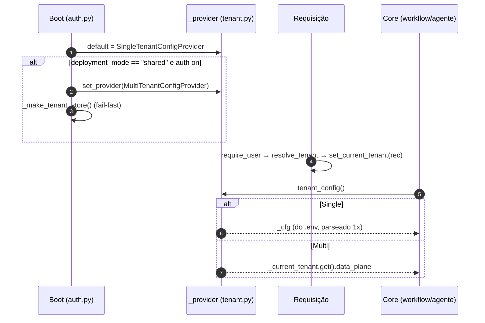
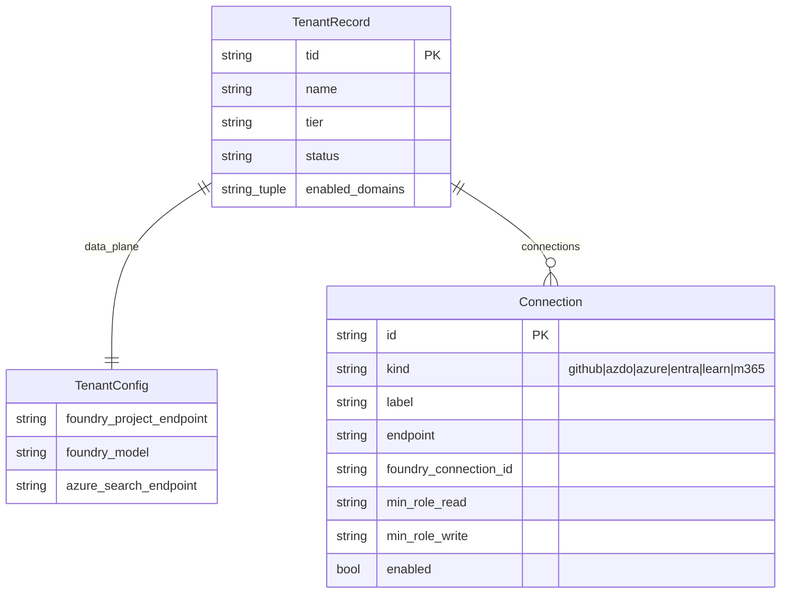

# Modos de Implantação e o Seam de Tenant

## Por que existe um seam

A passagem de single-tenant para SaaS poderia ter contaminado todo o core com `if multi_tenant:`. Em vez disso, o backend isola **toda** a variação por tenant atrás de uma única função — `tenant_config()` — e troca a implementação dela no boot. A docstring do módulo é explícita: *"a única costura que varia por DEPLOYMENT_MODE … o core nunca conhece o modo"* ([app/core/tenant.py:1-6](https://github.com/ruinosus/foundry-assured/blob/feature/saas-d-packaging/apps/backend/app/core/tenant.py#L1-L6)).

## Sumário

| Conceito | Símbolo | Arquivo | Fonte |
|---|---|---|---|
| Dados de plano-de-dados por tenant | `TenantConfig` (frozen dataclass, ZERO segredos) | `tenant.py` | [app/core/tenant.py:17-23](https://github.com/ruinosus/foundry-assured/blob/feature/saas-d-packaging/apps/backend/app/core/tenant.py#L17-L23) |
| Provider abstrato | `TenantConfigProvider` (Protocol) | `tenant.py` | [app/core/tenant.py:136-137](https://github.com/ruinosus/foundry-assured/blob/feature/saas-d-packaging/apps/backend/app/core/tenant.py#L136-L137) |
| Single-tenant (`.env`) | `SingleTenantConfigProvider` | `tenant.py` | [app/core/tenant.py:140-151](https://github.com/ruinosus/foundry-assured/blob/feature/saas-d-packaging/apps/backend/app/core/tenant.py#L140-L151) |
| Multi-tenant (por requisição) | `MultiTenantConfigProvider` | `tenant.py` | [app/core/tenant.py:161-168](https://github.com/ruinosus/foundry-assured/blob/feature/saas-d-packaging/apps/backend/app/core/tenant.py#L161-L168) |
| Acessor único do core | `tenant_config()` | `tenant.py` | [app/core/tenant.py:229-231](https://github.com/ruinosus/foundry-assured/blob/feature/saas-d-packaging/apps/backend/app/core/tenant.py#L229-L231) |
| Registro persistido | `TenantRecord`, `Connection` | `tenant_store.py` | [app/core/tenant_store.py:16-38](https://github.com/ruinosus/foundry-assured/blob/feature/saas-d-packaging/apps/backend/app/core/tenant_store.py#L16-L38) |

## `TenantConfig`: o que varia por tenant

`TenantConfig` é uma dataclass **frozen** que carrega apenas ponteiros de plano-de-dados (endpoints Foundry/Search/Storage, KBs por domínio, ACL, memory store, hosted agent) — **zero segredos** ([app/core/tenant.py:17-23](https://github.com/ruinosus/foundry-assured/blob/feature/saas-d-packaging/apps/backend/app/core/tenant.py#L17-L23)). Campos notáveis:

| Campo | Para quê | Fonte |
|---|---|---|
| `foundry_project_endpoint`, `foundry_model` | projeto + deployment de modelo | [app/core/tenant.py:25-27](https://github.com/ruinosus/foundry-assured/blob/feature/saas-d-packaging/apps/backend/app/core/tenant.py#L25-L27) |
| `azure_search_endpoint`, `azure_search_knowledge_base` | KB do helpdesk (Fase 1) | [app/core/tenant.py:36-37](https://github.com/ruinosus/foundry-assured/blob/feature/saas-d-packaging/apps/backend/app/core/tenant.py#L36-L37) |
| `cockpit_search_*`, `selfwiki_search_*` | KBs do 2º e 3º domínios | [app/core/tenant.py:45-52](https://github.com/ruinosus/foundry-assured/blob/feature/saas-d-packaging/apps/backend/app/core/tenant.py#L45-L52) |
| `cockpit_acl_*` | controle de acesso por documento | [app/core/tenant.py:55-60](https://github.com/ruinosus/foundry-assured/blob/feature/saas-d-packaging/apps/backend/app/core/tenant.py#L55-L60) |
| `foundry_memory_store` | memória por usuário (Fase 3) | [app/core/tenant.py:66](https://github.com/ruinosus/foundry-assured/blob/feature/saas-d-packaging/apps/backend/app/core/tenant.py#L66) |
| `hosted_agent_name`, `platform_hosted_agent_name` | agentes hosted (Fase 6 / D) | [app/core/tenant.py:69-72](https://github.com/ruinosus/foundry-assured/blob/feature/saas-d-packaging/apps/backend/app/core/tenant.py#L69-L72) |
| `mcp_ado_organization`, `mcp_github_pat`, `mcp_azure_url` | MCP por tenant (**DEPRECATED** em shared) | [app/core/tenant.py:74-79](https://github.com/ruinosus/foundry-assured/blob/feature/saas-d-packaging/apps/backend/app/core/tenant.py#L74-L79) |

A property `acl_group_map` resolve nomes de grupo → object-IDs do Entra, combinando o trio demo (`public`/`internal`/`confidential`) com o CSV `cockpit_acl_group_map` ([app/core/tenant.py:81-96](https://github.com/ruinosus/foundry-assured/blob/feature/saas-d-packaging/apps/backend/app/core/tenant.py#L81-L96)).

## Os dois providers e como a seleção acontece



<!-- Sources: app/core/tenant.py:147-168, app/core/auth.py:109-122 -->

- **Single:** `SingleTenantConfigProvider` parseia `_TenantEnv()` (um `BaseSettings` lendo `.env`) **uma vez** na construção, porque o workflow chama `tenant_config()` várias vezes por run ([app/core/tenant.py:140-151](https://github.com/ruinosus/foundry-assured/blob/feature/saas-d-packaging/apps/backend/app/core/tenant.py#L140-L151), [app/core/tenant.py:99-133](https://github.com/ruinosus/foundry-assured/blob/feature/saas-d-packaging/apps/backend/app/core/tenant.py#L99-L133)).
- **Multi:** `MultiTenantConfigProvider.current()` lê o `TenantRecord` da requisição via o contextvar `_current_tenant` e retorna `rec.data_plane`; se nenhum tenant foi resolvido, **levanta `RuntimeError`** (fail-closed) ([app/core/tenant.py:161-168](https://github.com/ruinosus/foundry-assured/blob/feature/saas-d-packaging/apps/backend/app/core/tenant.py#L161-L168)).

O provider ativo é uma global trocada por `set_provider()` ([app/core/tenant.py:220-226](https://github.com/ruinosus/foundry-assured/blob/feature/saas-d-packaging/apps/backend/app/core/tenant.py#L220-L226)). O contextvar é setado por `set_current_tenant()` e lido por `current_tenant_id()` (usado pelo `memory_scope`) ([app/core/tenant.py:171-178](https://github.com/ruinosus/foundry-assured/blob/feature/saas-d-packaging/apps/backend/app/core/tenant.py#L171-L178)).

## Entitlement por domínio e por tier (ADR-010)

Em shared mode, **todos** os domínios são montados no app, mas o acesso é filtrado por tenant. Dois mecanismos:

1. **Seed por tier** no onboarding: `TIER_DOMAINS` mapeia tier → tupla de domínios; `domains_for_tier(tier)` cai para `DOMAIN_IDS` (todos) quando o tier é desconhecido — não-quebrável ([app/core/tenant.py:187-196](https://github.com/ruinosus/foundry-assured/blob/feature/saas-d-packaging/apps/backend/app/core/tenant.py#L187-L196)).
2. **Gate por requisição** `require_domain(domain_id)`: dependência FastAPI fail-closed que retorna **403** a menos que o `enabled_domains` do tenant resolvido contenha o domínio ([app/core/tenant.py:199-217](https://github.com/ruinosus/foundry-assured/blob/feature/saas-d-packaging/apps/backend/app/core/tenant.py#L199-L217)).

```python
# require_domain — fail-closed (app/core/tenant.py:211-215)
async def _check(_user=Depends(require_user)) -> None:
    rec = _current_tenant.get()
    enabled = getattr(rec, "enabled_domains", None) or ()
    if rec is None or domain_id not in enabled:
        raise HTTPException(status_code=403, detail=f"domain '{domain_id}' not enabled for tenant")
```

`require_domain` **sub-depende de `require_user`**, então o FastAPI resolve o tenant (seta `_current_tenant`) antes do gate rodar — a ordem vem do grafo de dependências, não da posição na lista ([app/core/tenant.py:199-209](https://github.com/ruinosus/foundry-assured/blob/feature/saas-d-packaging/apps/backend/app/core/tenant.py#L199-L209)).

## O tenant store: persistência por tid

`TenantRecord` é o agregado persistido, keyed por `tid` (Entra tenant id) ([app/core/tenant_store.py:30-38](https://github.com/ruinosus/foundry-assured/blob/feature/saas-d-packaging/apps/backend/app/core/tenant_store.py#L30-L38)):

| Campo | Tipo | Significado | Fonte |
|---|---|---|---|
| `tid`, `name` | str | identidade do tenant | [app/core/tenant_store.py:32-33](https://github.com/ruinosus/foundry-assured/blob/feature/saas-d-packaging/apps/backend/app/core/tenant_store.py#L32-L33) |
| `tier`, `status` | str | `shared`/`dedicated`/`self_hosted` · `active`/`suspended` | [app/core/tenant_store.py:34-35](https://github.com/ruinosus/foundry-assured/blob/feature/saas-d-packaging/apps/backend/app/core/tenant_store.py#L34-L35) |
| `data_plane` | `TenantConfig` | os ponteiros do plano-de-dados | [app/core/tenant_store.py:36](https://github.com/ruinosus/foundry-assured/blob/feature/saas-d-packaging/apps/backend/app/core/tenant_store.py#L36) |
| `connections` | tupla de `Connection` | servidores MCP por tenant | [app/core/tenant_store.py:37](https://github.com/ruinosus/foundry-assured/blob/feature/saas-d-packaging/apps/backend/app/core/tenant_store.py#L37) |
| `enabled_domains` | tupla de str | entitlement de licença por tenant (ADR-010) | [app/core/tenant_store.py:38](https://github.com/ruinosus/foundry-assured/blob/feature/saas-d-packaging/apps/backend/app/core/tenant_store.py#L38) |



<!-- Sources: app/core/tenant_store.py:16-38 -->

`Connection` é uma dataclass frozen cujo `kind` deve ser um id do registry MCP **verbatim**; ela **não carrega segredo** — a auth flui via Foundry connection ou Key Vault (ADR-005/008) ([app/core/tenant_store.py:16-28](https://github.com/ruinosus/foundry-assured/blob/feature/saas-d-packaging/apps/backend/app/core/tenant_store.py#L16-L28)). Helpers funcionais fazem upsert/remoção imutável: `with_connection`/`without_connection` ([app/core/tenant_store.py:46-54](https://github.com/ruinosus/foundry-assured/blob/feature/saas-d-packaging/apps/backend/app/core/tenant_store.py#L46-L54)) e `validate_kind` confirma contra o catálogo `SERVERS` ([app/core/tenant_store.py:41-43](https://github.com/ruinosus/foundry-assured/blob/feature/saas-d-packaging/apps/backend/app/core/tenant_store.py#L41-L43)).

### Implementações de store (swappable)

| Impl | Quando | Persistência | Fonte |
|---|---|---|---|
| `InMemoryTenantStore` | dev/CI | dict efêmero | [app/core/tenant_store.py:63-76](https://github.com/ruinosus/foundry-assured/blob/feature/saas-d-packaging/apps/backend/app/core/tenant_store.py#L63-L76) |
| `TableStorageTenantStore` | produção | Azure Table (keyless), `PartitionKey=tid`, `RowKey='config'`, `data_plane` como JSON | [app/core/tenant_store.py:89-117](https://github.com/ruinosus/foundry-assured/blob/feature/saas-d-packaging/apps/backend/app/core/tenant_store.py#L89-L117) |

A seleção é feita por `_make_tenant_store()` no boot: `tenant_store_backend == "memory"` → InMemory; senão Table, com **fail-fast** se `tenant_store_account_url` estiver vazio ([app/core/auth.py:77-94](https://github.com/ruinosus/foundry-assured/blob/feature/saas-d-packaging/apps/backend/app/core/auth.py#L77-L94)). O `azure-data-tables` só é importado na construção da classe Table, então single-tenant nunca o importa ([app/core/tenant_store.py:94-100](https://github.com/ruinosus/foundry-assured/blob/feature/saas-d-packaging/apps/backend/app/core/tenant_store.py#L94-L100)).

## Settings globais de plataforma vs. config de tenant

`PlatformSettings` carrega **apenas** o que é global (modo, wiring do tenant store, Entra, flags MCP globais, CORS) — explicitamente NÃO os ponteiros de plano-de-dados, que vivem em `TenantConfig` ([app/core/settings.py:1-6](https://github.com/ruinosus/foundry-assured/blob/feature/saas-d-packaging/apps/backend/app/core/settings.py#L1-L6), [app/core/settings.py:11-22](https://github.com/ruinosus/foundry-assured/blob/feature/saas-d-packaging/apps/backend/app/core/settings.py#L11-L22)). O catálogo de tids permitidos a auto-onboarding fica em `onboarding_allowed_tids`/`allowed_tids` ([app/core/settings.py:39-44](https://github.com/ruinosus/foundry-assured/blob/feature/saas-d-packaging/apps/backend/app/core/settings.py#L39-L44)).

## Related Pages

| Página | Relação |
|------|-------------|
| [Visão Geral do Backend](./page-1.md) | Contexto do seam SaaS |
| [Autenticação, OBO e RBAC](./page-3.md) | Onde `resolve_tenant`/`set_current_tenant` rodam |
| [API, Endpoints e Wiring](./page-4.md) | A API `/tenant` que escreve no store; `require_domain` no main |
| [Platform e MCP](./page-6.md) | Como `connections` viram tools por requisição |
