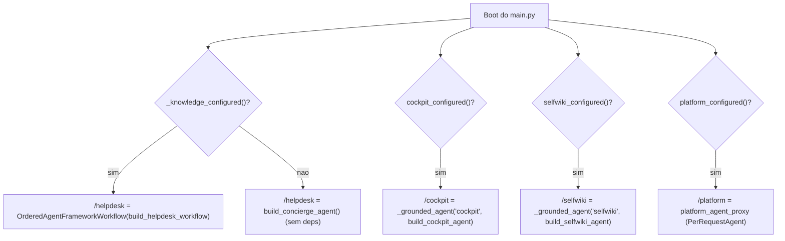
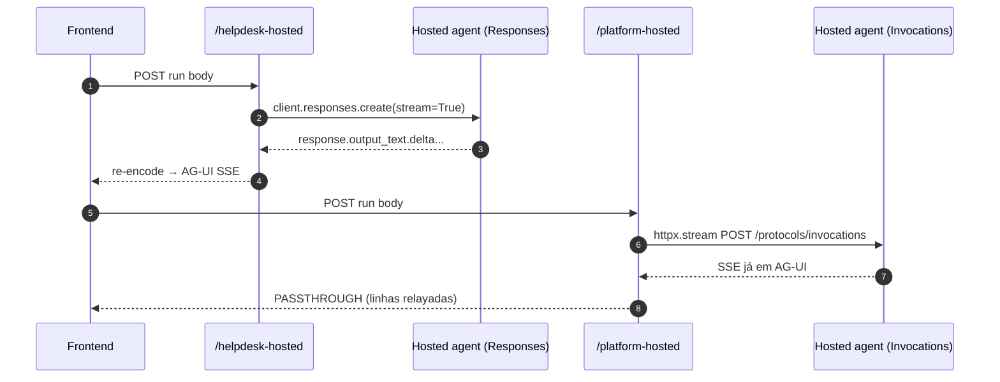

# API, Endpoints e Wiring do main.py

## Por que esta separação

O `app/main.py` é deliberadamente **fino**: cria o app, aplica CORS, inclui os routers HTTP de `app/api`, e registra os endpoints AG-UI dos domínios — toda lógica de negócio vive em `services/` + `agents/` + `workflow/` ([app/main.py:1-13](https://github.com/ruinosus/foundry-assured/blob/feature/saas-d-packaging/apps/backend/app/main.py#L1-L13)). Os endpoints AG-UI são registrados **na app** (não num router) via `add_agent_framework_fastapi_endpoint` ([app/main.py:82-95](https://github.com/ruinosus/foundry-assured/blob/feature/saas-d-packaging/apps/backend/app/main.py#L82-L95)).

## Mapa de endpoints

| Endpoint | Método/Protocolo | Gate | Fonte |
|---|---|---|---|
| `/healthz` | GET | nenhum | [app/api/health.py:6-8](https://github.com/ruinosus/foundry-assured/blob/feature/saas-d-packaging/apps/backend/app/api/health.py#L6-L8) |
| `/me` | GET | `require_user` | [app/api/me.py:19-31](https://github.com/ruinosus/foundry-assured/blob/feature/saas-d-packaging/apps/backend/app/api/me.py#L19-L31) |
| `/tickets` | GET | `auth_dependencies()` | [app/api/tickets.py:9-16](https://github.com/ruinosus/foundry-assured/blob/feature/saas-d-packaging/apps/backend/app/api/tickets.py#L9-L16) |
| `/eval/runs`, `/eval/foundry` | GET | `auth_dependencies()` | [app/api/evals.py:16-42](https://github.com/ruinosus/foundry-assured/blob/feature/saas-d-packaging/apps/backend/app/api/evals.py#L16-L42) |
| `/admin/*` | GET/POST/DELETE | `require_role("Admin")` | [app/api/admin.py:17-88](https://github.com/ruinosus/foundry-assured/blob/feature/saas-d-packaging/apps/backend/app/api/admin.py#L17-L88) |
| `/tenant/*` | GET/POST/PUT/DELETE | Admin + tenant-scoped (**shared only**) | [app/api/tenant.py:26-151](https://github.com/ruinosus/foundry-assured/blob/feature/saas-d-packaging/apps/backend/app/api/tenant.py#L26-L151) |
| `/helpdesk` | AG-UI (workflow ou concierge) | `_domain_deps("helpdesk")` | [app/main.py:85-95](https://github.com/ruinosus/foundry-assured/blob/feature/saas-d-packaging/apps/backend/app/main.py#L85-L95) |
| `/cockpit`, `/selfwiki`, `/platform` | AG-UI | `_domain_deps(...)` | [app/main.py:99-127](https://github.com/ruinosus/foundry-assured/blob/feature/saas-d-packaging/apps/backend/app/main.py#L99-L127) |
| `/helpdesk-hosted` | Responses → AG-UI | `auth_dependencies()` | [app/api/chat.py:21-33](https://github.com/ruinosus/foundry-assured/blob/feature/saas-d-packaging/apps/backend/app/api/chat.py#L21-L33) |
| `/platform-hosted` | Invocations passthrough | `_hosted_deps("platform")` | [app/api/chat.py:36-41](https://github.com/ruinosus/foundry-assured/blob/feature/saas-d-packaging/apps/backend/app/api/chat.py#L36-L41) |

## Agregação de routers

`api_router` inclui os routers fixos e, **só em shared mode**, inclui o router `/tenant` (importado lazy) ([app/api/__init__.py:9-19](https://github.com/ruinosus/foundry-assured/blob/feature/saas-d-packaging/apps/backend/app/api/__init__.py#L9-L19)):

```python
if settings.deployment_mode == "shared":
    from app.api import tenant
    api_router.include_router(tenant.router)
```

## O wiring mode-aware no main.py

Duas funções helper encapsulam a variação por modo:

- `_domain_deps(domain_id)`: retorna `auth_dependencies()` e, **só em shared**, anexa `Depends(require_domain(domain_id))`. Em self_hosted/dedicated é byte-idêntico ao de antes ([app/main.py:59-65](https://github.com/ruinosus/foundry-assured/blob/feature/saas-d-packaging/apps/backend/app/main.py#L59-L65)).
- `_grounded_agent(agent_id, builder)`: em shared **nenhum** tenant é resolvido no boot, então o `builder()` (que lê `tenant_config()`) NÃO pode rodar ainda — é embrulhado num `PerRequestAgent` que constrói por requisição; em self_hosted constrói eagermente ([app/main.py:68-79](https://github.com/ruinosus/foundry-assured/blob/feature/saas-d-packaging/apps/backend/app/main.py#L68-L79)).



<!-- Sources: app/main.py:85-127 -->

Cada domínio é montado condicionalmente pelo seu `*_configured()` — que em shared mode retorna `True` (monta global, decide por tenant no request time) e em self_hosted checa os ponteiros do `.env` ([app/agents/concierge.py:27-31](https://github.com/ruinosus/foundry-assured/blob/feature/saas-d-packaging/apps/backend/app/agents/concierge.py#L27-L31), [app/agents/cockpit.py:27-31](https://github.com/ruinosus/foundry-assured/blob/feature/saas-d-packaging/apps/backend/app/agents/cockpit.py#L27-L31), [app/agents/platform.py:25-28](https://github.com/ruinosus/foundry-assured/blob/feature/saas-d-packaging/apps/backend/app/agents/platform.py#L25-L28)).

O `lifespan` pré-carrega a config OpenID do Entra (primeira requisição autenticada mais rápida) e fecha o cliente hosted no shutdown ([app/main.py:38-44](https://github.com/ruinosus/foundry-assured/blob/feature/saas-d-packaging/apps/backend/app/main.py#L38-L44)). CORS é aplicado manualmente porque o kwarg `allow_origins` do adapter está marcado "not yet implemented" ([app/main.py:10-13](https://github.com/ruinosus/foundry-assured/blob/feature/saas-d-packaging/apps/backend/app/main.py#L10-L13), [app/main.py:49-54](https://github.com/ruinosus/foundry-assured/blob/feature/saas-d-packaging/apps/backend/app/main.py#L49-L54)).

## A API de tenant (shared mode)

Gerenciamento per-tenant de config + connections, Admin-gated + tenant-scoped. Todo write é um **read-modify-write do próprio registro do caller** (`current_tenant_id()`) — nenhum `tid` vem do path ([app/api/tenant.py:1-7](https://github.com/ruinosus/foundry-assured/blob/feature/saas-d-packaging/apps/backend/app/api/tenant.py#L1-L7)):

| Rota | O que faz | Dep | Fonte |
|---|---|---|---|
| `GET /tenant` | record se onboarded, senão se PODE onboard; tolera ausência | `require_role("Admin")` só | [app/api/tenant.py:72-79](https://github.com/ruinosus/foundry-assured/blob/feature/saas-d-packaging/apps/backend/app/api/tenant.py#L72-L79) |
| `POST /tenant/onboard` | cria record idempotente; **seed de `enabled_domains` pelo tier** | `onboarding_guard` | [app/api/tenant.py:86-100](https://github.com/ruinosus/foundry-assured/blob/feature/saas-d-packaging/apps/backend/app/api/tenant.py#L86-L100) |
| `PUT /tenant/config` | atualiza ponteiros do data_plane | Admin + user | [app/api/tenant.py:103-107](https://github.com/ruinosus/foundry-assured/blob/feature/saas-d-packaging/apps/backend/app/api/tenant.py#L103-L107) |
| `GET/POST/DELETE /tenant/connections` | CRUD de `Connection` | Admin + user | [app/api/tenant.py:110-129](https://github.com/ruinosus/foundry-assured/blob/feature/saas-d-packaging/apps/backend/app/api/tenant.py#L110-L129) |
| `GET/PUT /tenant/domains` | catálogo + entitlement de domínios | Admin + user | [app/api/tenant.py:136-151](https://github.com/ruinosus/foundry-assured/blob/feature/saas-d-packaging/apps/backend/app/api/tenant.py#L136-L151) |

Detalhes de segurança verificados no código:
- `OnboardBody.tier` semeia `enabled_domains` via `domains_for_tier(tier)`; bodyless → `tier=None` → `"shared"` → todos os domínios, idêntico ao anterior ([app/api/tenant.py:82-100](https://github.com/ruinosus/foundry-assured/blob/feature/saas-d-packaging/apps/backend/app/api/tenant.py#L82-L100)).
- Respostas nunca ecoam segredos: `_redacted()` zera `mcp_github_pat` antes de responder ([app/api/tenant.py:62-79](https://github.com/ruinosus/foundry-assured/blob/feature/saas-d-packaging/apps/backend/app/api/tenant.py#L62-L79)).
- `POST /connections` exige `validate_kind` E (`foundry_connection_id` OU `keyvault_ref`), senão 422 ([app/api/tenant.py:115-123](https://github.com/ruinosus/foundry-assured/blob/feature/saas-d-packaging/apps/backend/app/api/tenant.py#L115-L123)).
- `PUT /domains` rejeita ids fora de `DOMAIN_IDS` (422) e preserva a ordem do catálogo ([app/api/tenant.py:142-151](https://github.com/ruinosus/foundry-assured/blob/feature/saas-d-packaging/apps/backend/app/api/tenant.py#L142-L151)).

## Pontes hosted: Responses e Invocations

O frontend tem um seletor live/hosted. Os endpoints hosted re-emitem a resposta do agente hosted como **eventos AG-UI** para o CopilotKit renderizar o mesmo chat ([app/services/hosted.py:1-8](https://github.com/ruinosus/foundry-assured/blob/feature/saas-d-packaging/apps/backend/app/services/hosted.py#L1-L8)).



<!-- Sources: app/services/hosted.py:67-99, app/services/hosted.py:116-177 -->

- **`/helpdesk-hosted`** (`stream_agui`): consome o protocolo **Responses** do hosted agent e **re-encoda** cada `response.output_text.delta` em `TextMessageContentEvent`; sem passos de workflow nem approval card (inerentes ao workflow live) ([app/services/hosted.py:67-99](https://github.com/ruinosus/foundry-assured/blob/feature/saas-d-packaging/apps/backend/app/services/hosted.py#L67-L99)). O cliente async é cacheado — com um `TODO(multitenant)` notando que o cache process-global liga-se ao primeiro tenant que o aquece ([app/services/hosted.py:34-41](https://github.com/ruinosus/foundry-assured/blob/feature/saas-d-packaging/apps/backend/app/services/hosted.py#L34-L41)).
- **`/platform-hosted`** (`stream_platform_agui`): usa o protocolo **Invocations**, cujo endpoint já serve AG-UI — então é um **passthrough 1:1**, relaying as linhas SSE intocadas; só enquadra um `RunErrorEvent` limpo no caminho de falha ([app/services/hosted.py:116-177](https://github.com/ruinosus/foundry-assured/blob/feature/saas-d-packaging/apps/backend/app/services/hosted.py#L116-L177)). **Inferência marcada no código:** o shape exato da URL, scope, body e framing SSE NÃO são verificáveis offline — há `TODO(infra-gated)` em cada ponto, incluindo a nota de que `aiter_lines()` provavelmente precisa virar `aiter_bytes()` para um passthrough byte-idêntico ([app/services/hosted.py:102-113](https://github.com/ruinosus/foundry-assured/blob/feature/saas-d-packaging/apps/backend/app/services/hosted.py#L102-L113), [app/services/hosted.py:163-172](https://github.com/ruinosus/foundry-assured/blob/feature/saas-d-packaging/apps/backend/app/services/hosted.py#L163-L172)).

`_hosted_deps` espelha `_domain_deps` do main para manter o gate de domínio shared em sincronia ([app/api/chat.py:11-18](https://github.com/ruinosus/foundry-assured/blob/feature/saas-d-packaging/apps/backend/app/api/chat.py#L11-L18)).

## A API admin (Microsoft Graph app-only)

`/admin/*` dirige todo o ciclo de vida de usuário + atribuição de papel via Microsoft Graph **app-only** (a própria identidade da API app, client credentials), cada rota Admin-gated; nenhum Graph do browser ([app/api/admin.py:1-6](https://github.com/ruinosus/foundry-assured/blob/feature/saas-d-packaging/apps/backend/app/api/admin.py#L1-L6)). `_guard` traduz `GraphError` → HTTP para a UI ver uma mensagem limpa ([app/api/admin.py:23-29](https://github.com/ruinosus/foundry-assured/blob/feature/saas-d-packaging/apps/backend/app/api/admin.py#L23-L29)). O cliente Graph usa REST puro via `urllib` + `ClientSecretCredential` ([app/services/graph.py:34-55](https://github.com/ruinosus/foundry-assured/blob/feature/saas-d-packaging/apps/backend/app/services/graph.py#L34-L55)).

## Related Pages

| Página | Relação |
|------|-------------|
| [Modos de Implantação e o Seam de Tenant](./page-2.md) | `require_domain`, `TenantConfig`, `Connection` usados aqui |
| [Autenticação, OBO e RBAC](./page-3.md) | `auth_dependencies`, `require_role`, `onboarding_guard` |
| [Domínios de Agente e Workflow](./page-5.md) | Os builders que o main monta nos endpoints |
| [Platform e MCP](./page-6.md) | `platform_agent_proxy` e a ponte `/platform-hosted` |
