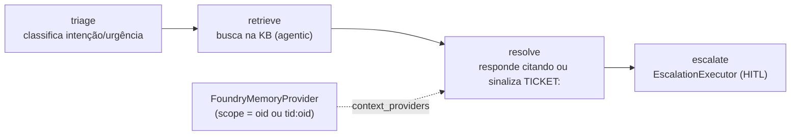
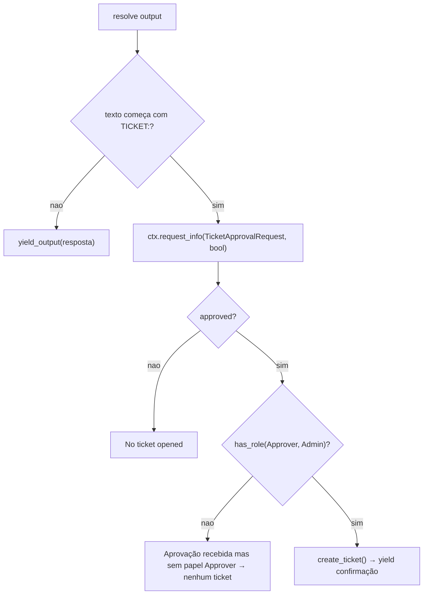

# Domínios de Agente e o Workflow Helpdesk

## Por que um workflow, não um agente único

O domínio `helpdesk` é o de maior risco do showcase: expor um **workflow multi-agente** sobre AG-UI de forma que o frontend receba os passos intermediários (triage, retrieve, draft), não só a resposta final. A solução é **workflow-as-agent** ([app/workflow/graph.py:1-14](https://github.com/ruinosus/foundry-assured/blob/feature/saas-d-packaging/apps/backend/app/workflow/graph.py#L1-L14)). Os outros três domínios são Q&A grounded simples — sem workflow nem HITL.

## Sumário dos domínios

| Domínio | Builder | Provider de busca | Identidade | Fonte |
|---|---|---|---|---|
| helpdesk (workflow) | `build_helpdesk_workflow` | `AzureAISearchContextProvider` (no nó retrieve) | OBO por requisição | [app/workflow/graph.py:28-54](https://github.com/ruinosus/foundry-assured/blob/feature/saas-d-packaging/apps/backend/app/workflow/graph.py#L28-L54) |
| concierge (fallback) | `build_concierge_agent` | idem (modo agentic) ou nenhum | `DefaultAzureCredential` | [app/agents/concierge.py:34-62](https://github.com/ruinosus/foundry-assured/blob/feature/saas-d-packaging/apps/backend/app/agents/concierge.py#L34-L62) |
| cockpit | `build_cockpit_agent` | `SecureAzureAISearchProvider` (ACL trim) | app identity | [app/agents/cockpit.py:34-67](https://github.com/ruinosus/foundry-assured/blob/feature/saas-d-packaging/apps/backend/app/agents/cockpit.py#L34-L67) |
| selfwiki | `build_selfwiki_agent` | `GroundedAzureAISearchProvider` (fallback semântico) | app identity | [app/agents/selfwiki.py:34-65](https://github.com/ruinosus/foundry-assured/blob/feature/saas-d-packaging/apps/backend/app/agents/selfwiki.py#L34-L65) |

## O workflow construído por requisição

A Fase 3 tornou o workflow **per-request** para cada run usar a credencial OBO do usuário assinado e seu próprio escopo de memória. `build_helpdesk_workflow(thread_id)`:

1. `credential = credential_for_request()` e `scope = memory_scope()`;
2. `memory = build_memory_provider(credential, scope)`;
3. constrói os três agentes + o `EscalationExecutor`;
4. monta `add_chain([triage, retrieve, resolve, escalate])`.

([app/workflow/graph.py:28-54](https://github.com/ruinosus/foundry-assured/blob/feature/saas-d-packaging/apps/backend/app/workflow/graph.py#L28-L54))

<!-- Sources: app/workflow/graph.py:33-54, app/workflow/agents.py:42-70 -->

Os três agentes são `FoundryChatClient.as_agent(...)` com `name` **lowercase UI-facing** (`triage`/`retrieve`/`resolve`), porque o `name` vira o id do executor que o adapter AG-UI emite como o passo renderizado ([app/workflow/agents.py:1-10](https://github.com/ruinosus/foundry-assured/blob/feature/saas-d-packaging/apps/backend/app/workflow/agents.py#L1-L10), [app/workflow/agents.py:34-70](https://github.com/ruinosus/foundry-assured/blob/feature/saas-d-packaging/apps/backend/app/workflow/agents.py#L34-L70)). O `_client()` lê endpoint/modelo de `tenant_config()` — ponto onde o seam de tenant entra no workflow ([app/workflow/agents.py:25-31](https://github.com/ruinosus/foundry-assured/blob/feature/saas-d-packaging/apps/backend/app/workflow/agents.py#L25-L31)).

O nó `retrieve` injeta `AzureAISearchContextProvider(mode="agentic")` apontando para `azure_search_knowledge_base` ([app/workflow/agents.py:42-55](https://github.com/ruinosus/foundry-assured/blob/feature/saas-d-packaging/apps/backend/app/workflow/agents.py#L42-L55)). O `resolve` recebe o memory provider como `context_providers` quando presente ([app/workflow/agents.py:58-70](https://github.com/ruinosus/foundry-assured/blob/feature/saas-d-packaging/apps/backend/app/workflow/agents.py#L58-L70)).

## Memória por usuário (Fase 3)

`build_memory_provider` retorna um `FoundryMemoryProvider` scoped a um usuário, ou `None` quando memória não está configurada (`foundry_project_endpoint` + `foundry_memory_store`) ([app/workflow/memory.py:22-41](https://github.com/ruinosus/foundry-assured/blob/feature/saas-d-packaging/apps/backend/app/workflow/memory.py#L22-L41)). Antes de um run, ele busca as memórias do usuário (preferências, resoluções passadas) e as injeta; depois, armazena novas — com `update_delay=0` (grava imediatamente, vs o default de 5 min) ([app/workflow/memory.py:1-10](https://github.com/ruinosus/foundry-assured/blob/feature/saas-d-packaging/apps/backend/app/workflow/memory.py#L1-L10), [app/workflow/memory.py:34-41](https://github.com/ruinosus/foundry-assured/blob/feature/saas-d-packaging/apps/backend/app/workflow/memory.py#L34-L41)).

## HITL: ticket só após aprovação humana + papel

O `EscalationExecutor` é o nó final. Por que um nó `request_info` do workflow em vez de uma tool com approval-mode: o adapter AG-UI duplica o `TOOL_CALL_START` para tools approval-gated, quebrando o stream; o mecanismo nativo de request/response emite um interrupt limpo que o CopilotKit renderiza via `useInterrupt` ([app/workflow/escalation.py:1-17](https://github.com/ruinosus/foundry-assured/blob/feature/saas-d-packaging/apps/backend/app/workflow/escalation.py#L1-L17)).

<!-- Sources: app/workflow/escalation.py:50-93, app/agents/prompts.py:26-41 -->

O contrato textual: `resolve` responde **exatamente** `TICKET: <one-line summary>` quando é um pedido de ação ([app/agents/prompts.py:26-41](https://github.com/ruinosus/foundry-assured/blob/feature/saas-d-packaging/apps/backend/app/agents/prompts.py#L26-L41)). O `on_resolve` inspeciona o prefixo `TICKET:` e pausa com `ctx.request_info(... response_type=bool)`; o `on_decision` só cria o ticket se `approved` E `has_role("Approver", "Admin")` ([app/workflow/escalation.py:50-93](https://github.com/ruinosus/foundry-assured/blob/feature/saas-d-packaging/apps/backend/app/workflow/escalation.py#L50-L93)). Assim "nenhum ticket sem aprovação" vale **estruturalmente** ([app/workflow/escalation.py:5-8](https://github.com/ruinosus/foundry-assured/blob/feature/saas-d-packaging/apps/backend/app/workflow/escalation.py#L5-L8)).

`create_ticket` é uma ação **real, persistida** em `data/tickets.jsonl` (Azure Files no deploy, sobrevive scale-to-zero); também exposta como `@tool` para o hosted agent chamar autonomamente ([app/tools/tickets.py:1-10](https://github.com/ruinosus/foundry-assured/blob/feature/saas-d-packaging/apps/backend/app/tools/tickets.py#L1-L10), [app/tools/tickets.py:28-69](https://github.com/ruinosus/foundry-assured/blob/feature/saas-d-packaging/apps/backend/app/tools/tickets.py#L28-L69)).

## `PerRequestAgent`: o proxy que difere o build

O adapter quer um `SupportsAgentRun` *instance*, não uma factory. Em shared mode os domínios grounded não podem construir no boot (nenhum tenant resolvido), então `PerRequestAgent` difere o build para o request time: cada `.run()` chama `builder()` fresco, lendo a config do tenant DESTA requisição ([app/agents/per_request.py:1-16](https://github.com/ruinosus/foundry-assured/blob/feature/saas-d-packaging/apps/backend/app/agents/per_request.py#L1-L16)). Ele carrega `id`/`name`/`description` (o Protocol checa atributos no `isinstance`) e delega `run`/`create_session`/`get_session` ([app/agents/per_request.py:25-48](https://github.com/ruinosus/foundry-assured/blob/feature/saas-d-packaging/apps/backend/app/agents/per_request.py#L25-L48)).

## Os três domínios grounded

Todos seguem o padrão Foundry IQ documentado pela Microsoft: a fundamentação vem do context provider de busca (agentic retrieval injeta os docs com citações) e a disciplina de resposta vive nas instructions — sem Agent Skill no lado consumidor ([app/agents/cockpit.py:7-15](https://github.com/ruinosus/foundry-assured/blob/feature/saas-d-packaging/apps/backend/app/agents/cockpit.py#L7-L15)).

| Agente | Provider | Diferença-chave | Fonte |
|---|---|---|---|
| concierge | `AzureAISearchContextProvider` | fallback Phase 0 sem KB (instructions ungrounded) | [app/agents/concierge.py:44-62](https://github.com/ruinosus/foundry-assured/blob/feature/saas-d-packaging/apps/backend/app/agents/concierge.py#L44-L62) |
| cockpit | `SecureAzureAISearchProvider` | **ACL trim por usuário** + `retrieval_reasoning_effort="medium"` | [app/agents/cockpit.py:55-67](https://github.com/ruinosus/foundry-assured/blob/feature/saas-d-packaging/apps/backend/app/agents/cockpit.py#L55-L67) |
| selfwiki | `GroundedAzureAISearchProvider` | **fallback semântico direto** quando agentic vem vazio | [app/agents/selfwiki.py:52-65](https://github.com/ruinosus/foundry-assured/blob/feature/saas-d-packaging/apps/backend/app/agents/selfwiki.py#L52-L65) |

O `retrieval_reasoning_effort="medium"` habilita query planning iterativo; medido no golden de enumeração MCP, levanta o recall de 6/12 → 8/12 — a alavanca de completeness ([app/agents/cockpit.py:48-54](https://github.com/ruinosus/foundry-assured/blob/feature/saas-d-packaging/apps/backend/app/agents/cockpit.py#L48-L54)). O `GroundedAzureAISearchProvider` cai para uma busca semântica direta no índice quando o passe agentic volta vazio (que fazia o agente declinar cego) ([app/agents/grounded_search.py:1-12](https://github.com/ruinosus/foundry-assured/blob/feature/saas-d-packaging/apps/backend/app/agents/grounded_search.py#L1-L12)).

A disciplina de citação é policy de eval: toda resposta do resolver/concierge DEVE conter ao menos uma citação de fonte ([app/agents/prompts.py:50-56](https://github.com/ruinosus/foundry-assured/blob/feature/saas-d-packaging/apps/backend/app/agents/prompts.py#L50-L56)). O ACL trim do `SecureAzureAISearchProvider` é detalhado em [Conhecimento, ACL e Controle de Acesso](./page-7.md).

## Related Pages

| Página | Relação |
|------|-------------|
| [Autenticação, OBO e RBAC](./page-3.md) | `credential_for_request`/`memory_scope`/`has_role` |
| [API, Endpoints e Wiring](./page-4.md) | Onde os builders são montados nos endpoints |
| [Conhecimento, ACL e Controle de Acesso](./page-7.md) | `SecureAzureAISearchProvider` e a ingestão das KBs |
| [O Quarto Domínio: Platform e MCP](./page-6.md) | O domínio tool-driven que também usa `PerRequestAgent` |
