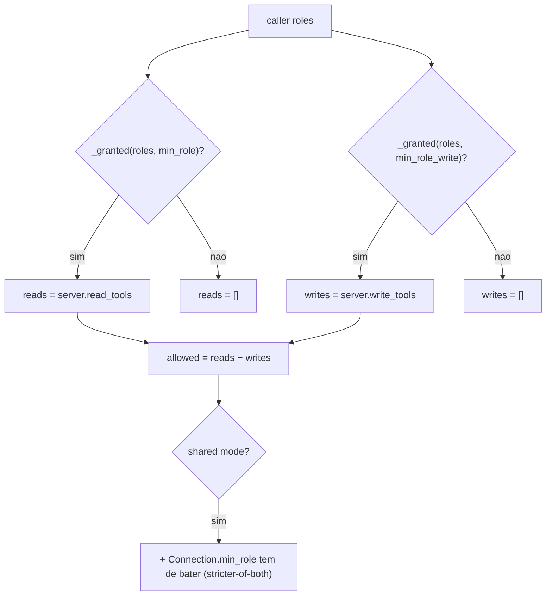
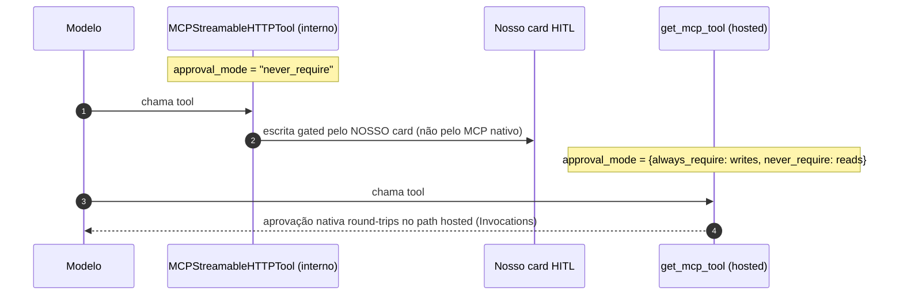

# O Quarto Domínio: Platform e Integração MCP

## Por que este domínio é diferente

Diferente dos experts grounded (cockpit/selfwiki), a capacidade do agente `platform` **é** o conjunto de ferramentas MCP first-party da Microsoft, montadas **por requisição** a partir de `app/agents/mcp/`. As ferramentas são filtradas por papel (Reader vê reads; Author/Admin veem writes) e, para servidores OBO, rodam como o usuário assinado ([app/agents/platform.py:1-10](https://github.com/ruinosus/foundry-assured/blob/feature/saas-d-packaging/apps/backend/app/agents/platform.py#L1-L10)).

## Sumário

| Peça | Símbolo | Arquivo | Fonte |
|---|---|---|---|
| Catálogo de servidores (dado puro) | `SERVERS`, `McpServer` | `mcp/registry.py` | [app/agents/mcp/registry.py:24-116](https://github.com/ruinosus/foundry-assured/blob/feature/saas-d-packaging/apps/backend/app/agents/mcp/registry.py#L24-L116) |
| Governança como dado | `visible_tools`, `classify_tool` | `mcp/registry.py` | [app/agents/mcp/registry.py:130-175](https://github.com/ruinosus/foundry-assured/blob/feature/saas-d-packaging/apps/backend/app/agents/mcp/registry.py#L130-L175) |
| Build de ferramentas | `build_mcp_tools`, `build_from_connections`, `build_hosted_from_connections` | `mcp/tools.py` | [app/agents/mcp/tools.py:178-241](https://github.com/ruinosus/foundry-assured/blob/feature/saas-d-packaging/apps/backend/app/agents/mcp/tools.py#L178-L241) |
| Agente + proxy | `build_platform_agent`, `platform_agent_proxy` | `agents/platform.py` | [app/agents/platform.py:31-56](https://github.com/ruinosus/foundry-assured/blob/feature/saas-d-packaging/apps/backend/app/agents/platform.py#L31-L56) |

## O registry: governança como dado, não código

`app/agents/mcp/registry.py` é **puro** — sem rede, framework ou auth — então é unit-testável isolado. Cada servidor declara quais tools são reads vs writes e o papel mínimo de cada. **Fail-closed:** uma tool que não está em NENHUMA lista é tratada como WRITE — uma tool nova não-classificada não escapa como read aberto ([app/agents/mcp/registry.py:1-12](https://github.com/ruinosus/foundry-assured/blob/feature/saas-d-packaging/apps/backend/app/agents/mcp/registry.py#L1-L12), [app/agents/mcp/registry.py:130-134](https://github.com/ruinosus/foundry-assured/blob/feature/saas-d-packaging/apps/backend/app/agents/mcp/registry.py#L130-L134)).

| Servidor | `auth` | Habilitado? | Por quê | Fonte |
|---|---|---|---|---|
| `learn` | `public` | sim | endpoint público (Microsoft Learn) | [app/agents/mcp/registry.py:43-49](https://github.com/ruinosus/foundry-assured/blob/feature/saas-d-packaging/apps/backend/app/agents/mcp/registry.py#L43-L49) |
| `azure` | `obo` | **não** | sem endpoint remoto gerenciado (stdio local) | [app/agents/mcp/registry.py:55-64](https://github.com/ruinosus/foundry-assured/blob/feature/saas-d-packaging/apps/backend/app/agents/mcp/registry.py#L55-L64) |
| `entra` | `obo` | **não** | sem endpoint first-party remoto | [app/agents/mcp/registry.py:68-77](https://github.com/ruinosus/foundry-assured/blob/feature/saas-d-packaging/apps/backend/app/agents/mcp/registry.py#L68-L77) |
| `azdo` | `obo` | sim | endpoint real (`{org}` por org) | [app/agents/mcp/registry.py:81-90](https://github.com/ruinosus/foundry-assured/blob/feature/saas-d-packaging/apps/backend/app/agents/mcp/registry.py#L81-L90) |
| `github` | `github_pat` | sim | OAuth do GitHub (NÃO Entra OBO) | [app/agents/mcp/registry.py:98-105](https://github.com/ruinosus/foundry-assured/blob/feature/saas-d-packaging/apps/backend/app/agents/mcp/registry.py#L98-L105) |
| `m365` | `oauth_passthrough` | **não** | endpoint a confirmar | [app/agents/mcp/registry.py:106-115](https://github.com/ruinosus/foundry-assured/blob/feature/saas-d-packaging/apps/backend/app/agents/mcp/registry.py#L106-L115) |

O modelo de papéis é **flat** (não escada): `READ_ROLES` = Reader/Author/Approver/Admin; `WRITE_ROLES` = Author/Admin ([app/agents/mcp/registry.py:19-21](https://github.com/ruinosus/foundry-assured/blob/feature/saas-d-packaging/apps/backend/app/agents/mcp/registry.py#L19-L21)). Nota importante: GitHub auth **não** é Entra OBO — GitHub valida só tokens próprios e rejeita audiência Microsoft, então usa PAT/OAuth do próprio GitHub ([app/agents/mcp/registry.py:91-97](https://github.com/ruinosus/foundry-assured/blob/feature/saas-d-packaging/apps/backend/app/agents/mcp/registry.py#L91-L97)).

## RBAC por ferramenta

<!-- Sources: app/agents/mcp/registry.py:137-175 -->

`visible_tools(server, roles)` retorna `(reads, writes)` visíveis ao caller — um caller sem papel vê nada (fail-closed) ([app/agents/mcp/registry.py:142-147](https://github.com/ruinosus/foundry-assured/blob/feature/saas-d-packaging/apps/backend/app/agents/mcp/registry.py#L142-L147)). Em shared mode, `visible_tools_for(server, conn, roles)` aplica o **stricter-of-both**: a min-role do registry E a do `Connection` têm de ser satisfeitas — o tenant só pode apertar, nunca afrouxar ([app/agents/mcp/registry.py:158-175](https://github.com/ruinosus/foundry-assured/blob/feature/saas-d-packaging/apps/backend/app/agents/mcp/registry.py#L158-L175)).

## Os três caminhos de build

`build_mcp_tools()` é **mode-aware**. Quando auth está off (dev local), trata o caller como Admin — senão o filtro de papel esconderia toda tool localmente ([app/agents/mcp/tools.py:223-241](https://github.com/ruinosus/foundry-assured/blob/feature/saas-d-packaging/apps/backend/app/agents/mcp/tools.py#L223-L241)):

| Caminho | Quando | Função | Auth da tool | Fonte |
|---|---|---|---|---|
| Registry flat | self-hosted (default) | `_build_one` sobre `enabled_servers()` | header_provider OBO/PAT | [app/agents/mcp/tools.py:82-109](https://github.com/ruinosus/foundry-assured/blob/feature/saas-d-packaging/apps/backend/app/agents/mcp/tools.py#L82-L109) |
| Connections (interno) | shared | `build_from_connections` → `_build_from_connection` | OBO ou Foundry-connection broker | [app/agents/mcp/tools.py:150-181](https://github.com/ruinosus/foundry-assured/blob/feature/saas-d-packaging/apps/backend/app/agents/mcp/tools.py#L150-L181) |
| Connections (hosted) | hosted | `build_hosted_from_connections` via `get_tool` | `project_connection_id` (Foundry resolve) | [app/agents/mcp/tools.py:184-210](https://github.com/ruinosus/foundry-assured/blob/feature/saas-d-packaging/apps/backend/app/agents/mcp/tools.py#L184-L210) |

A resolução RBAC + URL + approval compartilhada vive em **um lugar** — `_connection_build_params` — usado tanto pelo path interno quanto pelo hosted ([app/agents/mcp/tools.py:124-147](https://github.com/ruinosus/foundry-assured/blob/feature/saas-d-packaging/apps/backend/app/agents/mcp/tools.py#L124-L147)). Servidores cuja config requerida falta são **pulados** (fail-closed): azdo precisa de org, github precisa de PAT ([app/agents/mcp/tools.py:71-79](https://github.com/ruinosus/foundry-assured/blob/feature/saas-d-packaging/apps/backend/app/agents/mcp/tools.py#L71-L79)).

### Brokering de credencial sem persistir segredo

Para conexões não-OBO carregando um `foundry_connection_id`, `_foundry_connection_header_provider` busca a credencial da Foundry connection do tenant **no momento da chamada** (em memória, nunca persistida); o closure é lazy — nenhum import/chamada Azure até ser invocado ([app/agents/mcp/tools.py:51-68](https://github.com/ruinosus/foundry-assured/blob/feature/saas-d-packaging/apps/backend/app/agents/mcp/tools.py#L51-L68), [app/agents/mcp/tools.py:167-171](https://github.com/ruinosus/foundry-assured/blob/feature/saas-d-packaging/apps/backend/app/agents/mcp/tools.py#L167-L171)).

## Aprovação de escrita: interno vs hosted

<!-- Sources: app/agents/mcp/tools.py:92-97, app/agents/mcp/tools.py:143-147 -->

No path **interno** o `approval_mode="never_require"` porque a aprovação MCP nativa NÃO executa sobre AG-UI (agent-framework #3199), então a aprovação de escrita é tratada pelo nosso card HITL no workflow — mas a **visibilidade** de write ainda é gated por papel (um Reader nunca vê a write) ([app/agents/mcp/tools.py:1-18](https://github.com/ruinosus/foundry-assured/blob/feature/saas-d-packaging/apps/backend/app/agents/mcp/tools.py#L1-L18), [app/agents/mcp/tools.py:92-97](https://github.com/ruinosus/foundry-assured/blob/feature/saas-d-packaging/apps/backend/app/agents/mcp/tools.py#L92-L97)). No path **hosted/connection**, o `approval_mode` é um dict que marca `always_require_approval` para writes e `never_require_approval` para reads — aprovação nativa ([app/agents/mcp/tools.py:143-147](https://github.com/ruinosus/foundry-assured/blob/feature/saas-d-packaging/apps/backend/app/agents/mcp/tools.py#L143-L147)). Esse é o motivo de a ponte `/platform-hosted` usar o protocolo **Invocations** (Responses não round-trip o interrupt) — ver [API e Endpoints](./page-4.md#pontes-hosted-responses-e-invocations).

## O agente e o proxy

`build_platform_agent()` cria um `FoundryChatClient` com `credential_for_request()` (OBO) e chama `client.as_agent(... tools=build_mcp_tools())` ([app/agents/platform.py:31-44](https://github.com/ruinosus/foundry-assured/blob/feature/saas-d-packaging/apps/backend/app/agents/platform.py#L31-L44)). O endpoint serve o `platform_agent_proxy` — um `PerRequestAgent` que **reconstrói** o agente em cada `.run()`, para cada requisição obter tools filtradas pelos papéis + OBO do caller ATUAL (não uma vez no boot — o ponto inteiro deste domínio) ([app/agents/platform.py:47-56](https://github.com/ruinosus/foundry-assured/blob/feature/saas-d-packaging/apps/backend/app/agents/platform.py#L47-L56), [app/main.py:117-127](https://github.com/ruinosus/foundry-assured/blob/feature/saas-d-packaging/apps/backend/app/main.py#L117-L127)).

As `PLATFORM_INSTRUCTIONS` impõem: preferir tool a chute, fundamentar em resultados de tool, e **nunca alegar que executou uma escrita** — explicar o que faria e deixar o passo de aprovação tratar ([app/agents/prompts.py:139-144](https://github.com/ruinosus/foundry-assured/blob/feature/saas-d-packaging/apps/backend/app/agents/prompts.py#L139-L144)).

## Related Pages

| Página | Relação |
|------|-------------|
| [Modos de Implantação e o Seam de Tenant](./page-2.md) | `Connection` e o tenant store que alimenta os builds shared |
| [Autenticação, OBO e RBAC](./page-3.md) | `current_roles`/`credential_for_request` que filtram as tools |
| [API, Endpoints e Wiring](./page-4.md) | `/platform` e a ponte `/platform-hosted` (Invocations) |
| [Domínios de Agente e Workflow](./page-5.md) | `PerRequestAgent`, reusado aqui |
