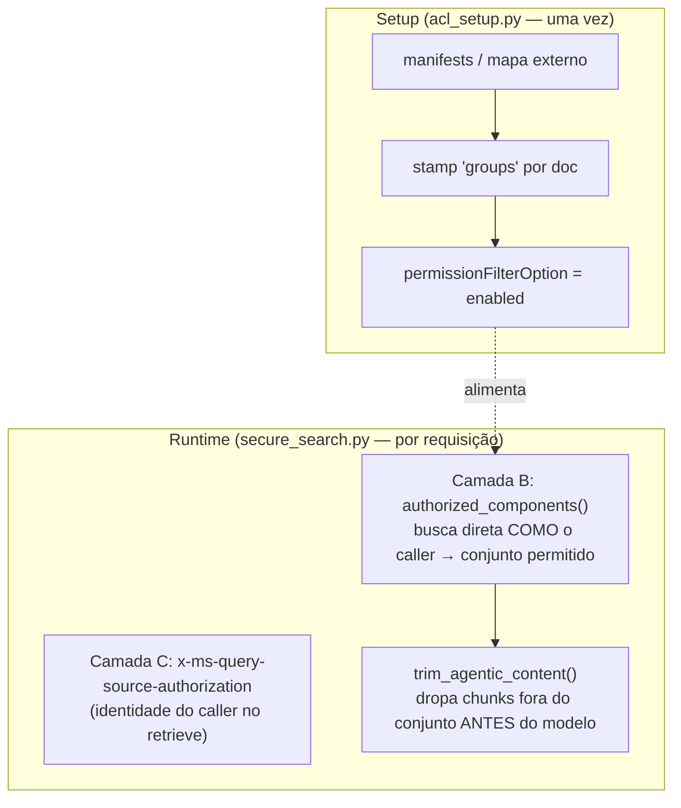
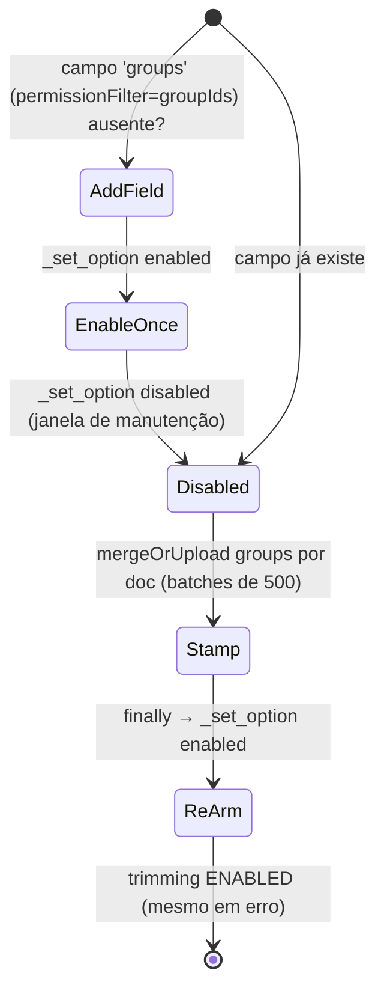

# Conhecimento, ACL e Controle de Acesso por Documento

## Por que controle de acesso é DADO

Regra inegociável do projeto: **controle de acesso é dado** (os grupos de leitura de cada fonte), **nunca lógica de classificação no código**. O acesso segue a fonte; doc sem acesso declarado → fail-closed. O `acl_setup.py` é explícito: *"o mecanismo enforça acesso; ele nunca inventa. Não há lógica de classificação neste código — sem tiers, sem marcadores"* ([app/knowledge/acl_setup.py:1-19](https://github.com/ruinosus/foundry-assured/blob/feature/saas-d-packaging/apps/backend/app/knowledge/acl_setup.py#L1-L19)).

## Sumário

| Componente | Papel | Arquivo | Fonte |
|---|---|---|---|
| Ingestão da KB do helpdesk | upload corpus + knowledge source + KB | `knowledge/ingest.py` | [app/knowledge/ingest.py:1-20](https://github.com/ruinosus/foundry-assured/blob/feature/saas-d-packaging/apps/backend/app/knowledge/ingest.py#L1-L20) |
| Ingestão da KB do Cockpit | 2º domínio (docbundles internos) | `knowledge/ingest_cockpit.py` | [app/knowledge/ingest_cockpit.py:1-20](https://github.com/ruinosus/foundry-assured/blob/feature/saas-d-packaging/apps/backend/app/knowledge/ingest_cockpit.py#L1-L20) |
| Geração do deep-wiki (dogfood) | wiki fiel a partir do código real | `knowledge/wiki_builder.py` | [app/knowledge/wiki_builder.py:1-18](https://github.com/ruinosus/foundry-assured/blob/feature/saas-d-packaging/apps/backend/app/knowledge/wiki_builder.py#L1-L18) |
| Stamp de ACL no índice | grava grupos por doc + liga trimming | `knowledge/acl_setup.py` | [app/knowledge/acl_setup.py:98-161](https://github.com/ruinosus/foundry-assured/blob/feature/saas-d-packaging/apps/backend/app/knowledge/acl_setup.py#L98-L161) |
| Provider seguro (trim em runtime) | passthrough de identidade + trim app-side | `agents/secure_search.py` | [app/agents/secure_search.py:105-136](https://github.com/ruinosus/foundry-assured/blob/feature/saas-d-packaging/apps/backend/app/agents/secure_search.py#L105-L136) |

## Ingestão: o padrão Foundry IQ

`ingest.py` (Fase 1) constrói a KB do helpdesk: faz upload de cada markdown de `corpus/` para o blob container, cria um **blob knowledge source** (Azure AI Search auto-chunk + embed via o deployment de embedding) e cria o **knowledge base** que orquestra agentic retrieval, tudo com `DefaultAzureCredential` (sem keys) ([app/knowledge/ingest.py:1-20](https://github.com/ruinosus/foundry-assured/blob/feature/saas-d-packaging/apps/backend/app/knowledge/ingest.py#L1-L20)). `ingest_cockpit.py` é o mesmo padrão apontado aos docbundles do Cockpit (~250 páginas, 21 componentes), num blob container/KS/KB separados (`cockpit-kb`) — o corpus interno nunca é copiado para o repo público ([app/knowledge/ingest_cockpit.py:1-20](https://github.com/ruinosus/foundry-assured/blob/feature/saas-d-packaging/apps/backend/app/knowledge/ingest_cockpit.py#L1-L20)).

O `wiki_builder.py` é a outra metade: um agente Foundry lê o **código-fonte real** e escreve uma wiki citada no formato de bundle (`manifest.json` + `pages/*.md` + `llms.txt`), dirigido pelas regras de profundidade do Agent Skill **wiki-page-writer** da Microsoft — "trace actual code paths, every claim cites a real file, no guessing". É a base do dogfood selfwiki ([app/knowledge/wiki_builder.py:1-18](https://github.com/ruinosus/foundry-assured/blob/feature/saas-d-packaging/apps/backend/app/knowledge/wiki_builder.py#L1-L18)).

## Controle de acesso por documento: as duas camadas



<!-- Sources: app/agents/secure_search.py:1-19, app/knowledge/acl_setup.py:98-161 -->

O `secure_search.py` documenta duas camadas de defesa-em-profundidade ([app/agents/secure_search.py:1-19](https://github.com/ruinosus/foundry-assured/blob/feature/saas-d-packaging/apps/backend/app/agents/secure_search.py#L1-L19)):

- **Camada C (service-side, o hook):** o agentic retrieve carrega a identidade do caller via header `x-ms-query-source-authorization`; trima server-side onde o serviço suportar (inerte hoje, ativa automaticamente quando suportado). Implementado embrulhando `client.retrieve` para injetar o token OBP do caller ([app/agents/secure_search.py:108-121](https://github.com/ruinosus/foundry-assured/blob/feature/saas-d-packaging/apps/backend/app/agents/secure_search.py#L108-L121)).
- **Camada B (app-side, ativa agora):** como o serviço não trima o path agentic por usuário, o app pergunta ao índice a **mesma query como o caller** via busca direta — que trima corretamente — para aprender o **conjunto de componentes autorizados**, e dropa qualquer chunk fora desse conjunto antes do modelo ver. Autoritativo (o trim vem da avaliação de ACL do próprio serviço) e fail-closed ([app/agents/secure_search.py:9-17](https://github.com/ruinosus/foundry-assured/blob/feature/saas-d-packaging/apps/backend/app/agents/secure_search.py#L9-L17)).

### `_agentic_search`: o pseudocódigo real

```python
# app/agents/secure_search.py:123-136
result = await super()._agentic_search(messages)
token = _caller_search_token()
if token is None:            # auth off (dev) → nada a trimar
    return result
allowed = authorized_components(token)   # camada B — entitlement do caller
for m in result:
    new_contents = [trim_agentic_content(t, allowed) if (t := text) else c ...]
```

`authorized_components()` faz uma busca direta (`search=*`) com um token de serviço E o token do caller no header, paginando via `@odata.nextLink` para não capar entitlements amplos; em erro, retorna conjunto vazio (fail-closed, dropa tudo em vez de vazar) ([app/agents/secure_search.py:50-69](https://github.com/ruinosus/foundry-assured/blob/feature/saas-d-packaging/apps/backend/app/agents/secure_search.py#L50-L69)). `trim_agentic_content()` interpreta o texto como array JSON de chunks e mantém só os cujo componente está em `allowed`; chunks não-atribuíveis são dropados ([app/agents/secure_search.py:72-102](https://github.com/ruinosus/foundry-assured/blob/feature/saas-d-packaging/apps/backend/app/agents/secure_search.py#L72-L102)).

## Identidade de componente: extração determinística, não classificação

Tanto o stamp quanto o trim derivam o **mesmo** key de componente. `_component(blob_url)` extrai da convenção de nomeação do blob (`<component>(-v<ver>)?__<page>.md` → `<component>`); `_canonical()` normaliza (lowercase, espaços→hífens, versão trailing strippada) para que a key do blob e o label do H1 batam ([app/knowledge/acl_setup.py:38-56](https://github.com/ruinosus/foundry-assured/blob/feature/saas-d-packaging/apps/backend/app/knowledge/acl_setup.py#L38-L56)). O `secure_search._chunk_component` reusa exatamente essa normalização a partir do H1 do chunk, garantindo que as keys casem ([app/agents/secure_search.py:72-83](https://github.com/ruinosus/foundry-assured/blob/feature/saas-d-packaging/apps/backend/app/agents/secure_search.py#L72-L83)).

## `setup_acl`: o stamp do índice



<!-- Sources: app/knowledge/acl_setup.py:98-161 -->

`setup_acl(component_groups)` adiciona o campo de permissão `groups` (se ausente), popula sob uma **janela disabled** (docs sem grupo ficam invisíveis quando enforçado), e re-arma o trimming no `finally` — então uma falha transitória nunca deixa o índice aberto ([app/knowledge/acl_setup.py:98-161](https://github.com/ruinosus/foundry-assured/blob/feature/saas-d-packaging/apps/backend/app/knowledge/acl_setup.py#L113-L161)). Grupos são resolvidos por nome → object-ID via `tenant_config().acl_group_map` (GUIDs passam direto; nomes desconhecidos são dropados); docs sem grupo resolvível são **fail-closed** ([app/knowledge/acl_setup.py:59-68](https://github.com/ruinosus/foundry-assured/blob/feature/saas-d-packaging/apps/backend/app/knowledge/acl_setup.py#L59-L68), [app/knowledge/acl_setup.py:144-151](https://github.com/ruinosus/foundry-assured/blob/feature/saas-d-packaging/apps/backend/app/knowledge/acl_setup.py#L144-L151)).

Note que **todos** esses pontos leem `tenant_config()` (endpoint de busca, índice, group map), então o controle de acesso herda o seam multi-tenant: cada tenant trima contra seus próprios grupos ([app/knowledge/acl_setup.py:79-96](https://github.com/ruinosus/foundry-assured/blob/feature/saas-d-packaging/apps/backend/app/knowledge/acl_setup.py#L79-L96), [app/agents/secure_search.py:57-58](https://github.com/ruinosus/foundry-assured/blob/feature/saas-d-packaging/apps/backend/app/agents/secure_search.py#L57-L58)).

## Quando o trim não roda

Com auth off (dev local) não há caller, então nada é trimado — `_caller_search_token()` retorna `None` e `_agentic_search` devolve o resultado intocado ([app/agents/secure_search.py:40-48](https://github.com/ruinosus/foundry-assured/blob/feature/saas-d-packaging/apps/backend/app/agents/secure_search.py#L40-L48), [app/agents/secure_search.py:126-128](https://github.com/ruinosus/foundry-assured/blob/feature/saas-d-packaging/apps/backend/app/agents/secure_search.py#L126-L128)).

## Related Pages

| Página | Relação |
|------|-------------|
| [Modos de Implantação e o Seam de Tenant](./page-2.md) | `acl_group_map`/`cockpit_acl_*` em `TenantConfig` |
| [Domínios de Agente e Workflow](./page-5.md) | O agente cockpit que usa `SecureAzureAISearchProvider` |
| [Avaliação, Garantia e Testes](./page-8.md) | Os testes de access-control e o gate de violações |
