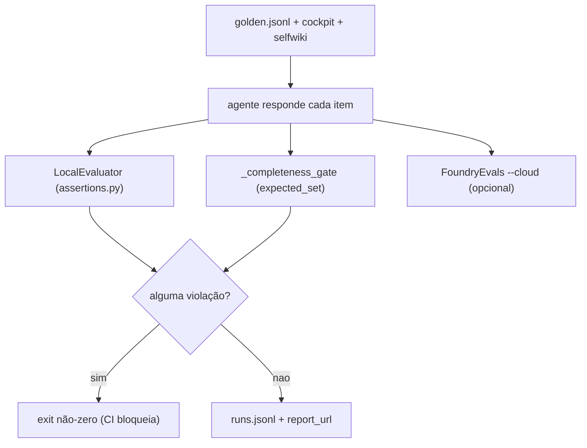

# Avaliação, Garantia (Assurance) e Testes

## Por que avaliação é parte do produto

O showcase não entrega só o concierge — entrega o **mecanismo de garantia** por cima: build-fidelity → recall → completeness → controle de acesso por documento → red-team. Cada número é um sinal 🟢/🔴 ligado a um evaluator + um gate de CI + um trace. Os thresholds são a "fonte única de verdade" em `assurance.yaml` ([apps/backend/eval/assurance.yaml:1-5](https://github.com/ruinosus/foundry-assured/blob/feature/saas-d-packaging/apps/backend/eval/assurance.yaml#L1-L5)).

## Sumário

| Camada | Arquivo | O que gateia | Fonte |
|---|---|---|---|
| Harness offline | `eval/run_eval.py` | roda golden set, score em 2 camadas | [apps/backend/eval/run_eval.py:1-22](https://github.com/ruinosus/foundry-assured/blob/feature/saas-d-packaging/apps/backend/eval/run_eval.py#L1-L22) |
| Policy gate (ASSERT) | `eval/assertions.py` | cita fonte; nunca vaza segredo | [apps/backend/eval/assertions.py:1-13](https://github.com/ruinosus/foundry-assured/blob/feature/saas-d-packaging/apps/backend/eval/assertions.py#L1-L13) |
| Thresholds | `eval/assurance.yaml` | groundedness, recall, completeness, ASR | [apps/backend/eval/assurance.yaml:6-32](https://github.com/ruinosus/foundry-assured/blob/feature/saas-d-packaging/apps/backend/eval/assurance.yaml#L6-L32) |
| Foundry cloud judge | `services/foundry_evals.py` | groundedness/relevance/coherence | [app/api/evals.py:36-42](https://github.com/ruinosus/foundry-assured/blob/feature/saas-d-packaging/apps/backend/app/api/evals.py#L36-L42) |
| API de leitura | `app/api/evals.py` | `/eval/runs`, `/eval/foundry` | [app/api/evals.py:16-42](https://github.com/ruinosus/foundry-assured/blob/feature/saas-d-packaging/apps/backend/app/api/evals.py#L16-L42) |

## O harness offline

`run_eval.py` (Fase 5) roda o concierge grounded contra o golden set e o escora em duas camadas usando a API de evaluation do agent-framework ([apps/backend/eval/run_eval.py:1-22](https://github.com/ruinosus/foundry-assured/blob/feature/saas-d-packaging/apps/backend/eval/run_eval.py#L1-L22)):

- **`LocalEvaluator`** (`eval/assertions.py`) — gate de policy determinístico: toda resposta deve citar uma fonte (ou declinar) e nunca vazar segredo. Uma violação faz o run sair não-zero (o gate de CI).
- **`FoundryEvals`** (`--cloud`) — os LLM-judges hospedados da Microsoft (groundedness/relevance/coherence), com scores visíveis no portal Foundry (`report_url`), ligando eval de volta aos traces.

Usos: `uv run python -m eval.run_eval` (gate rápido), `--cloud` (scores Foundry), `--self-test` (prova que o gate pega uma violação plantada) ([apps/backend/eval/run_eval.py:13-22](https://github.com/ruinosus/foundry-assured/blob/feature/saas-d-packaging/apps/backend/eval/run_eval.py#L13-L22)).

<!-- Sources: apps/backend/eval/run_eval.py:1-22, apps/backend/eval/run_eval.py:67-100 -->

O `_completeness_gate` é determinístico (sem LLM judge, então pode hard-gate CI): golden rows com `expected_set` (lista source-verified de itens que a resposta deve mencionar, ex.: todo servidor MCP) são escoradas por cobertura; a média deve bater o threshold ([apps/backend/eval/run_eval.py:67-100](https://github.com/ruinosus/foundry-assured/blob/feature/saas-d-packaging/apps/backend/eval/run_eval.py#L67-L100)). Ele ataca exatamente a falha observada (listar 6 de 9 servidores MCP).

## As policies ASSERT

`assertions.py` são checks `@evaluator` determinísticos e sem API, alimentando um `LocalEvaluator`. Codificam as policies inegociáveis do CLAUDE.md: toda resposta grounded cita um runbook (ou declina explicitamente); uma resposta nunca ecoa um valor de segredo/credencial ([apps/backend/eval/assertions.py:1-13](https://github.com/ruinosus/foundry-assured/blob/feature/saas-d-packaging/apps/backend/eval/assertions.py#L1-L13)). Um check retorna bool (True = passa); o decorator injeta dados de cada `EvalItem` pelos nomes de parâmetro ([apps/backend/eval/assertions.py:8-13](https://github.com/ruinosus/foundry-assured/blob/feature/saas-d-packaging/apps/backend/eval/assertions.py#L8-L13)).

## Os thresholds de garantia

| Métrica | Threshold | Fase | Fonte |
|---|---|---|---|
| `groundedness_min` | 4.0 | 3 | [apps/backend/eval/assurance.yaml:9](https://github.com/ruinosus/foundry-assured/blob/feature/saas-d-packaging/apps/backend/eval/assurance.yaml#L9) |
| `answer_completeness_min` | 0.60 | 3 | [apps/backend/eval/assurance.yaml:11](https://github.com/ruinosus/foundry-assured/blob/feature/saas-d-packaging/apps/backend/eval/assurance.yaml#L11) |
| `retrieval_recall_min` | 0.75 | 2 | [apps/backend/eval/assurance.yaml:14](https://github.com/ruinosus/foundry-assured/blob/feature/saas-d-packaging/apps/backend/eval/assurance.yaml#L14) |
| `citation_floor` | 1 | já enforçada | [apps/backend/eval/assurance.yaml:15](https://github.com/ruinosus/foundry-assured/blob/feature/saas-d-packaging/apps/backend/eval/assurance.yaml#L15) |
| `fidelity_min` (build) | 0.80 | 1 | [apps/backend/eval/assurance.yaml:20](https://github.com/ruinosus/foundry-assured/blob/feature/saas-d-packaging/apps/backend/eval/assurance.yaml#L20) |
| `access_control_violations_max` | 0 (hard zero) | 4-5 | [apps/backend/eval/assurance.yaml:24](https://github.com/ruinosus/foundry-assured/blob/feature/saas-d-packaging/apps/backend/eval/assurance.yaml#L24) |
| `redteam_asr_max` | 0.10 | 4-5 | [apps/backend/eval/assurance.yaml:25](https://github.com/ruinosus/foundry-assured/blob/feature/saas-d-packaging/apps/backend/eval/assurance.yaml#L25) |

O `fidelity_min: 0.80` é o **mesmo gate de build-fidelity** que governa este bundle de wiki: a fração de citações de arquivo que resolvem a um arquivo real; abaixo dele, o bundle é escrito para inspeção mas não pode ser ingerido ([apps/backend/eval/assurance.yaml:16-20](https://github.com/ruinosus/foundry-assured/blob/feature/saas-d-packaging/apps/backend/eval/assurance.yaml#L16-L20)). O `reasoning_effort: medium` é registrado aqui como fonte única de verdade de como a KB é consultada ([apps/backend/eval/assurance.yaml:27-32](https://github.com/ruinosus/foundry-assured/blob/feature/saas-d-packaging/apps/backend/eval/assurance.yaml#L27-L32)).

## A suíte de testes cobre a evolução SaaS

A pasta `eval/` ganhou uma bateria de testes específicos do SaaS multi-tenant (todos `*_test.py`):

| Área | Testes (exemplos) |
|---|---|
| Seam de tenant | `tenant_provider_test.py`, `tenant_store_test.py`, `tenant_resolution_test.py`, `tenant_scope_test.py`, `tenant_e2e_test.py`, `tenant_admin_e2e_test.py` |
| Modos / boot | `configured_mode_test.py`, `shared_boot_smoke_test.py`, `multitenant_scheme_test.py`, `credential_wiring_test.py` |
| Domínios / entitlement | `domain_gate_test.py`, `domains_api_test.py`, `enabled_domains_roundtrip_test.py`, `tier_domains_test.py`, `per_request_override_test.py` |
| MCP / platform | `mcp_registry_test.py`, `rbac_per_tool_test.py`, `approval_mode_test.py`, `connection_*_test.py`, `mcp_brokering_e2e_test.py`, `hosted_platform_smoke_test.py`, `platform_hosted_*_test.py` |
| Onboarding / memória | `onboarding_guard_test.py`, `memory_scope_test.py` |
| Segurança / garantia | `access_control_test.py`, `red_team_test.py`, `test_attribution.py`, `wiki_freshness_test.py` |

(Lista verificada por `ls apps/backend/eval/`; ver os arquivos em [apps/backend/eval/](https://github.com/ruinosus/foundry-assured/blob/feature/saas-d-packaging/apps/backend/eval/).) `mcp_registry_test.py` exercita o registry **puro** isolado — daí o registry não importar rede/framework ([app/agents/mcp/registry.py:1-12](https://github.com/ruinosus/foundry-assured/blob/feature/saas-d-packaging/apps/backend/app/agents/mcp/registry.py#L1-L12)).

## API de leitura dos resultados

| Endpoint | Fonte de dados | Fonte |
|---|---|---|
| `GET /eval/runs` | mirror local `eval/runs.jsonl` (vazio em deploy fresco) | [app/api/evals.py:16-33](https://github.com/ruinosus/foundry-assured/blob/feature/saas-d-packaging/apps/backend/app/api/evals.py#L16-L33) |
| `GET /eval/foundry` | runs + scores ao vivo do projeto Foundry (store canônico) | [app/api/evals.py:36-42](https://github.com/ruinosus/foundry-assured/blob/feature/saas-d-packaging/apps/backend/app/api/evals.py#L36-L42) |

Ambos atrás do gate Entra (no-op em dev). O store canônico é a aba Evaluations do portal Foundry; a página `/evals` do frontend renderiza `/eval/foundry` e deep-linka para o portal ([app/api/evals.py:36-42](https://github.com/ruinosus/foundry-assured/blob/feature/saas-d-packaging/apps/backend/app/api/evals.py#L36-L42)).

## Related Pages

| Página | Relação |
|------|-------------|
| [Visão Geral do Backend](./page-1.md) | O mecanismo de garantia como produto |
| [Domínios de Agente e Workflow](./page-5.md) | O agente avaliado e a policy de citação |
| [Conhecimento, ACL e Controle de Acesso](./page-7.md) | O gate de access-control violations (hard zero) |
| [O Quarto Domínio: Platform e MCP](./page-6.md) | Os testes de RBAC por ferramenta e brokering |
