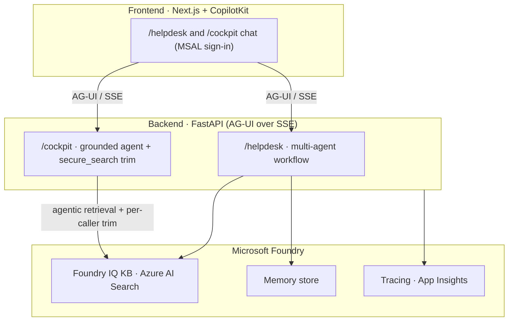
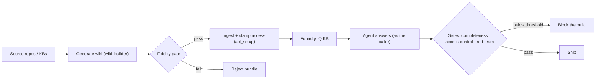
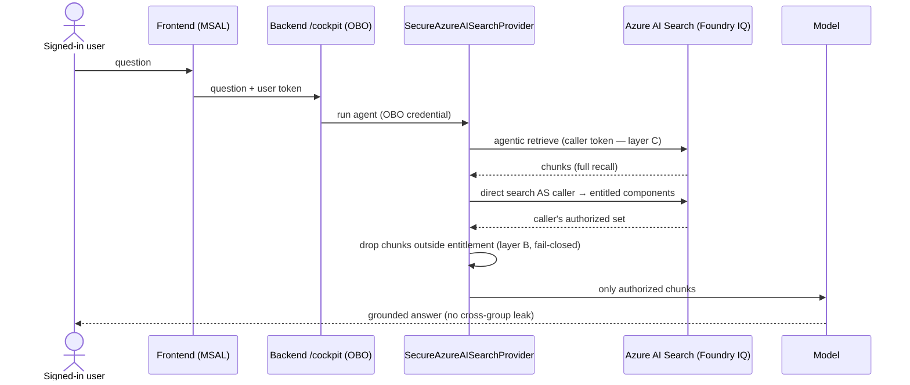

# Contexto extraído dos arquivos-fonte

Abaixo estão apenas afirmações e trechos que constam explicitamente nos arquivos fornecidos, com a citação do arquivo-fonte.

## Padrões de documentação (trechos relevantes)
- Todos os `.md` sob `docs/` começam com um bloco YAML (front-matter) seguido por exatamente um `# H1`. (DOCS-STANDARD.md)  
- Modelo de front-matter fornecido:

```yaml
---
title: <short title>
description: <one sentence — what + who it's for>
type: tutorial | how-to | reference | explanation | plan
audience: operator | contributor | evaluator | adopter
status: draft | stable | superseded
updated: YYYY-MM-DD
---
```
(DOCS-STANDARD.md)

- Tipos de documento usados (mapeamento Diátaxis ↔ Microsoft Learn): `tutorial`, `how-to`, `reference`, `explanation`, `plan`. (DOCS-STANDARD.md)  
- Diagramas devem ser Mermaid (diagramas como código). Recomenda-se:
  - `flowchart` para arquitetura, pipelines e fluxos de decisão.
  - `sequenceDiagram` para fluxos de execução / chamadas em ordem.
  - A explicação está logo após o diagrama. (DOCS-STANDARD.md)

- Regras de voz & formatação: tom amigável, segunda pessoa, frases simples; um `# H1`; `##` para navegação; uso comedido de alertas; código em blocos cercados por fences. (DOCS-STANDARD.md)

- Práticas de docs-as-code e manutenção:
  - "Docs live in the repo, change in the same PR as the code they describe, and are reviewed like code." (DOCS-STANDARD.md)  
  - `docs/README.md` lista cada doc com seu tipo + audiência — adicionar uma linha ao adicionar um doc. (DOCS-STANDARD.md)  
  - "One source of truth per fact." (DOCS-STANDARD.md)

## Método / mecanismo (trechos do METHOD.md)
- Front-matter do documento METHOD.md:

```yaml
---
title: The mechanism — guarantees, how, and how to run it
description: Reference for the reusable KB→agent assurance mechanism — what it guarantees, the gates that enforce it, and the operator steps to run it.
type: reference
audience: adopter
status: stable
updated: 2026-06-27
---
```
(METHOD.md)

- Resumo do propósito (trecho): "The reusable recipe to point an agent at one or more repositories / knowledge bases and get **measured** guarantees: the KB is built faithfully, the agent answers correctly and completely, and **access is secure** — each caller sees only what they're entitled to, and no prompt can change that." (METHOD.md)

- A forma (trecho com diagrama Mermaid — "three layers"):


(METHOD.md)

- As garantias são representadas como controles/gates (exemplo de pilares e gates): fidelidade (`wiki_builder`, `build.fidelity_min`), completude (`run_eval`, `answer_completeness_min`), controle de acesso (`access_control_test`, …), red-team (`red_team_test`). (METHOD.md)

- Diagrama do pipeline de build → ingest → avaliação (trecho):


(METHOD.md)

- Fluxo de requisição para o trim por chamador (sequenceDiagram) — defesa em profundidade (trecho):


(METHOD.md)

- Passos do operador (numerados no documento):
  1. Provision — `azd up` (Foundry + Search + apps).  
  2. Identities — security groups exist (ou scripts criam demo ones); set `COCKPIT_ACL_GROUP_MAP`.  
  3. Generate — `wiki_builder --repo <r> --component <c> --groups <repo read teams>`; a fidelity gate rejeita bundles de baixa fidelidade.  
  4. Ingest — `ingest_cockpit` lê `groups` e chama `app/knowledge/acl_setup.py`, que grava o campo `groups` no índice e habilita o trim em tempo de consulta. (SharePoint/ADLS têm ACLs nativas.)  
  5. Consume — o agente recupera "as the caller" (OBO) e realiza trim por direito (`secure_search`: passthrough + app-side trim).  
  6. Gate — qualidade em `ci.yml`/`agent-evals.yml`; segurança em `security-gates.yml` (access-control + red-team). Abaixo do limiar → build falha.  
(METHOD.md)

---

Nenhuma afirmação sobre URL remota do repositório, branch padrão, ou existência de arquivos-fonte adicionais foi encontrada nos arquivos fornecidos; portanto essas questões não são tratadas aqui.