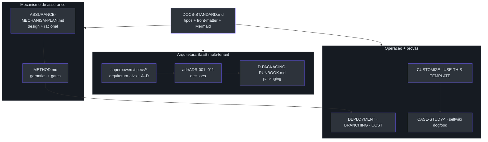

# Visão geral do conjunto de documentação

## Por que este conjunto existe

O diretório `docs/` **não** é um amontoado de notas: é uma base de documentação
versionada, tipada e revisada como código. A regra de fundo está escrita
explicitamente — *"Docs live in the repo, change in the same PR as the code they
describe, and are reviewed like code."*
([docs/DOCS-STANDARD.md:87-88](https://github.com/ruinosus/foundry-assured/blob/feature/saas-d-packaging/docs/DOCS-STANDARD.md#L87-L88)).
A consequência prática: cada fato tem **uma** fonte de verdade — *"One source of
truth per fact."*
([docs/DOCS-STANDARD.md:93-94](https://github.com/ruinosus/foundry-assured/blob/feature/saas-d-packaging/docs/DOCS-STANDARD.md#L93-L94)).

Esta página é o índice navegável do conjunto. Os documentos se dividem em **três
grandes blocos**: o **mecanismo de assurance** (o que o produto garante), a
**arquitetura SaaS multi-tenant** (para onde o produto evoluiu desde a v0.1.0), e os
**guias operacionais + estudos de caso** (como rodar, adaptar e provar).

> **Fato (lido em fonte).** O índice oficial dos docs vive em
> [docs/README.md:21-41](https://github.com/ruinosus/foundry-assured/blob/feature/saas-d-packaging/docs/README.md#L21-L41),
> uma tabela `Doc | Type | Audience | What it's for`. Esta página de wiki reflete esse
> índice e o expande com as novidades da era SaaS (ADRs 001–011, specs de sub-projetos,
> runbook de packaging, custo e branching).

## O conjunto em uma tabela

| Documento | Tipo (`type:`) | Audiência | Para quê | Fonte |
| --- | --- | --- | --- | --- |
| **METHOD.md** | reference | adopter | O mecanismo de assurance — garantias, gates e como rodar | [docs/README.md:23](https://github.com/ruinosus/foundry-assured/blob/feature/saas-d-packaging/docs/README.md#L23) |
| **DEPLOYMENT.md** | how-to | operator | Provisionamento ponta-a-ponta, do clone ao deploy | [docs/README.md:24](https://github.com/ruinosus/foundry-assured/blob/feature/saas-d-packaging/docs/README.md#L24) |
| **IDENTITY-AND-ACCESS-SETUP.md** | reference | operator | O mapa Entra ID — o que o azd/Bicep cria vs registros manuais | [docs/README.md:25](https://github.com/ruinosus/foundry-assured/blob/feature/saas-d-packaging/docs/README.md#L25) |
| **RBAC-AND-USER-MANAGEMENT-PLAN.md** | plan | contributor | App RBAC (Entra App Roles) + gestão de usuários in-portal | [docs/README.md:26](https://github.com/ruinosus/foundry-assured/blob/feature/saas-d-packaging/docs/README.md#L26) |
| **USE-THIS-TEMPLATE.md** | how-to | adopter | Criar seu próprio repo a partir deste template | [docs/README.md:27](https://github.com/ruinosus/foundry-assured/blob/feature/saas-d-packaging/docs/README.md#L27) |
| **CUSTOMIZE.md** | how-to | adopter | Trocar as quatro peças de domínio | [docs/README.md:28](https://github.com/ruinosus/foundry-assured/blob/feature/saas-d-packaging/docs/README.md#L28) |
| **RELEASE-AUTOMATION.md** | how-to | operator | Como um merge vira release versionada + deploy gateado | [docs/README.md:29](https://github.com/ruinosus/foundry-assured/blob/feature/saas-d-packaging/docs/README.md#L29) |
| **USE-CASE-WALKTHROUGH.md** | explanation | evaluator | Exemplo fictício do mecanismo inteiro ponta-a-ponta | [docs/README.md:30](https://github.com/ruinosus/foundry-assured/blob/feature/saas-d-packaging/docs/README.md#L30) |
| **CASE-STUDY-LLM-WIKI-LOOP.md** | explanation | evaluator | Estudo de caso medido: aterrar docs e eval na fonte | [docs/README.md:31](https://github.com/ruinosus/foundry-assured/blob/feature/saas-d-packaging/docs/README.md#L31) |
| **CASE-STUDY-SELFWIKI-DOGFOOD.md** | explanation | evaluator | Dogfood do mecanismo neste repo — dois bugs que ele achou em si | [docs/README.md:32](https://github.com/ruinosus/foundry-assured/blob/feature/saas-d-packaging/docs/README.md#L32) |
| **DOCS-STANDARD.md** | reference | contributor | Como os docs são tipados, estruturados e diagramados | [docs/README.md:39](https://github.com/ruinosus/foundry-assured/blob/feature/saas-d-packaging/docs/README.md#L39) |

*A tabela acima é o subconjunto v0.1.0. A era SaaS adiciona os ADRs, specs e runbooks
documentados nas páginas seguintes desta wiki.*

## O padrão por trás dos documentos (Diátaxis ↔ Microsoft Learn)

Todo `.md` sob `docs/` carrega um **tipo** que mapeia 1:1 entre o framework
[Diátaxis](https://diataxis.fr/) e o `ms.topic` do Microsoft Learn — a *necessidade do
leitor* escolhe o tipo
([docs/DOCS-STANDARD.md:15-27](https://github.com/ruinosus/foundry-assured/blob/feature/saas-d-packaging/docs/DOCS-STANDARD.md#L15-L27)).

| Tipo | `ms.topic` | O leitor está… | Fonte |
| --- | --- | --- | --- |
| `tutorial` | tutorial | aprendendo fazendo | [docs/DOCS-STANDARD.md:23](https://github.com/ruinosus/foundry-assured/blob/feature/saas-d-packaging/docs/DOCS-STANDARD.md#L23) |
| `how-to` | how-to | completando uma tarefa | [docs/DOCS-STANDARD.md:24](https://github.com/ruinosus/foundry-assured/blob/feature/saas-d-packaging/docs/DOCS-STANDARD.md#L24) |
| `reference` | reference | consultando algo | [docs/DOCS-STANDARD.md:25](https://github.com/ruinosus/foundry-assured/blob/feature/saas-d-packaging/docs/DOCS-STANDARD.md#L25) |
| `explanation` | conceptual | entendendo o *porquê* | [docs/DOCS-STANDARD.md:26](https://github.com/ruinosus/foundry-assured/blob/feature/saas-d-packaging/docs/DOCS-STANDARD.md#L26) |
| `plan` | conceptual | acompanhando trabalho planejado | [docs/DOCS-STANDARD.md:27](https://github.com/ruinosus/foundry-assured/blob/feature/saas-d-packaging/docs/DOCS-STANDARD.md#L27) |

Cada `.md` começa com um bloco YAML (front-matter) seguido por exatamente um `# H1` —
ambos, nessa ordem, como o Microsoft Learn exige
([docs/DOCS-STANDARD.md:32-46](https://github.com/ruinosus/foundry-assured/blob/feature/saas-d-packaging/docs/DOCS-STANDARD.md#L32-L46)).
**Exceção:** tudo sob `docs/wiki/` é a deep-wiki gerada por máquina (o domínio
`selfwiki`) e é **isento** da regra de front-matter + H1 — não é escrito à mão, é
regenerado
([docs/DOCS-STANDARD.md:51-54](https://github.com/ruinosus/foundry-assured/blob/feature/saas-d-packaging/docs/DOCS-STANDARD.md#L51-L54)).
Esta própria wiki é justamente esse conteúdo gerado.

## Como os blocos se conectam

<!-- Sources: docs/README.md:12-41, docs/DOCS-STANDARD.md:15-54 -->

A própria página inicial dos docs resume a tese em uma frase: **"Three domains, one
mechanism"** — o mesmo código de assurance dirige três domínios de conhecimento
swappable (helpdesk, cockpit, selfwiki), cada um com sua KB e ingest, e você implanta
qualquer subconjunto
([docs/README.md:12-17](https://github.com/ruinosus/foundry-assured/blob/feature/saas-d-packaging/docs/README.md#L12-L17)).

## O que mudou desde a v0.1.0

A v0.1.0 desta wiki documentou o conjunto pré-SaaS. A v0.2.0 (esta) reflete a evolução
para **SaaS multi-tenant híbrido**:

- **Specs SaaS** sob `docs/superpowers/specs/` — a arquitetura-alvo + os sub-projetos
  A/B/C/D-runtime/D-packaging (página [Arquitetura SaaS multi-tenant](./page-3.md)).
- **ADRs 001–011** sob `docs/adr/` — decisões de tenancy, identidade, segredos,
  entitlement por domínio e passthrough de Toolbox (página [Decisões de arquitetura](./page-4.md)).
- **Novos docs operacionais**: `D-PACKAGING-RUNBOOK.md`, `BRANCHING.md`, `COST.md`
  (página [Deploy, branching e custo](./page-6.md)).
- **METHOD.md** agora é multi-tenant-aware — as garantias passam a valer **por tenant**
  ([docs/METHOD.md:22-28](https://github.com/ruinosus/foundry-assured/blob/feature/saas-d-packaging/docs/METHOD.md#L22-L28)).

## Related Pages

| Página | Relação |
|------|-------------|
| [O mecanismo de assurance](./page-2.md) | O coração do produto — garantias e gates |
| [Arquitetura SaaS multi-tenant](./page-3.md) | Para onde o conjunto evoluiu |
| [Decisões de arquitetura (ADRs)](./page-4.md) | As decisões que sustentam a evolução |
| [Customização e expansão de domínio](./page-7.md) | Como adaptar o template |
