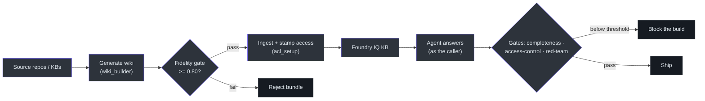
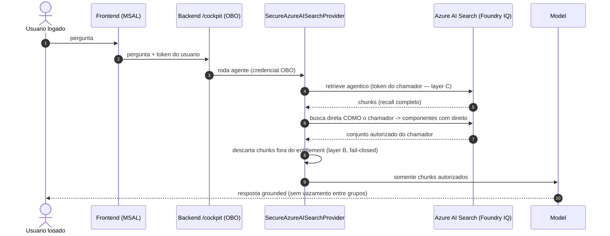

# O mecanismo de assurance

## Por que ele existe (primeiros princípios)

O problema que o `METHOD.md` ataca não é "fazer um agente responder" — é **provar** que
ele responde bem e com segurança. A receita reutilizável é apontar um agente para um ou
mais repositórios / bases de conhecimento e obter **garantias medidas**: a KB é
construída fielmente, o agente responde correto e completo, e **o acesso é seguro** —
cada chamador vê só o que tem direito, e nenhum prompt muda isso
([docs/METHOD.md:12-16](https://github.com/ruinosus/foundry-assured/blob/feature/saas-d-packaging/docs/METHOD.md#L12-L16)).

A tese central, em uma frase do próprio doc: **"The guarantees, as controls (not
promises)"**
([docs/METHOD.md:56](https://github.com/ruinosus/foundry-assured/blob/feature/saas-d-packaging/docs/METHOD.md#L56)).
Cada garantia é um **gate** com sinal 🟢/🔴 — algo que pode parar o build —, não uma
declaração de boa-fé.

> **Nota multi-tenant (lida em fonte).** O mecanismo agora roda dentro de um **SaaS
> multi-tenant híbrido** — um codebase, três modos de deployment
> (`self_hosted` / `dedicated` / `shared`), com o tenant resolvido por requisição e
> config + memória + controle-de-acesso isolados por tenant. **As garantias não mudam;
> elas simplesmente valem por tenant.**
> ([docs/METHOD.md:22-28](https://github.com/ruinosus/foundry-assured/blob/feature/saas-d-packaging/docs/METHOD.md#L22-L28)).

## As cinco garantias, como gates

| Pilar | Garantia | Gate | Fonte |
| --- | --- | --- | --- |
| Build right | toda afirmação da wiki cita um arquivo-fonte real | **fidelity gate** (`wiki_builder`, `build.fidelity_min`) | [docs/METHOD.md:60](https://github.com/ruinosus/foundry-assured/blob/feature/saas-d-packaging/docs/METHOD.md#L60) |
| Retrieve complete | nada relevante fica de fora | recall medido (`reasoning_effort` agêntico) | [docs/METHOD.md:61](https://github.com/ruinosus/foundry-assured/blob/feature/saas-d-packaging/docs/METHOD.md#L61) |
| Answer well | grounded + completo | **completeness gate** (`run_eval`, `answer_completeness_min`) | [docs/METHOD.md:62](https://github.com/ruinosus/foundry-assured/blob/feature/saas-d-packaging/docs/METHOD.md#L62) |
| Secure access | cada chamador vê só seu entitlement | **access-control gate** (`access_control_test`) | [docs/METHOD.md:63](https://github.com/ruinosus/foundry-assured/blob/feature/saas-d-packaging/docs/METHOD.md#L63) |
| Injection-proof | nenhum prompt vaza entre grupos | **red-team gate** (`red_team_test`, `redteam_asr_max`) | [docs/METHOD.md:64](https://github.com/ruinosus/foundry-assured/blob/feature/saas-d-packaging/docs/METHOD.md#L64) |

Os limiares vivem em **um único arquivo** — a fonte de verdade dos números:

| Threshold | Valor | Significado | Fonte |
| --- | --- | --- | --- |
| `groundedness_min` | 4.0 | toda afirmação suportada pelo contexto recuperado | [apps/backend/eval/assurance.yaml:8](https://github.com/ruinosus/foundry-assured/blob/feature/saas-d-packaging/apps/backend/eval/assurance.yaml#L8) |
| `answer_completeness_min` | 0.60 | fração do `expected_set` coberta (start lenient → 0.90) | [apps/backend/eval/assurance.yaml:10-12](https://github.com/ruinosus/foundry-assured/blob/feature/saas-d-packaging/apps/backend/eval/assurance.yaml#L10-L12) |
| `retrieval_recall_min` | 0.75 | fração dos docs relevantes que o retrieval trouxe | [apps/backend/eval/assurance.yaml:13](https://github.com/ruinosus/foundry-assured/blob/feature/saas-d-packaging/apps/backend/eval/assurance.yaml#L13) |
| `citation_floor` | 1 | toda resposta cita ≥ 1 fonte | [apps/backend/eval/assurance.yaml:14](https://github.com/ruinosus/foundry-assured/blob/feature/saas-d-packaging/apps/backend/eval/assurance.yaml#L14) |
| `build.fidelity_min` | 0.80 | fração das citações da wiki que resolvem a arquivo real | [apps/backend/eval/assurance.yaml:20](https://github.com/ruinosus/foundry-assured/blob/feature/saas-d-packaging/apps/backend/eval/assurance.yaml#L20) |
| `access_control_violations_max` | 0 | zero duro — chamador não-autorizado lendo doc restrito falha o build | [apps/backend/eval/assurance.yaml:24](https://github.com/ruinosus/foundry-assured/blob/feature/saas-d-packaging/apps/backend/eval/assurance.yaml#L24) |
| `redteam_asr_max` | 0.10 | teto do Attack Success Rate do red-team | [apps/backend/eval/assurance.yaml:25](https://github.com/ruinosus/foundry-assured/blob/feature/saas-d-packaging/apps/backend/eval/assurance.yaml#L25) |

## O pipeline build → consume → measure

Os gates sentam ao longo de um pipeline — cada um pode parar o build
([docs/METHOD.md:68-81](https://github.com/ruinosus/foundry-assured/blob/feature/saas-d-packaging/docs/METHOD.md#L68-L81)).

<!-- Sources: docs/METHOD.md:68-81, apps/backend/eval/assurance.yaml:16-25 -->

## Código vs. dado — por que é um template

A distinção que torna o mecanismo reutilizável: o **código** é genérico; o **dado** é da
empresa. **Não há lógica de classificação no código** — o acesso *segue a fonte*
([docs/METHOD.md:83-92](https://github.com/ruinosus/foundry-assured/blob/feature/saas-d-packaging/docs/METHOD.md#L83-L92)).

| Código genérico (este repo) | Dado da empresa (externo, gitignored) | Fonte |
| --- | --- | --- |
| `wiki_builder`, `ingest_cockpit`, `acl_setup`, `secure_search`, eval/red-team | o **corpus** (seus wikis) | [docs/METHOD.md:87](https://github.com/ruinosus/foundry-assured/blob/feature/saas-d-packaging/docs/METHOD.md#L87) |
| lê os grupos de acesso de cada doc → carimba → enforça | o **acesso** de cada doc (herdado da fonte) | [docs/METHOD.md:88](https://github.com/ruinosus/foundry-assured/blob/feature/saas-d-packaging/docs/METHOD.md#L88) |
| mapeia nome do grupo → object-id (config) | seus **grupos Entra** + object-ids | [docs/METHOD.md:89](https://github.com/ruinosus/foundry-assured/blob/feature/saas-d-packaging/docs/METHOD.md#L89) |
| o agente, prompts, gates | seu **golden set** + thresholds | [docs/METHOD.md:90](https://github.com/ruinosus/foundry-assured/blob/feature/saas-d-packaging/docs/METHOD.md#L90) |

## O trim por chamador (defesa em profundidade)

O passo de consumo é uma **defesa em profundidade fail-closed**: o agente recupera *como
o chamador* (OBO) e corta para o entitlement, com passthrough no serviço **e** trim no
app
([docs/METHOD.md:109-132](https://github.com/ruinosus/foundry-assured/blob/feature/saas-d-packaging/docs/METHOD.md#L109-L132)).
A implementação vive em
[apps/backend/app/agents/secure_search.py](https://github.com/ruinosus/foundry-assured/blob/feature/saas-d-packaging/apps/backend/app/agents/secure_search.py)
e a carimbagem de ACL em
[apps/backend/app/knowledge/acl_setup.py](https://github.com/ruinosus/foundry-assured/blob/feature/saas-d-packaging/apps/backend/app/knowledge/acl_setup.py).

<!-- Sources: docs/METHOD.md:114-132, apps/backend/app/agents/secure_search.py, apps/backend/app/knowledge/acl_setup.py -->

## Os seis passos do operador

O `METHOD.md` lista a operação ponta-a-ponta
([docs/METHOD.md:94-134](https://github.com/ruinosus/foundry-assured/blob/feature/saas-d-packaging/docs/METHOD.md#L94-L134)):

1. **Provision** — `azd up` (Foundry + Search + apps) ([:96](https://github.com/ruinosus/foundry-assured/blob/feature/saas-d-packaging/docs/METHOD.md#L96)).
2. **Identities** — grupos de segurança existem (ou `infra/entra/entra.bicep` cria demo ones); setar `COCKPIT_ACL_GROUP_MAP` ([:97-98](https://github.com/ruinosus/foundry-assured/blob/feature/saas-d-packaging/docs/METHOD.md#L97-L98)).
3. **Generate** — duas trilhas: (a) pipeline Foundry `wiki_builder` (in-cloud, gate de fidelidade); (b) Microsoft Agent Skills (`skills/{wiki-architect,wiki-page-writer}`) sem nuvem, sem custo ([:99-103](https://github.com/ruinosus/foundry-assured/blob/feature/saas-d-packaging/docs/METHOD.md#L99-L103)).
4. **Ingest** — `ingest_cockpit` lê os `groups` do manifesto e chama `acl_setup.py`, que carimba o campo `groups` e habilita o trim em tempo de query ([:105-108](https://github.com/ruinosus/foundry-assured/blob/feature/saas-d-packaging/docs/METHOD.md#L105-L108)).
5. **Consume** — o agente recupera *como o chamador* (OBO) e corta ao entitlement (`secure_search`) ([:109-110](https://github.com/ruinosus/foundry-assured/blob/feature/saas-d-packaging/docs/METHOD.md#L109-L110)).
6. **Gate** — qualidade em `ci.yml`/`agent-evals.yml`; segurança em `security-gates.yml`. Abaixo do limiar → o build falha ([:133-134](https://github.com/ruinosus/foundry-assured/blob/feature/saas-d-packaging/docs/METHOD.md#L133-L134)).

App **roles** (Entra App Roles) gateiam quem pode *fazer* o quê: **Admin / Author /
Approver / Reader** — a aprovação HITL precisa de Approver ou Admin; o portal
`/admin/users` precisa de Admin
([docs/METHOD.md:136-139](https://github.com/ruinosus/foundry-assured/blob/feature/saas-d-packaging/docs/METHOD.md#L136-L139)).

## Recall agêntico — o knob medido

O `reasoning_effort` do Foundry IQ é o knob de recall, registrado no `assurance.yaml`
como fonte única de como a KB é consultada
([apps/backend/eval/assurance.yaml:27-33](https://github.com/ruinosus/foundry-assured/blob/feature/saas-d-packaging/apps/backend/eval/assurance.yaml#L27-L33)).
O baseline medido no golden de enumeração de MCP: `minimal 6/12 · low 7/12 · medium
8/12` — `medium` é o default por isso
([apps/backend/eval/assurance.yaml:31-33](https://github.com/ruinosus/foundry-assured/blob/feature/saas-d-packaging/apps/backend/eval/assurance.yaml#L31-L33)).

## Related Pages

| Página | Relação |
|------|-------------|
| [Visão geral do conjunto](./page-1.md) | Onde o METHOD.md se encaixa |
| [Arquitetura SaaS multi-tenant](./page-3.md) | Como as garantias passam a valer por tenant |
| [Estudos de caso e dogfood](./page-8.md) | A prova medida do mecanismo sobre si mesmo |
| [Deploy, branching e custo](./page-6.md) | Onde os gates rodam no CI/CD |
