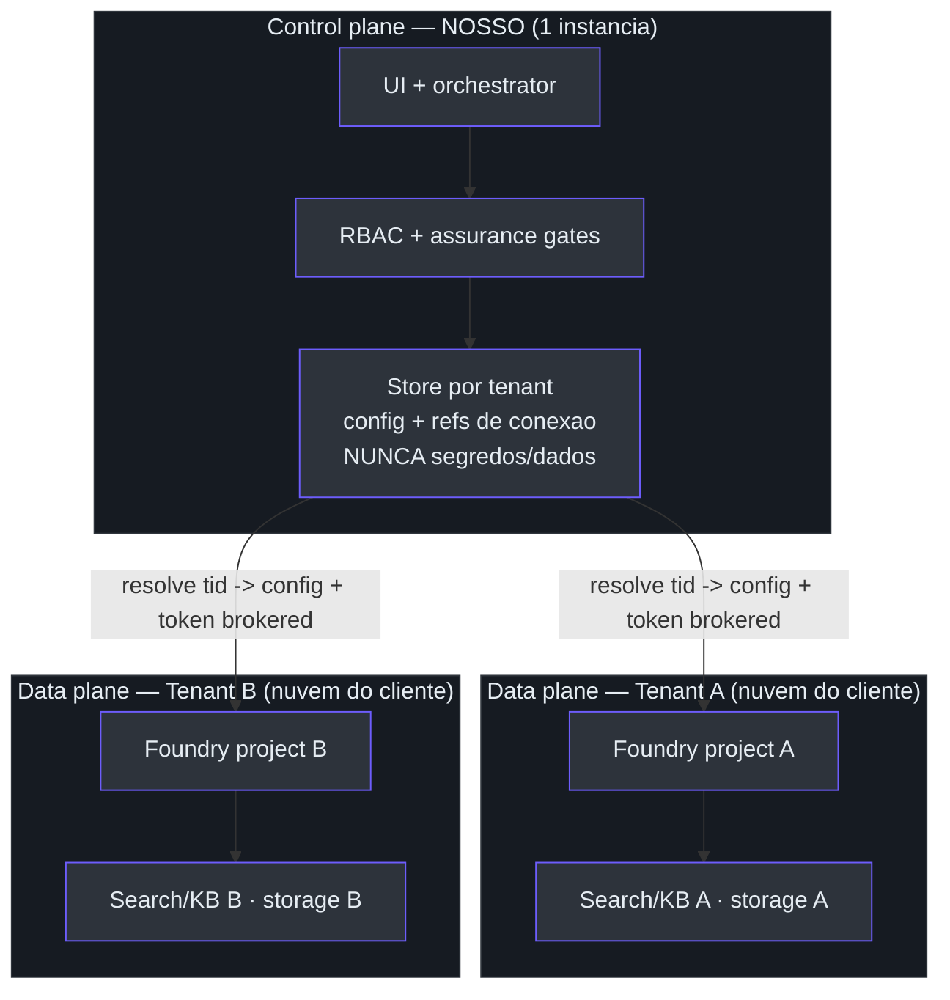
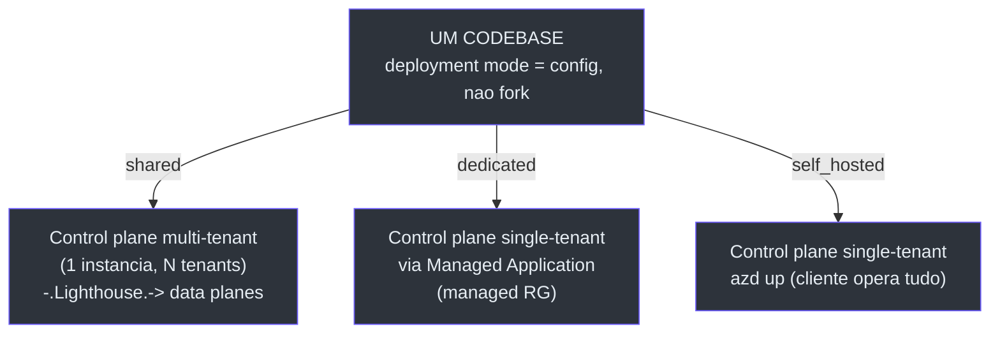
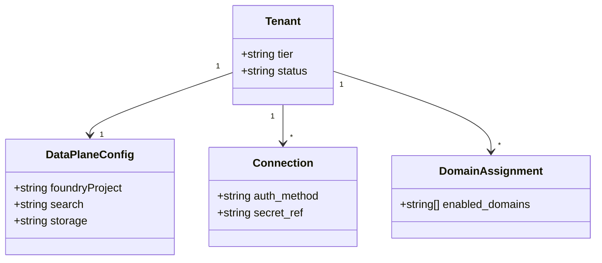

# Arquitetura SaaS multi-tenant

## A evolução, em uma frase

A spec de arquitetura-alvo descreve a transformação do Foundry Assured de um produto
**single-tenant self-hosted** (o cliente provisiona seu próprio Azure via `azd`) em um
**SaaS multi-tenant híbrido** onde **nós somos o orchestrator / control plane** e **todo
dado, compute e credencial fica na nuvem do cliente (BYO)**. Os modelos self-hosted e
managed **coexistem em um codebase — sem fork**
([docs/superpowers/specs/2026-06-29-saas-target-architecture-design.md:20-25](https://github.com/ruinosus/foundry-assured/blob/feature/saas-d-packaging/docs/superpowers/specs/2026-06-29-saas-target-architecture-design.md#L20-L25)).

> **Fato vs. inferência.** O documento é um **design `status: draft`**
> ([…design.md:4-6](https://github.com/ruinosus/foundry-assured/blob/feature/saas-d-packaging/docs/superpowers/specs/2026-06-29-saas-target-architecture-design.md#L4-L6)) —
> a arquitetura-alvo, não a implementação completa. Cada sub-projeto A–D tem sua própria
> spec → plan → build. As decisões são gravadas como ADRs 001–011 (ver
> [Decisões de arquitetura](./page-4.md)).

## 1. Control plane × data plane

A divisão de fundo: **nós operamos o control plane** (UI + orchestrator + RBAC + gates
de assurance); todo dado, compute, segredo e conexão vive no **data plane** do cliente. O
store do control plane guarda **config por tenant + metadados de conexão apenas — nunca
segredos, nunca dado do cliente**. Em runtime, resolvemos o tenant do claim `tid` do
token, carregamos a config daquele tenant, cunhamos um token brokered (OBO /
passthrough), e chamamos **o data plane do próprio cliente**. A fronteira natural de
isolamento é o **Foundry project** do cliente
([…design.md:39-44](https://github.com/ruinosus/foundry-assured/blob/feature/saas-d-packaging/docs/superpowers/specs/2026-06-29-saas-target-architecture-design.md#L39-L44)).

<!-- Sources: docs/superpowers/specs/2026-06-29-saas-target-architecture-design.md:39-44, docs/diagrams/saas/01-control-plane-vs-data-plane.mmd -->

## 2. Identidade & fluxo de credencial

| Fase | Mecanismo | Onde a credencial fica | Fonte |
| --- | --- | --- | --- |
| Onboarding (1x/tenant) | admin-consent → service principal + delegação Lighthouse | só config + refs no store | [design.md:52-54](https://github.com/ruinosus/foundry-assured/blob/feature/saas-d-packaging/docs/superpowers/specs/2026-06-29-saas-target-architecture-design.md#L52-L54) |
| Runtime, audiência Microsoft (Foundry, ADO) | **OBO** — agimos como o usuário, sem passo extra | nenhum segredo armazenado | [design.md:55-57](https://github.com/ruinosus/foundry-assured/blob/feature/saas-d-packaging/docs/superpowers/specs/2026-06-29-saas-target-architecture-design.md#L55-L57) |
| Runtime, terceiros (GitHub) | **OAuth identity passthrough** — consent por usuário | token no Foundry Agent Service do cliente | [design.md:58-61](https://github.com/ruinosus/foundry-assured/blob/feature/saas-d-packaging/docs/superpowers/specs/2026-06-29-saas-target-architecture-design.md#L58-L61) |
| Segredos em repouso | Key Vault / CMK do cliente, via `secret_ref` | Key Vault do cliente | [design.md:62-63](https://github.com/ruinosus/foundry-assured/blob/feature/saas-d-packaging/docs/superpowers/specs/2026-06-29-saas-target-architecture-design.md#L62-L63) |

O caminho OBO **é o `app/core/auth.py` de hoje, tornado multi-tenant**
([design.md:55-57](https://github.com/ruinosus/foundry-assured/blob/feature/saas-d-packaging/docs/superpowers/specs/2026-06-29-saas-target-architecture-design.md#L55-L57));
implementação atual em
[apps/backend/app/core/auth.py](https://github.com/ruinosus/foundry-assured/blob/feature/saas-d-packaging/apps/backend/app/core/auth.py).

## 3. Três deployment stamps — um codebase, três modos

O mesmo código roda em três configurações, diferindo só em **onde o control plane roda**
e **quantos tenants ele serve**
([design.md:71-78](https://github.com/ruinosus/foundry-assured/blob/feature/saas-d-packaging/docs/superpowers/specs/2026-06-29-saas-target-architecture-design.md#L71-L78)).

| Modo | Tenancy | Onde | Veículo | Fonte |
| --- | --- | --- | --- | --- |
| **self-hosted** (hoje) | 1 | nuvem do cliente, cliente opera | `azd up` | [design.md:76](https://github.com/ruinosus/foundry-assured/blob/feature/saas-d-packaging/docs/superpowers/specs/2026-06-29-saas-target-architecture-design.md#L76) |
| **dedicated** (enterprise) | 1 | nuvem do cliente, nós operamos | Azure **Managed Application** | [design.md:77](https://github.com/ruinosus/foundry-assured/blob/feature/saas-d-packaging/docs/superpowers/specs/2026-06-29-saas-target-architecture-design.md#L77) |
| **shared** (SMB/default) | N | nossa nuvem | control plane multi-tenant + **Lighthouse** | [design.md:78](https://github.com/ruinosus/foundry-assured/blob/feature/saas-d-packaging/docs/superpowers/specs/2026-06-29-saas-target-architecture-design.md#L78) |

O **único ponto de variação** é a **costura de resolução de config**: um
`TenantConfigProvider` com impl `SingleTenant` (self-hosted/dedicated — o `settings`
global de hoje) e impl `MultiTenant` (shared — resolve por `tid`). **Todo o resto é
idêntico entre modos**
([design.md:80-83](https://github.com/ruinosus/foundry-assured/blob/feature/saas-d-packaging/docs/superpowers/specs/2026-06-29-saas-target-architecture-design.md#L80-L83)).
O diagrama-fonte:
[docs/diagrams/saas/03-deployment-stamps.mmd](https://github.com/ruinosus/foundry-assured/blob/feature/saas-d-packaging/docs/diagrams/saas/03-deployment-stamps.mmd).

<!-- Sources: docs/superpowers/specs/2026-06-29-saas-target-architecture-design.md:71-83, docs/diagrams/saas/03-deployment-stamps.mmd:1-37 -->

O modo é selecionado por um env `DEPLOYMENT_MODE` (default `self_hosted`) que escolhe a
impl do provider no boot — ver
[ADR-007](./page-4.md#adr-007-coexistencia)
([design.md:80-83](https://github.com/ruinosus/foundry-assured/blob/feature/saas-d-packaging/docs/superpowers/specs/2026-06-29-saas-target-architecture-design.md#L80-L83)).

## 4. Isolamento por tenant — as três costuras que mudam

O store do control plane guarda, por tenant: um `Tenant` (tier/status), um
`DataPlaneConfig` (ponteiros para Foundry/Search/storage do cliente), `Connection`s
(cada uma com `auth_method` + `secret_ref` que **nunca** é o segredo), e
`DomainAssignment`s (quais agentes habilitados)
([design.md:91-94](https://github.com/ruinosus/foundry-assured/blob/feature/saas-d-packaging/docs/superpowers/specs/2026-06-29-saas-target-architecture-design.md#L91-L94)).
Só **três costuras** mudam no código de hoje; o resto fica intocado:

| Hoje (single-tenant) | Alvo (multi-tenant) | Fonte |
| --- | --- | --- |
| `settings = Settings()` global | `TenantConfigProvider.current()` → config do tenant atual | [design.md:97](https://github.com/ruinosus/foundry-assured/blob/feature/saas-d-packaging/docs/superpowers/specs/2026-06-29-saas-target-architecture-design.md#L97) |
| `memory_scope()` = `user.oid` | `f"{tid}:{user.oid}"` (namespace por tenant) | [design.md:98](https://github.com/ruinosus/foundry-assured/blob/feature/saas-d-packaging/docs/superpowers/specs/2026-06-29-saas-target-architecture-design.md#L98) |
| MCP `SERVERS` estático no código | registry estático = catálogo/forma; conexões habilitadas vêm do store por tenant | [design.md:99-100](https://github.com/ruinosus/foundry-assured/blob/feature/saas-d-packaging/docs/superpowers/specs/2026-06-29-saas-target-architecture-design.md#L99-L100) |

<!-- Sources: docs/superpowers/specs/2026-06-29-saas-target-architecture-design.md:91-100 -->

A isolação de dados é **largamente automática** (o dado vive na nuvem do cliente; o
agente chama *o Foundry deles* com o token brokered); o que *nós* isolamos é a config por
tenant + o contexto da requisição em voo, enforçado em **um único choke point de
tenant-scoping**
([design.md:102-104](https://github.com/ruinosus/foundry-assured/blob/feature/saas-d-packaging/docs/superpowers/specs/2026-06-29-saas-target-architecture-design.md#L102-L104)).
A guarda de memória é deliberadamente assimétrica: `SingleTenant` mantém o `user.oid`
**sem prefixo**; só `MultiTenant` prefixa por `tid`, porque chaves de memória são *estado
persistido* — um prefixo silencioso no self-hosted orfanaria memórias existentes
([design.md:118-121](https://github.com/ruinosus/foundry-assured/blob/feature/saas-d-packaging/docs/superpowers/specs/2026-06-29-saas-target-architecture-design.md#L118-L121)).

## 5. Os quatro sub-projetos (A–D)

| Sub-projeto | Foco | Depende de | Fonte |
| --- | --- | --- | --- |
| **A — Multi-tenant foundation** (a espinha) | `TenantConfigProvider` + `DEPLOYMENT_MODE`, Entra multi-tenant, `tid`, store + `memory_scope`; de-risk com `SingleTenant` (zero mudança de comportamento) | — | [design.md:114-123](https://github.com/ruinosus/foundry-assured/blob/feature/saas-d-packaging/docs/superpowers/specs/2026-06-29-saas-target-architecture-design.md#L114-L123) |
| **B — Connection store + UI** | refs a Foundry connections / Key Vault, `TenantStore` (Table Storage → App Configuration) | A | [design.md:124-131](https://github.com/ruinosus/foundry-assured/blob/feature/saas-d-packaging/docs/superpowers/specs/2026-06-29-saas-target-architecture-design.md#L124-L131) |
| **C — Credential brokering** | OBO multi-tenant + OAuth passthrough + resolução de `secret_ref` | B | [design.md:132-133](https://github.com/ruinosus/foundry-assured/blob/feature/saas-d-packaging/docs/superpowers/specs/2026-06-29-saas-target-architecture-design.md#L132-L133) |
| **D — Stamps / packaging** | Managed Application + onboarding Lighthouse | paralelo a B/C | [design.md:134-135](https://github.com/ruinosus/foundry-assured/blob/feature/saas-d-packaging/docs/superpowers/specs/2026-06-29-saas-target-architecture-design.md#L134-L135) |

Convergência: dedicated/self-hosted precisa só de **A→B→C**; o modo shared precisa de
**C ∩ D** (OBO multi-tenant brokerado sobre uma subscription delegada via Lighthouse que
o D provisiona)
([design.md:137-140](https://github.com/ruinosus/foundry-assured/blob/feature/saas-d-packaging/docs/superpowers/specs/2026-06-29-saas-target-architecture-design.md#L137-L140)).
As specs e plans de cada um estão documentados em
[Sub-projetos e D-packaging](./page-5.md). Os plans vivem em
[docs/superpowers/plans/](https://github.com/ruinosus/foundry-assured/blob/feature/saas-d-packaging/docs/superpowers/plans/2026-06-29-subproject-a-multitenant-foundation.md).

## Regras fail-closed do controle de acesso

A spec é explícita: tenant não onboarded / config faltando → **nunca cair para outro
tenant**; vazamento cross-tenant → queries tenant-scoped forçadas em **um** choke point
(auditável)
([design.md:142-146](https://github.com/ruinosus/foundry-assured/blob/feature/saas-d-packaging/docs/superpowers/specs/2026-06-29-saas-target-architecture-design.md#L142-L146)).

## Related Pages

| Página | Relação |
|------|-------------|
| [Decisões de arquitetura (ADRs)](./page-4.md) | As 11 decisões que esta arquitetura grava |
| [Sub-projetos e D-packaging](./page-5.md) | As specs/plans + runbook de cada sub-projeto |
| [O mecanismo de assurance](./page-2.md) | As garantias que passam a valer por tenant |
| [Deploy, branching e custo](./page-6.md) | Como os modos se mapeiam a ambientes |
