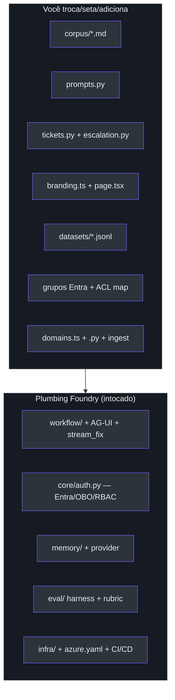
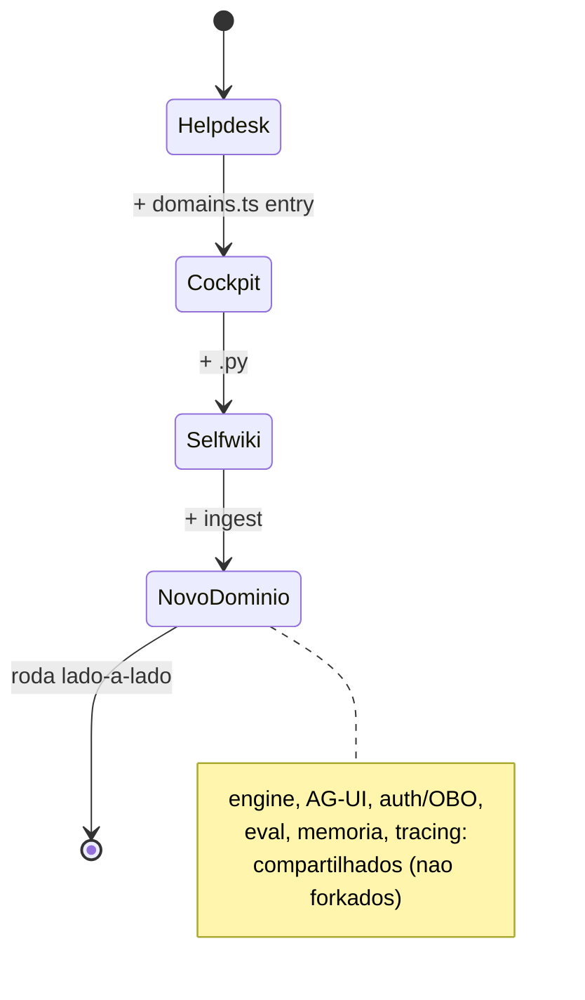

# Customização e expansão de domínio

## O padrão, não só um helpdesk

O `CUSTOMIZE.md` cristaliza a tese: este projeto é um **padrão** —
**ask → ground → resolve → escalate** —, não só um helpdesk. Um dev pergunta, o sistema
aterra a resposta numa KB e escala para uma ação aprovada por humano quando responder não
basta. Essa forma serve quase qualquer assistente interno — RH onboarding, Q&A jurídico,
finance ops, customer success
([docs/CUSTOMIZE.md:11-19](https://github.com/ruinosus/foundry-assured/blob/feature/saas-d-packaging/docs/CUSTOMIZE.md#L11-L19)).

Trocar o domínio é mudar **quatro coisas** (mais data-only e add); todo o resto — workflow
multi-agente, AG-UI streaming, Entra auth/OBO, eval harness, memória, tracing, pipeline de
deploy — é **plumbing Foundry reutilizável que você mantém como está**
([docs/CUSTOMIZE.md:17-19](https://github.com/ruinosus/foundry-assured/blob/feature/saas-d-packaging/docs/CUSTOMIZE.md#L17-L19)).

## Os pontos de troca

| # | Swap point | Onde | Tipo | Fonte |
| - | --- | --- | --- | --- |
| 1 | **Knowledge corpus** | `apps/backend/app/knowledge/corpus/*.md` | drop-in | [CUSTOMIZE.md:23](https://github.com/ruinosus/foundry-assured/blob/feature/saas-d-packaging/docs/CUSTOMIZE.md#L23) |
| 2 | **Agent prompts** | `apps/backend/app/agents/prompts.py` | rewrite | [CUSTOMIZE.md:24](https://github.com/ruinosus/foundry-assured/blob/feature/saas-d-packaging/docs/CUSTOMIZE.md#L24) |
| 3 | **A ação** (ticket → sua) | `app/tools/`, `workflow/escalation.py`, a convenção `TICKET:` | rewrite | [CUSTOMIZE.md:25](https://github.com/ruinosus/foundry-assured/blob/feature/saas-d-packaging/docs/CUSTOMIZE.md#L25) |
| 4 | **Identidade / labels** | `apps/frontend/lib/branding.ts`, `app/page.tsx` | set | [CUSTOMIZE.md:26](https://github.com/ruinosus/foundry-assured/blob/feature/saas-d-packaging/docs/CUSTOMIZE.md#L26) |
| 5 | **Eval datasets** | `apps/backend/eval/datasets/*.jsonl` | set (data) | [CUSTOMIZE.md:27](https://github.com/ruinosus/foundry-assured/blob/feature/saas-d-packaging/docs/CUSTOMIZE.md#L27) |
| 6 | **Acesso** (quem vê cada doc) | grupos Entra + `COCKPIT_ACL_GROUP_MAP`; read groups no manifesto | set (data) | [CUSTOMIZE.md:28](https://github.com/ruinosus/foundry-assured/blob/feature/saas-d-packaging/docs/CUSTOMIZE.md#L28) |
| 7 | **Um domínio inteiro novo** | `apps/frontend/lib/domains.ts` + `app/agents/<domain>.py` + ingest | add | [CUSTOMIZE.md:29](https://github.com/ruinosus/foundry-assured/blob/feature/saas-d-packaging/docs/CUSTOMIZE.md#L29) |

Regra de bolso: **#1, #4, #5, #6 você seta; #2 e #3 você reescreve; #7 você adiciona**. O
eval *harness*, o mecanismo de ACL e os security gates nunca mudam — acesso é **dado**, não
código
([docs/CUSTOMIZE.md:31-34](https://github.com/ruinosus/foundry-assured/blob/feature/saas-d-packaging/docs/CUSTOMIZE.md#L31-L34)).

<!-- Sources: docs/CUSTOMIZE.md:21-34, docs/CUSTOMIZE.md:199-214 -->

## Os invariantes que não se quebram

Ao reescrever os prompts (`prompts.py`, o "cérebro"), dois invariantes mantêm os outros
pilares
([docs/CUSTOMIZE.md:62-82](https://github.com/ruinosus/foundry-assured/blob/feature/saas-d-packaging/docs/CUSTOMIZE.md#L62-L82)):

- **RETRIEVE** deve emitir `NO_MATCH` quando nada é achado, e **RESOLVE** deve *recusar*
  ("não sei") em vez de inventar — o eval de grounding depende disso
  ([CUSTOMIZE.md:73-77](https://github.com/ruinosus/foundry-assured/blob/feature/saas-d-packaging/docs/CUSTOMIZE.md#L73-L77)).
- **RESOLVE** deve emitir a linha única **`TICKET: 
`** quando uma ação é
  necessária — o contrato que o passo de escalation escuta
  ([CUSTOMIZE.md:78-80](https://github.com/ruinosus/foundry-assured/blob/feature/saas-d-packaging/docs/CUSTOMIZE.md#L78-L80)).

> ⚠️ O **hosted agent** (`apps/hosted-agent/main.py`) é self-contained e não importa
> `prompts.py` — ele espelha os prompts inline; se usar o caminho hosted, mantenha os dois
> em sync
> ([CUSTOMIZE.md:80-82](https://github.com/ruinosus/foundry-assured/blob/feature/saas-d-packaging/docs/CUSTOMIZE.md#L80-L82)).

## A ação, como contrato

O fluxo da ação de escalation é um contrato textual: RESOLVE emite `"TICKET: 
"` →
o `EscalationExecutor` em
[apps/backend/app/workflow/escalation.py](https://github.com/ruinosus/foundry-assured/blob/feature/saas-d-packaging/apps/backend/app/workflow/escalation.py)
detecta → `request_info` (aprovação humana) → na aprovação,
[apps/backend/app/tools/tickets.py](https://github.com/ruinosus/foundry-assured/blob/feature/saas-d-packaging/apps/backend/app/tools/tickets.py)
`create_ticket()` persiste e retorna
([docs/CUSTOMIZE.md:88-94](https://github.com/ruinosus/foundry-assured/blob/feature/saas-d-packaging/docs/CUSTOMIZE.md#L88-L94)).
Para Q&A puro, remove-se o nó `escalate` do chain em
[apps/backend/app/workflow/graph.py](https://github.com/ruinosus/foundry-assured/blob/feature/saas-d-packaging/apps/backend/app/workflow/graph.py)
([CUSTOMIZE.md:109-111](https://github.com/ruinosus/foundry-assured/blob/feature/saas-d-packaging/docs/CUSTOMIZE.md#L109-L111)).

## Adicionar um domínio inteiro — três adições

Os pontos #1–#6 *substituem* o helpdesk. Para **adicionar** outro assistente ao lado — o
showcase já traz três (helpdesk, cockpit, selfwiki) — os domínios são **config-driven**.
Adicionar um são **três adições, sem mudar o engine**
([docs/CUSTOMIZE.md:163-177](https://github.com/ruinosus/foundry-assured/blob/feature/saas-d-packaging/docs/CUSTOMIZE.md#L163-L177)):

1. **Frontend** — uma entrada em
   [apps/frontend/lib/domains.ts](https://github.com/ruinosus/foundry-assured/blob/feature/saas-d-packaging/apps/frontend/lib/domains.ts)
   (id, label, path do agente backend, branding).
2. **Backend agent** — `apps/backend/app/agents/<domain>.py` espelhando
   [apps/backend/app/agents/selfwiki.py](https://github.com/ruinosus/foundry-assured/blob/feature/saas-d-packaging/apps/backend/app/agents/selfwiki.py).
3. **Ingest** — aponta o ingest da KB daquele domínio ao seu corpus.

<!-- Sources: docs/CUSTOMIZE.md:163-177, apps/frontend/lib/domains.ts, apps/backend/app/agents/selfwiki.py -->

A entitlement de domínio por tenant (qual domínio cada tenant pode usar) é codificada como
**license entitlement** — ver [ADR-010](./page-4.md). No SaaS, `enabled_domains` no
registro do tenant + a guarda `require_domain` fail-closed governam isso, não o
`domains.ts` sozinho.

## O que você NÃO toca

O plumbing reutilizável — o valor herdado: `app/workflow/`, `app/core/auth.py` (Entra
sign-in, OBO, memory scoping, **incluindo o RBAC** App Roles + `/admin/users`),
`app/memory/`, o `eval/` harness, `infra/` + `azure.yaml` + `.github/workflows/`, e o shell
do frontend com o toggle **Live ⇄ Hosted**
([docs/CUSTOMIZE.md:199-214](https://github.com/ruinosus/foundry-assured/blob/feature/saas-d-packaging/docs/CUSTOMIZE.md#L199-L214)).

## Corpus em PDF/Office?

Converte para Markdown primeiro com Microsoft **MarkItDown** — há um helper
`./scripts/to-markdown.sh -o apps/backend/app/knowledge/corpus *.pdf` (PDF, Office, HTML,
imagens via OCR)
([docs/CUSTOMIZE.md:42-45](https://github.com/ruinosus/foundry-assured/blob/feature/saas-d-packaging/docs/CUSTOMIZE.md#L42-L45)).

## Related Pages

| Página | Relação |
|------|-------------|
| [O mecanismo de assurance](./page-2.md) | O split código-vs-dado que torna isto um template |
| [Decisões de arquitetura (ADRs)](./page-4.md) | ADR-010 — entitlement de domínio por tenant |
| [Estudos de caso e dogfood](./page-8.md) | O selfwiki como prova de que o domínio é configurável |
