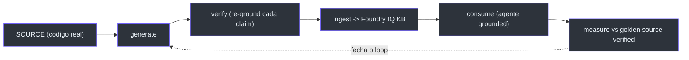
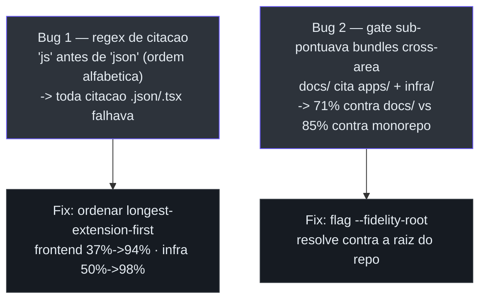

# Estudos de caso e dogfood

Os estudos de caso são onde o conjunto sai do plano e mostra **números**. Dois documentos
`explanation` carregam o peso: o **loop LLM-wiki** (por que docs e eval precisam ser
aterrados na fonte) e o **dogfood selfwiki** (o mecanismo virado sobre o próprio repo).

## Caso 1 — O loop LLM-wiki source-grounded

A tese: para aterrar um agente num codebase multi-repo grande, *tanto* a documentação que
ele recupera *quanto* a avaliação que o julga precisam ser **verificadas contra a fonte** —
um resumo de LLM não basta. Um loop **generate → verify → ingest → consume**, medido
contra um golden source-verified, produz respostas mensuravelmente mais fiéis
([docs/CASE-STUDY-LLM-WIKI-LOOP.md:12-17](https://github.com/ruinosus/foundry-assured/blob/feature/saas-d-packaging/docs/CASE-STUDY-LLM-WIKI-LOOP.md#L12-L17)).


<!-- Sources: docs/CASE-STUDY-LLM-WIKI-LOOP.md:33-41 -->

A evidência: num golden de 20 perguntas, o score subiu **12 → 16 → 17/20** — e *por que*
subiu é o achado
([CASE-STUDY-LLM-WIKI-LOOP.md:55-64](https://github.com/ruinosus/foundry-assured/blob/feature/saas-d-packaging/docs/CASE-STUDY-LLM-WIKI-LOOP.md#L55-L64)):

| Passo | O que mudou | Score | Fonte |
| --- | --- | --- | --- |
| Baseline | docs LLM-summarized + golden LLM-authored | 12/20 | [LLM-WIKI-LOOP.md:62](https://github.com/ruinosus/foundry-assured/blob/feature/saas-d-packaging/docs/CASE-STUDY-LLM-WIKI-LOOP.md#L62) |
| Source-verify o **golden** | ~5 "falhas" eram **bugs do golden** (o agente estava certo) | 16/20 | [LLM-WIKI-LOOP.md:63](https://github.com/ruinosus/foundry-assured/blob/feature/saas-d-packaging/docs/CASE-STUDY-LLM-WIKI-LOOP.md#L63) |
| Instrução de autoridade | preferir docs de arquitetura autoritativos sobre resumos | 17/20 | [LLM-WIKI-LOOP.md:64](https://github.com/ruinosus/foundry-assured/blob/feature/saas-d-packaging/docs/CASE-STUDY-LLM-WIKI-LOOP.md#L64) |

A meta-descoberta: re-checar o golden contra a fonte mostrou que **a própria verdade-base
LLM-authored estava errada** em vários itens — *"the agent had answered correctly and the
ruler was bent"*. Não confie num golden gerado por LLM mais do que em docs gerados por LLM
— verifique ambos contra a fonte
([LLM-WIKI-LOOP.md:65-71](https://github.com/ruinosus/foundry-assured/blob/feature/saas-d-packaging/docs/CASE-STUDY-LLM-WIKI-LOOP.md#L65-L71)).

O documento também compara **dois caminhos de geração, uma consumição**: Path 1 (Foundry +
`gpt-5-codex` + verifier — fundo e line-anchored) vs Path 2 (deep-wiki "crisp" CLI — largo
e leve, free e fast). Ambos rodam **as mesmas Agent Skills abertas** — você escolhe por
necessidade
([LLM-WIKI-LOOP.md:84-116](https://github.com/ruinosus/foundry-assured/blob/feature/saas-d-packaging/docs/CASE-STUDY-LLM-WIKI-LOOP.md#L84-L116)).

## Caso 2 — Dogfood na própria fonte (selfwiki)

O mecanismo foi virado sobre **o próprio monorepo** (`apps/backend`, `apps/frontend`,
`infra`, `docs`): gerou uma deep-wiki, ingestou numa KB Foundry IQ dedicada e levantou um
terceiro agente grounded — `/selfwiki`. O ponto não era demo: dogfoodar um mecanismo de
qualidade num codebase que você conhece a fundo é o jeito mais rápido de achar onde ele
mente
([docs/CASE-STUDY-SELFWIKI-DOGFOOD.md:11-21](https://github.com/ruinosus/foundry-assured/blob/feature/saas-d-packaging/docs/CASE-STUDY-SELFWIKI-DOGFOOD.md#L11-L21)).

### O que ele achou — dois bugs no próprio mecanismo


<!-- Sources: docs/CASE-STUDY-SELFWIKI-DOGFOOD.md:47-69 -->

- **Bug 1 — contagem de citação.** O gate de fidelidade media *qual fração das citações de
  arquivo da wiki resolvem a um arquivo real*. O regex montava a alternação de extensões
  **alfabeticamente**, então `js` vinha antes de `json`; alternação regex é first-match,
  então todo `main.parameters.json` virava `main.parameters.js` — path que nunca resolve.
  **Toda citação `.json`/`.tsx` falhava silenciosamente.** Fix: ordenar
  longest-extension-first — frontend **37% → 94%**, infra **50% → 98%**, sem regeneração. Os
  bundles sempre foram fiéis; o gate é que contava errado
  ([SELFWIKI-DOGFOOD.md:47-61](https://github.com/ruinosus/foundry-assured/blob/feature/saas-d-packaging/docs/CASE-STUDY-SELFWIKI-DOGFOOD.md#L47-L61)).
- **Bug 2 — escopo cross-area.** O bundle `docs/` pontuou **71%** — mas uma wiki de
  docs/overview *legitimamente* cita arquivos em `apps/` e `infra/`. Contra o monorepo
  inteiro — o denominador justo — é **85%**. Adicionou-se a flag `--fidelity-root`
  ([SELFWIKI-DOGFOOD.md:63-69](https://github.com/ruinosus/foundry-assured/blob/feature/saas-d-packaging/docs/CASE-STUDY-SELFWIKI-DOGFOOD.md#L63-L69)).

> **Por que importa para esta wiki.** Esta é uma wiki do bundle `docs/` — um bundle
> cross-cutting. O denominador justo de fidelidade é o **monorepo inteiro**, não `docs/`
> sozinho. Foi exatamente o Bug 2 que estabeleceu isso.

### Resultados de fidelidade (pós-fix)

| Bundle | Área | Páginas | Fidelidade | Fonte |
| --- | --- | --- | --- | --- |
| `foundry-helpdesk-backend` | `apps/backend` | 7 | 96% (194/203, 36 arquivos) | [SELFWIKI-DOGFOOD.md:100](https://github.com/ruinosus/foundry-assured/blob/feature/saas-d-packaging/docs/CASE-STUDY-SELFWIKI-DOGFOOD.md#L100) |
| `foundry-helpdesk-frontend` | `apps/frontend` | 7 | 94% (179/190, 28 arquivos) | [SELFWIKI-DOGFOOD.md:101](https://github.com/ruinosus/foundry-assured/blob/feature/saas-d-packaging/docs/CASE-STUDY-SELFWIKI-DOGFOOD.md#L101) |
| `foundry-helpdesk-infra` | `infra` | 7 | 98% (132/135, 7 arquivos) | [SELFWIKI-DOGFOOD.md:102](https://github.com/ruinosus/foundry-assured/blob/feature/saas-d-packaging/docs/CASE-STUDY-SELFWIKI-DOGFOOD.md#L102) |
| `foundry-helpdesk-docs` | `docs` | 7 | 85% (145/170, 30 arquivos, vs monorepo) | [SELFWIKI-DOGFOOD.md:103](https://github.com/ruinosus/foundry-assured/blob/feature/saas-d-packaging/docs/CASE-STUDY-SELFWIKI-DOGFOOD.md#L103) |

Os quatro bundles → `selfwiki-kb`, 70 chunks indexados. O golden de **18 Q&A
source-verified** passou **18/18, 0 falhas** no gate de policy local
([SELFWIKI-DOGFOOD.md:107-118](https://github.com/ruinosus/foundry-assured/blob/feature/saas-d-packaging/docs/CASE-STUDY-SELFWIKI-DOGFOOD.md#L107-L118)).

### A prova de genericidade

O resultado mais forte é o que *não* precisou de código novo. O domínio selfwiki reusa o
ingest do Cockpit **verbatim** — a única diferença é o ambiente
([SELFWIKI-DOGFOOD.md:79-94](https://github.com/ruinosus/foundry-assured/blob/feature/saas-d-packaging/docs/CASE-STUDY-SELFWIKI-DOGFOOD.md#L79-L94)):

```bash
KB_KNOWLEDGE_SOURCE=selfwiki-docbundles-ks \
COCKPIT_STORAGE_CONTAINER=selfwiki-corpus \
COCKPIT_SEARCH_KNOWLEDGE_BASE=selfwiki-kb \
COCKPIT_DOCBUNDLES=../../docs/wiki \
  uv run python -m app.knowledge.ingest_cockpit
```

O agente
[apps/backend/app/agents/selfwiki.py](https://github.com/ruinosus/foundry-assured/blob/feature/saas-d-packaging/apps/backend/app/agents/selfwiki.py)
é um mirror fino do Cockpit apontado a outra KB. "Mesma máquina, corpus + prompts
diferentes" deixou de ser claim e virou a implementação
([SELFWIKI-DOGFOOD.md:91-94](https://github.com/ruinosus/foundry-assured/blob/feature/saas-d-packaging/docs/CASE-STUDY-SELFWIKI-DOGFOOD.md#L91-L94)).
A geração é dirigida por
[apps/backend/app/knowledge/wiki_builder.py](https://github.com/ruinosus/foundry-assured/blob/feature/saas-d-packaging/apps/backend/app/knowledge/wiki_builder.py),
que segue as skills de geração da Microsoft.

## Os decks da arquitetura SaaS

A era SaaS adicionou dois decks HTML standalone (renderizados via GitHub Pages),
complementando os decks de deep-wiki existentes:

| Deck | Para quê | Fonte |
| --- | --- | --- |
| `saas-architecture.html` | A arquitetura SaaS visual (control plane × data plane, stamps) | [docs/saas-architecture.html](https://github.com/ruinosus/foundry-assured/blob/feature/saas-d-packaging/docs/saas-architecture.html) |
| `saas-request-flow.html` | O fluxo de requisição multi-tenant ponta-a-ponta | [docs/saas-request-flow.html](https://github.com/ruinosus/foundry-assured/blob/feature/saas-d-packaging/docs/saas-request-flow.html) |
| `deep-wiki-presentation.html` | Como a deep-wiki é construída, ingestada e seu custo (dados reais) | [docs/README.md:34](https://github.com/ruinosus/foundry-assured/blob/feature/saas-d-packaging/docs/README.md#L34) |
| `fluxo-deepwiki.html` | Build-time (fidelity gate) × query-time (identity trim) | [docs/README.md:35](https://github.com/ruinosus/foundry-assured/blob/feature/saas-d-packaging/docs/README.md#L35) |

> **O que o dogfood significa.** Ele não só *testou* o mecanismo — ele o **melhorou**. Dois
> bugs latentes de gate teriam mis-graduado qualquer corpus `.json`/`.tsx`-heavy ou
> cross-cutting que um adopter real apontasse; ambos estão corrigidos, e a deep-wiki deste
> repo está viva e consultável
> ([SELFWIKI-DOGFOOD.md:130-135](https://github.com/ruinosus/foundry-assured/blob/feature/saas-d-packaging/docs/CASE-STUDY-SELFWIKI-DOGFOOD.md#L130-L135)).

## Related Pages

| Página | Relação |
|------|-------------|
| [O mecanismo de assurance](./page-2.md) | O gate de fidelidade que o dogfood corrigiu |
| [Customização e expansão de domínio](./page-7.md) | A genericidade que o selfwiki provou |
| [Visão geral do conjunto](./page-1.md) | Onde os estudos de caso se encaixam |
