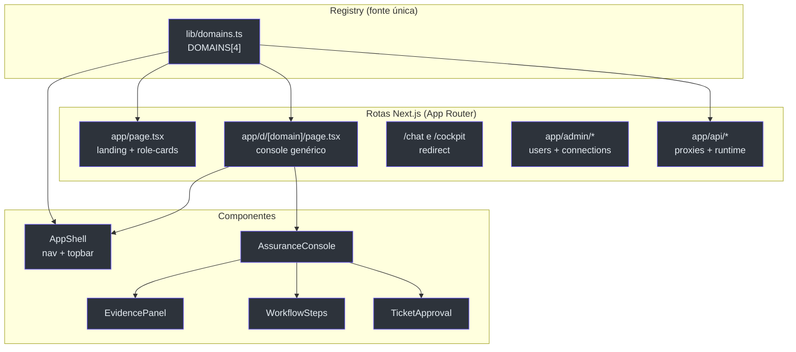

# Visão Geral — Frontend Multi-tenant de 4 Domínios

## Por que este frontend existe

O frontend é a face do **Foundry Assured** — um concierge de suporte de engenharia que tria, fundamenta, resolve e escala com aprovação humana. Mas o diferencial de arquitetura não é o chat: é que **a mesma superfície serve qualquer domínio**. A tese do produto é que o "mecanismo de garantia" (citação obrigatória, acesso por documento, avaliação contínua) é *domain-swappable*, então a UI também é. Adicionar um domínio = **uma entrada** em `lib/domains.ts` (+ um agente no backend), sem nova página, sem nova rota.

Isso é declarado explicitamente no topo do registry: _"Adding a domain = one entry here (+ a backend agent)"_ [lib/domains.ts:1-6](https://github.com/ruinosus/foundry-assured/blob/feature/saas-d-packaging/apps/frontend/lib/domains.ts#L1-L6).

> **Fato (lido no código):** o registry é a fonte única de verdade. Ele dirige o mapa de agentes (`api/copilotkit`), a navegação lateral, a rota genérica `/d/[domain]`, os cards do landing e os prompts iniciais por domínio.

## O que mudou desde a v0.1.0 (linha SaaS-D)

A regeneração v0.2.0 reflete o frontend agora **multi-tenant e de 4 domínios**. Resumo das mudanças factuais:

| Mudança | Antes (v0.1.0) | Agora (v0.2.0) | Fonte |
|---|---|---|---|
| Domínios no registry | 3 (helpdesk, cockpit, selfwiki) | **4** — soma `platform` (`kind: "tool"`) | [lib/domains.ts:71-85](https://github.com/ruinosus/foundry-assured/blob/feature/saas-d-packaging/apps/frontend/lib/domains.ts#L71-L85) |
| Tipos de domínio (`DomainKind`) | `workflow` / `grounded` | `workflow` / `grounded` / **`tool`** | [lib/domains.ts:8](https://github.com/ruinosus/foundry-assured/blob/feature/saas-d-packaging/apps/frontend/lib/domains.ts#L8) |
| Toggle Live/Hosted | só no chat helpdesk | **registry-driven** via `domain.hostedAgentId` | [components/console/AssuranceConsole.tsx:31-37](https://github.com/ruinosus/foundry-assured/blob/feature/saas-d-packaging/apps/frontend/components/console/AssuranceConsole.tsx#L31-L37) |
| Twins hospedados | `helpdesk-hosted` | `helpdesk-hosted` + **`platform-hosted`** | [app/api/copilotkit/[[...slug]]/route.ts:84-88](https://github.com/ruinosus/foundry-assured/blob/feature/saas-d-packaging/apps/frontend/app/api/copilotkit/%5B%5B...slug%5D%5D/route.ts#L84-L88) |
| UI de tenant/admin | apenas usuários | **Connections** (data-plane + conexões) + proxy `/api/tenant` | [components/admin/Connections.tsx:1-7](https://github.com/ruinosus/foundry-assured/blob/feature/saas-d-packaging/apps/frontend/components/admin/Connections.tsx#L1-L7) |

## Os 4 domínios

Cada domínio é um objeto `Domain` no array `DOMAINS`. Os campos `id`, `kind`, `endpoint` e o opcional `hostedAgentId` são o que efetivamente muda o comportamento da UI.

| id | icon | kind | endpoint | hostedAgentId | Fonte |
|---|---|---|---|---|---|
| `helpdesk` | 💬 | `workflow` | `/helpdesk` | — | [lib/domains.ts:29-42](https://github.com/ruinosus/foundry-assured/blob/feature/saas-d-packaging/apps/frontend/lib/domains.ts#L29-L42) |
| `cockpit` | 🛰️ | `grounded` | `/cockpit` | — | [lib/domains.ts:43-56](https://github.com/ruinosus/foundry-assured/blob/feature/saas-d-packaging/apps/frontend/lib/domains.ts#L43-L56) |
| `selfwiki` | 📖 | `grounded` | `/selfwiki` | — | [lib/domains.ts:57-70](https://github.com/ruinosus/foundry-assured/blob/feature/saas-d-packaging/apps/frontend/lib/domains.ts#L57-L70) |
| `platform` | 🛠️ | `tool` | `/platform` | `platform-hosted` | [lib/domains.ts:71-85](https://github.com/ruinosus/foundry-assured/blob/feature/saas-d-packaging/apps/frontend/lib/domains.ts#L71-L85) |

O significado de cada `kind` está documentado inline: `workflow` = triage→retrieve→resolve→escalate com passos + HITL; `grounded` = Q&A puro com citações; `tool` = dirigido por ferramentas (servidores MCP da Microsoft) com HITL em ações de escrita [lib/domains.ts:14-17](https://github.com/ruinosus/foundry-assured/blob/feature/saas-d-packaging/apps/frontend/lib/domains.ts#L14-L17).

## Mapa do componente (estrutura)

<!-- Sources: lib/domains.ts:28-89, app/d/[domain]/page.tsx:16-24, components/shell/AppShell.tsx:18-37, components/console/AssuranceConsole.tsx:39-99 -->

## Como o registry "irriga" a UI

A página de landing mapeia `DOMAINS` para role-cards e linka cada um para `/d/<id>` [app/page.tsx:49-63](https://github.com/ruinosus/foundry-assured/blob/feature/saas-d-packaging/apps/frontend/app/page.tsx#L49-L63). A nav lateral deriva os itens de "AI agents" do mesmo array [components/shell/AppShell.tsx:18](https://github.com/ruinosus/foundry-assured/blob/feature/saas-d-packaging/apps/frontend/components/shell/AppShell.tsx#L18). A rota `/d/[domain]` resolve o id pelo path e o entrega ao console [app/d/[domain]/page.tsx:17-23](https://github.com/ruinosus/foundry-assured/blob/feature/saas-d-packaging/apps/frontend/app/d/%5Bdomain%5D/page.tsx#L17-L23). As rotas antigas `/chat` e `/cockpit` viram `redirect()` para `/d/helpdesk` e `/d/cockpit` [app/chat/page.tsx:5-7](https://github.com/ruinosus/foundry-assured/blob/feature/saas-d-packaging/apps/frontend/app/chat/page.tsx#L5-L7).

## As três garantias (a "assinatura" do produto)

O EvidencePanel e o landing repetem as mesmas três garantias do mecanismo — **construída com fidelidade**, **acesso que segue a fonte**, **continuamente avaliada** [app/page.tsx:9-25](https://github.com/ruinosus/foundry-assured/blob/feature/saas-d-packaging/apps/frontend/app/page.tsx#L9-L25). Elas não são prosa de marketing: o gate de fidelidade exige ≥80% de citações que resolvem para arquivos reais — o mesmo gate que esta própria wiki passa.

## Related Pages

| Página | Relação |
|------|-------------|
| [Arquitetura e Stack](page-2.md) | Camadas, Next.js 15, CopilotKit v2 |
| [Registry e Runtime](page-3.md) | Detalhe de `lib/domains.ts` e do runtime CopilotKit |
| [Assurance Console](page-4.md) | O console genérico + EvidencePanel |
| [Admin e Multi-tenancy](page-6.md) | A UI de tenant/onboarding nova na linha SaaS |
