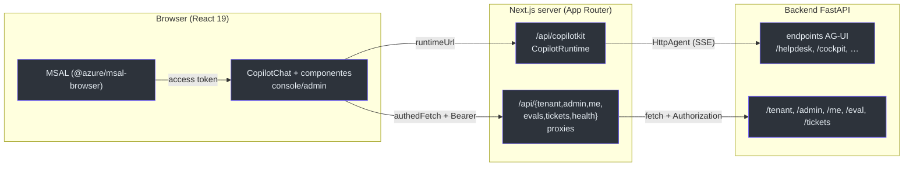
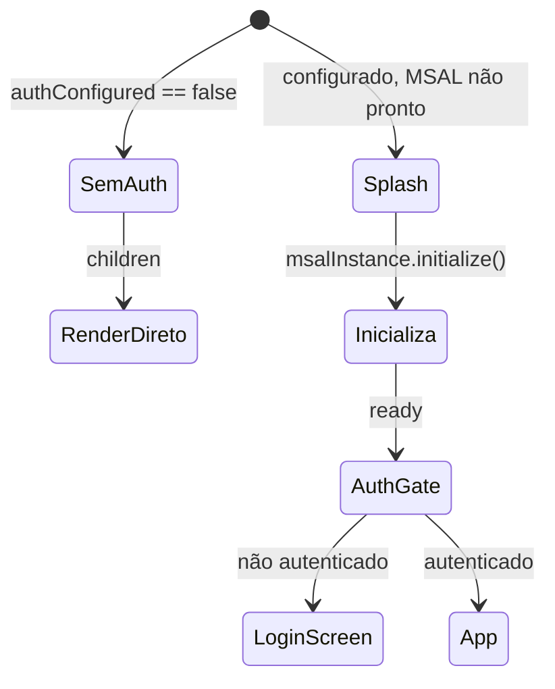

# Arquitetura e Stack (Next.js 15 + CopilotKit v2)

## Visão de alto nível

O frontend é uma app **Next.js 15 (App Router)** que não conversa com o Azure direto. Ela conversa com:
1. um **runtime CopilotKit** rodando dentro do próprio Next (rota `/api/copilotkit`), que faz a ponte para o backend FastAPI sobre **AG-UI/SSE**; e
2. um conjunto de **proxies de API** (`/api/tenant`, `/api/admin`, `/api/me`, `/api/evals`, `/api/tickets`, `/api/health`) que repassam o token Entra do usuário para o backend e mantêm a URL do backend fora do browser.

<!-- Sources: app/api/copilotkit/[[...slug]]/route.ts:13-32, app/api/tenant/[...path]/route.ts:9-19, lib/auth/api.ts:11-26 -->

## Stack tecnológico (dependências reais)

Lido em `package.json`:

| Pacote | Versão | Papel | Fonte |
|---|---|---|---|
| `next` | `^15.5.0` | Framework (App Router, rotas, standalone) | [package.json:21](https://github.com/ruinosus/foundry-assured/blob/feature/saas-d-packaging/apps/frontend/package.json#L21) |
| `react` / `react-dom` | `^19.0.0` | UI | [package.json:22-23](https://github.com/ruinosus/foundry-assured/blob/feature/saas-d-packaging/apps/frontend/package.json#L22-L23) |
| `@copilotkit/react-core` | `^1.61.2` | Cliente de chat + hooks (`useAgent`, v2) | [package.json:18](https://github.com/ruinosus/foundry-assured/blob/feature/saas-d-packaging/apps/frontend/package.json#L18) |
| `@copilotkit/runtime` | `^1.61.2` | Runtime no servidor Next (`CopilotRuntime`) | [package.json:20](https://github.com/ruinosus/foundry-assured/blob/feature/saas-d-packaging/apps/frontend/package.json#L20) |
| `@ag-ui/client` | `^0.0.57` | `HttpAgent` (ponte AG-UI sobre SSE) | [package.json:15](https://github.com/ruinosus/foundry-assured/blob/feature/saas-d-packaging/apps/frontend/package.json#L15) |
| `@azure/msal-browser` / `@azure/msal-react` | `^5.x` | Login Entra ID + hooks | [package.json:16-17](https://github.com/ruinosus/foundry-assured/blob/feature/saas-d-packaging/apps/frontend/package.json#L16-L17) |
| `@copilotkit/aimock` (dev) | `^1.34.0` | Demo mode (fixture replay, sem Azure) | [package.json:26](https://github.com/ruinosus/foundry-assured/blob/feature/saas-d-packaging/apps/frontend/package.json#L26) |

> **Nota:** o `package.json` ainda declara `"version": "0.1.0"` [package.json:3](https://github.com/ruinosus/foundry-assured/blob/feature/saas-d-packaging/apps/frontend/package.json#L3); a versão do *bundle de wiki* (v0.2.0) é independente do `version` do pacote npm.

## Camadas e responsabilidades

A app se organiza em quatro grupos de arquivos:

| Camada | Diretório | Responsabilidade | Exemplo |
|---|---|---|---|
| **Rotas/páginas** | `app/` | Roteamento, SSR/CSR, redirects | [app/d/[domain]/page.tsx](https://github.com/ruinosus/foundry-assured/blob/feature/saas-d-packaging/apps/frontend/app/d/%5Bdomain%5D/page.tsx#L16) |
| **API (server)** | `app/api/` | Runtime CopilotKit + proxies | [app/api/me/route.ts](https://github.com/ruinosus/foundry-assured/blob/feature/saas-d-packaging/apps/frontend/app/api/me/route.ts#L8) |
| **Componentes** | `components/` | Console, chat, admin, shell, evals | [components/console/AssuranceConsole.tsx](https://github.com/ruinosus/foundry-assured/blob/feature/saas-d-packaging/apps/frontend/components/console/AssuranceConsole.tsx#L31) |
| **Libs** | `lib/` | Registry, auth, branding, demo | [lib/domains.ts](https://github.com/ruinosus/foundry-assured/blob/feature/saas-d-packaging/apps/frontend/lib/domains.ts#L28) |

## Por que client-only no console

A rota `/d/[domain]` carrega o `AssuranceConsole` via `next/dynamic` com `ssr: false` [app/d/[domain]/page.tsx:12-14](https://github.com/ruinosus/foundry-assured/blob/feature/saas-d-packaging/apps/frontend/app/d/%5Bdomain%5D/page.tsx#L12-L14). O motivo está documentado inline: **MSAL + CopilotKit v2 não rodam durante SSR** [app/d/[domain]/page.tsx:4-6](https://github.com/ruinosus/foundry-assured/blob/feature/saas-d-packaging/apps/frontend/app/d/%5Bdomain%5D/page.tsx#L4-L6). O mesmo padrão `dynamic(..., { ssr: false })` aparece nas páginas admin [app/admin/users/page.tsx:9-11](https://github.com/ruinosus/foundry-assured/blob/feature/saas-d-packaging/apps/frontend/app/admin/users/page.tsx#L9-L11).

`PublicClientApplication` só é construída no browser, porque toca `window`/`crypto` — no servidor fica `null` [lib/auth/msal.ts:34-38](https://github.com/ruinosus/foundry-assured/blob/feature/saas-d-packaging/apps/frontend/lib/auth/msal.ts#L34-L38).

## Inicialização do app (Providers)

O `RootLayout` envolve tudo em `<Providers>` e importa os estilos do CopilotKit v2 e os globais [app/layout.tsx:2-3,19-21](https://github.com/ruinosus/foundry-assured/blob/feature/saas-d-packaging/apps/frontend/app/layout.tsx#L2-L21). O `Providers` decide três caminhos de render:

<!-- Sources: components/shell/Providers.tsx:36-56 -->

Quando o Entra não está configurado, `Providers` é pass-through [components/shell/Providers.tsx:47-48](https://github.com/ruinosus/foundry-assured/blob/feature/saas-d-packaging/apps/frontend/components/shell/Providers.tsx#L47-L48). Quando está, `AuthGate` substitui o app inteiro pela `LoginScreen` se o usuário não estiver autenticado — nada é acessível sem login [components/shell/Providers.tsx:21-25](https://github.com/ruinosus/foundry-assured/blob/feature/saas-d-packaging/apps/frontend/components/shell/Providers.tsx#L21-L25).

## Build standalone

`next.config.ts` define `output: "standalone"` para emitir um bundle de servidor autocontido (`.next/standalone`) para a imagem de container [next.config.ts:3-6](https://github.com/ruinosus/foundry-assured/blob/feature/saas-d-packaging/apps/frontend/next.config.ts#L3-L6).

## Related Pages

| Página | Relação |
|------|-------------|
| [Visão Geral](page-1.md) | O porquê do registry e os 4 domínios |
| [Registry e Runtime](page-3.md) | Detalhe do `CopilotRuntime` e `withResumeBridge` |
| [Autenticação Entra](page-7.md) | MSAL, `authedFetch`, proxies |
| [Execução Local e Deploy](page-8.md) | Standalone, scripts, demo |
