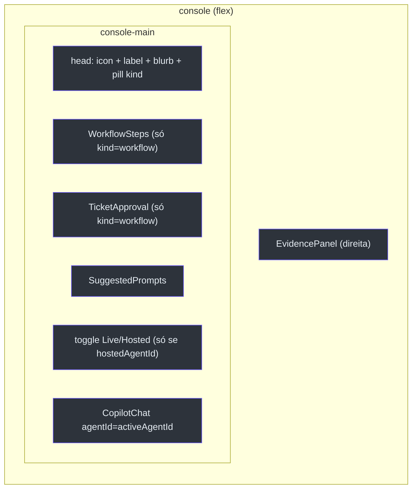
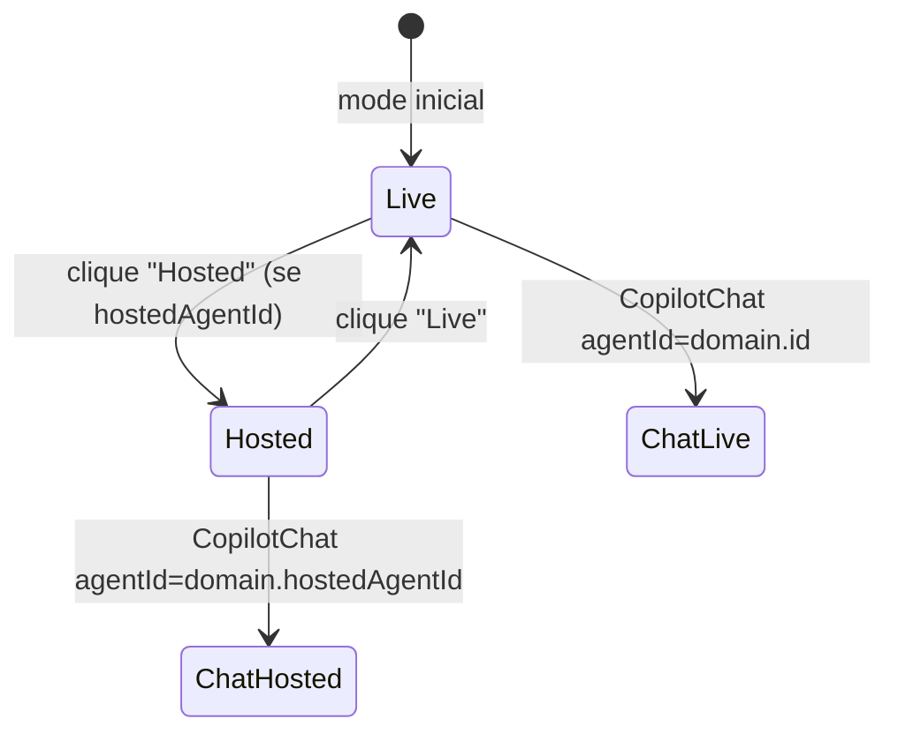
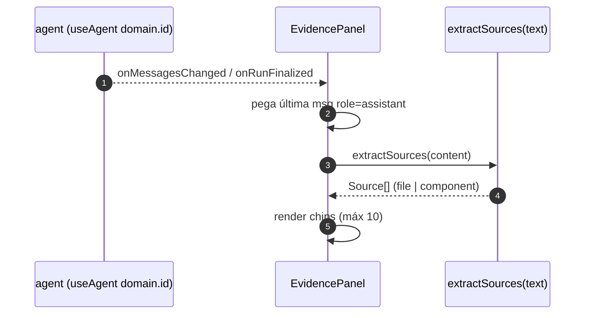

# Assurance Console, Toggle Live/Hosted e EvidencePanel

## Por que um único console

O `AssuranceConsole` é a superfície config-driven para **qualquer** agente de domínio. Em vez de uma página de chat por domínio, há um console que muda de comportamento conforme o `Domain` recebido — a sidebar do `AppShell` é o switcher de domínio [components/console/AssuranceConsole.tsx:3-9](https://github.com/ruinosus/foundry-assured/blob/feature/saas-d-packaging/apps/frontend/components/console/AssuranceConsole.tsx#L3-L9).


<!-- Sources: components/console/AssuranceConsole.tsx:39-96 -->

## A estrutura de duas colunas

Dentro do shell (flush), o console tem duas panes: o chat (centro) e o `EvidencePanel` (direita) — a assinatura de citações/assurance [components/console/AssuranceConsole.tsx:5-7](https://github.com/ruinosus/foundry-assured/blob/feature/saas-d-packaging/apps/frontend/components/console/AssuranceConsole.tsx#L5-L7).

A UI condicional por `kind` é direta: domínios `workflow` adicionalmente renderizam `<WorkflowSteps />` e `<TicketApproval />`; os demais não [components/console/AssuranceConsole.tsx:60-65](https://github.com/ruinosus/foundry-assured/blob/feature/saas-d-packaging/apps/frontend/components/console/AssuranceConsole.tsx#L60-L65). O pill do cabeçalho mostra "workflow + HITL" ou "grounded Q&A" conforme o kind [components/console/AssuranceConsole.tsx:55-57](https://github.com/ruinosus/foundry-assured/blob/feature/saas-d-packaging/apps/frontend/components/console/AssuranceConsole.tsx#L55-L57).

## O toggle Live/Hosted (registry-driven)

A grande mudança da linha SaaS: o toggle deixou de ser hardcoded no helpdesk e passou a ser **dirigido pelo registry**. Ele só renderiza quando o domínio declara `hostedAgentId` — logo qualquer domínio que ganhar um twin hospedado herda o toggle de graça, sem special-casing [components/console/AssuranceConsole.tsx:31-37](https://github.com/ruinosus/foundry-assured/blob/feature/saas-d-packaging/apps/frontend/components/console/AssuranceConsole.tsx#L31-L37).

O `activeAgentId` resolve assim [components/console/AssuranceConsole.tsx:35-37](https://github.com/ruinosus/foundry-assured/blob/feature/saas-d-packaging/apps/frontend/components/console/AssuranceConsole.tsx#L35-L37):

```ts
const [mode, setMode] = useState<"live" | "hosted">("live");
const activeAgentId =
  mode === "hosted" && domain.hostedAgentId ? domain.hostedAgentId : domain.id;
```


<!-- Sources: components/console/AssuranceConsole.tsx:35-37, 69-91 -->

O bloco do toggle só aparece sob `{domain.hostedAgentId && (...)}` e troca a legenda entre "AG-UI · live tool steps + write-approval" e "Foundry Agent Service · managed hosted agent" [components/console/AssuranceConsole.tsx:69-88](https://github.com/ruinosus/foundry-assured/blob/feature/saas-d-packaging/apps/frontend/components/console/AssuranceConsole.tsx#L69-L88). O `<CopilotChat>` recebe `agentId={activeAgentId}` [components/console/AssuranceConsole.tsx:91](https://github.com/ruinosus/foundry-assured/blob/feature/saas-d-packaging/apps/frontend/components/console/AssuranceConsole.tsx#L91).

### Comparação com o HelpdeskApp legado

Há um segundo lar para o toggle: `HelpdeskApp.tsx`, usado fora do console genérico. Ali o toggle é hardcoded (Live workflow / Hosted agent) e fixa `agentId="helpdesk"` / `"helpdesk-hosted"` [components/chat/HelpdeskApp.tsx:54-87](https://github.com/ruinosus/foundry-assured/blob/feature/saas-d-packaging/apps/frontend/components/chat/HelpdeskApp.tsx#L54-L87). Em demo mode esconde o toggle e mostra um pill "Demo · replayed fixture" [components/chat/HelpdeskApp.tsx:48-53](https://github.com/ruinosus/foundry-assured/blob/feature/saas-d-packaging/apps/frontend/components/chat/HelpdeskApp.tsx#L48-L53).

| Aspecto | AssuranceConsole | HelpdeskApp |
|---|---|---|
| Origem do toggle | `domain.hostedAgentId` (registry) | hardcoded | 
| AgentId | `domain.id` / `domain.hostedAgentId` | `"helpdesk"` / `"helpdesk-hosted"` |
| Fonte | [AssuranceConsole.tsx:69-91](https://github.com/ruinosus/foundry-assured/blob/feature/saas-d-packaging/apps/frontend/components/console/AssuranceConsole.tsx#L69-L91) | [HelpdeskApp.tsx:54-87](https://github.com/ruinosus/foundry-assured/blob/feature/saas-d-packaging/apps/frontend/components/chat/HelpdeskApp.tsx#L54-L87) |

## Autenticação dentro do console

`AssuranceConsole` espelha `HelpdeskApp`: quando Entra está configurado, gateia em sign-in e encaminha o access token (o backend faz o OBO); senão renderiza direto [components/console/AssuranceConsole.tsx:11-13](https://github.com/ruinosus/foundry-assured/blob/feature/saas-d-packaging/apps/frontend/components/console/AssuranceConsole.tsx#L11-L13). O `AuthedConsole` adquire o token silenciosamente e o **renova a cada 4 min** para não deixar o chat OBO 401-ar no meio da sessão [components/console/AssuranceConsole.tsx:116-133](https://github.com/ruinosus/foundry-assured/blob/feature/saas-d-packaging/apps/frontend/components/console/AssuranceConsole.tsx#L116-L133). Se o domínio não existe, mostra "Domínio não encontrado" [components/console/AssuranceConsole.tsx:149-157](https://github.com/ruinosus/foundry-assured/blob/feature/saas-d-packaging/apps/frontend/components/console/AssuranceConsole.tsx#L149-L157).

## EvidencePanel — a citação é o objeto interessante

O `EvidencePanel` é a primitiva on-thesis: em RAG enterprise, *a citação é o objeto interessante, não o resumo — a confiança passa pelo link* [components/console/EvidencePanel.tsx:3-6](https://github.com/ruinosus/foundry-assured/blob/feature/saas-d-packaging/apps/frontend/components/console/EvidencePanel.tsx#L3-L6).

Como ele funciona (v1): ele deriva as fontes do **texto** da última mensagem do assistente, via duas regex — uma para caminhos de arquivo e nomes de código, outra para identificadores de componente (`cockpit-*`, `foundry-helpdesk-*`) [components/console/EvidencePanel.tsx:23-39](https://github.com/ruinosus/foundry-assured/blob/feature/saas-d-packaging/apps/frontend/components/console/EvidencePanel.tsx#L23-L39). Ele se inscreve no agente do domínio e re-extrai a cada mudança de mensagens [components/console/EvidencePanel.tsx:59-78](https://github.com/ruinosus/foundry-assured/blob/feature/saas-d-packaging/apps/frontend/components/console/EvidencePanel.tsx#L59-L78).


<!-- Sources: components/console/EvidencePanel.tsx:59-78, 27-39 -->

Abaixo das fontes, três **garantias** fixas (Fidelidade, Acesso, Avaliação) são sempre exibidas [components/console/EvidencePanel.tsx:41-57,103-118](https://github.com/ruinosus/foundry-assured/blob/feature/saas-d-packaging/apps/frontend/components/console/EvidencePanel.tsx#L41-L118). Quando nada é citado, degrada graciosamente com um texto-placeholder [components/console/EvidencePanel.tsx:95-100](https://github.com/ruinosus/foundry-assured/blob/feature/saas-d-packaging/apps/frontend/components/console/EvidencePanel.tsx#L95-L100).

## SuggestedPrompts — antídoto ao "blank box"

Os chips de prompt inicial vêm de `domain.suggested` e enviam ao clicar (`addMessage` + `runAgent`), sumindo assim que a conversa começa [components/console/SuggestedPrompts.tsx:3-6,27-48](https://github.com/ruinosus/foundry-assured/blob/feature/saas-d-packaging/apps/frontend/components/console/SuggestedPrompts.tsx#L3-L48).

## Related Pages

| Página | Relação |
|------|-------------|
| [Registry e Runtime](page-3.md) | De onde vêm `domain.id` e `domain.hostedAgentId` |
| [Human-in-the-loop](page-5.md) | `WorkflowSteps` e `TicketApproval` renderizados aqui |
| [Visão Geral](page-1.md) | As três garantias do EvidencePanel |
| [Autenticação Entra](page-7.md) | O fluxo OBO que o console encaminha |
