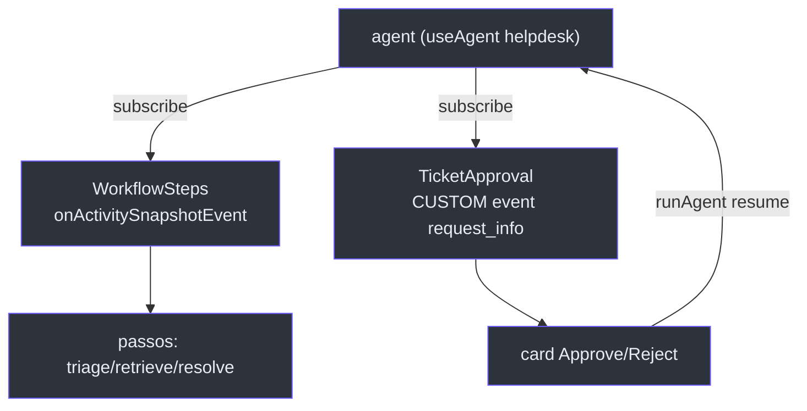
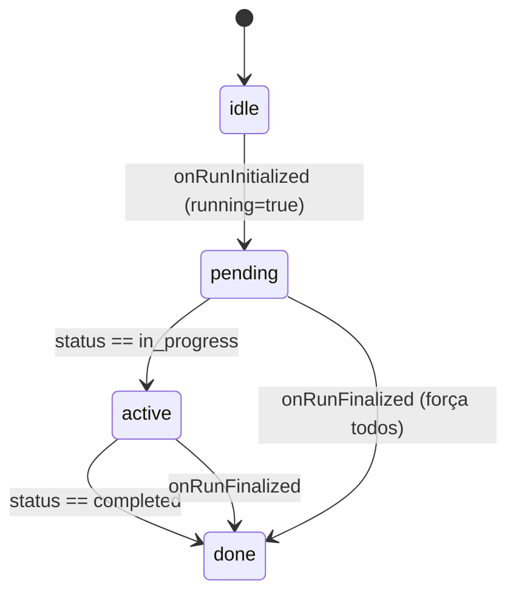
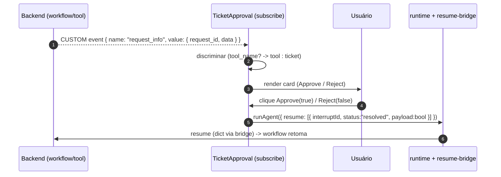

# Human-in-the-loop — WorkflowSteps e TicketApproval

## O problema que estes dois componentes resolvem

Um workflow multi-agente não pode aparecer no UI só como "resposta final". O usuário precisa ver **os passos** (triage → retrieve → resolve) e precisa **aprovar** antes de qualquer ação irreversível (abrir um ticket, rodar uma ferramenta de escrita). Esses dois componentes — `WorkflowSteps` e `TicketApproval` — assinam o **mesmo stream de eventos** do agente `helpdesk` e materializam essas duas necessidades.

<!-- Sources: components/chat/WorkflowSteps.tsx:33-60, components/chat/TicketApproval.tsx:54-90 -->

## WorkflowSteps — passos ao vivo

Os três passos são estáticos (triage, retrieve, resolve) [components/chat/WorkflowSteps.tsx:18-22](https://github.com/ruinosus/foundry-assured/blob/feature/saas-d-packaging/apps/frontend/components/chat/WorkflowSteps.tsx#L18-L22). O componente assina o agente e mapeia `executor_id → status` a partir de `onActivitySnapshotEvent` [components/chat/WorkflowSteps.tsx:45-49](https://github.com/ruinosus/foundry-assured/blob/feature/saas-d-packaging/apps/frontend/components/chat/WorkflowSteps.tsx#L45-L49).

Detalhe importante de import: `useAgent` vem de `@copilotkit/react-core/v2` (não de `/v2/headless`) para compartilhar o mesmo contexto CopilotKit — caso contrário lança "useCopilotKit must be used within CopilotKitProvider" [components/chat/WorkflowSteps.tsx:12-15](https://github.com/ruinosus/foundry-assured/blob/feature/saas-d-packaging/apps/frontend/components/chat/WorkflowSteps.tsx#L12-L15).

Um ponto sutil corrigido no código: o passo terminal `resolve` nunca emite uma activity "completed" limpa (sua conclusão sai como a resposta em streaming). Por isso `onRunFinalized` marca **todos** os passos como `completed` [components/chat/WorkflowSteps.tsx:51-56](https://github.com/ruinosus/foundry-assured/blob/feature/saas-d-packaging/apps/frontend/components/chat/WorkflowSteps.tsx#L51-L56).

<!-- Sources: components/chat/WorkflowSteps.tsx:41-69 -->

O mapeamento de estado visual: `completed → done` (✓ verde), `in_progress → active` (azul), senão `pending`/`idle` [components/chat/WorkflowSteps.tsx:64-69](https://github.com/ruinosus/foundry-assured/blob/feature/saas-d-packaging/apps/frontend/components/chat/WorkflowSteps.tsx#L64-L69).

## TicketApproval — interceptando o request_info

`useInterrupt` do CopilotKit **não** captura a interrupção do workflow agent-framework: o adapter emite `RUN_FINISHED` com um campo singular `interrupt` + um evento CUSTOM `request_info`, que a detecção de interrupt do v2 não casa. Então o componente **tapeia o stream de eventos direto** e dirige a aprovação ele mesmo [components/chat/TicketApproval.tsx:5-21](https://github.com/ruinosus/foundry-assured/blob/feature/saas-d-packaging/apps/frontend/components/chat/TicketApproval.tsx#L5-L21).

O mesmo tap atende **dois tipos** de aprovação sobre o mesmo evento `request_info`/CUSTOM [components/chat/TicketApproval.tsx:26-32](https://github.com/ruinosus/foundry-assured/blob/feature/saas-d-packaging/apps/frontend/components/chat/TicketApproval.tsx#L26-L32):

| `kind` | Origem | Discriminador | Fonte |
|---|---|---|---|
| `"ticket"` | HITL do `create_ticket` do helpdesk | tem `summary`, sem nome de tool | [TicketApproval.tsx:83-85](https://github.com/ruinosus/foundry-assured/blob/feature/saas-d-packaging/apps/frontend/components/chat/TicketApproval.tsx#L83-L85) |
| `"tool"` | aprovação de write-tool MCP nativa (platform) | tem `tool_name`/`name`/`function_name` | [TicketApproval.tsx:75-82](https://github.com/ruinosus/foundry-assured/blob/feature/saas-d-packaging/apps/frontend/components/chat/TicketApproval.tsx#L75-L82) |

<!-- Sources: components/chat/TicketApproval.tsx:59-108 -->

A resolução envia a forma **array** AG-UI (`resume: [{ interruptId, status: "resolved", payload: approved }]`); a rota do runtime reescreve para o dict do backend antes de encaminhar [components/chat/TicketApproval.tsx:100-104](https://github.com/ruinosus/foundry-assured/blob/feature/saas-d-packaging/apps/frontend/components/chat/TicketApproval.tsx#L100-L104) — exatamente o `withResumeBridge` descrito em [Registry e Runtime](page-3.md#por-que-o-resume-bridge-existe).

### Render dos dois cards

- **Tool**: "Run write tool `<toolName>`?" com os argumentos serializados [components/chat/TicketApproval.tsx:112-125](https://github.com/ruinosus/foundry-assured/blob/feature/saas-d-packaging/apps/frontend/components/chat/TicketApproval.tsx#L112-L125).
- **Ticket**: "Open a support ticket?" com o `summary` [components/chat/TicketApproval.tsx:126-133](https://github.com/ruinosus/foundry-assured/blob/feature/saas-d-packaging/apps/frontend/components/chat/TicketApproval.tsx#L126-L133).

> **Fato + caveat (lido no código):** o shape exato do `ToolApprovalRequestContent` nativo ainda está pendente de verificação live (nota `#3199` no código); o discriminador testa vários nomes de campo (`tool_name`, `name`, `function_name`, `toolName`) por robustez [components/chat/TicketApproval.tsx:14-21,75-79](https://github.com/ruinosus/foundry-assured/blob/feature/saas-d-packaging/apps/frontend/components/chat/TicketApproval.tsx#L14-L79).

## Onde isso aparece

`WorkflowSteps` e `TicketApproval` são montados pelo `AssuranceConsole` somente para `kind === "workflow"` [components/console/AssuranceConsole.tsx:60-65](https://github.com/ruinosus/foundry-assured/blob/feature/saas-d-packaging/apps/frontend/components/console/AssuranceConsole.tsx#L60-L65) e, no caminho legado live, pelo `HelpdeskApp` [components/chat/HelpdeskApp.tsx:73-80](https://github.com/ruinosus/foundry-assured/blob/feature/saas-d-packaging/apps/frontend/components/chat/HelpdeskApp.tsx#L73-L80). Os tickets aprovados aparecem depois na página `/tickets` (via `/api/tickets`) [components/tickets/TicketsView.tsx:3-4,23-34](https://github.com/ruinosus/foundry-assured/blob/feature/saas-d-packaging/apps/frontend/components/tickets/TicketsView.tsx#L3-L34).

## Related Pages

| Página | Relação |
|------|-------------|
| [Registry e Runtime](page-3.md) | O `withResumeBridge` que traduz o `resume` |
| [Assurance Console](page-4.md) | Onde os dois componentes são montados |
| [Admin e Multi-tenancy](page-6.md) | O domínio `platform` (tool) e seu write-approval |
| [Execução Local e Deploy](page-8.md) | Demo mode replaya o fluxo HITL |
