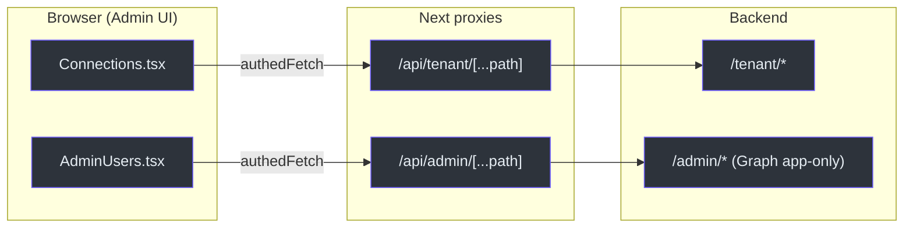
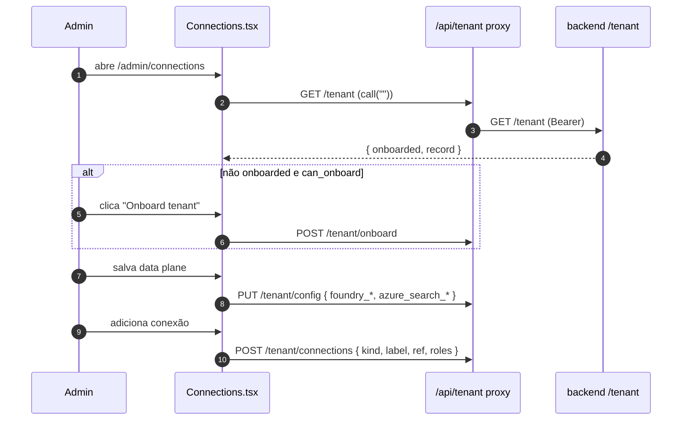

# Admin e Multi-tenancy — Users, Connections e Proxies

## O princípio: a UI nunca segura segredos

Toda a área admin é **camada de conveniência sobre o backend**. O browser nunca chama o Graph nem o Azure direto; ele chama proxies Next que **encaminham o bearer token Entra** do usuário para o FastAPI, que detém as credenciais app-only e re-gateia cada chamada server-side pelo papel **Admin** [components/admin/Connections.tsx:3-6](https://github.com/ruinosus/foundry-assured/blob/feature/saas-d-packaging/apps/frontend/components/admin/Connections.tsx#L3-L6), [components/admin/AdminUsers.tsx:3-5](https://github.com/ruinosus/foundry-assured/blob/feature/saas-d-packaging/apps/frontend/components/admin/AdminUsers.tsx#L3-L5).

<!-- Sources: components/admin/Connections.tsx:45-50, app/api/tenant/[...path]/route.ts:9-19, app/api/admin/[...path]/route.ts:9-19 -->

## Visibilidade no nav (gate de UI)

Os itens `Admin` e `Connections` só aparecem na sidebar para o papel Admin; o gate real é server-side em cada endpoint [components/shell/AppShell.tsx:100-102](https://github.com/ruinosus/foundry-assured/blob/feature/saas-d-packaging/apps/frontend/components/shell/AppShell.tsx#L100-L102). Os papéis vêm de `/api/me` via `useMyRoles` [lib/auth/roles.ts:10-23](https://github.com/ruinosus/foundry-assured/blob/feature/saas-d-packaging/apps/frontend/lib/auth/roles.ts#L10-L23), e `isAdmin` testa `roles.includes("Admin")` [lib/auth/roles.ts:25](https://github.com/ruinosus/foundry-assured/blob/feature/saas-d-packaging/apps/frontend/lib/auth/roles.ts#L25). Cada página admin repete o gate: enquanto `roles===null` mostra "Loading…", se não-admin mostra um card pedindo o papel [app/admin/connections/page.tsx:16-27](https://github.com/ruinosus/foundry-assured/blob/feature/saas-d-packaging/apps/frontend/app/admin/connections/page.tsx#L16-L27).

## Connections — onboarding + data-plane + conexões (novo na linha SaaS)

`Connections.tsx` é o coração da multi-tenancy do frontend. Ele tem três blocos, todos servidos por `/api/tenant/*`:

| Bloco | Estado | Chamada backend | Fonte |
|---|---|---|---|
| **Onboarding** | tenant não onboarded | `POST /onboard` | [Connections.tsx:138-159](https://github.com/ruinosus/foundry-assured/blob/feature/saas-d-packaging/apps/frontend/components/admin/Connections.tsx#L138-L159) |
| **Data plane** | endpoints Foundry + Search | `PUT /config` | [Connections.tsx:162-198](https://github.com/ruinosus/foundry-assured/blob/feature/saas-d-packaging/apps/frontend/components/admin/Connections.tsx#L162-L198) |
| **Connections** | tabela + add/edit/delete | `GET/POST/DELETE /connections` | [Connections.tsx:201-310](https://github.com/ruinosus/foundry-assured/blob/feature/saas-d-packaging/apps/frontend/components/admin/Connections.tsx#L201-L310) |

O carregamento inicial busca o tenant, e se onboarded preenche o data-plane e busca as conexões [components/admin/Connections.tsx:75-88](https://github.com/ruinosus/foundry-assured/blob/feature/saas-d-packaging/apps/frontend/components/admin/Connections.tsx#L75-L88).

### Data-plane configurável

Os campos do data-plane são o endpoint do projeto Foundry, o modelo, o endpoint do Azure Search e a knowledge base — exatamente o que torna o backend apontável para o data-plane de cada tenant [components/admin/Connections.tsx:14-20,166-181](https://github.com/ruinosus/foundry-assured/blob/feature/saas-d-packaging/apps/frontend/components/admin/Connections.tsx#L14-L181).

### Conexões: nunca o segredo, sempre a referência

Uma conexão referencia um `foundry_connection_id` **ou** um `keyvault_ref` — nunca o valor do segredo [components/admin/Connections.tsx:21-30](https://github.com/ruinosus/foundry-assured/blob/feature/saas-d-packaging/apps/frontend/components/admin/Connections.tsx#L21-L30). Os tipos disponíveis (`KINDS`) e os papéis mínimos de leitura/escrita (`ROLES`) são listas fixas [components/admin/Connections.tsx:11-12](https://github.com/ruinosus/foundry-assured/blob/feature/saas-d-packaging/apps/frontend/components/admin/Connections.tsx#L11-L12):

| Constante | Valores | Fonte |
|---|---|---|
| `KINDS` | github, azdo, azure, entra, learn, m365 | [Connections.tsx:11](https://github.com/ruinosus/foundry-assured/blob/feature/saas-d-packaging/apps/frontend/components/admin/Connections.tsx#L11) |
| `ROLES` | Reader, Author, Approver, Admin | [Connections.tsx:12](https://github.com/ruinosus/foundry-assured/blob/feature/saas-d-packaging/apps/frontend/components/admin/Connections.tsx#L12) |

O aviso no rodapé reforça: o segredo vive no Foundry/Key Vault, aqui só vai a referência [components/admin/Connections.tsx:304-307](https://github.com/ruinosus/foundry-assured/blob/feature/saas-d-packaging/apps/frontend/components/admin/Connections.tsx#L304-L307).

<!-- Sources: components/admin/Connections.tsx:75-107, 148-149, 184-195, 287-302 -->

## AdminUsers — usuários + papéis via Graph

`AdminUsers.tsx` faz o lifecycle de usuários (invite guest / create member / remove) e a atribuição de papéis, tudo via `/api/admin/*` [components/admin/AdminUsers.tsx:3-5,40-54](https://github.com/ruinosus/foundry-assured/blob/feature/saas-d-packaging/apps/frontend/components/admin/AdminUsers.tsx#L3-L54). Os papéis disponíveis vêm do próprio backend (`GET /admin/roles`) — _"the app owns the roles; your company maps its groups onto them"_ [components/admin/AdminUsers.tsx:87-91](https://github.com/ruinosus/foundry-assured/blob/feature/saas-d-packaging/apps/frontend/components/admin/AdminUsers.tsx#L87-L91).

| Ação | Endpoint (via proxy) | Fonte |
|---|---|---|
| Listar usuários / atribuições / papéis | `GET users` / `role-assignments` / `roles` | [AdminUsers.tsx:43-47](https://github.com/ruinosus/foundry-assured/blob/feature/saas-d-packaging/apps/frontend/components/admin/AdminUsers.tsx#L43-L47) |
| Atribuir papel | `POST role-assignments` | [AdminUsers.tsx:126-128](https://github.com/ruinosus/foundry-assured/blob/feature/saas-d-packaging/apps/frontend/components/admin/AdminUsers.tsx#L126-L128) |
| Revogar papel | `DELETE role-assignments/{id}` | [AdminUsers.tsx:110-112](https://github.com/ruinosus/foundry-assured/blob/feature/saas-d-packaging/apps/frontend/components/admin/AdminUsers.tsx#L110-L112) |
| Convidar guest | `POST users/invite` | [AdminUsers.tsx:167-169](https://github.com/ruinosus/foundry-assured/blob/feature/saas-d-packaging/apps/frontend/components/admin/AdminUsers.tsx#L167-L169) |
| Criar member | `POST users` | [AdminUsers.tsx:180-182](https://github.com/ruinosus/foundry-assured/blob/feature/saas-d-packaging/apps/frontend/components/admin/AdminUsers.tsx#L180-L182) |
| Remover | `DELETE users/{id}` | [AdminUsers.tsx:150-152](https://github.com/ruinosus/foundry-assured/blob/feature/saas-d-packaging/apps/frontend/components/admin/AdminUsers.tsx#L150-L152) |

## Os proxies de tenant/admin (server-side)

Ambos os proxies são `[...path]` catch-all, `force-dynamic`, e seguem o mesmo padrão: pegam o `authorization`, montam a URL `${BACKEND}/<base>/<path>`, repassam o corpo em métodos não-GET/DELETE, e devolvem 502 se o backend estiver inalcançável [app/api/tenant/[...path]/route.ts:6-33](https://github.com/ruinosus/foundry-assured/blob/feature/saas-d-packaging/apps/frontend/app/api/tenant/%5B...path%5D/route.ts#L6-L33). A diferença é só o segmento base (`/tenant/` vs `/admin/`) e os verbos suportados — `tenant` adiciona `PUT` (para `/config`) [app/api/tenant/[...path]/route.ts:42-44](https://github.com/ruinosus/foundry-assured/blob/feature/saas-d-packaging/apps/frontend/app/api/tenant/%5B...path%5D/route.ts#L42-L44).

## O domínio platform (tool) e a Domains toggle

O 4º domínio, `platform`, é o lado de runtime da multi-tenancy: `kind: "tool"`, endpoint `/platform`, twin `platform-hosted` [lib/domains.ts:71-85](https://github.com/ruinosus/foundry-assured/blob/feature/saas-d-packaging/apps/frontend/lib/domains.ts#L71-L85). Por ser `tool`, ele recebe o resume-bridge no runtime (write-approval) [app/api/copilotkit/[[...slug]]/route.ts:68-78](https://github.com/ruinosus/foundry-assured/blob/feature/saas-d-packaging/apps/frontend/app/api/copilotkit/%5B%5B...slug%5D%5D/route.ts#L68-L78) e o card de aprovação de tool descrito em [Human-in-the-loop](page-5.md#ticketapproval-interceptando-o-request-info).

## Related Pages

| Página | Relação |
|------|-------------|
| [Autenticação Entra](page-7.md) | `authedFetch`, `useMyRoles`, o gate de Admin |
| [Human-in-the-loop](page-5.md) | A aprovação de write-tool do domínio platform |
| [Registry e Runtime](page-3.md) | Como `platform`/`platform-hosted` entram no runtime |
| [Visão Geral](page-1.md) | O que mudou na linha SaaS |
