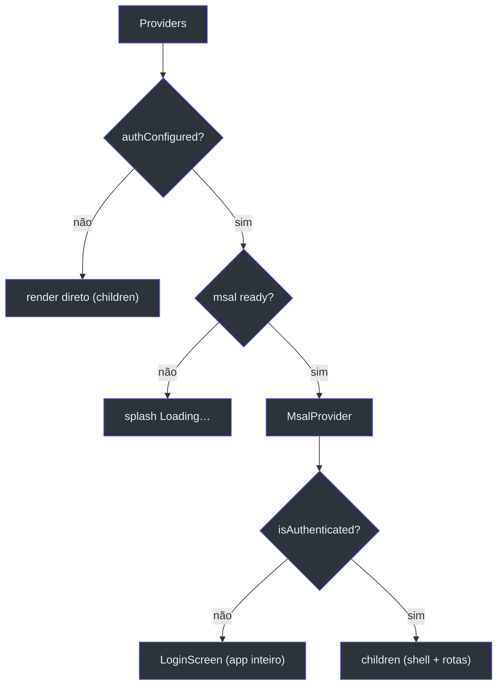
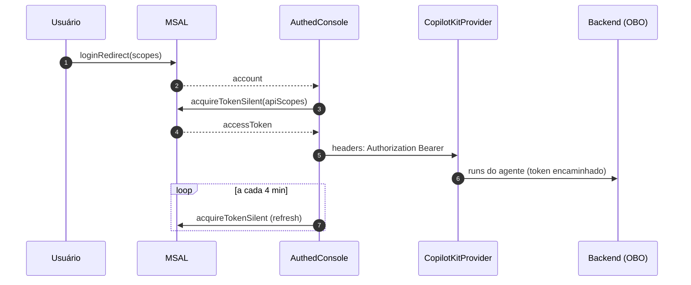

# Autenticação Entra (MSAL) e os Proxies de API

## O modelo: SPA token → backend OBO

O frontend não fala com Graph/Azure direto. Ele faz o usuário **consentir um único escopo** (`api://<apiClientId>/access_as_user`) e encaminha o access token resultante ao backend, que faz o **OBO (on-behalf-of) server-side**. A configuração lê apenas vars `NEXT_PUBLIC_`; na ausência delas a app roda sem auth, espelhando o fallback `DefaultAzureCredential` do backend [lib/auth/msal.ts:3-18](https://github.com/ruinosus/foundry-assured/blob/feature/saas-d-packaging/apps/frontend/lib/auth/msal.ts#L3-L18).

| Variável | Papel | Fonte |
|---|---|---|
| `NEXT_PUBLIC_ENTRA_TENANT_ID` | authority | [lib/auth/msal.ts:9](https://github.com/ruinosus/foundry-assured/blob/feature/saas-d-packaging/apps/frontend/lib/auth/msal.ts#L9) |
| `NEXT_PUBLIC_ENTRA_SPA_CLIENT_ID` | clientId da SPA | [lib/auth/msal.ts:10](https://github.com/ruinosus/foundry-assured/blob/feature/saas-d-packaging/apps/frontend/lib/auth/msal.ts#L10) |
| `NEXT_PUBLIC_ENTRA_API_CLIENT_ID` | id da API (monta o scope) | [lib/auth/msal.ts:11](https://github.com/ruinosus/foundry-assured/blob/feature/saas-d-packaging/apps/frontend/lib/auth/msal.ts#L11) |

`authConfigured` é `true` só quando **as três** existem e não está em demo mode [lib/auth/msal.ts:15](https://github.com/ruinosus/foundry-assured/blob/feature/saas-d-packaging/apps/frontend/lib/auth/msal.ts#L15). A `msalInstance` (`PublicClientApplication`) só é construída no browser (toca `window`/`crypto`); no servidor fica `null` [lib/auth/msal.ts:34-38](https://github.com/ruinosus/foundry-assured/blob/feature/saas-d-packaging/apps/frontend/lib/auth/msal.ts#L34-L38).

## O sign-in wall (AuthGate)

<!-- Sources: components/shell/Providers.tsx:21-56 -->

Quando autenticado falha, `AuthGate` renderiza **somente** a `LoginScreen` — o shell e as rotas nunca montam, então nada é alcançável sem login; o sign-out (`logoutRedirect`) volta para a tela de login [components/shell/Providers.tsx:21-25](https://github.com/ruinosus/foundry-assured/blob/feature/saas-d-packaging/apps/frontend/components/shell/Providers.tsx#L21-L25), [components/shell/LoginScreen.tsx:4-7,41-42](https://github.com/ruinosus/foundry-assured/blob/feature/saas-d-packaging/apps/frontend/components/shell/LoginScreen.tsx#L4-L42). MSAL é hoisteado para o app todo porque o redirect URI é a origem `/` (a Overview, que não tem chat mas precisa consumir a resposta de auth) [components/shell/Providers.tsx:3-7](https://github.com/ruinosus/foundry-assured/blob/feature/saas-d-packaging/apps/frontend/components/shell/Providers.tsx#L3-L7).

## Aquisição e renovação do token (chat)

Tanto `AssuranceConsole` quanto `HelpdeskApp` seguem o mesmo padrão: `acquireTokenSilent` no mount, fallback para `acquireTokenRedirect`, e um `setInterval` que **renova a cada 4 min** — caso contrário o chat OBO 401-a silenciosamente ao expirar (~1h) [components/chat/HelpdeskApp.tsx:108-127](https://github.com/ruinosus/foundry-assured/blob/feature/saas-d-packaging/apps/frontend/components/chat/HelpdeskApp.tsx#L108-L127), [components/console/AssuranceConsole.tsx:116-133](https://github.com/ruinosus/foundry-assured/blob/feature/saas-d-packaging/apps/frontend/components/console/AssuranceConsole.tsx#L116-L133). O token vira o header `Authorization: Bearer <token>` no `CopilotKitProvider` [components/console/AssuranceConsole.tsx:41-42](https://github.com/ruinosus/foundry-assured/blob/feature/saas-d-packaging/apps/frontend/components/console/AssuranceConsole.tsx#L41-L42).

<!-- Sources: components/console/AssuranceConsole.tsx:116-146 -->

## authedFetch — o cliente para os proxies

Chamadas REST (admin, tenant, me, evals, tickets) usam `authedFetch`, que anexa o token via a singleton `msalInstance` (sem hook React, então funciona de qualquer client component). Em dev (`authConfigured=false`) degrada para `fetch` puro [lib/auth/api.ts:3-26](https://github.com/ruinosus/foundry-assured/blob/feature/saas-d-packaging/apps/frontend/lib/auth/api.ts#L3-L26). Se não houver token silencioso, envia sem auth e deixa o chamador tratar o 401 — não força redirect [lib/auth/api.ts:18-21](https://github.com/ruinosus/foundry-assured/blob/feature/saas-d-packaging/apps/frontend/lib/auth/api.ts#L18-L21).

## Os proxies de API (tabela)

Todos os proxies são server-side (`route.ts`), `force-dynamic`, e existem por dois motivos: **sem CORS** e **a URL do backend fica fora do browser** [app/api/health/route.ts:1-3](https://github.com/ruinosus/foundry-assured/blob/feature/saas-d-packaging/apps/frontend/app/api/health/route.ts#L1-L3).

| Rota | Backend | Encaminha token? | Fonte |
|---|---|---|---|
| `/api/copilotkit/[[...slug]]` | `/helpdesk`, `/cockpit`, … (AG-UI) | sim (header do provider) | [route.ts:91-101](https://github.com/ruinosus/foundry-assured/blob/feature/saas-d-packaging/apps/frontend/app/api/copilotkit/%5B%5B...slug%5D%5D/route.ts#L91-L101) |
| `/api/tenant/[...path]` | `/tenant/*` | sim | [route.ts:9-19](https://github.com/ruinosus/foundry-assured/blob/feature/saas-d-packaging/apps/frontend/app/api/tenant/%5B...path%5D/route.ts#L9-L19) |
| `/api/admin/[...path]` | `/admin/*` | sim | [route.ts:9-19](https://github.com/ruinosus/foundry-assured/blob/feature/saas-d-packaging/apps/frontend/app/api/admin/%5B...path%5D/route.ts#L9-L19) |
| `/api/me` | `/me` (identidade + roles) | sim | [route.ts:8-18](https://github.com/ruinosus/foundry-assured/blob/feature/saas-d-packaging/apps/frontend/app/api/me/route.ts#L8-L18) |
| `/api/evals` | `/eval/foundry` | sim | [route.ts:10-23](https://github.com/ruinosus/foundry-assured/blob/feature/saas-d-packaging/apps/frontend/app/api/evals/route.ts#L10-L23) |
| `/api/tickets` | `/tickets` | sim | [route.ts:10-23](https://github.com/ruinosus/foundry-assured/blob/feature/saas-d-packaging/apps/frontend/app/api/tickets/route.ts#L10-L23) |
| `/api/health` | `/healthz` | não | [route.ts:9-15](https://github.com/ruinosus/foundry-assured/blob/feature/saas-d-packaging/apps/frontend/app/api/health/route.ts#L9-L15) |

A URL do backend cai para `http://localhost:8000` quando `BACKEND_URL` não está setada [app/api/me/route.ts:6](https://github.com/ruinosus/foundry-assured/blob/feature/saas-d-packaging/apps/frontend/app/api/me/route.ts#L6).

## O dot de status do backend

O `AppShell` checa `/api/health` no mount e mostra um dot verde/vermelho ("backend online/offline") — sem CORS nem URL exposta [components/shell/AppShell.tsx:39-57](https://github.com/ruinosus/foundry-assured/blob/feature/saas-d-packaging/apps/frontend/components/shell/AppShell.tsx#L39-L57).

## Related Pages

| Página | Relação |
|------|-------------|
| [Admin e Multi-tenancy](page-6.md) | Quem consome `authedFetch` e os proxies |
| [Assurance Console](page-4.md) | O chat que encaminha o Bearer token |
| [Arquitetura e Stack](page-2.md) | Os Providers e o fluxo SSR/CSR |
| [Registry e Runtime](page-3.md) | O proxy `/api/copilotkit` em detalhe |
