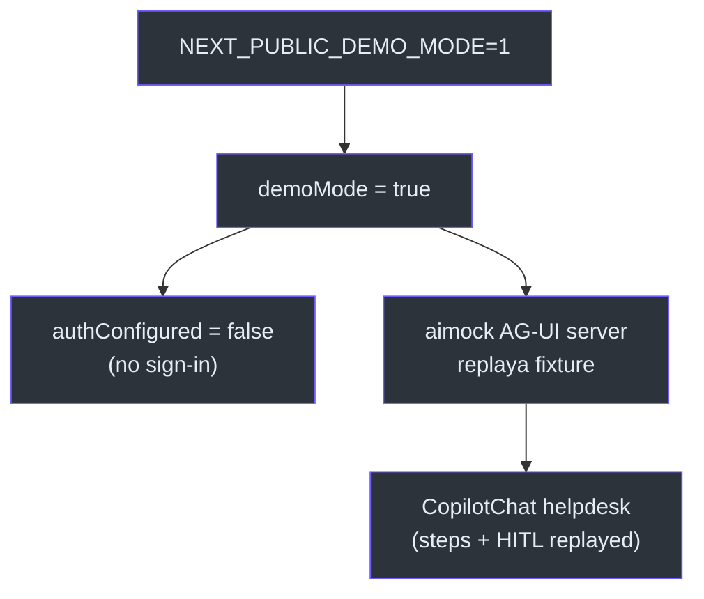
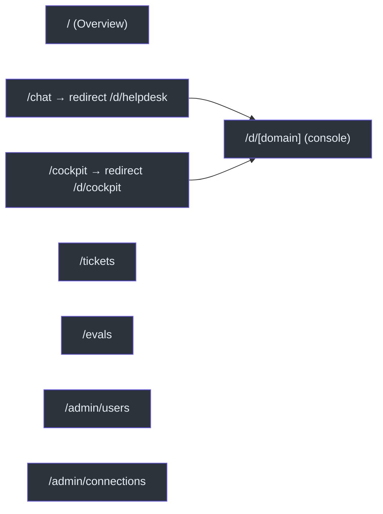

# Execução Local, Demo Mode e Deploy

## Scripts npm

Lido em `package.json` [package.json:5-13](https://github.com/ruinosus/foundry-assured/blob/feature/saas-d-packaging/apps/frontend/package.json#L5-L13):

| Script | Comando | Uso |
|---|---|---|
| `dev` | `next dev` | dev server (porta 3000) |
| `build` | `next build` | build de produção (standalone) |
| `start` | `next start` | servir o build |
| `lint` | `next lint` | lint |
| `typecheck` | `tsc --noEmit` | checagem de tipos |
| `demo` | `bash ../../scripts/demo.sh` | demo mode (fixture, sem Azure) |
| `demo:record` | `bash ../../scripts/demo-record.sh` | gravar nova fixture |

Os scripts `demo`/`demo:record` apontam para `scripts/demo.sh` e `scripts/demo-record.sh` na raiz do monorepo (verificados presentes).

## Demo mode — ver o fluxo sem Azure

Quando `NEXT_PUBLIC_DEMO_MODE=1`, a app fala com um servidor AG-UI **aimock** que replaya uma fixture gravada em vez do backend real — então o fluxo inteiro (passos, resposta fundamentada, HITL) roda com **zero Azure e sem sign-in** [lib/demo.ts:1-5](https://github.com/ruinosus/foundry-assured/blob/feature/saas-d-packaging/apps/frontend/lib/demo.ts#L1-L5).

O demo mode também força no-auth: `authConfigured` é `false` em demo, mesmo que as vars Entra existam no ambiente [lib/auth/msal.ts:13-15](https://github.com/ruinosus/foundry-assured/blob/feature/saas-d-packaging/apps/frontend/lib/auth/msal.ts#L13-L15). No `HelpdeskApp`, demo mode esconde o toggle e mostra o pill "Demo · replayed fixture, no Azure" [components/chat/HelpdeskApp.tsx:48-53](https://github.com/ruinosus/foundry-assured/blob/feature/saas-d-packaging/apps/frontend/components/chat/HelpdeskApp.tsx#L48-L53).

<!-- Sources: lib/demo.ts:1-5, lib/auth/msal.ts:13-15, components/chat/HelpdeskApp.tsx:48-53 -->

As fixtures gravadas vivem em `demo/fixtures/` (arquivos `agui-*.json`) — capturas do stream AG-UI usadas pelo replay (verificadas presentes no diretório `apps/frontend/demo/fixtures/`).

## Variáveis de ambiente (resumo)

| Variável | Default | Efeito | Fonte |
|---|---|---|---|
| `AGUI_URL` | `http://localhost:8000/helpdesk` | endpoint AG-UI do helpdesk live | [route.ts:22](https://github.com/ruinosus/foundry-assured/blob/feature/saas-d-packaging/apps/frontend/app/api/copilotkit/%5B%5B...slug%5D%5D/route.ts#L22) |
| `HOSTED_AGUI_URL` | `…/helpdesk-hosted` | twin hospedado do helpdesk | [route.ts:26-27](https://github.com/ruinosus/foundry-assured/blob/feature/saas-d-packaging/apps/frontend/app/api/copilotkit/%5B%5B...slug%5D%5D/route.ts#L26-L27) |
| `PLATFORM_HOSTED_AGUI_URL` | `…/platform-hosted` | twin hospedado do platform | [route.ts:31-32](https://github.com/ruinosus/foundry-assured/blob/feature/saas-d-packaging/apps/frontend/app/api/copilotkit/%5B%5B...slug%5D%5D/route.ts#L31-L32) |
| `<ID>_AGUI_URL` | — | override de endpoint por domínio | [route.ts:65-66](https://github.com/ruinosus/foundry-assured/blob/feature/saas-d-packaging/apps/frontend/app/api/copilotkit/%5B%5B...slug%5D%5D/route.ts#L65-L66) |
| `BACKEND_URL` | `http://localhost:8000` | base dos proxies REST | [app/api/me/route.ts:6](https://github.com/ruinosus/foundry-assured/blob/feature/saas-d-packaging/apps/frontend/app/api/me/route.ts#L6) |
| `NEXT_PUBLIC_ENTRA_*` | — | habilita auth Entra | [lib/auth/msal.ts:9-11](https://github.com/ruinosus/foundry-assured/blob/feature/saas-d-packaging/apps/frontend/lib/auth/msal.ts#L9-L11) |
| `NEXT_PUBLIC_DEMO_MODE` | — | liga demo mode | [lib/demo.ts:5](https://github.com/ruinosus/foundry-assured/blob/feature/saas-d-packaging/apps/frontend/lib/demo.ts#L5) |

## Páginas de workspace

Além dos consoles de domínio, há três páginas estáticas de workspace na nav [components/shell/AppShell.tsx:19-23](https://github.com/ruinosus/foundry-assured/blob/feature/saas-d-packaging/apps/frontend/components/shell/AppShell.tsx#L19-L23):

| Página | Componente | Lê de | Fonte |
|---|---|---|---|
| `/` Overview | landing + role-cards | registry | [app/page.tsx:27-80](https://github.com/ruinosus/foundry-assured/blob/feature/saas-d-packaging/apps/frontend/app/page.tsx#L27-L80) |
| `/tickets` | `TicketsView` | `/api/tickets` | [components/tickets/TicketsView.tsx:19-34](https://github.com/ruinosus/foundry-assured/blob/feature/saas-d-packaging/apps/frontend/components/tickets/TicketsView.tsx#L19-L34) |
| `/evals` | `EvalsView` | `/api/evals` → Foundry | [components/evals/EvalsView.tsx:25-46](https://github.com/ruinosus/foundry-assured/blob/feature/saas-d-packaging/apps/frontend/components/evals/EvalsView.tsx#L25-L46) |

A `EvalsView` lê os runs reais do projeto Foundry (groundedness/relevance/coherence) e linka cada run ao seu relatório no portal [components/evals/EvalsView.tsx:3-5,46](https://github.com/ruinosus/foundry-assured/blob/feature/saas-d-packaging/apps/frontend/components/evals/EvalsView.tsx#L3-L46). A `TicketsView` mostra os tickets reais abertos pelo fluxo HITL (`create_ticket` → `data/tickets.jsonl`) [components/tickets/TicketsView.tsx:3-4](https://github.com/ruinosus/foundry-assured/blob/feature/saas-d-packaging/apps/frontend/components/tickets/TicketsView.tsx#L3-L4).

## Roteamento e redirects

<!-- Sources: app/chat/page.tsx:5-7, app/cockpit/page.tsx:5-7, app/d/[domain]/page.tsx:16-24 -->

## Deploy — build standalone

`next.config.ts` define `output: "standalone"` para emitir `.next/standalone` (servidor autocontido) para a imagem de container [next.config.ts:3-6](https://github.com/ruinosus/foundry-assured/blob/feature/saas-d-packaging/apps/frontend/next.config.ts#L3-L6). Há um `Dockerfile` no diretório do frontend (verificado presente). A infra Bicep/azd que orquestra o deploy de container vive fora deste bundle, em `infra/` (ex.: `containerapps.bicep`), e não é coberta aqui por estar fora de `apps/frontend`.

> **Inferência (marcada):** o caminho de deploy é containerizar o bundle standalone e provisionar via os artefatos `infra/` do monorepo; o detalhe do pipeline está fora do escopo de `apps/frontend` e não foi lido linha-a-linha aqui.

## Related Pages

| Página | Relação |
|------|-------------|
| [Visão Geral](page-1.md) | Mapa do componente e os 4 domínios |
| [Registry e Runtime](page-3.md) | As env vars `*_AGUI_URL` |
| [Autenticação Entra](page-7.md) | `BACKEND_URL` e os proxies |
| [Human-in-the-loop](page-5.md) | O fluxo HITL que o demo replaya |
