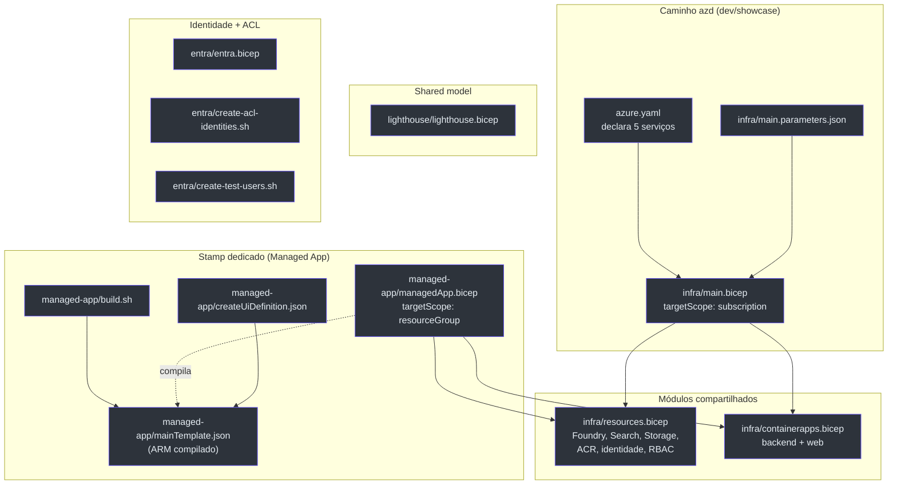

# Visão Geral da Infraestrutura

> **Escopo desta página.** Mapa de alto nível de tudo que vive sob `infra/` mais a declaração de serviços em [`azure.yaml`](https://github.com/ruinosus/foundry-assured/blob/feature/saas-d-packaging/azure.yaml). Cada afirmação aqui é rastreada para o arquivo+linha que a comprova; quando algo é inferência (e não leitura literal do código), está marcado como **(inferência)**.

## Por que esta infraestrutura existe (primeiros princípios)

O Foundry Assured é um concierge de suporte de engenharia que roda **três planos**: um frontend Next.js, um backend Python multi-agente e o **Foundry na nuvem** (KB, memória, eval, tracing). A IaC tem um trabalho central: **provisionar esses recursos de nuvem de forma keyless (identidade gerenciada / Entra ID) e reproduzível**, sem nenhuma chave de API hardcoded — a regra inegociável #2 do projeto.

O que mudou na v0.2.0 (SaaS / D-packaging) é que o **mesmo conjunto de recursos** agora precisa ser entregue de **três formas**, sem duplicar a definição dos recursos:

| Veículo de entrega | Quem opera | Onde os recursos nascem | Arquivo raiz | Source |
|---|---|---|---|---|
| **azd** (dev / showcase) | você mesmo | sua subscription, RG `rg-<env>` | `infra/main.bicep` (subscription-scoped) | [main.bicep:10](https://github.com/ruinosus/foundry-assured/blob/feature/saas-d-packaging/infra/main.bicep#L10) |
| **Stamp dedicado** (enterprise) | publisher (nós) | subscription do **cliente**, RG gerenciado | `infra/managed-app/managedApp.bicep` (resourceGroup-scoped) | [managedApp.bicep:21](https://github.com/ruinosus/foundry-assured/blob/feature/saas-d-packaging/infra/managed-app/managedApp.bicep#L21) |
| **Lighthouse** (shared, data-plane) | publisher cross-tenant | subscription do cliente (delegada) | `infra/lighthouse/lighthouse.bicep` (subscription-scoped) | [lighthouse.bicep:20](https://github.com/ruinosus/foundry-assured/blob/feature/saas-d-packaging/infra/lighthouse/lighthouse.bicep#L20) |

A chave da arquitetura: **os dois primeiros compõem os MESMOS dois módulos** — `resources.bicep` e `containerapps.bicep`. O stamp dedicado é uma *re-parametrização* do caminho azd para a subscription do cliente, não uma cópia das definições (ADR-002, [managedApp.bicep:13-15](https://github.com/ruinosus/foundry-assured/blob/feature/saas-d-packaging/infra/managed-app/managedApp.bicep#L13-L15)).

## Mapa dos arquivos

<!-- Sources: infra/main.bicep:52-88, infra/managed-app/managedApp.bicep:64-97, infra/lighthouse/lighthouse.bicep:68-83, azure.yaml:6-60 -->

## Os cinco serviços declarados em `azure.yaml`

O `azure.yaml` é o manifesto que o azd lê para saber **o que buildar e onde implantar**. Ele declara cinco serviços ([azure.yaml:6-60](https://github.com/ruinosus/foundry-assured/blob/feature/saas-d-packaging/azure.yaml#L6-L60)):

| Serviço | `project` | `host` | Papel | Source |
|---|---|---|---|---|
| `backend` | `apps/backend` | `containerapp` | API FastAPI + workflow AG-UI | [azure.yaml:7-13](https://github.com/ruinosus/foundry-assured/blob/feature/saas-d-packaging/azure.yaml#L7-L13) |
| `cockpit-expert` | `apps/hosted-cockpit` | `azure.ai.agent` | Hosted agent — Q&A Cockpit | [azure.yaml:14-25](https://github.com/ruinosus/foundry-assured/blob/feature/saas-d-packaging/azure.yaml#L14-L25) |
| `helpdesk-concierge` | `apps/hosted-agent` | `azure.ai.agent` | Hosted agent — workflow helpdesk | [azure.yaml:26-37](https://github.com/ruinosus/foundry-assured/blob/feature/saas-d-packaging/azure.yaml#L26-L37) |
| `platform-concierge` | `apps/hosted-platform` | `azure.ai.agent` | Hosted agent — tools (Invocations) **NOVO** | [azure.yaml:38-49](https://github.com/ruinosus/foundry-assured/blob/feature/saas-d-packaging/azure.yaml#L38-L49) |
| `web` | `apps/frontend` | `containerapp` | Frontend Next.js | [azure.yaml:50-60](https://github.com/ruinosus/foundry-assured/blob/feature/saas-d-packaging/azure.yaml#L50-L60) |

**Fato:** os três serviços `azure.ai.agent` são **hosted agents** (containers servidos pelo Foundry Agent Service), não Container Apps; só `backend` e `web` viram Container Apps ([containerapps.bicep:95-193](https://github.com/ruinosus/foundry-assured/blob/feature/saas-d-packaging/infra/containerapps.bicep#L95-L193)). O `platform-concierge` é **novo** na v0.2.0 e fala o protocolo **Invocations** (não Responses) — detalhe em [Hosted Agents](./page-7.md).

## Postura keyless (a regra que toda a IaC respeita)

Toda autenticação é por identidade gerenciada / Entra ID. A conta Foundry, o projeto e a busca têm `SystemAssigned` identity ([resources.bicep:81](https://github.com/ruinosus/foundry-assured/blob/feature/saas-d-packaging/infra/resources.bicep#L81), [resources.bicep:95](https://github.com/ruinosus/foundry-assured/blob/feature/saas-d-packaging/infra/resources.bicep#L95), [resources.bicep:226](https://github.com/ruinosus/foundry-assured/blob/feature/saas-d-packaging/infra/resources.bicep#L226)); os Container Apps compartilham uma identidade `UserAssigned` ([resources.bicep:258-262](https://github.com/ruinosus/foundry-assured/blob/feature/saas-d-packaging/infra/resources.bicep#L258-L262)). O único segredo aceito é o `entraApiClientSecret` para OBO, e ele entra como `@secure()` + Container App secret, nunca como env literal ([containerapps.bicep:33-34](https://github.com/ruinosus/foundry-assured/blob/feature/saas-d-packaging/infra/containerapps.bicep#L33-L34), [containerapps.bicep:115-117](https://github.com/ruinosus/foundry-assured/blob/feature/saas-d-packaging/infra/containerapps.bicep#L115-L117)).

## Custo (resumo)

O piso always-on é **≈ $79/mês (~$0,11/h)**, **~93% disso é Azure AI Search Basic** ($73,73/mo); o resto é usage-based e **≈ $0 ocioso** (Container Apps escalam a zero) — apurado pela Retail Prices API, documentado em [`docs/COST.md`](https://github.com/ruinosus/foundry-assured/blob/feature/saas-d-packaging/docs/COST.md) ([COST.md:9-15](https://github.com/ruinosus/foundry-assured/blob/feature/saas-d-packaging/docs/COST.md#L9-L15)). O AI Search não tem scale-to-zero, então o controle de custo é `azd down`. Detalhes em [Custo, Parâmetros e Scripts](./page-9.md).

## Referências

- [`infra/main.bicep`](https://github.com/ruinosus/foundry-assured/blob/feature/saas-d-packaging/infra/main.bicep) — entrypoint azd
- [`azure.yaml`](https://github.com/ruinosus/foundry-assured/blob/feature/saas-d-packaging/azure.yaml) — declaração de serviços
- [`docs/adr/ADR-002-dedicated-stamp-managed-app-lighthouse.md`](https://github.com/ruinosus/foundry-assured/blob/feature/saas-d-packaging/docs/adr/ADR-002-dedicated-stamp-managed-app-lighthouse.md)

## Related Pages

| Página | Relação |
|---|---|
| [O Stack azd](./page-2.md) | detalha o entrypoint subscription-scoped e a composição dos módulos |
| [Recursos Compartilhados](./page-3.md) | o `resources.bicep` consumido pelos dois veículos |
| [O Stamp Dedicado](./page-5.md) | a Managed Application que re-parametriza os mesmos módulos |
| [Hosted Agents](./page-7.md) | os três serviços `azure.ai.agent` |
