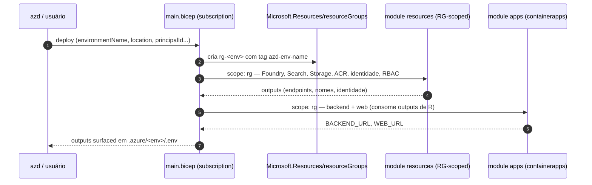
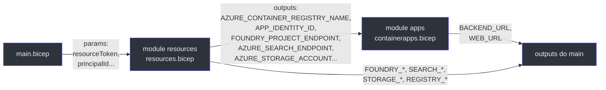

# O Stack azd (`main.bicep`)

> **Escopo.** [`infra/main.bicep`](https://github.com/ruinosus/foundry-assured/blob/feature/saas-d-packaging/infra/main.bicep) + [`infra/main.parameters.json`](https://github.com/ruinosus/foundry-assured/blob/feature/saas-d-packaging/infra/main.parameters.json). Este é o caminho de desenvolvimento/showcase (`azd up`).

## Por que subscription-scoped

Um `azd up` precisa criar **o próprio resource group** antes de tudo — e criar um RG só é possível a partir do escopo de subscription. Por isso `main.bicep` declara `targetScope = 'subscription'` ([main.bicep:10](https://github.com/ruinosus/foundry-assured/blob/feature/saas-d-packaging/infra/main.bicep#L10)) e cria o RG `rg-${environmentName}` ([main.bicep:46-50](https://github.com/ruinosus/foundry-assured/blob/feature/saas-d-packaging/infra/main.bicep#L46-L50)). **Contraste-chave (inferência a partir dos escopos):** o stamp dedicado é `resourceGroup`-scoped justamente porque a plataforma de Managed Application já criou o RG gerenciado para ele — ver [O Stamp Dedicado](./page-5.md).

## Fluxo de provisionamento

<!-- Sources: infra/main.bicep:46-88, infra/main.bicep:90-108 -->

## Os parâmetros de entrada

`main.bicep` declara parâmetros que o azd preenche a partir do ambiente. Os obrigatórios e os opcionais:

| Parâmetro | Default | Origem azd | Papel | Source |
|---|---|---|---|---|
| `environmentName` | — (1-64 chars) | `AZURE_ENV_NAME` | deriva nomes + tag `azd-env-name` | [main.bicep:12-15](https://github.com/ruinosus/foundry-assured/blob/feature/saas-d-packaging/infra/main.bicep#L12-L15) |
| `location` | — | `AZURE_LOCATION` | região primária | [main.bicep:18](https://github.com/ruinosus/foundry-assured/blob/feature/saas-d-packaging/infra/main.bicep#L18) |
| `principalId` | `''` | `AZURE_PRINCIPAL_ID` | usuário com acesso data-plane | [main.bicep:21](https://github.com/ruinosus/foundry-assured/blob/feature/saas-d-packaging/infra/main.bicep#L21) |
| `principalType` | `'User'` | `AZURE_PRINCIPAL_TYPE` | `User` local, `ServicePrincipal` em CI | [main.bicep:24](https://github.com/ruinosus/foundry-assured/blob/feature/saas-d-packaging/infra/main.bicep#L24) |
| `modelDeploymentName` | `'gpt-5-mini'` | — | nome do deploy do modelo de chat | [main.bicep:27](https://github.com/ruinosus/foundry-assured/blob/feature/saas-d-packaging/infra/main.bicep#L27) |
| `searchLocation` | `''` | `AZURE_SEARCH_LOCATION` | override de região do AI Search | [main.bicep:30](https://github.com/ruinosus/foundry-assured/blob/feature/saas-d-packaging/infra/main.bicep#L30) |
| `entraTenantId` | `''` | `ENTRA_TENANT_ID` | OBO do backend | [main.bicep:33](https://github.com/ruinosus/foundry-assured/blob/feature/saas-d-packaging/infra/main.bicep#L33) |
| `entraApiClientId` | `''` | `ENTRA_API_CLIENT_ID` | client id da API backend (OBO) | [main.bicep:36](https://github.com/ruinosus/foundry-assured/blob/feature/saas-d-packaging/infra/main.bicep#L36) |
| `entraApiClientSecret` | `''` `@secure()` | `ENTRA_API_CLIENT_SECRET` | secret OBO (nunca literal) | [main.bicep:38-40](https://github.com/ruinosus/foundry-assured/blob/feature/saas-d-packaging/infra/main.bicep#L38-L40) |

O mapeamento `${VAR}` → parâmetro vive em [`main.parameters.json`](https://github.com/ruinosus/foundry-assured/blob/feature/saas-d-packaging/infra/main.parameters.json) ([main.parameters.json:4-13](https://github.com/ruinosus/foundry-assured/blob/feature/saas-d-packaging/infra/main.parameters.json#L4-L13)). Note que `main.parameters.json` **não** mapeia `modelDeploymentName` — ele cai no default `gpt-5-mini`.

### Tokens derivados

Dois valores computados controlam unicidade e a região da busca:

- `resourceToken = toLower(uniqueString(subscription().id, environmentName, location))` — sufixo curto que torna nomes globalmente únicos ([main.bicep:42](https://github.com/ruinosus/foundry-assured/blob/feature/saas-d-packaging/infra/main.bicep#L42)).
- `effectiveSearchLocation = empty(searchLocation) ? location : searchLocation` — fallback de região do AI Search ([main.bicep:43](https://github.com/ruinosus/foundry-assured/blob/feature/saas-d-packaging/infra/main.bicep#L43)). Existe porque `eastus2` às vezes fica sem capacidade de Search ([main.bicep:29](https://github.com/ruinosus/foundry-assured/blob/feature/saas-d-packaging/infra/main.bicep#L29)).

## A composição dos dois módulos

<!-- Sources: infra/main.bicep:52-88, infra/main.bicep:90-108 -->

**Fato — o `module apps` depende de `resources` por dados, não por `dependsOn` explícito.** Os parâmetros de `apps` são todos `resources.outputs.*` ([main.bicep:74-87](https://github.com/ruinosus/foundry-assured/blob/feature/saas-d-packaging/infra/main.bicep#L74-L87)), o que cria a ordenação implícita (ARM resolve a dependência pela referência de output). Os parâmetros OBO (`entraTenantId`, `entraApiClientId`, `entraApiClientSecret`) passam direto do `main` para o `apps` ([main.bicep:84-86](https://github.com/ruinosus/foundry-assured/blob/feature/saas-d-packaging/infra/main.bicep#L84-L86)).

## Outputs surfaced para o `.env`

`main.bicep` re-exporta os outputs dos módulos para que o azd os grave em `.azure/<env>/.env` — é assim que o backend e o pipeline de ingestão descobrem os endpoints ([main.bicep:90-108](https://github.com/ruinosus/foundry-assured/blob/feature/saas-d-packaging/infra/main.bicep#L90-L108)):

| Output | Comentário | Source |
|---|---|---|
| `BACKEND_URL`, `WEB_URL` | FQDNs públicos dos Container Apps | [main.bicep:90-91](https://github.com/ruinosus/foundry-assured/blob/feature/saas-d-packaging/infra/main.bicep#L90-L91) |
| `FOUNDRY_PROJECT_ENDPOINT`, `FOUNDRY_MODEL`, `FOUNDRY_EMBEDDING_MODEL` | endpoint/modelos Foundry | [main.bicep:94-96](https://github.com/ruinosus/foundry-assured/blob/feature/saas-d-packaging/infra/main.bicep#L94-L96) |
| `AZURE_SEARCH_ENDPOINT`, `AZURE_SEARCH_KNOWLEDGE_BASE` | endpoint + nome da KB | [main.bicep:100-101](https://github.com/ruinosus/foundry-assured/blob/feature/saas-d-packaging/infra/main.bicep#L100-L101) |
| `AZURE_STORAGE_*` | conta/container do corpus | [main.bicep:103-105](https://github.com/ruinosus/foundry-assured/blob/feature/saas-d-packaging/infra/main.bicep#L103-L105) |
| `AZURE_CONTAINER_REGISTRY_*` | ACR para imagens dos hosted agents | [main.bicep:107-108](https://github.com/ruinosus/foundry-assured/blob/feature/saas-d-packaging/infra/main.bicep#L107-L108) |

## Disciplina de assinaturas de SDK/Bicep

O cabeçalho de `main.bicep` afirma que tipos/apiVersions foram verificados contra o sample oficial `microsoft-foundry/foundry-samples 00-basic` e o quickstart Bicep — coerente com a regra inegociável #1 ("não invente assinaturas") ([main.bicep:6-8](https://github.com/ruinosus/foundry-assured/blob/feature/saas-d-packaging/infra/main.bicep#L6-L8)).

## Related Pages

| Página | Relação |
|---|---|
| [Recursos Compartilhados](./page-3.md) | o `module resources` aqui composto |
| [Container Apps](./page-4.md) | o `module apps` aqui composto |
| [O Stamp Dedicado](./page-5.md) | re-parametriza estes mesmos módulos para a subscription do cliente |
| [Custo, Parâmetros e Scripts](./page-9.md) | tabela completa de parâmetros e custo |
