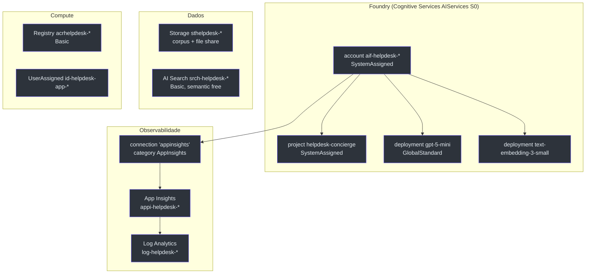
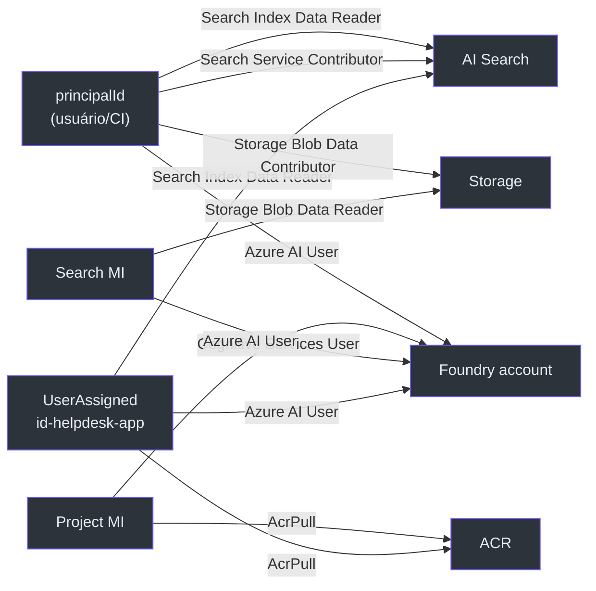

# Recursos Compartilhados (`resources.bicep`)

> **Escopo.** [`infra/resources.bicep`](https://github.com/ruinosus/foundry-assured/blob/feature/saas-d-packaging/infra/resources.bicep) — o módulo RG-scoped que define **todos** os recursos de nuvem (exceto os Container Apps). É composto por `main.bicep` (azd) e por `managedApp.bicep` (stamp dedicado), então tudo aqui vale para os dois veículos.

## Por que um único módulo

A decisão de arquitetura (ADR-002) é que o stamp dedicado seja uma **re-parametrização**, não uma cópia. Isso só funciona se a definição dos recursos viver em **um** lugar — este arquivo. Por isso ele é RG-scoped e não cria nenhum `resourceGroups` (quem cria o RG é o chamador) ([resources.bicep:1-10](https://github.com/ruinosus/foundry-assured/blob/feature/saas-d-packaging/infra/resources.bicep#L1-L10)).

## Inventário de recursos

<!-- Sources: infra/resources.bicep:75-262 -->

| Recurso | Tipo / apiVersion | Nome (var) | SKU/kind | Source |
|---|---|---|---|---|
| Foundry account | `Microsoft.CognitiveServices/accounts@2025-06-01` | `aif-helpdesk-${token}` | `AIServices` / `S0` | [resources.bicep:75-88](https://github.com/ruinosus/foundry-assured/blob/feature/saas-d-packaging/infra/resources.bicep#L75-L88) |
| Foundry project | `.../accounts/projects@2025-06-01` | `helpdesk-concierge` | SystemAssigned | [resources.bicep:90-97](https://github.com/ruinosus/foundry-assured/blob/feature/saas-d-packaging/infra/resources.bicep#L90-L97) |
| Modelo de chat | `.../accounts/deployments@2025-06-01` | `gpt-5-mini` (param) | `GlobalStandard` cap 100 | [resources.bicep:99-110](https://github.com/ruinosus/foundry-assured/blob/feature/saas-d-packaging/infra/resources.bicep#L99-L110) |
| Embedding | `.../accounts/deployments@2025-06-01` | `text-embedding-3-small` | `GlobalStandard` cap 100 | [resources.bicep:113-125](https://github.com/ruinosus/foundry-assured/blob/feature/saas-d-packaging/infra/resources.bicep#L113-L125) |
| Log Analytics | `Microsoft.OperationalInsights/workspaces@2023-09-01` | `log-helpdesk-${token}` | `PerGB2018`, 30d | [resources.bicep:136-144](https://github.com/ruinosus/foundry-assured/blob/feature/saas-d-packaging/infra/resources.bicep#L136-L144) |
| App Insights | `Microsoft.Insights/components@2020-02-02` | `appi-helpdesk-${token}` | web | [resources.bicep:146-155](https://github.com/ruinosus/foundry-assured/blob/feature/saas-d-packaging/infra/resources.bicep#L146-L155) |
| Connection telemetria | `.../accounts/connections@2025-06-01` | `appinsights` | category `AppInsights` | [resources.bicep:158-174](https://github.com/ruinosus/foundry-assured/blob/feature/saas-d-packaging/infra/resources.bicep#L158-L174) |
| Storage | `Microsoft.Storage/storageAccounts@2023-05-01` | `sthelpdesk-${token}` | `Standard_LRS` StorageV2 | [resources.bicep:180-191](https://github.com/ruinosus/foundry-assured/blob/feature/saas-d-packaging/infra/resources.bicep#L180-L191) |
| Container corpus | `.../blobServices/containers@2023-05-01` | `corpus` | publicAccess None | [resources.bicep:198-202](https://github.com/ruinosus/foundry-assured/blob/feature/saas-d-packaging/infra/resources.bicep#L198-L202) |
| File share | `.../fileServices/shares@2023-05-01` | `helpdesk-data` | 1 GiB | [resources.bicep:211-215](https://github.com/ruinosus/foundry-assured/blob/feature/saas-d-packaging/infra/resources.bicep#L211-L215) |
| AI Search | `Microsoft.Search/searchServices@2024-06-01-preview` | `srch-helpdesk-${token}` | `basic`, semantic `free` | [resources.bicep:221-236](https://github.com/ruinosus/foundry-assured/blob/feature/saas-d-packaging/infra/resources.bicep#L221-L236) |
| Container Registry | `Microsoft.ContainerRegistry/registries@2023-11-01-preview` | `acrhelpdesk${token}` | `Basic` | [resources.bicep:244-253](https://github.com/ruinosus/foundry-assured/blob/feature/saas-d-packaging/infra/resources.bicep#L244-L253) |
| Identidade app | `Microsoft.ManagedIdentity/userAssignedIdentities@2023-01-31` | `id-helpdesk-app-${token}` | — | [resources.bicep:258-262](https://github.com/ruinosus/foundry-assured/blob/feature/saas-d-packaging/infra/resources.bicep#L258-L262) |

### Detalhes que importam

- **Deployments sequenciais.** O embedding tem `dependsOn: [ modelDeployment ]` porque "deployments na mesma conta devem ser criados sequencialmente" ([resources.bicep:112-124](https://github.com/ruinosus/foundry-assured/blob/feature/saas-d-packaging/infra/resources.bicep#L112-L124)).
- **Versão do modelo.** `modelVersion = '2025-08-07'`; o comentário registra que as famílias gpt-4.x/gpt-4o saíram de GA em eastus2 — só a família gpt-5.x está GA ([resources.bicep:31-32](https://github.com/ruinosus/foundry-assured/blob/feature/saas-d-packaging/infra/resources.bicep#L31-L32)).
- **Semantic ranker grátis.** `semanticSearch: 'free'` habilita o ranker semântico (agentic retrieval) dentro da cota gratuita de 1k/mês ([resources.bicep:231](https://github.com/ruinosus/foundry-assured/blob/feature/saas-d-packaging/infra/resources.bicep#L231)).
- **AAD-or-key.** O Search aceita AAD com `aadAuthFailureMode: 'http401WithBearerChallenge'` ([resources.bicep:232-234](https://github.com/ruinosus/foundry-assured/blob/feature/saas-d-packaging/infra/resources.bicep#L232-L234)).
- **File share para tickets.** O share `helpdesk-data` existe para que `tickets.jsonl` (escrito em `/app/data`) sobreviva ao scale-to-zero ([resources.bicep:204-215](https://github.com/ruinosus/foundry-assured/blob/feature/saas-d-packaging/infra/resources.bicep#L204-L215)).

## A trama keyless: role assignments

O ponto mais denso do arquivo. Sete GUIDs de built-in roles ([resources.bicep:61-67](https://github.com/ruinosus/foundry-assured/blob/feature/saas-d-packaging/infra/resources.bicep#L61-L67)) são atribuídos entre identidades. **Fato:** nenhuma chave é gerada — toda comunicação é por identidade gerenciada.

<!-- Sources: infra/resources.bicep:264-387 -->

| Atribuição | Principal | Role | Por quê | Source |
|---|---|---|---|---|
| `appToRegistry` | app id | AcrPull | Container App puxa imagem do ACR | [resources.bicep:264-272](https://github.com/ruinosus/foundry-assured/blob/feature/saas-d-packaging/infra/resources.bicep#L264-L272) |
| `appToFoundry` | app id | Azure AI User | backend chama Foundry como ele mesmo | [resources.bicep:274-282](https://github.com/ruinosus/foundry-assured/blob/feature/saas-d-packaging/infra/resources.bicep#L274-L282) |
| `appToSearch` | app id | Search Index Data Reader | backend consulta a KB | [resources.bicep:284-292](https://github.com/ruinosus/foundry-assured/blob/feature/saas-d-packaging/infra/resources.bicep#L284-L292) |
| `searchToFoundry` | Search MI | Cognitive Services User | Search invoca modelo de embedding/planejamento | [resources.bicep:299-307](https://github.com/ruinosus/foundry-assured/blob/feature/saas-d-packaging/infra/resources.bicep#L299-L307) |
| `projectToFoundry` | Project MI | Azure AI User | memória invoca chat+embedding server-side | [resources.bicep:312-320](https://github.com/ruinosus/foundry-assured/blob/feature/saas-d-packaging/infra/resources.bicep#L312-L320) |
| `projectToRegistry` | Project MI | AcrPull | hosted agent puxa a imagem | [resources.bicep:324-332](https://github.com/ruinosus/foundry-assured/blob/feature/saas-d-packaging/infra/resources.bicep#L324-L332) |
| `searchToStorage` | Search MI | Storage Blob Data Reader | indexer lê o corpus | [resources.bicep:335-343](https://github.com/ruinosus/foundry-assured/blob/feature/saas-d-packaging/infra/resources.bicep#L335-L343) |
| `userSearchContributor` | principalId | Search Service Contributor | usuário cria KB/sources | [resources.bicep:346-354](https://github.com/ruinosus/foundry-assured/blob/feature/saas-d-packaging/infra/resources.bicep#L346-L354) |
| `userSearchReader` | principalId | Search Index Data Reader | usuário consulta KB local | [resources.bicep:357-365](https://github.com/ruinosus/foundry-assured/blob/feature/saas-d-packaging/infra/resources.bicep#L357-L365) |
| `userStorageContributor` | principalId | Storage Blob Data Contributor | usuário sobe o corpus | [resources.bicep:368-376](https://github.com/ruinosus/foundry-assured/blob/feature/saas-d-packaging/infra/resources.bicep#L368-L376) |
| `userAiUser` | principalId | Azure AI User | usuário no data-plane Foundry | [resources.bicep:379-387](https://github.com/ruinosus/foundry-assured/blob/feature/saas-d-packaging/infra/resources.bicep#L379-L387) |

**Fail-closed por design.** As quatro atribuições `user*` são `if (!empty(principalId))` ([resources.bicep:346](https://github.com/ruinosus/foundry-assured/blob/feature/saas-d-packaging/infra/resources.bicep#L346), [:357](https://github.com/ruinosus/foundry-assured/blob/feature/saas-d-packaging/infra/resources.bicep#L357), [:368](https://github.com/ruinosus/foundry-assured/blob/feature/saas-d-packaging/infra/resources.bicep#L368), [:379](https://github.com/ruinosus/foundry-assured/blob/feature/saas-d-packaging/infra/resources.bicep#L379)). Isso é **central para o stamp dedicado**: lá `principalId` é deixado vazio de propósito, então **nenhum grant de usuário** é criado — o publisher opera, o cliente não recebe acesso data-plane embutido (ver [O Stamp Dedicado](./page-5.md) e [managedApp.bicep:60-72](https://github.com/ruinosus/foundry-assured/blob/feature/saas-d-packaging/infra/managed-app/managedApp.bicep#L60-L72)).

## Outputs

O módulo exporta endpoints, nomes e a identidade compartilhada — consumidos por `containerapps.bicep` e re-exportados ao `.env` ([resources.bicep:393-417](https://github.com/ruinosus/foundry-assured/blob/feature/saas-d-packaging/infra/resources.bicep#L393-L417)). Destaques: `FOUNDRY_PROJECT_ENDPOINT` é montado como `https://${accountName}.services.ai.azure.com/api/projects/${projectName}` ([resources.bicep:393](https://github.com/ruinosus/foundry-assured/blob/feature/saas-d-packaging/infra/resources.bicep#L393)); `AZURE_SEARCH_KNOWLEDGE_BASE` é o literal `helpdesk-kb` ([resources.bicep:403](https://github.com/ruinosus/foundry-assured/blob/feature/saas-d-packaging/infra/resources.bicep#L403)); `APPLICATIONINSIGHTS_CONNECTION_STRING` exporta a connection string para o OTEL local ([resources.bicep:400](https://github.com/ruinosus/foundry-assured/blob/feature/saas-d-packaging/infra/resources.bicep#L400)).

## Related Pages

| Página | Relação |
|---|---|
| [O Stack azd](./page-2.md) | quem compõe este módulo com `principalId` preenchido |
| [O Stamp Dedicado](./page-5.md) | quem compõe este módulo com `principalId` vazio |
| [Container Apps](./page-4.md) | consome a identidade e os outputs daqui |
| [Identidades Entra, ACL](./page-8.md) | o controle de acesso por documento na KB |
