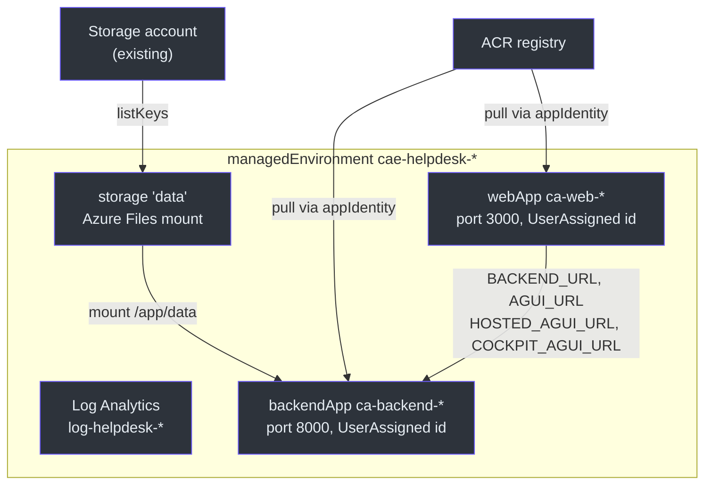
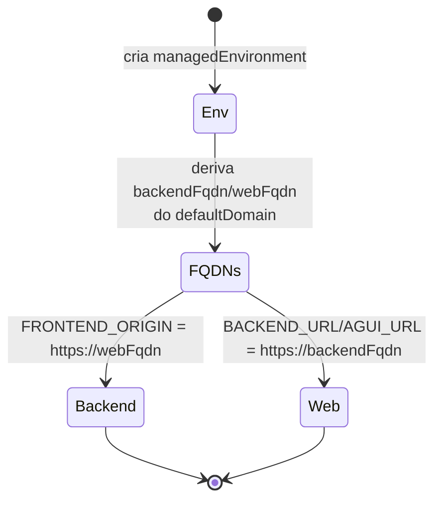

# Container Apps (`containerapps.bicep`)

> **Escopo.** [`infra/containerapps.bicep`](https://github.com/ruinosus/foundry-assured/blob/feature/saas-d-packaging/infra/containerapps.bicep) — o `module apps` composto por `main.bicep` e `managedApp.bicep`. Provisiona o backend FastAPI e o frontend Next.js como Azure Container Apps. Os hosted agents **não** estão aqui (são `azure.ai.agent`, ver [Hosted Agents](./page-7.md)).

## Por que Container Apps (e por que scale-to-zero)

Backend e web precisam de HTTP ingress público, mas o showcase fica ocioso a maior parte do tempo. Container Apps com `minReplicas: 0` dá **idle = $0** (cold start na primeira requisição) — a postura de custo que [`docs/COST.md`](https://github.com/ruinosus/foundry-assured/blob/feature/saas-d-packaging/docs/COST.md) descreve. O web escala `min 0 / max 3` ([containerapps.bicep:190](https://github.com/ruinosus/foundry-assured/blob/feature/saas-d-packaging/infra/containerapps.bicep#L190)), o backend `min 0 / max 1` ([containerapps.bicep:146](https://github.com/ruinosus/foundry-assured/blob/feature/saas-d-packaging/infra/containerapps.bicep#L146)).

**Fato — backend trava em 1 réplica de propósito.** O comentário explica: o `tickets.jsonl` é append-based, então >1 escritor poderia intercalar/corromper o arquivo ([containerapps.bicep:144-146](https://github.com/ruinosus/foundry-assured/blob/feature/saas-d-packaging/infra/containerapps.bicep#L144-L146)).

## Topologia

<!-- Sources: infra/containerapps.bicep:56-193 -->

## Os recursos

| Recurso | Tipo | Nome | Source |
|---|---|---|---|
| Log Analytics | `Microsoft.OperationalInsights/workspaces@2023-09-01` | `log-helpdesk-${token}` | [containerapps.bicep:46-54](https://github.com/ruinosus/foundry-assured/blob/feature/saas-d-packaging/infra/containerapps.bicep#L46-L54) |
| Managed env | `Microsoft.App/managedEnvironments@2024-03-01` | `cae-helpdesk-${token}` | [containerapps.bicep:56-69](https://github.com/ruinosus/foundry-assured/blob/feature/saas-d-packaging/infra/containerapps.bicep#L56-L69) |
| Storage mount | `.../managedEnvironments/storages@2024-03-01` | `data` (Azure Files RW) | [containerapps.bicep:77-88](https://github.com/ruinosus/foundry-assured/blob/feature/saas-d-packaging/infra/containerapps.bicep#L77-L88) |
| Backend app | `Microsoft.App/containerApps@2024-03-01` | `ca-backend-${token}` | [containerapps.bicep:95-149](https://github.com/ruinosus/foundry-assured/blob/feature/saas-d-packaging/infra/containerapps.bicep#L95-L149) |
| Web app | `Microsoft.App/containerApps@2024-03-01` | `ca-web-${token}` | [containerapps.bicep:151-193](https://github.com/ruinosus/foundry-assured/blob/feature/saas-d-packaging/infra/containerapps.bicep#L151-L193) |

> **Caveat de duplicação (importante para o stamp dedicado).** Este módulo declara um Log Analytics `log-helpdesk-${resourceToken}` ([containerapps.bicep:46-54](https://github.com/ruinosus/foundry-assured/blob/feature/saas-d-packaging/infra/containerapps.bicep#L46-L54)) — **o mesmo nome** que `resources.bicep` também declara ([resources.bicep:136-144](https://github.com/ruinosus/foundry-assured/blob/feature/saas-d-packaging/infra/resources.bicep#L136-L144)). Como dois deployments aninhados separados, isso **converge sob modo Incremental** (idempotente), mas é frágil sob Complete. É exatamente por isso que o stamp dedicado fixa o modo Incremental — ver [O Stamp Dedicado](./page-5.md).

## Quebra da referência circular backend ⇄ web

O backend precisa do FQDN do web (para `FRONTEND_ORIGIN`/CORS) e o web precisa do FQDN do backend (para proxiar AG-UI). Se um referenciasse a propriedade `ingress.fqdn` do outro, haveria dependência circular.

A solução: **derivar os dois FQDNs do `defaultDomain` do ambiente** (que é criado primeiro), em vez de ler o FQDN um do outro ([containerapps.bicep:90-93](https://github.com/ruinosus/foundry-assured/blob/feature/saas-d-packaging/infra/containerapps.bicep#L90-L93)).

<!-- Sources: infra/containerapps.bicep:90-93, infra/containerapps.bicep:130, infra/containerapps.bicep:181-186 -->

## Configuração do backend

O backend roda como identidade `UserAssigned` ([containerapps.bicep:99-102](https://github.com/ruinosus/foundry-assured/blob/feature/saas-d-packaging/infra/containerapps.bicep#L99-L102)), com ingress na porta 8000 ([containerapps.bicep:106-111](https://github.com/ruinosus/foundry-assured/blob/feature/saas-d-packaging/infra/containerapps.bicep#L106-L111)) e estas env vars ([containerapps.bicep:125-135](https://github.com/ruinosus/foundry-assured/blob/feature/saas-d-packaging/infra/containerapps.bicep#L125-L135)):

| Env var | Valor | Source |
|---|---|---|
| `FOUNDRY_PROJECT_ENDPOINT` / `FOUNDRY_MODEL` | params do módulo | [containerapps.bicep:126-127](https://github.com/ruinosus/foundry-assured/blob/feature/saas-d-packaging/infra/containerapps.bicep#L126-L127) |
| `AZURE_SEARCH_ENDPOINT` / `AZURE_SEARCH_KNOWLEDGE_BASE` | params | [containerapps.bicep:128-129](https://github.com/ruinosus/foundry-assured/blob/feature/saas-d-packaging/infra/containerapps.bicep#L128-L129) |
| `FRONTEND_ORIGIN` | `https://${webFqdn}` (CORS) | [containerapps.bicep:130](https://github.com/ruinosus/foundry-assured/blob/feature/saas-d-packaging/infra/containerapps.bicep#L130) |
| `AZURE_CLIENT_ID` | client id da app identity (DefaultAzureCredential) | [containerapps.bicep:131](https://github.com/ruinosus/foundry-assured/blob/feature/saas-d-packaging/infra/containerapps.bicep#L131) |
| `ENTRA_*` (OBO) | tenant/client + `secretRef` ao secret | [containerapps.bicep:132-134](https://github.com/ruinosus/foundry-assured/blob/feature/saas-d-packaging/infra/containerapps.bicep#L132-L134) |

**Segredo OBO via Container App secret.** `entraApiClientSecret` é declarado `@secure()` ([containerapps.bicep:33-34](https://github.com/ruinosus/foundry-assured/blob/feature/saas-d-packaging/infra/containerapps.bicep#L33-L34)), virado em secret `entra-api-secret` ([containerapps.bicep:115-117](https://github.com/ruinosus/foundry-assured/blob/feature/saas-d-packaging/infra/containerapps.bicep#L115-L117)) e referenciado por `secretRef`, nunca como valor literal — coerente com a regra #2.

### Persistência

O share `data` (Azure Files) é montado em `/app/data`; é onde `tickets.jsonl` persiste ([containerapps.bicep:136-143](https://github.com/ruinosus/foundry-assured/blob/feature/saas-d-packaging/infra/containerapps.bicep#L136-L143)). O acesso ao Files é só por account-key (não há MI para a share key), por isso o módulo a obtém via `listKeys()` ([containerapps.bicep:71-88](https://github.com/ruinosus/foundry-assured/blob/feature/saas-d-packaging/infra/containerapps.bicep#L71-L88)).

## Configuração do web

O web roda na porta 3000 ([containerapps.bicep:162-167](https://github.com/ruinosus/foundry-assured/blob/feature/saas-d-packaging/infra/containerapps.bicep#L162-L167)) e recebe os endpoints AG-UI server-side ([containerapps.bicep:178-187](https://github.com/ruinosus/foundry-assured/blob/feature/saas-d-packaging/infra/containerapps.bicep#L178-L187)): `BACKEND_URL`, `AGUI_URL` (`/helpdesk`), `HOSTED_AGUI_URL` (`/helpdesk-hosted`) e `COCKPIT_AGUI_URL` (`/cockpit`). As `NEXT_PUBLIC_*` (browser-side) são baked na imagem no build, via `buildArgs` em [`azure.yaml`](https://github.com/ruinosus/foundry-assured/blob/feature/saas-d-packaging/azure.yaml) ([azure.yaml:57-60](https://github.com/ruinosus/foundry-assured/blob/feature/saas-d-packaging/azure.yaml#L57-L60), comentário em [containerapps.bicep:179-180](https://github.com/ruinosus/foundry-assured/blob/feature/saas-d-packaging/infra/containerapps.bicep#L179-L180)).

## Imagem placeholder

Ambos os apps nascem com `mcr.microsoft.com/azuredocs/containerapps-helloworld:latest` ([containerapps.bicep:42](https://github.com/ruinosus/foundry-assured/blob/feature/saas-d-packaging/infra/containerapps.bicep#L42)); o azd substitui pela imagem real no `deploy`, casando pela tag `azd-service-name` (`backend`/`web`) ([containerapps.bicep:98](https://github.com/ruinosus/foundry-assured/blob/feature/saas-d-packaging/infra/containerapps.bicep#L98), [:154](https://github.com/ruinosus/foundry-assured/blob/feature/saas-d-packaging/infra/containerapps.bicep#L154)). **(Inferência)** Esse é o padrão azd: provisiona o app com placeholder, depois faz push+update — confirmado pelo comentário de cabeçalho ([containerapps.bicep:1-3](https://github.com/ruinosus/foundry-assured/blob/feature/saas-d-packaging/infra/containerapps.bicep#L1-L3)).

## Related Pages

| Página | Relação |
|---|---|
| [Recursos Compartilhados](./page-3.md) | provê a identidade, o ACR e o storage usados aqui |
| [O Stack azd](./page-2.md) | compõe este módulo e re-exporta `BACKEND_URL`/`WEB_URL` |
| [O Stamp Dedicado](./page-5.md) | re-usa este módulo e fixa o modo Incremental por causa do Log Analytics duplicado |
| [Hosted Agents](./page-7.md) | os outros três serviços, fora dos Container Apps |
