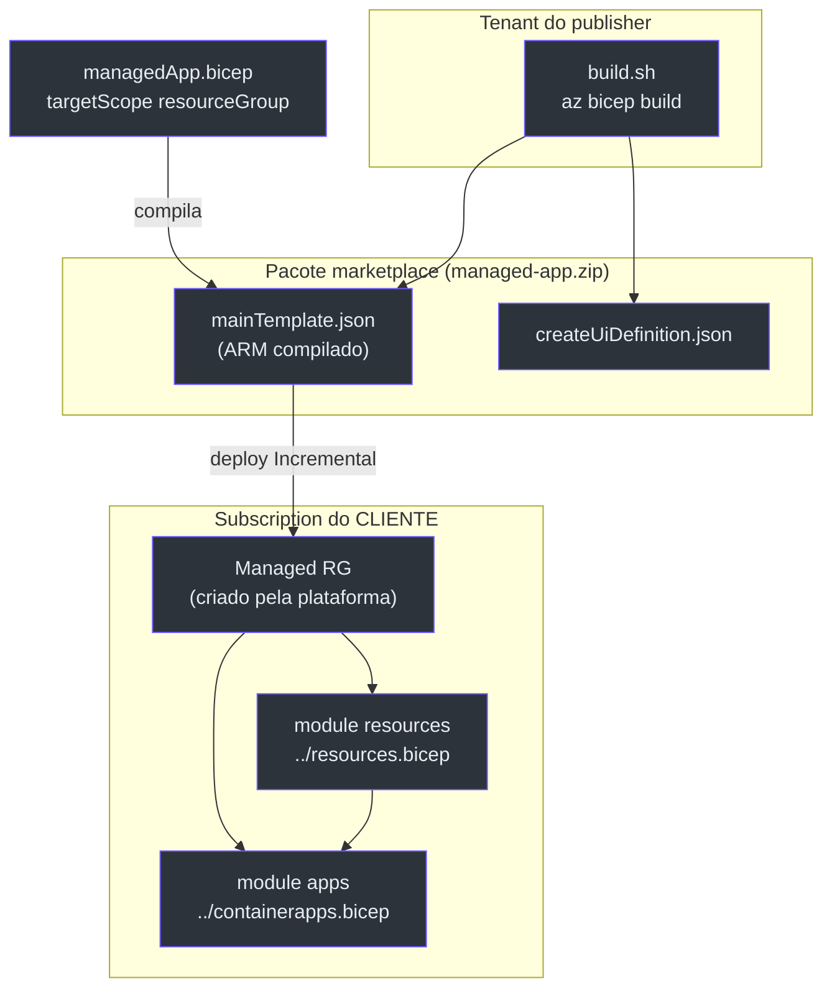
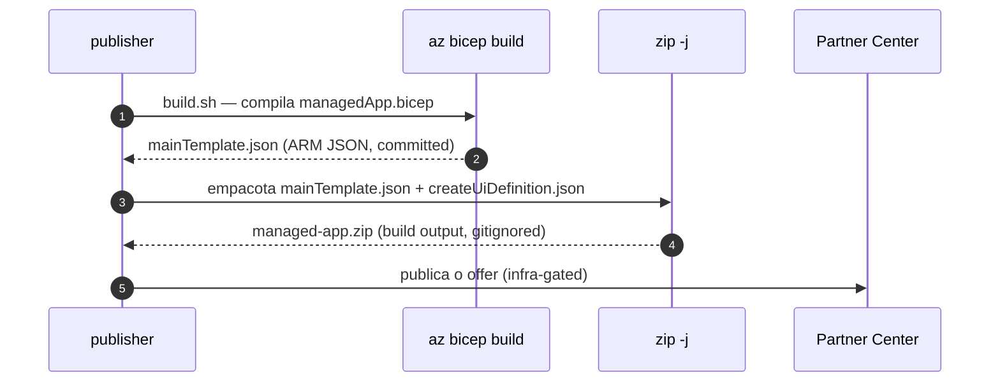

# O Stamp Dedicado — Azure Managed Application

> **Escopo.** [`infra/managed-app/`](https://github.com/ruinosus/foundry-assured/blob/feature/saas-d-packaging/infra/managed-app/) — o pacote de **Azure Managed Application** (ADR-002). É a forma de entregar um **control plane dedicado dentro da subscription do cliente**, operado pelo publisher. **NOVO na v0.2.0.**

## Por que uma Managed Application

ADR-002 decide que o stamp dedicado (enterprise) seja entregue como Managed Application: o publisher publica o control plane; ele implanta num resource group *gerenciado* dentro da subscription do **cliente**, que o cliente não pode modificar diretamente — "tudo é do cliente", com o publisher como operador ([managedApp.bicep:3-9](https://github.com/ruinosus/foundry-assured/blob/feature/saas-d-packaging/infra/managed-app/managedApp.bicep#L3-L9), [ADR-002](https://github.com/ruinosus/foundry-assured/blob/feature/saas-d-packaging/docs/adr/ADR-002-dedicated-stamp-managed-app-lighthouse.md)).

## O insight central: re-parametrização, não cópia

A diferença para `main.bicep`:

| Aspecto | `main.bicep` (azd) | `managedApp.bicep` (stamp) | Source |
|---|---|---|---|
| `targetScope` | `subscription` | `resourceGroup` | [main.bicep:10](https://github.com/ruinosus/foundry-assured/blob/feature/saas-d-packaging/infra/main.bicep#L10) vs [managedApp.bicep:21](https://github.com/ruinosus/foundry-assured/blob/feature/saas-d-packaging/infra/managed-app/managedApp.bicep#L21) |
| Cria o RG? | Sim (`Microsoft.Resources/resourceGroups`) | **Não** — a plataforma já criou o RG gerenciado | [main.bicep:46-50](https://github.com/ruinosus/foundry-assured/blob/feature/saas-d-packaging/infra/main.bicep#L46-L50) vs [managedApp.bicep:10-15](https://github.com/ruinosus/foundry-assured/blob/feature/saas-d-packaging/infra/managed-app/managedApp.bicep#L10-L15) |
| `principalId` para os módulos | `principalId` real | `''` (vazio, intencional) | [main.bicep:59](https://github.com/ruinosus/foundry-assured/blob/feature/saas-d-packaging/infra/main.bicep#L59) vs [managedApp.bicep:70](https://github.com/ruinosus/foundry-assured/blob/feature/saas-d-packaging/infra/managed-app/managedApp.bicep#L70) |
| `resourceToken` | `(subscription, env, location)` | `(subscription, resourceGroup().id, location)` | [main.bicep:42](https://github.com/ruinosus/foundry-assured/blob/feature/saas-d-packaging/infra/main.bicep#L42) vs [managedApp.bicep:45](https://github.com/ruinosus/foundry-assured/blob/feature/saas-d-packaging/infra/managed-app/managedApp.bicep#L45) |
| Módulos compostos | `resources.bicep` + `containerapps.bicep` | os **mesmos** (`../resources.bicep` + `../containerapps.bicep`) | [main.bicep:52-88](https://github.com/ruinosus/foundry-assured/blob/feature/saas-d-packaging/infra/main.bicep#L52-L88) vs [managedApp.bicep:64-97](https://github.com/ruinosus/foundry-assured/blob/feature/saas-d-packaging/infra/managed-app/managedApp.bicep#L64-L97) |

<!-- Sources: infra/managed-app/managedApp.bicep:21-97, infra/managed-app/build.sh:19-24 -->

## `principalId` vazio = fail-closed

A escolha mais importante de segurança: `managedApp.bicep` passa `principalId: ''` para o `module resources` ([managedApp.bicep:70](https://github.com/ruinosus/foundry-assured/blob/feature/saas-d-packaging/infra/managed-app/managedApp.bicep#L70)). Como as quatro role assignments de usuário em `resources.bicep` são condicionais a `if (!empty(principalId))` ([resources.bicep:346-387](https://github.com/ruinosus/foundry-assured/blob/feature/saas-d-packaging/infra/resources.bicep#L346-L387)), **nenhum grant data-plane de usuário é criado** no stamp. O comentário deixa explícito: no modelo managed-app o publisher opera o stamp, então não se cria grant de usuário — fail-closed por default ([managedApp.bicep:60-72](https://github.com/ruinosus/foundry-assured/blob/feature/saas-d-packaging/infra/managed-app/managedApp.bicep#L60-L72)).

## O caveat de modo Incremental (NÃO mude para Complete)

Ambos os módulos compostos declaram um Log Analytics com **o mesmo nome** `log-helpdesk-${resourceToken}` ([resources.bicep:136-144](https://github.com/ruinosus/foundry-assured/blob/feature/saas-d-packaging/infra/resources.bicep#L136-L144), [containerapps.bicep:46-54](https://github.com/ruinosus/foundry-assured/blob/feature/saas-d-packaging/infra/containerapps.bicep#L46-L54)). Como dois deployments aninhados separados:

- **Modo Incremental** → COMPILA limpo e CONVERGE (ambos implantam o mesmo workspace → idempotente).
- **Modo Complete** → comportamento indefinido / foot-gun ao reconciliar um recurso de nome duplicado declarado por dois módulos.

Conclusão registrada no código: **updates da managed application DEVEM usar Incremental** ([managedApp.bicep:48-57](https://github.com/ruinosus/foundry-assured/blob/feature/saas-d-packaging/infra/managed-app/managedApp.bicep#L48-L57)). O `mainTemplate.json` compilado confirma — o deployment `resources` tem `"mode": "Incremental"` ([managedApp.bicep:64-73](https://github.com/ruinosus/foundry-assured/blob/feature/saas-d-packaging/infra/managed-app/managedApp.bicep#L64-L73)). **(Fato — verificado no template ARM)**: o `mainTemplate.json` declara os deployments aninhados `resources` e `containerapps` em modo Incremental.

## O pacote de marketplace

<!-- Sources: infra/managed-app/build.sh:1-26, infra/managed-app/.gitignore:1-3 -->

| Artefato | Papel | Committed? | Source |
|---|---|---|---|
| `managedApp.bicep` | template fonte (Bicep) | sim | [managedApp.bicep:1](https://github.com/ruinosus/foundry-assured/blob/feature/saas-d-packaging/infra/managed-app/managedApp.bicep#L1) |
| `mainTemplate.json` | root ARM exigido pela Managed App (compilado) | sim | [build.sh:19-20](https://github.com/ruinosus/foundry-assured/blob/feature/saas-d-packaging/infra/managed-app/build.sh#L19-L20) |
| `createUiDefinition.json` | wizard do portal (basics + steps) | sim | [createUiDefinition.json:1-91](https://github.com/ruinosus/foundry-assured/blob/feature/saas-d-packaging/infra/managed-app/createUiDefinition.json#L1-L91) |
| `build.sh` | compila + zipa o pacote | sim | [build.sh:1-27](https://github.com/ruinosus/foundry-assured/blob/feature/saas-d-packaging/infra/managed-app/build.sh#L1-L27) |
| `managed-app.zip` | artefato de marketplace | **não** (gitignored) | [.gitignore:1-3](https://github.com/ruinosus/foundry-assured/blob/feature/saas-d-packaging/infra/managed-app/.gitignore#L1-L3) |

O `build.sh` compila `managedApp.bicep → mainTemplate.json` via `az bicep build` ([build.sh:19-20](https://github.com/ruinosus/foundry-assured/blob/feature/saas-d-packaging/infra/managed-app/build.sh#L19-L20)) e zipa os dois arquivos *flat* (`zip -j`, sem caminhos de diretório), como o Partner Center exige ([build.sh:22-24](https://github.com/ruinosus/foundry-assured/blob/feature/saas-d-packaging/infra/managed-app/build.sh#L22-L24)).

### O wizard (`createUiDefinition.json`)

Expõe ao cliente apenas o essencial: um TextBox `modelDeploymentName` (default `gpt-5-mini`, regex de validação) nos basics ([createUiDefinition.json:6-19](https://github.com/ruinosus/foundry-assured/blob/feature/saas-d-packaging/infra/managed-app/createUiDefinition.json#L6-L19)) e um step opcional "Entra OBO" com tenant/clientId (validados como GUID-ou-vazio) e um PasswordBox para o secret ([createUiDefinition.json:20-82](https://github.com/ruinosus/foundry-assured/blob/feature/saas-d-packaging/infra/managed-app/createUiDefinition.json#L20-L82)). Os `outputs` casam exatamente com os parâmetros do `managedApp.bicep` ([createUiDefinition.json:83-89](https://github.com/ruinosus/foundry-assured/blob/feature/saas-d-packaging/infra/managed-app/createUiDefinition.json#L83-L89)). Note que o wizard **não** pede `principalId` — coerente com o fail-closed acima.

## Outputs do stamp

`managedApp.bicep` exporta os mesmos endpoints do azd, mais um comentário de que servem ao **post-deploy wiring** do publisher (hosted agent + Toolbox), conforme o runbook D-packaging ([managedApp.bicep:99-109](https://github.com/ruinosus/foundry-assured/blob/feature/saas-d-packaging/infra/managed-app/managedApp.bicep#L99-L109)).

## Related Pages

| Página | Relação |
|---|---|
| [Recursos Compartilhados](./page-3.md) | o módulo re-parametrizado aqui; o `if (!empty(principalId))` |
| [Container Apps](./page-4.md) | o outro módulo re-parametrizado; o Log Analytics duplicado |
| [Azure Lighthouse](./page-6.md) | o veículo complementar (shared model) decidido no mesmo ADR-002 |
| [Hosted Agents](./page-7.md) | o post-deploy wiring (Toolbox) referenciado nos outputs |
