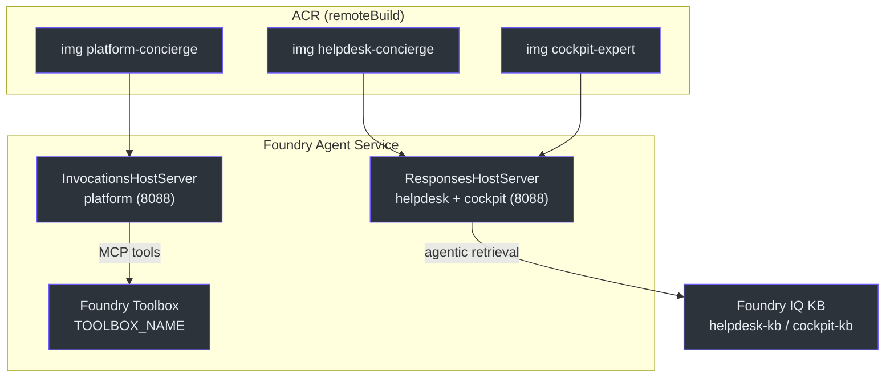

# Hosted Agents (`azure.ai.agent`)

> **Escopo.** Os três serviços declarados com `host: azure.ai.agent` em [`azure.yaml`](https://github.com/ruinosus/foundry-assured/blob/feature/saas-d-packaging/azure.yaml) e seus diretórios de container: [`apps/hosted-agent`](https://github.com/ruinosus/foundry-assured/blob/feature/saas-d-packaging/apps/hosted-agent/), [`apps/hosted-cockpit`](https://github.com/ruinosus/foundry-assured/blob/feature/saas-d-packaging/apps/hosted-cockpit/) e o **novo** [`apps/hosted-platform`](https://github.com/ruinosus/foundry-assured/blob/feature/saas-d-packaging/apps/hosted-platform/). Estes **não** são Container Apps — são containers servidos pelo Foundry Agent Service.

## Por que hosted agents (vs o backend AG-UI)

O backend (Container App) serve o app vivo, multi-usuário, com OBO/memória/HITL. Um **hosted agent** é o oposto: um container **single-identity, request/response**, empacotado e operado pelo Foundry Agent Service. É a unidade que o stamp dedicado e o Toolbox referenciam no post-deploy. Por isso os três aparecem em `azure.yaml` com `host: azure.ai.agent` e `remoteBuild: true` ([azure.yaml:14-49](https://github.com/ruinosus/foundry-assured/blob/feature/saas-d-packaging/azure.yaml#L14-L49)) — o ACR builda a imagem remotamente, o Foundry a puxa (via a role `projectToRegistry`/AcrPull, ver [Recursos Compartilhados](./page-3.md)).

## Os três agentes

| Serviço | Dir | Protocolo | Porta | Identidade-fonte (app vivo) | Source |
|---|---|---|---|---|---|
| `helpdesk-concierge` | `apps/hosted-agent` | **Responses** | 8088 | workflow `triage→retrieve→resolve` | [agent.yaml:1-5](https://github.com/ruinosus/foundry-assured/blob/feature/saas-d-packaging/apps/hosted-agent/agent.yaml#L1-L5) |
| `cockpit-expert` | `apps/hosted-cockpit` | **Responses** | 8088 | `app/agents/cockpit.py` (Q&A) | [agent.yaml:1-5](https://github.com/ruinosus/foundry-assured/blob/feature/saas-d-packaging/apps/hosted-cockpit/agent.yaml#L1-L5) |
| `platform-concierge` **NOVO** | `apps/hosted-platform` | **Invocations** | 8088 | `app/agents/platform.py` (tools) | [agent.yaml:1-5](https://github.com/ruinosus/foundry-assured/blob/feature/saas-d-packaging/apps/hosted-platform/agent.yaml#L1-L5) |

<!-- Sources: apps/hosted-agent/main.py:107, apps/hosted-cockpit/main.py:18-19, apps/hosted-platform/main.py:75 -->

## Responses vs Invocations (o porquê do novo agente)

A distinção mais importante da v0.2.0. Os dois agentes "grounded" (helpdesk, cockpit) servem **Responses** porque Q&A puro cabe num modelo single-identity request/response — e por isso **largam** OBO/memória/HITL ([hosted-agent/main.py:9-16](https://github.com/ruinosus/foundry-assured/blob/feature/saas-d-packaging/apps/hosted-agent/main.py#L9-L16), [hosted-cockpit/main.py:9-12](https://github.com/ruinosus/foundry-assured/blob/feature/saas-d-packaging/apps/hosted-cockpit/main.py#L9-L12)).

O `platform-concierge` é diferente: ele mantém **capacidade de tool + a interrupção de write-approval**, o que o protocolo Responses **não** consegue round-trippar. Por isso ele serve **Invocations** (raw AG-UI) via `InvocationsHostServer` ([hosted-platform/main.py:7-21](https://github.com/ruinosus/foundry-assured/blob/feature/saas-d-packaging/apps/hosted-platform/main.py#L7-L21), [:75](https://github.com/ruinosus/foundry-assured/blob/feature/saas-d-packaging/apps/hosted-platform/main.py#L75)). É descrito como o "FULL-PARITY Invocations twin" do agente vivo de platform — não o stripping single-identity que os grounded fazem ([hosted-platform/main.py:13-14](https://github.com/ruinosus/foundry-assured/blob/feature/saas-d-packaging/apps/hosted-platform/main.py#L13-L14)).

| | Responses | Invocations |
|---|---|---|
| Host server | `ResponsesHostServer` | `InvocationsHostServer` |
| Suporta interrupt/HITL | não | **sim** |
| Agentes | helpdesk, cockpit | platform |
| `protocol` no agent.yaml | `responses` | `invocations` |
| Source | [hosted-agent/main.py:107](https://github.com/ruinosus/foundry-assured/blob/feature/saas-d-packaging/apps/hosted-agent/main.py#L107) | [hosted-platform/main.py:75](https://github.com/ruinosus/foundry-assured/blob/feature/saas-d-packaging/apps/hosted-platform/main.py#L75) |

A declaração de protocolo bate com isso: `responses` em [hosted-agent/agent.yaml:3-5](https://github.com/ruinosus/foundry-assured/blob/feature/saas-d-packaging/apps/hosted-agent/agent.yaml#L3-L5) e `invocations` em [hosted-platform/agent.yaml:3-5](https://github.com/ruinosus/foundry-assured/blob/feature/saas-d-packaging/apps/hosted-platform/agent.yaml#L3-L5).

## helpdesk-concierge — workflow como agente

O `main.py` reconstrói o pipeline `triage→retrieve→resolve` com `WorkflowBuilder`, cada passo um `AgentExecutor` com `context_mode="last_agent"` ([hosted-agent/main.py:73-105](https://github.com/ruinosus/foundry-assured/blob/feature/saas-d-packaging/apps/hosted-agent/main.py#L73-L105)). Aterrissa na mesma Foundry IQ KB via `AzureAISearchContextProvider(mode="agentic")` ([hosted-agent/main.py:63-68](https://github.com/ruinosus/foundry-assured/blob/feature/saas-d-packaging/apps/hosted-agent/main.py#L63-L68)). O workflow vira agente com `.as_agent()` e é servido por `ResponsesHostServer` ([hosted-agent/main.py:95-108](https://github.com/ruinosus/foundry-assured/blob/feature/saas-d-packaging/apps/hosted-agent/main.py#L95-L108)). Auth é a identidade injetada pela plataforma via `DefaultAzureCredential` ([hosted-agent/main.py:54](https://github.com/ruinosus/foundry-assured/blob/feature/saas-d-packaging/apps/hosted-agent/main.py#L54)).

## platform-concierge — tools via Toolbox (ADR-011)

O ponto-chave: **as tools não são montadas por request** (isso é o caminho OBO vivo, `build_mcp_tools()`). Para um hosted agent, as tools são configuradas **no Foundry Toolbox em deploy time**, e o agente as resolve pelo Toolbox referenciado por `TOOLBOX_NAME` ([hosted-platform/main.py:18-21](https://github.com/ruinosus/foundry-assured/blob/feature/saas-d-packaging/apps/hosted-platform/main.py#L18-L21), [:54-57](https://github.com/ruinosus/foundry-assured/blob/feature/saas-d-packaging/apps/hosted-platform/main.py#L54-L57)). O passthrough de identidade OAuth é **DADO** no Toolbox/connection, nunca código de credencial à mão (ADR-011 / regra #6) ([hosted-platform/main.py:18-20](https://github.com/ruinosus/foundry-assured/blob/feature/saas-d-packaging/apps/hosted-platform/main.py#L18-L20)). O binding Toolbox↔agente é deploy-time e infra-gated, marcado com `TODO(infra-gated)` no código ([hosted-platform/main.py:59-62](https://github.com/ruinosus/foundry-assured/blob/feature/saas-d-packaging/apps/hosted-platform/main.py#L59-L62)).

## Configuração — agent.yaml

Cada agente declara `kind: hosted`, recursos `0.5 vCPU / 1Gi` e suas env vars (o `FOUNDRY_PROJECT_ENDPOINT` e a connection string de App Insights são **injetados pela plataforma**):

| Agente | Env vars próprias | Source |
|---|---|---|
| helpdesk | `AZURE_AI_MODEL_DEPLOYMENT_NAME`, `AZURE_SEARCH_ENDPOINT`, `AZURE_SEARCH_KNOWLEDGE_BASE` (`${...}` do azd) | [hosted-agent/agent.yaml:9-17](https://github.com/ruinosus/foundry-assured/blob/feature/saas-d-packaging/apps/hosted-agent/agent.yaml#L9-L17) |
| cockpit | idem, mas `AZURE_SEARCH_KNOWLEDGE_BASE: cockpit-kb` (literal, não output azd) | [hosted-cockpit/agent.yaml:9-19](https://github.com/ruinosus/foundry-assured/blob/feature/saas-d-packaging/apps/hosted-cockpit/agent.yaml#L9-L19) |
| platform | `AZURE_AI_MODEL_DEPLOYMENT_NAME` + `TOOLBOX_NAME` | [hosted-platform/agent.yaml:9-19](https://github.com/ruinosus/foundry-assured/blob/feature/saas-d-packaging/apps/hosted-platform/agent.yaml#L9-L19) |

**Detalhe:** o cockpit aterrissa numa **segunda KB** (`cockpit-kb`), criada data-plane pelo ingest, não a `helpdesk-kb` — por isso o nome é fixo no yaml ([hosted-cockpit/agent.yaml:16-19](https://github.com/ruinosus/foundry-assured/blob/feature/saas-d-packaging/apps/hosted-cockpit/agent.yaml#L16-L19)).

## Os containers

Os três Dockerfiles são quase idênticos: `python:3.12-slim`, copiam o dir para `user_agent/`, instalam `requirements.txt`, expõem 8088 e rodam `python main.py` ([hosted-agent/Dockerfile:4-19](https://github.com/ruinosus/foundry-assured/blob/feature/saas-d-packaging/apps/hosted-agent/Dockerfile#L4-L19), [hosted-platform/Dockerfile:4-19](https://github.com/ruinosus/foundry-assured/blob/feature/saas-d-packaging/apps/hosted-platform/Dockerfile#L4-L19)). As deps de cada um diferem: helpdesk/cockpit incluem `agent-framework-azure-ai-search` (precisam do KB provider); platform não, mas todos têm `agent-framework-foundry-hosting` ([hosted-agent/requirements.txt:1-4](https://github.com/ruinosus/foundry-assured/blob/feature/saas-d-packaging/apps/hosted-agent/requirements.txt#L1-L4), [hosted-platform/requirements.txt:1-3](https://github.com/ruinosus/foundry-assured/blob/feature/saas-d-packaging/apps/hosted-platform/requirements.txt#L1-L3)).

## Related Pages

| Página | Relação |
|---|---|
| [Recursos Compartilhados](./page-3.md) | a role `projectToRegistry` que deixa o Foundry puxar estas imagens |
| [O Stamp Dedicado](./page-5.md) | o post-deploy wiring (hosted agent + Toolbox) referenciado nos outputs |
| [Visão Geral](./page-1.md) | os cinco serviços de `azure.yaml` |
| [Container Apps](./page-4.md) | os outros dois serviços (backend/web), que são Container Apps |
