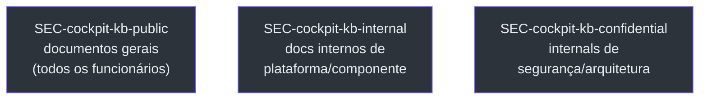
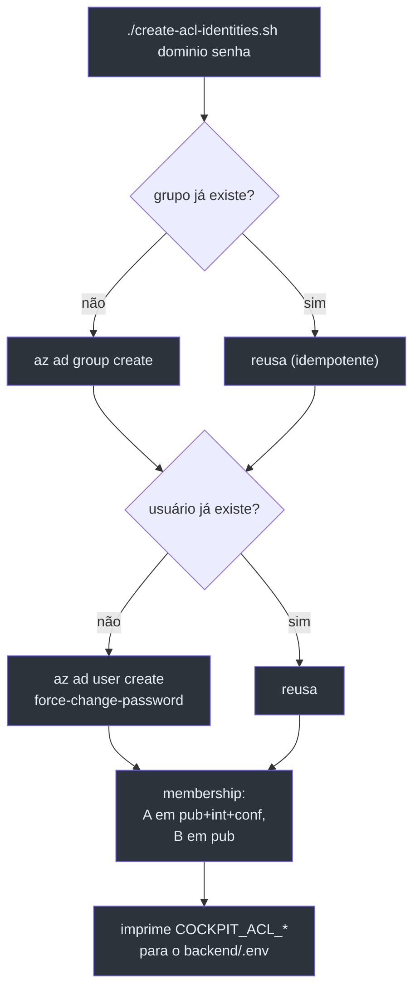

# Identidades Entra, ACL e Usuários de Teste

> **Escopo.** [`infra/entra/`](https://github.com/ruinosus/foundry-assured/blob/feature/saas-d-packaging/infra/entra/) — `entra.bicep`, `create-acl-identities.sh`, `create-test-users.sh`, `bicepconfig.json`. É a base do **controle de acesso por documento** na KB. Princípio do projeto (regra #6): controle de acesso é **DADO** (os grupos de leitura de cada fonte), nunca lógica de classificação no código.

## Por que grupos por classificação (e não por artefato)

O padrão enterprise least-privilege: em vez de um grupo por documento, os documentos são **classificados por sensibilidade** e cada tier é **um** grupo cloud-only security-enabled. Uma multinacional mapeia esses tiers aos seus próprios tiers existentes; o mapeamento componente→tier vive no pipeline de ingest, então o esquema se adapta sem mexer nas identidades ([entra.bicep:3-9](https://github.com/ruinosus/foundry-assured/blob/feature/saas-d-packaging/infra/entra/entra.bicep#L3-L9)).

## Os três tiers

<!-- Sources: infra/entra/entra.bicep:27-52 -->

| Grupo | `uniqueName` | Conteúdo | Source |
|---|---|---|---|
| `SEC-cockpit-kb-public` | `sec-cockpit-kb-public` | público/geral (todos) | [entra.bicep:27-34](https://github.com/ruinosus/foundry-assured/blob/feature/saas-d-packaging/infra/entra/entra.bicep#L27-L34) |
| `SEC-cockpit-kb-internal` | `sec-cockpit-kb-internal` | plataforma/componente interno | [entra.bicep:36-43](https://github.com/ruinosus/foundry-assured/blob/feature/saas-d-packaging/infra/entra/entra.bicep#L36-L43) |
| `SEC-cockpit-kb-confidential` | `sec-cockpit-kb-confidential` | segurança/arquitetura | [entra.bicep:45-52](https://github.com/ruinosus/foundry-assured/blob/feature/saas-d-packaging/infra/entra/entra.bicep#L45-L52) |

Todos são `mailEnabled: false`, `securityEnabled: true` (grupos de segurança cloud-only) ([entra.bicep:32-33](https://github.com/ruinosus/foundry-assured/blob/feature/saas-d-packaging/infra/entra/entra.bicep#L32-L33)). Os outputs são os object-IDs dos três grupos — alimentam o mapeamento de ACL do ingest (`COCKPIT_ACL_GROUPS`) e o backend ([entra.bicep:54-56](https://github.com/ruinosus/foundry-assured/blob/feature/saas-d-packaging/infra/entra/entra.bicep#L54-L56)).

## `entra.bicep` via Microsoft Graph (extensão Bicep)

O `entra.bicep` é `targetScope = 'tenant'` e usa a extensão `microsoftGraphV1` para criar objetos de diretório (`Microsoft.Graph/groups@v1.0`) — auto-instalável ([entra.bicep:23-25](https://github.com/ruinosus/foundry-assured/blob/feature/saas-d-packaging/infra/entra/entra.bicep#L23-L25)). A extensão é habilitada em [`bicepconfig.json`](https://github.com/ruinosus/foundry-assured/blob/feature/saas-d-packaging/infra/entra/bicepconfig.json): `experimentalFeaturesEnabled.extensibility: true` e a extensão apontando para `br:mcr.microsoft.com/bicep/extensions/microsoftgraph/v1.0:0.1.8-preview` ([bicepconfig.json:2-7](https://github.com/ruinosus/foundry-assured/blob/feature/saas-d-packaging/infra/entra/bicepconfig.json#L2-L7)). A identidade que deploya precisa de direitos de diretório (ex.: Groups Administrator) ([entra.bicep:11-21](https://github.com/ruinosus/foundry-assured/blob/feature/saas-d-packaging/infra/entra/entra.bicep#L11-L21)).

## A alternativa portável: `create-acl-identities.sh`

**Por que existe um script além do Bicep:** criar objetos de diretório vai pelo Microsoft Graph e precisa de direitos de *diretório* (Groups/User Administrator) — **não** os direitos de ARM tenant-scope que `az deployment tenant create` exige e que contas pessoais/baixo-privilégio não têm. `az ad` chama o Graph direto, então o script funciona onde você consiga gerenciar o próprio diretório, mesmo sem direitos ARM de tenant ([create-acl-identities.sh:2-14](https://github.com/ruinosus/foundry-assured/blob/feature/saas-d-packaging/infra/entra/create-acl-identities.sh#L2-L14)).

<!-- Sources: infra/entra/create-acl-identities.sh:22-64 -->

É idempotente (re-rodar reusa grupos/usuários) ([create-acl-identities.sh:16](https://github.com/ruinosus/foundry-assured/blob/feature/saas-d-packaging/infra/entra/create-acl-identities.sh#L16)). Cria os três grupos ([create-acl-identities.sh:47-49](https://github.com/ruinosus/foundry-assured/blob/feature/saas-d-packaging/infra/entra/create-acl-identities.sh#L47-L49)), dois usuários ([create-acl-identities.sh:51-52](https://github.com/ruinosus/foundry-assured/blob/feature/saas-d-packaging/infra/entra/create-acl-identities.sh#L51-L52)), faz as memberships e imprime as env vars `COCKPIT_ACL_*` prontas para colar no backend ([create-acl-identities.sh:54-64](https://github.com/ruinosus/foundry-assured/blob/feature/saas-d-packaging/infra/entra/create-acl-identities.sh#L54-L64)).

## Os dois usuários de teste — provam o trimming de ACL

`create-test-users.sh` cria exatamente as duas identidades que provam o trimming na hora da query ([create-test-users.sh:2-13](https://github.com/ruinosus/foundry-assured/blob/feature/saas-d-packaging/infra/entra/create-test-users.sh#L2-L13)):

| Usuário | Clearance | Deve | Source |
|---|---|---|---|
| **A** (`cockpit-test-a`) | public + internal + confidential | recuperar qualquer doc | [create-test-users.sh:34](https://github.com/ruinosus/foundry-assured/blob/feature/saas-d-packaging/infra/entra/create-test-users.sh#L34) |
| **B** (`cockpit-test-b`) | public **apenas** | nunca recuperar um doc confidential | [create-test-users.sh:35](https://github.com/ruinosus/foundry-assured/blob/feature/saas-d-packaging/infra/entra/create-test-users.sh#L35) |

A membership reflete isso: A entra nos três grupos, B só no public ([create-test-users.sh:37-38](https://github.com/ruinosus/foundry-assured/blob/feature/saas-d-packaging/infra/entra/create-test-users.sh#L37-L38)).

> **Por que usuários ficam num script, não na IaC.** Usuários carregam uma senha inicial, então vivem num script com param seguro, não no Bicep ([create-test-users.sh:10-11](https://github.com/ruinosus/foundry-assured/blob/feature/saas-d-packaging/infra/entra/create-test-users.sh#L10-L11), comentário em [entra.bicep:20-21](https://github.com/ruinosus/foundry-assured/blob/feature/saas-d-packaging/infra/entra/entra.bicep#L20-L21)). Ambos os usuários nascem com `--force-change-password-next-sign-in true` ([create-test-users.sh:30](https://github.com/ruinosus/foundry-assured/blob/feature/saas-d-packaging/infra/entra/create-test-users.sh#L30)).

## Bicep vs script — quando cada um

| | `entra.bicep` | `create-acl-identities.sh` / `create-test-users.sh` |
|---|---|---|
| Mecanismo | extensão Microsoft Graph (IaC) | `az ad` (Graph direto) |
| Direitos exigidos | ARM tenant-scope **+** diretório | só diretório |
| Cria usuários | não (só grupos) | sim (com senha) |
| Indicado para | pipeline org com roles plenas | conta pessoal/dev sem ARM tenant |
| Source | [entra.bicep:11-21](https://github.com/ruinosus/foundry-assured/blob/feature/saas-d-packaging/infra/entra/entra.bicep#L11-L21) | [create-acl-identities.sh:2-14](https://github.com/ruinosus/foundry-assured/blob/feature/saas-d-packaging/infra/entra/create-acl-identities.sh#L2-L14) |

## Related Pages

| Página | Relação |
|---|---|
| [Recursos Compartilhados](./page-3.md) | a KB AI Search onde o trimming de ACL acontece |
| [Custo, Parâmetros e Scripts](./page-9.md) | referência consolidada de scripts e parâmetros |
| [Hosted Agents](./page-7.md) | o passthrough OAuth (ADR-011), o análogo de entitlement no caminho hosted |
