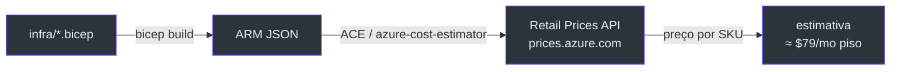
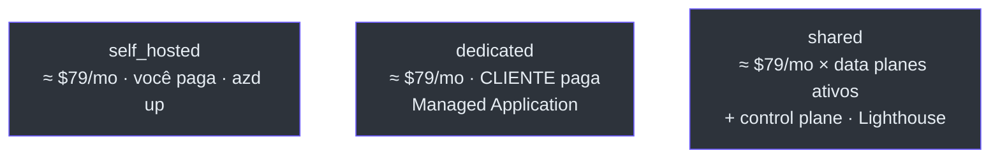
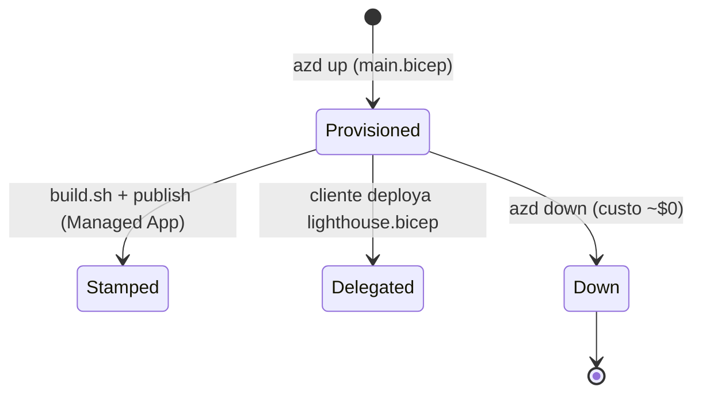

# Custo, Parâmetros e Referência de Scripts

> **Escopo.** Visão operacional transversal: custo (de [`docs/COST.md`](https://github.com/ruinosus/foundry-assured/blob/feature/saas-d-packaging/docs/COST.md)), parâmetros/env vars de todos os templates e a referência rápida dos scripts em `infra/`.

## Custo — o piso always-on

**Bottom line:** o piso always-on é **≈ $79/mês (~$0,11/h)**, e **~93% disso é Azure AI Search Basic** ($73,73/mo). O resto é usage-based e **≈ $0 ocioso** (Container Apps escalam a zero, Log Analytics fica no tier grátis, storage é centavos) ([COST.md:9-15](https://github.com/ruinosus/foundry-assured/blob/feature/saas-d-packaging/docs/COST.md#L9-L15)). O AI Search **não tem scale-to-zero**, então o controle de custo é `azd down`, não downsizing (Basic é o piso para agentic retrieval).

### Como o número é apurado (método indicado pela Microsoft)

`docs/COST.md` usa a **Azure Retail Prices API** (`https://prices.azure.com/api/retail/prices`) — pública, sem auth, programática; cada preço fixo da tabela foi puxado ao vivo dela (USD, `eastus2`) ([COST.md:24-31](https://github.com/ruinosus/foundry-assured/blob/feature/saas-d-packaging/docs/COST.md#L24-L31)). É reproduzível com o ACE (Azure Cost Estimator), que compila `bicep build → ARM` e consulta a mesma API por recurso ([COST.md:33-46](https://github.com/ruinosus/foundry-assured/blob/feature/saas-d-packaging/docs/COST.md#L33-L46)).

<!-- Sources: docs/COST.md:24-46, docs/COST.md:76-85 -->

### Os meters

| Recurso | SKU | Preço (Retail API) | ~Mensal | Tipo | Source |
|---|---|---|---|---|---|
| **Azure AI Search** | Basic | **$0,101/h** | **≈ $73,73** | 🔴 fixo — o meter a vigiar | [COST.md:76](https://github.com/ruinosus/foundry-assured/blob/feature/saas-d-packaging/docs/COST.md#L76) |
| **Container Registry** | Basic | $0,1666/dia | ≈ $5,07 | 🔴 fixo | [COST.md:77](https://github.com/ruinosus/foundry-assured/blob/feature/saas-d-packaging/docs/COST.md#L77) |
| Foundry | Cognitive Services S0 | $0 platform fee | $0 | 🟢 pay-per-token | [COST.md:78](https://github.com/ruinosus/foundry-assured/blob/feature/saas-d-packaging/docs/COST.md#L78) |
| Container Apps (backend+web) | Consumption, scale-to-zero | usage | ≈ $0 idle | 🟢 usage | [COST.md:79](https://github.com/ruinosus/foundry-assured/blob/feature/saas-d-packaging/docs/COST.md#L79) |
| Log Analytics / App Insights | PerGB2018 | $2,30/GB (5 GB/mo grátis) | ≈ $0 demo | 🟡 usage | [COST.md:80](https://github.com/ruinosus/foundry-assured/blob/feature/saas-d-packaging/docs/COST.md#L80) |
| Hosted agents ×3 | Agent Service | compute + tokens | variável | 🟢 usage | [COST.md:85](https://github.com/ruinosus/foundry-assured/blob/feature/saas-d-packaging/docs/COST.md#L85) |

**Fato (v0.2.0):** a tabela de custo já conta **3** hosted agents — `helpdesk-concierge`, `cockpit-expert` e o novo `platform-concierge` (o twin Invocations do D-packaging) ([COST.md:60-63](https://github.com/ruinosus/foundry-assured/blob/feature/saas-d-packaging/docs/COST.md#L60-L63)).

### Custo por modo de deployment

<!-- Sources: docs/COST.md:99-103 -->

O mesmo Bicep serve três modos (ADR-007); o custo difere por **quem paga** e **o que é compartilhado** ([COST.md:94-103](https://github.com/ruinosus/foundry-assured/blob/feature/saas-d-packaging/docs/COST.md#L94-L103)). O stamp dedicado custa **a mesma stack**, faturada na subscription do cliente; Lighthouse é uma delegação `Microsoft.ManagedServices` **sem custo de recurso**, e o wrapper da Managed Application não cobra além dos recursos do seu `mainTemplate.json` ([COST.md:65-70](https://github.com/ruinosus/foundry-assured/blob/feature/saas-d-packaging/docs/COST.md#L65-L70)).

## Tabela consolidada de parâmetros

| Template | Parâmetro | Default | Source |
|---|---|---|---|
| `main.bicep` | `environmentName`, `location`, `principalId`, `principalType`, `modelDeploymentName`, `searchLocation`, `entra*` | ver [page-2](./page-2.md) | [main.bicep:12-40](https://github.com/ruinosus/foundry-assured/blob/feature/saas-d-packaging/infra/main.bicep#L12-L40) |
| `resources.bicep` | `modelVersion` | `2025-08-07` | [resources.bicep:32](https://github.com/ruinosus/foundry-assured/blob/feature/saas-d-packaging/infra/resources.bicep#L32) |
| `resources.bicep` | `modelCapacity` / `embeddingCapacity` | `100` / `100` | [resources.bicep:35](https://github.com/ruinosus/foundry-assured/blob/feature/saas-d-packaging/infra/resources.bicep#L35), [:44](https://github.com/ruinosus/foundry-assured/blob/feature/saas-d-packaging/infra/resources.bicep#L44) |
| `resources.bicep` | `searchSkuName` | `basic` | [resources.bicep:47](https://github.com/ruinosus/foundry-assured/blob/feature/saas-d-packaging/infra/resources.bicep#L47) |
| `managedApp.bicep` | `modelDeploymentName`, `searchLocation`, `entra*` | gpt-5-mini / `''` | [managedApp.bicep:26-40](https://github.com/ruinosus/foundry-assured/blob/feature/saas-d-packaging/infra/managed-app/managedApp.bicep#L26-L40) |
| `lighthouse.bicep` | `managedByTenantId`, `principalId`, `mspOffer*` | ver [page-6](./page-6.md) | [lighthouse.bicep:22-35](https://github.com/ruinosus/foundry-assured/blob/feature/saas-d-packaging/infra/lighthouse/lighthouse.bicep#L22-L35) |

O mapeamento `${VAR}`→parâmetro do azd vive em [`main.parameters.json:4-13`](https://github.com/ruinosus/foundry-assured/blob/feature/saas-d-packaging/infra/main.parameters.json#L4-L13); os do Lighthouse em [`parameters.json:5-19`](https://github.com/ruinosus/foundry-assured/blob/feature/saas-d-packaging/infra/lighthouse/parameters.json#L5-L19).

## Referência rápida de scripts

| Script | O que faz | Idempotente | Source |
|---|---|---|---|
| `managed-app/build.sh` | `bicep build → mainTemplate.json` + `zip -j managed-app.zip` | sim (sobrescreve) | [build.sh:19-24](https://github.com/ruinosus/foundry-assured/blob/feature/saas-d-packaging/infra/managed-app/build.sh#L19-L24) |
| `entra/create-acl-identities.sh` | cria 3 grupos + 2 usuários via `az ad`, imprime `COCKPIT_ACL_*` | sim | [create-acl-identities.sh:16](https://github.com/ruinosus/foundry-assured/blob/feature/saas-d-packaging/infra/entra/create-acl-identities.sh#L16) |
| `entra/create-test-users.sh` | cria os usuários A/B e as memberships de teste | não declarado | [create-test-users.sh:25-38](https://github.com/ruinosus/foundry-assured/blob/feature/saas-d-packaging/infra/entra/create-test-users.sh#L25-L38) |

Todos os scripts usam `set -euo pipefail` ([build.sh:15](https://github.com/ruinosus/foundry-assured/blob/feature/saas-d-packaging/infra/managed-app/build.sh#L15), [create-acl-identities.sh:17](https://github.com/ruinosus/foundry-assured/blob/feature/saas-d-packaging/infra/entra/create-acl-identities.sh#L17), [create-test-users.sh:15](https://github.com/ruinosus/foundry-assured/blob/feature/saas-d-packaging/infra/entra/create-test-users.sh#L15)). Prereqs do `build.sh`: Azure CLI com extensão Bicep + `zip`; publicar o zip no Partner Center é infra-gated ([build.sh:11-13](https://github.com/ruinosus/foundry-assured/blob/feature/saas-d-packaging/infra/managed-app/build.sh#L11-L13)).

## Comandos de provisionamento (ciclo de vida)

<!-- Sources: infra/main.bicep:1, infra/managed-app/build.sh:1, infra/lighthouse/lighthouse.bicep:9-11 -->

| Ação | Comando | Source |
|---|---|---|
| Provisionar (dev) | `azd up` | [main.bicep:1](https://github.com/ruinosus/foundry-assured/blob/feature/saas-d-packaging/infra/main.bicep#L1) |
| Construir pacote stamp | `./infra/managed-app/build.sh` | [build.sh:1-2](https://github.com/ruinosus/foundry-assured/blob/feature/saas-d-packaging/infra/managed-app/build.sh#L1-L2) |
| Delegar (cliente) | `az deployment sub create` com `lighthouse.bicep` | [lighthouse.bicep:9-11](https://github.com/ruinosus/foundry-assured/blob/feature/saas-d-packaging/infra/lighthouse/lighthouse.bicep#L9-L11) |
| Provisionar grupos ACL | `az deployment tenant create` com `entra.bicep` | [entra.bicep:13-16](https://github.com/ruinosus/foundry-assured/blob/feature/saas-d-packaging/infra/entra/entra.bicep#L13-L16) |
| Derrubar (custo ~$0) | `azd down` | [COST.md:14](https://github.com/ruinosus/foundry-assured/blob/feature/saas-d-packaging/docs/COST.md#L14) |

## Related Pages

| Página | Relação |
|---|---|
| [O Stack azd](./page-2.md) | a fonte dos parâmetros do caminho azd |
| [O Stamp Dedicado](./page-5.md) | o `build.sh` e o pacote de marketplace |
| [Azure Lighthouse](./page-6.md) | os parâmetros e o deploy pelo cliente |
| [Identidades Entra, ACL](./page-8.md) | os scripts de identidade detalhados |
