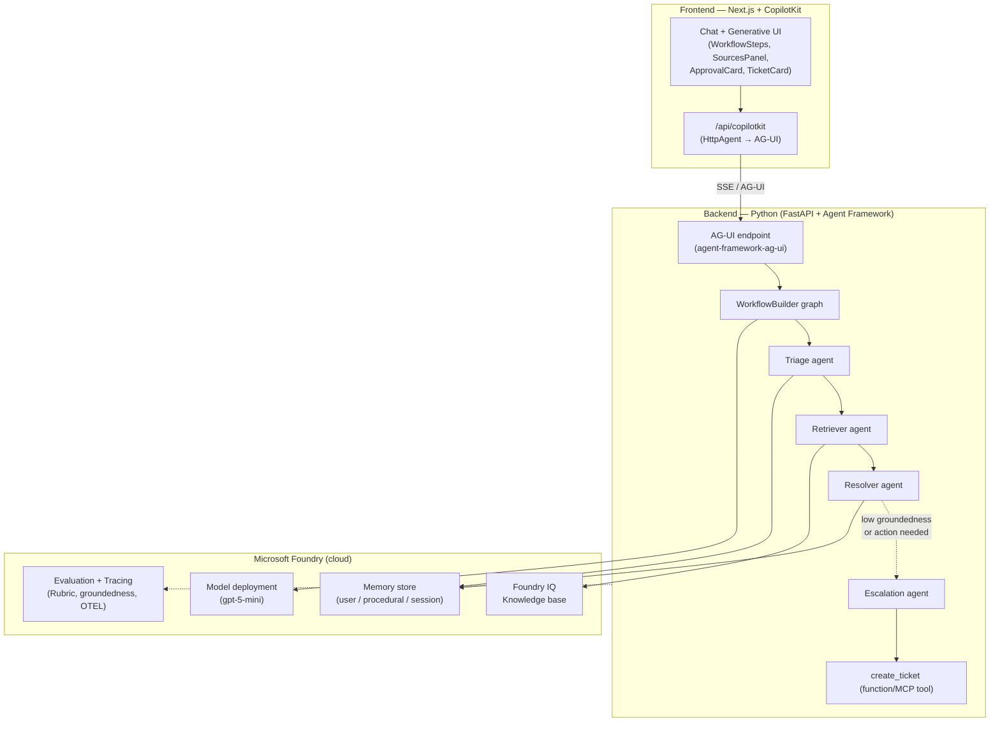

# Foundry Assured — Build Spec

> Caso de uso showcase do Microsoft Foundry que exercita **workflow, base de conhecimento, memória e eval**, com frontend **CopilotKit** via protocolo **AG-UI**. Pensado para ser construído com **Claude Code**.
>
> Domínio escolhido: *concierge de suporte de engenharia interno*. O domínio é **swappable** — toda a arquitetura abaixo vale para qualquer "pergunte → fundamente → resolva → escale" (ADR advisor, policy assistant, onboarding buddy etc.). Só troca o corpus de conhecimento e os prompts.

---

## 1. O que o sistema faz

Um dev manda uma pergunta no chat (ex.: *"VPN caindo no laptop novo"*, *"como rotaciono a credencial do banco de prod?"*). O sistema:

1. **Tria** a intenção e a urgência.
2. **Busca** trechos relevantes na base de conhecimento (runbooks, ADRs, docs de onboarding).
3. **Redige** uma resposta fundamentada, com citações das fontes.
4. **Decide**: se a resposta basta, entrega; se precisa de ação (abrir ticket, escalar), **pede aprovação humana** e então **abre o ticket** via tool.
5. **Lembra** das preferências do dev e de resoluções recorrentes entre sessões.

Tudo isso é **avaliado** (groundedness + rubric + policies) e **rastreável** (OpenTelemetry).

---

## 2. Mapeamento dos pilares Foundry

| Pilar Foundry | Componente no projeto | Como aparece |
|---|---|---|
| **Workflow** | `WorkflowBuilder` (Microsoft Agent Framework) | Grafo: triage → retrieve → resolve → (condicional) escalate, com human-in-the-loop |
| **Base de conhecimento** | Foundry IQ knowledge base | Retrieval agêntico sobre o corpus; respostas citam fontes |
| **Memória** | Memory in Foundry Agent Service (`azure-ai-projects` `.beta.memory_stores`) | *user* (stack/preferências), *procedural* (resoluções recorrentes), *session* (thread) |
| **Eval** | ASSERT (policies) + Rubric + groundedness + tracing | Harness offline em golden set; policies no CI; traces no Foundry Control Plane |
| **Frontend** | CopilotKit + AG-UI | Chat com generative UI dos passos, approval card, painel de fontes, shared state |

---

## 3. Arquitetura



**Risco de integração nº 1 (de-riscar primeiro):** expor um **workflow multi-agente** (não um agente único) sobre AG-UI, de forma que o frontend receba os **passos intermediários** (triage, retrieval, draft) e não só a resposta final. O caminho é *workflow-as-agent*: empacotar o workflow como um `AgentFrameworkAgent` e emitir os passos como eventos AG-UI. Valide isso na Fase 2 antes de investir no resto.

---

## 4. Stack e pacotes

**Backend (Python 3.12)**
- `agent-framework` — agentes + `WorkflowBuilder`
- `agent-framework-ag-ui` — adapter AG-UI (`AgentFrameworkAgent`, `add_agent_framework_fastapi_endpoint`)
- `azure-ai-projects>=2.2.0` — Foundry project client: KB, `.beta.memory_stores`, eval
- `azure-identity` — `DefaultAzureCredential`
- `fastapi`, `uvicorn`
- `uv` para deps; `azd` (Azure Developer CLI + extensão Foundry) para provisioning

**Frontend (Next.js 15, App Router)**
- `@copilotkit/react-core`, `@copilotkit/react-ui`, `@copilotkit/runtime`
- `HttpAgent` apontando para o endpoint AG-UI do backend

**Foundry (provisionar)**
- Foundry project + model deployment (default seguro: `gpt-5-mini`)
- Foundry IQ knowledge base
- Memory store
- Application Insights (tracing OTEL já vem nos samples)

> ⚠️ **As assinaturas exatas do SDK mudam rápido** (a superfície `.beta` em particular). Trate os trechos de código abaixo como **forma/esqueleto**, não copy-paste final. Regra no CLAUDE.md: verificar contra `learn.microsoft.com/azure/foundry` e o repo `microsoft-foundry/foundry-samples` antes de fixar qualquer chamada.

---

## 5. Estrutura do repositório

```
foundry-helpdesk/
├── backend/
│   ├── app/
│   │   ├── agents/          # triage, retriever, resolver, escalation
│   │   ├── workflow/        # WorkflowBuilder graph + workflow-as-agent wrapper
│   │   ├── memory/          # memory store wiring (user/procedural/session)
│   │   ├── knowledge/       # Foundry IQ KB client + script de ingestão
│   │   ├── tools/           # create_ticket (function tool / MCP)
│   │   ├── server.py        # FastAPI + AG-UI endpoint
│   │   └── settings.py
│   ├── eval/
│   │   ├── datasets/        # golden Q&A (jsonl)
│   │   ├── rubrics/         # critérios de qualidade
│   │   ├── assert/          # policies executáveis
│   │   └── run_eval.py
│   ├── pyproject.toml
│   └── azure.yaml           # azd
├── frontend/
│   ├── app/
│   │   ├── api/copilotkit/route.ts
│   │   ├── page.tsx
│   │   └── components/      # WorkflowSteps, SourcesPanel, ApprovalCard, TicketCard
│   └── package.json
├── infra/                   # bicep (azd)
├── CLAUDE.md
└── README.md
```

---

## 6. Plano de build por fases (com sinais verde/vermelho)

Cada fase é independente e testável. Não avança com a próxima até o sinal verde.

### Fase 0 — Esqueleto + hello-world sobre AG-UI
Provisiona o Foundry project (`azd`), sobe um agente trivial no FastAPI com AG-UI, e conecta o CopilotKit.
- 🟢 **Verde:** mensagem faz round-trip com streaming visível no chat CopilotKit.
- 🔴 **Vermelho:** CORS bloqueando, ou auth do `DefaultAzureCredential` falhando localmente.

### Fase 1 — Base de conhecimento (Foundry IQ)
Ingesta um corpus pequeno (~10-20 docs markdown: runbooks fake) numa knowledge base. Retriever agent responde citando fonte.
- 🟢 **Verde:** resposta cita um doc real do corpus; pergunta fora do corpus → "não sei" em vez de alucinar.
- 🔴 **Vermelho:** retrieval vazio, ou resposta sem citação.

### Fase 2 — Workflow + streaming dos passos *(maior risco)*
`WorkflowBuilder`: triage → retrieve → resolve. Empacota como workflow-as-agent e expõe via AG-UI. Frontend renderiza os passos via generative UI.
- 🟢 **Verde:** os 3 passos aparecem no UI conforme executam (não só o resultado final).
- 🔴 **Vermelho:** workflow roda mas o UI só vê a saída final → revisar emissão de eventos intermediários.

### Fase 3 — Memória
Liga user + procedural + session memory. Antes de responder, lê preferências do dev; depois de resolver, escreve a resolução.
- 🟢 **Verde:** 2ª sessão recupera o stack do dev sem reperguntar; tarefa repetida melhora via procedural memory.
- 🔴 **Vermelho:** memória grava mas nunca é lida de volta (write-only).

### Fase 4 — Human-in-the-loop + tool
Edge condicional: groundedness baixa OU ação necessária → `ApprovalCard` → `create_ticket`.
- 🟢 **Verde:** aprovar → ticket criado e renderizado; rejeitar → volta pro loop.
- 🔴 **Vermelho:** a tool dispara sem passar pela aprovação.

### Fase 5 — Eval
Harness offline: groundedness + Rubric no golden set. ASSERT com policies no CI. Traces visíveis no Foundry.
- 🟢 **Verde:** scores gerados e ligados aos traces; ASSERT pega uma violação plantada de propósito ("resposta sem citação").
- 🔴 **Vermelho:** evals rodam mas não bloqueiam nada (sem gate).

### Fase 6 *(opcional)* — Deploy
Empacota o workflow como hosted agent no Foundry Agent Service (`azd ai agent init` / Foundry Toolkit).
- 🟢 **Verde:** mesmo comportamento rodando no runtime gerenciado, com tracing.

---

## 7. Seams de código (esqueleto — verificar SDK)

### 7.1 AG-UI endpoint expondo o workflow (backend)

```python
# app/server.py
import os, uvicorn
from fastapi import FastAPI
from fastapi.middleware.cors import CORSMiddleware
from agent_framework_ag_ui import add_agent_framework_fastapi_endpoint
from app.workflow.graph import build_helpdesk_agent  # workflow-as-agent

app = FastAPI()
app.add_middleware(
    CORSMiddleware,
    allow_origins=["http://localhost:3000"],
    allow_methods=["*"], allow_headers=["*"],
)

# wrappa o workflow como um AgentFrameworkAgent e registra o endpoint AG-UI
add_agent_framework_fastapi_endpoint(app, agent=build_helpdesk_agent(), path="/helpdesk")

if __name__ == "__main__":
    uvicorn.run(app, host="0.0.0.0", port=8000)
```

### 7.2 Workflow (backend)

```python
# app/workflow/graph.py
from agent_framework import WorkflowBuilder
from app.agents import triage_agent, retriever_agent, resolver_agent, escalation_agent

def build_helpdesk_agent():
    wf = (
        WorkflowBuilder()
        .add(triage_agent())
        .add(retriever_agent())     # consulta Foundry IQ KB
        .add(resolver_agent())      # redige com citações
        .add_conditional(           # groundedness baixa OU ação → escalate
            condition=needs_escalation,
            then=escalation_agent(), # human-in-the-loop + create_ticket
        )
        .build()
    )
    return wf.as_agent(name="HelpdeskConcierge")  # workflow-as-agent p/ AG-UI

def needs_escalation(state) -> bool:
    return state.get("groundedness", 1.0) < 0.6 or state.get("action_required", False)
```

### 7.3 Foundry IQ knowledge base (retriever)

```python
# app/knowledge/kb.py
from azure.ai.projects import AIProjectClient
from azure.identity import DefaultAzureCredential

client = AIProjectClient(endpoint=os.environ["AZURE_AI_PROJECT_ENDPOINT"],
                         credential=DefaultAzureCredential())

def retrieve(query: str, kb_name: str = "helpdesk-kb", top_k: int = 5):
    # retrieval agêntico sobre a knowledge base — retorna trechos + fontes p/ citação
    results = client.knowledge.query(name=kb_name, query=query, top=top_k)  # verificar assinatura
    return [{"text": r.content, "source": r.source} for r in results]
```

### 7.4 Memória (user / procedural / session)

```python
# app/memory/store.py
# .beta.memory_stores — CRUD de itens de memória (azure-ai-projects >= 2.2.0)
def get_user_prefs(client, user_id: str):
    return client.beta.memory_stores.list(scope="user", key=user_id)  # verificar assinatura

def remember_resolution(client, signature: str, fix: str):
    # procedural: associa um "sintoma" recorrente a uma resolução que funcionou
    client.beta.memory_stores.create(scope="procedural",
                                     key=signature, value={"fix": fix})
```

### 7.5 Eval harness (offline)

```python
# eval/run_eval.py
# groundedness + Rubric sobre o golden set; ASSERT roda as policies à parte
from azure.ai.projects import AIProjectClient

def run(client: AIProjectClient, dataset="eval/datasets/golden.jsonl"):
    job = client.evaluations.create(
        data=dataset,
        evaluators=["groundedness", "rubric:helpdesk_quality"],  # verificar nomes
    )
    return client.evaluations.get(job.id)
# Policies executáveis (ex.: "toda resposta deve conter ≥1 citação";
# "nunca incluir segredo/credencial") ficam em eval/assert/ via framework ASSERT.
```

### 7.6 CopilotKit runtime route + generative UI (frontend)

```typescript
// app/api/copilotkit/route.ts
import { CopilotRuntime, copilotRuntimeNextJSAppRouterEndpoint } from "@copilotkit/runtime";
import { HttpAgent } from "@copilotkit/runtime";

const runtime = new CopilotRuntime({
  agents: {
    helpdesk: new HttpAgent({ url: "http://localhost:8000/helpdesk" }), // endpoint AG-UI
  },
});

export const POST = copilotRuntimeNextJSAppRouterEndpoint({ runtime }).POST;
```

```tsx
// app/page.tsx — generative UI dos passos do workflow + human-in-the-loop
"use client";
import { CopilotChat } from "@copilotkit/react-ui";
import { useCoAgentStateRender, useCopilotAction } from "@copilotkit/react-core";

export default function Page() {
  // renderiza os passos intermediários (triage/retrieve/resolve) conforme chegam
  useCoAgentStateRender({ name: "helpdesk", render: ({ state }) => <WorkflowSteps state={state} /> });

  // approval card antes de abrir ticket (human-in-the-loop)
  useCopilotAction({
    name: "confirm_escalation",
    renderAndWaitForResponse: ({ args, respond }) => (
      <ApprovalCard issue={args.summary} onApprove={() => respond("approve")} onReject={() => respond("reject")} />
    ),
  });

  return <CopilotChat />;
}
```

---

## 8. CLAUDE.md (colar no repo)

```markdown
# Foundry Assured — guia para o Claude Code

## Stack
- Backend: Python 3.12, agent-framework, agent-framework-ag-ui, azure-ai-projects>=2.2.0, FastAPI. Deps via `uv`.
- Frontend: Next.js 15 (App Router), CopilotKit (react-core/react-ui/runtime).
- Foundry: project + gpt-5-mini, Foundry IQ KB, memory store, evaluation/tracing.

## Regras inegociáveis
1. **NÃO invente assinaturas de SDK.** Antes de fixar qualquer chamada a `azure-ai-projects`
   (especialmente o namespace `.beta`), `agent-framework` ou `agent-framework-ag-ui`,
   verifique contra learn.microsoft.com/azure/foundry e o repo microsoft-foundry/foundry-samples.
   Se não conseguir confirmar, deixe um `# TODO: verificar assinatura` explícito.
2. Auth sempre via DefaultAzureCredential. Nada de API key hardcoded.
3. Cada fase tem sinal verde/vermelho (ver spec). Não avança sem o verde da fase atual.
4. Toda resposta do resolver DEVE conter ao menos uma citação de fonte. É policy de eval.
5. A tool create_ticket só pode disparar após aprovação humana explícita.

## Ordem de implementação
Fase 0 (AG-UI hello-world) → 1 (KB) → 2 (workflow streaming) → 3 (memória) → 4 (HITL+tool) → 5 (eval).
Fase 2 é o maior risco: validar que os passos intermediários chegam ao frontend antes de seguir.

## Comandos
- Backend: `uv run uvicorn app.server:app --port 8000 --reload`
- Frontend: `npm run dev` (porta 3000)
- Eval: `uv run python eval/run_eval.py`
- Provisioning: `azd up`
```

---

## 9. Primeiros passos concretos

1. `mkdir foundry-helpdesk && cd foundry-helpdesk` e cria a estrutura da seção 5.
2. Cola o CLAUDE.md (seção 8).
3. Provisiona o Foundry project: `azd init` + extensão Foundry, ou parte de um sample existente (`microsoft-foundry/foundry-samples`, pasta `python/hosted-agents/agent-framework`).
4. Manda o Claude Code executar a **Fase 0** inteira e parar no sinal verde.
5. Prepara o corpus da KB (10-20 markdowns de runbook fake) para a Fase 1.

## 10. Referências
- Foundry samples: `github.com/microsoft-foundry/foundry-samples`
- Build 2026 demos (memory, toolboxes, eval): `github.com/microsoft-foundry/build-2026-demos`
- Agent Framework: `github.com/microsoft/agent-framework`
- AG-UI ↔ Agent Framework: `learn.microsoft.com/agent-framework/integrations/ag-ui/`
- CopilotKit + MAF: `docs.copilotkit.ai/ms-agent-dotnet` (vale p/ Python tb) e o "dojo" de mini-exemplos
- Foundry IQ cookbook: `microsoft-foundry/forgebook` → notebook "mastering-foundry-iq"
- ASSERT (eval policies): `aka.ms/assert`
